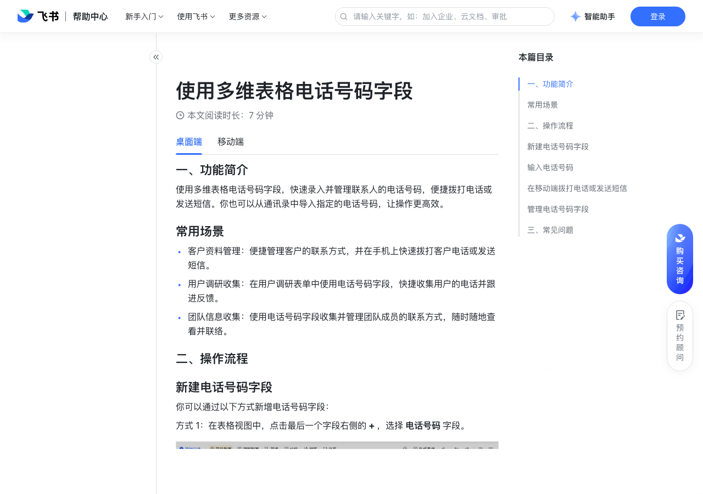

# 使用多维表格电话号码字段

> 来源：[飞书帮助中心](https://www.feishu.cn/hc/zh-CN/articles/209370117035)  
> 分类：多维表格 / 字段 / 业务字段  
> 抓取时间：2026-09-22T01:21:38.627Z

## 界面截图

### 文档内配图

1. 配图：https://p1-hera.feishucdn.com/tos-cn-i-jbbdkfciu3/b46dccf25a6a41b9bddc7252c1d92617~tplv-jbbdkfciu3-image:0:0.image
2. 配图：https://p1-hera.feishucdn.com/tos-cn-i-jbbdkfciu3/ea3c8fb8ea8b420392c1a8d7270d7a56~tplv-jbbdkfciu3-image:0:0.image
3. 配图：https://p1-hera.feishucdn.com/tos-cn-i-jbbdkfciu3/af98c49d77ee4577b455ab17a7d6d3dd~tplv-jbbdkfciu3-image:0:0.image
4. 配图：https://p1-hera.feishucdn.com/tos-cn-i-jbbdkfciu3/71f4008272cc43e19dbf984b3c3266e2~tplv-jbbdkfciu3-image:0:0.image
5. 配图：https://p1-hera.feishucdn.com/tos-cn-i-jbbdkfciu3/019c27ef56e54d03b8300cf0fbaad5d2~tplv-jbbdkfciu3-image:0:0.image
6. 配图：https://p1-hera.feishucdn.com/tos-cn-i-jbbdkfciu3/c6d1d17bccf64448b50ed36af2eda7f9~tplv-jbbdkfciu3-image:0:0.image
7. 配图：https://p1-hera.feishucdn.com/tos-cn-i-jbbdkfciu3/25d1ede1fa6449f2a502bda94865a08f~tplv-jbbdkfciu3-image:0:0.image
8. 配图：https://p1-hera.feishucdn.com/tos-cn-i-jbbdkfciu3/335c9c1ececa44739cded20d8c17ff74~tplv-jbbdkfciu3-image:0:0.image
9. 配图：https://p1-hera.feishucdn.com/tos-cn-i-jbbdkfciu3/359a2efcbb9f481a97665036c83e3563~tplv-jbbdkfciu3-image:0:0.image
10. 配图：https://p1-hera.feishucdn.com/tos-cn-i-jbbdkfciu3/8775e21271ca4b40b4e4ac933e61ec63~tplv-jbbdkfciu3-image:0:0.image
11. 配图：https://p1-hera.feishucdn.com/tos-cn-i-jbbdkfciu3/32f3d3c1eb2c429a898cb7d9210495e4~tplv-jbbdkfciu3-image:0:0.image

## 功能定位

本页对应飞书帮助中心「多维表格 / 字段 / 业务字段」下的「使用多维表格电话号码字段」。以下需求描述依据官方说明文档提炼，用于指导 DuoWei 对标实现。

## 功能目标

一、功能简介

## 文档结构（官方章节）

- 一、功能简介​
- 常用场景​
- 二、操作流程​
- 新建电话号码字段​
- 输入电话号码​
- 在移动端拨打电话或发送短信​
- 管理电话号码字段​
- 三、常见问题​

## 详细功能说明

一、功能简介

常用场景

客户资料管理：便捷管理客户的联系方式，并在手机上快速拨打客户电话或发送短信。

用户调研收集：在用户调研表单中使用电话号码字段，快捷收集用户的电话并跟进反馈。

团队信息收集：使用电话号码字段收集并管理团队成员的联系方式，随时随地查看并联络。

二、操作流程

新建电话号码字段

输入电话号码

在移动端拨打电话或发送短信

管理电话号码字段

修改标题或类型：可通过以下方式实现。

直接双击字段名称。

鼠标右键点击字段名称，或是将鼠标悬停在字段名称上并点击右侧的 ，选择 修改字段/列。

修改字段描述：鼠标右键点击字段名称，或是将鼠标悬停在字段名称上并点击右侧的 ，选择 编辑字段/列描述。

复制或删除字段：鼠标右键点击字段名称，或是将鼠标悬停在字段名称上并点击右侧的 ，按需选择 复制字段/列，或是 删除字段/列。

三、常见问题

问：同一个单元格可以导入多个电话号码吗？

问：电话号码字段是否有格式限制？

问：如何从手机通讯录中导入指定的电话号码？

问：如何直接拨打字段中的电话号码？

答：不能，每一个单元格仅可导入一个电话号码，再次导入将覆盖之前导入的电话号码。

答：你可以输入 20 位以内的国内外电话号码，输入时如果携带国际区号，系统会自动校验电话号码格式是否正确。

答：在移动端打开多维表格，展开记录详情后找到电话号码字段，点击右侧的图标选择需要导入的电话号。

答：在移动端打开多维表格，点击电话号码字段右侧的 图标，即可拨打电话或发送短信。

## 实现要点（对标 DuoWei）

1. **入口与信息架构**：在产品中明确该能力所属模块（字段 / 业务字段），并保证用户可从对应导航触达。
2. **核心交互**：按上文「详细功能说明」还原主要操作路径；截图中出现的按钮、字段、面板命名尽量与飞书语义一致或可映射。
3. **数据与权限**：若文档涉及可见范围、可编辑范围、分享或高级权限，实现时需落到角色/成员模型，并保证 API/MCP 与 UI 权限一致。
4. **边界与上限**：若文档提到数量上限、格式限制、导入导出约束，需在实现与错误提示中体现。
5. **验收**：以本页截图场景为用例，完成「能打开 / 能配置 / 能保存 / 能被 Agent 读写（如适用）」四项检查。

## 原始摘录摘要

> 一、功能简介 常用场景 客户资料管理：便捷管理客户的联系方式，并在手机上快速拨打客户电话或发送短信。 用户调研收集：在用户调研表单中使用电话号码字段，快捷收集用户的电话并跟进反馈。 团队信息收集：使用电话号码字段收集并管理团队成员的联系方式，随时随地查看并联络。 二、操作流程 新建电话号码字段 输入电话号码 在移动端拨打电话或发送短信 管理电话号码字段 修改标题或类型：可通过以下方式实现。 直接双击字段名称。 鼠标右键点击字段名称，或是将鼠标悬停在字段名称上并点击右侧的 ，选择 修改字段/列。 修改字段描述：鼠标右键点击字段名称，或是将鼠标悬停在字段名称上并点击右侧的 ，选择 编辑字段/列描述。 复制或删除字段：鼠标右键点击字段名称，或是将鼠标悬停在字段名称上并点击右侧的 ，按需选择 复制字段/列，或是 删除字段/列。 三、常见问题 问：同一个单元格可以导入多个电话号码吗？ 问：电话号码字段是否有格式限制？ 问：如何从手机通讯录中导入指定的电话号码？ 问：如何直接拨打字段中的电话号码？ 答：不能，每一个单元格仅可导入一个电话号码，再次导入将覆盖之前导入的电话号码。 答：你可以输入 20 位以内的国内外电话号码，输入时如果携带国际区号，系统会自动校验电话号码格式是否正确。 答：在移动端打开多维表格，展开记录详情后找到电话号码字段，点击右侧的图标选择需要导入的电话号。 答：在移动端打开多维表格，点击电话号码字段右侧的 图标，即可拨打电话或发送短信。

## 元数据

- article_id: `7123083845666439170`
- category_id: `7187723341653000220`
- path: `/hc/zh-CN/articles/209370117035`
- extracted_text_length: 632
