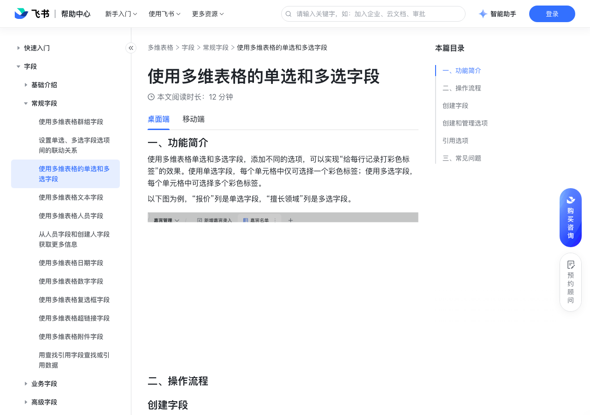

# 使用多维表格的单选和多选字段

> 来源：[飞书帮助中心](https://www.feishu.cn/hc/zh-CN/articles/624094577996)  
> 分类：多维表格 / 字段 / 常规字段  
> 抓取时间：2026-09-22T01:21:33.560Z

## 界面截图

### 文档内配图

1. 配图：https://p1-hera.feishucdn.com/tos-cn-i-jbbdkfciu3/a66b839dc3f74fc192d46d933d07f4a9~tplv-jbbdkfciu3-image:0:0.image
2. 配图：https://p1-hera.feishucdn.com/tos-cn-i-jbbdkfciu3/cc575a644fb34e06a932dc504a4b1bd0~tplv-jbbdkfciu3-image:0:0.image
3. 配图：https://p1-hera.feishucdn.com/tos-cn-i-jbbdkfciu3/2208c851474d4231a82574a2fd044c3e~tplv-jbbdkfciu3-image:0:0.image
4. 配图：https://p1-hera.feishucdn.com/tos-cn-i-jbbdkfciu3/c6d40f53e92e4ba38116423903cd263f~tplv-jbbdkfciu3-image:0:0.image
5. 配图：https://p1-hera.feishucdn.com/tos-cn-i-jbbdkfciu3/4f1633d81ede43f29f9eebf131e6b7ff~tplv-jbbdkfciu3-image:0:0.image
6. 配图：https://p1-hera.feishucdn.com/tos-cn-i-jbbdkfciu3/cb14a74c0979404d9ad49eff3940acb1~tplv-jbbdkfciu3-image:0:0.image
7. 配图：https://p1-hera.feishucdn.com/tos-cn-i-jbbdkfciu3/f112bcd58f6540ea97882805b328e4b9~tplv-jbbdkfciu3-image:0:0.image
8. 配图：https://p1-hera.feishucdn.com/tos-cn-i-jbbdkfciu3/fce546cdbf474ce089ade1b8491bcfd7~tplv-jbbdkfciu3-image:0:0.image
9. 配图：https://p1-hera.feishucdn.com/tos-cn-i-jbbdkfciu3/c977ca4add8d43c182c698c47d7b15f8~tplv-jbbdkfciu3-image:0:0.image
10. 配图：https://p1-hera.feishucdn.com/tos-cn-i-jbbdkfciu3/8e6ab08c48f346f69c680f94dff2ef71~tplv-jbbdkfciu3-image:0:0.image
11. 配图：https://p1-hera.feishucdn.com/tos-cn-i-jbbdkfciu3/0fa3a5c809e04277b9ce2a66b8c98e7e~tplv-jbbdkfciu3-image:0:0.image
12. 配图：https://p1-hera.feishucdn.com/tos-cn-i-jbbdkfciu3/687834c95442481f8b1b32b9cc9d2d3f~tplv-jbbdkfciu3-image:0:0.image
13. 配图：https://p1-hera.feishucdn.com/tos-cn-i-jbbdkfciu3/0f46ea878d1f4527aca4e9637f243711~tplv-jbbdkfciu3-image:0:0.image
14. 配图：https://p1-hera.feishucdn.com/tos-cn-i-jbbdkfciu3/5568f9a9bdd04d2e89072d8ead391916~tplv-jbbdkfciu3-image:0:0.image
15. 配图：https://p1-hera.feishucdn.com/tos-cn-i-jbbdkfciu3/1fd2ac45dd894e99acdf10c3d4e0e40f~tplv-jbbdkfciu3-image:0:0.image
16. 配图：https://p1-hera.feishucdn.com/tos-cn-i-jbbdkfciu3/40b8f67cb73a4adba11664c643d88430~tplv-jbbdkfciu3-image:0:0.image

## 功能定位

本页对应飞书帮助中心「多维表格 / 字段 / 常规字段」下的「使用多维表格的单选和多选字段」。以下需求描述依据官方说明文档提炼，用于指导 DuoWei 对标实现。

## 功能目标

一、功能简介

## 文档结构（官方章节）

- 一、功能简介​
- 二、操作流程​
- 创建字段​
- 创建和管理选项​
- 手动创建选项​
- 使用 AI 批量创建选项​
- 在单元格中添加或删除选项标签​
- 编辑选项内容​
- 修改选项颜色​
- 修改选项顺序​
- 删除选项​
- 设置默认选项​
- 引用选项​
- 三、常见问题​

## 详细功能说明

一、功能简介

二、操作流程

创建字段

创建和管理选项

手动创建选项

使用 AI 批量创建选项

查看 AI 自动生成的指令，点击适合的指令开始生成选项。

使用生成选项窗口底部的对话框发送选项生成指令。

在单元格中添加或删除选项标签

编辑选项内容

修改选项颜色

修改选项顺序

删除选项

设置默认选项

引用选项

三、常见问题

问：一个单选或多选字段中，最多可以创建多少个选项？

问：在多维表格的单选或多选字段中，如何批量修改选项的内容？

答：10,000 个。

答：不支持。

## 实现要点（对标 DuoWei）

1. **入口与信息架构**：在产品中明确该能力所属模块（字段 / 常规字段），并保证用户可从对应导航触达。
2. **核心交互**：按上文「详细功能说明」还原主要操作路径；截图中出现的按钮、字段、面板命名尽量与飞书语义一致或可映射。
3. **数据与权限**：若文档涉及可见范围、可编辑范围、分享或高级权限，实现时需落到角色/成员模型，并保证 API/MCP 与 UI 权限一致。
4. **边界与上限**：若文档提到数量上限、格式限制、导入导出约束，需在实现与错误提示中体现。
5. **验收**：以本页截图场景为用例，完成「能打开 / 能配置 / 能保存 / 能被 Agent 读写（如适用）」四项检查。

## 原始摘录摘要

> 一、功能简介 二、操作流程 创建字段 创建和管理选项 手动创建选项 使用 AI 批量创建选项 查看 AI 自动生成的指令，点击适合的指令开始生成选项。 使用生成选项窗口底部的对话框发送选项生成指令。 在单元格中添加或删除选项标签 编辑选项内容 修改选项颜色 修改选项顺序 删除选项 设置默认选项 引用选项 三、常见问题 问：一个单选或多选字段中，最多可以创建多少个选项？ 问：在多维表格的单选或多选字段中，如何批量修改选项的内容？ 答：10,000 个。 答：不支持。

## 元数据

- article_id: `6966894206090477596`
- category_id: `7187711716854464540`
- path: `/hc/zh-CN/articles/624094577996`
- extracted_text_length: 234
