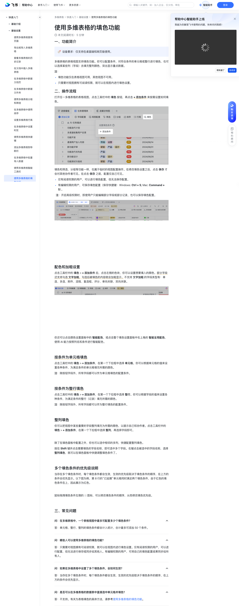

# 使用多维表格的填色功能

> 来源：[飞书帮助中心](https://www.feishu.cn/hc/zh-CN/articles/790479013597)  
> 分类：多维表格 / 快速入门 / 基础设置  
> 抓取时间：2026-09-22T01:16:04.418Z

## 界面截图

### 文档内配图

1. 配图：https://p1-hera.feishucdn.com/tos-cn-i-jbbdkfciu3/b035d310ded44199b6aed8e4842673aa~tplv-jbbdkfciu3-image:0:0.image
2. 配图：https://p1-hera.feishucdn.com/tos-cn-i-jbbdkfciu3/03cb652c6dec412abacf9fded00cbe47~tplv-jbbdkfciu3-image:0:0.image
3. 配图：https://p1-hera.feishucdn.com/tos-cn-i-jbbdkfciu3/0ec9bf3b4d2246709753c21a645b0403~tplv-jbbdkfciu3-image:0:0.image
4. 配图：https://p1-hera.feishucdn.com/tos-cn-i-jbbdkfciu3/27781f7e49d447fa9f7567004d3c0da1~tplv-jbbdkfciu3-image:0:0.image
5. 配图：https://p1-hera.feishucdn.com/tos-cn-i-jbbdkfciu3/af485aa52b8842188fcb56c38e7c73d3~tplv-jbbdkfciu3-image:0:0.image
6. 配图：https://p1-hera.feishucdn.com/tos-cn-i-jbbdkfciu3/732fb71ecf2946c9950b5437b9e25e2f~tplv-jbbdkfciu3-image:0:0.image
7. 配图：https://p1-hera.feishucdn.com/tos-cn-i-jbbdkfciu3/ca4943198bd047278bc792085ca6c2c3~tplv-jbbdkfciu3-image:0:0.image
8. 配图：https://p1-hera.feishucdn.com/tos-cn-i-jbbdkfciu3/76109111e04745da8ab86a83d164b07a~tplv-jbbdkfciu3-image:0:0.image
9. 配图：https://p1-hera.feishucdn.com/tos-cn-i-jbbdkfciu3/02c08592f2ad4de0aa22cae1b54c4b0b~tplv-jbbdkfciu3-image:0:0.image
10. 配图：https://p1-hera.feishucdn.com/tos-cn-i-jbbdkfciu3/bca3c65c5da04bd99789e06a1774ba46~tplv-jbbdkfciu3-image:0:0.image

## 功能定位

本页对应飞书帮助中心「多维表格 / 快速入门 / 基础设置」下的「使用多维表格的填色功能」。以下需求描述依据官方说明文档提炼，用于指导 DuoWei 对标实现。

## 功能目标

一、功能简介

## 文档结构（官方章节）

- 一、功能简介​
- 二、操作流程​
- 配色和加粗设置​
- 按条件为单元格填色​
- 按条件为整行填色​
- 整列填色​
- 多个填色条件的优先级说明​
- 三、常见问题​

## 详细功能说明

一、功能简介

填色功能仅在表格视图可用，其他视图不可用。

只需要对视图拥有可阅读权限，就可以在视图内进行填色设置。

二、操作流程

填色和筛选、分组等功能一样，也属于临时的视图配置操作。在修改填色设置之后，点击 保存 才会对其他协作者可见。在点击 保存 之前，配置仅自己可见。

仅有阅读权限的用户，可以进行填色配置，但无法保存配置。

有编辑权限的用户，可保存填色配置（保存快捷键：Windows: Ctrl + S; Mac: Command + S）。

配色和加粗设置

按条件为单元格填色

按条件为整行填色

整列填色

多个填色条件的优先级说明

三、常见问题

问：在多维表格中，一个表格视图中最多可配置多少个填色条件？

答：单元格、整行、整列的填色条件都会计入统计，合计最多可添加 50 个条件。

问：哪些人可以使用多维表格的填色功能？

答：只需要对视图拥有可阅读权限，就可以在视图内进行填色设置。仅有阅读权限的用户，可以进行配置，但无法进行保存或同步给其他人。有编辑权限的用户，可将自己的填色配置结果同步给所有人。

问：如果在多维表格中设置了多个填色条件，会如何生效？

答：当存在多个填色条件时，每个填色条件都会生效，生效的优先级取决于填色条件的顺序，在上方的条件会优先显示。

问：是否可以在多维表格的数据表中直接选中单元格并填色？

答：不支持。有关为表格填色的具体方法，请参考使用多维表格的填色功能。

问：多维表格是否可以单独为表头填色？

答：不可以。

问：多维表格是否可以高亮出重复值？

问：是否可以为多维表格单个单元格填色？

## 实现要点（对标 DuoWei）

1. **入口与信息架构**：在产品中明确该能力所属模块（快速入门 / 基础设置），并保证用户可从对应导航触达。
2. **核心交互**：按上文「详细功能说明」还原主要操作路径；截图中出现的按钮、字段、面板命名尽量与飞书语义一致或可映射。
3. **数据与权限**：若文档涉及可见范围、可编辑范围、分享或高级权限，实现时需落到角色/成员模型，并保证 API/MCP 与 UI 权限一致。
4. **边界与上限**：若文档提到数量上限、格式限制、导入导出约束，需在实现与错误提示中体现。
5. **验收**：以本页截图场景为用例，完成「能打开 / 能配置 / 能保存 / 能被 Agent 读写（如适用）」四项检查。

## 原始摘录摘要

> 一、功能简介 填色功能仅在表格视图可用，其他视图不可用。 只需要对视图拥有可阅读权限，就可以在视图内进行填色设置。 二、操作流程 填色和筛选、分组等功能一样，也属于临时的视图配置操作。在修改填色设置之后，点击 保存 才会对其他协作者可见。在点击 保存 之前，配置仅自己可见。 仅有阅读权限的用户，可以进行填色配置，但无法保存配置。 有编辑权限的用户，可保存填色配置（保存快捷键：Windows: Ctrl + S; Mac: Command + S）。 配色和加粗设置 按条件为单元格填色 按条件为整行填色 整列填色 多个填色条件的优先级说明 三、常见问题 问：在多维表格中，一个表格视图中最多可配置多少个填色条件？ 答：单元格、整行、整列的填色条件都会计入统计，合计最多可添加 50 个条件。 问：哪些人可以使用多维表格的填色功能？ 答：只需要对视图拥有可阅读权限，就可以在视图内进行填色设置。仅有阅读权限的用户，可以进行配置，但无法进行保存或同步给其他人。有编辑权限的用户，可将自己的填色配置结果同步给所有人。 问：如果在多维表格中设置了多个填色条件，会如何生效？ 答：当存在多个填色条件时，每个填色条件都会生效，生效的优先级取决于填色条件的顺序，在上方的条件会优先显示。 问：是否可以在多维表格的数据表中直接选中单元格并填色？ 答：不支持。有关为表格填色的具体方法，请参考使用多维表格的填色功能。 问：多维表格是否可以单独为表头填色？ 答：不可以。 问：多维表格是否可以高亮出重复值？ 问：是否可以为多维表格单个单元格填色？

## 元数据

- article_id: `7447418960234545153`
- category_id: `7225072576895254530`
- path: `/hc/zh-CN/articles/790479013597`
- extracted_text_length: 665
