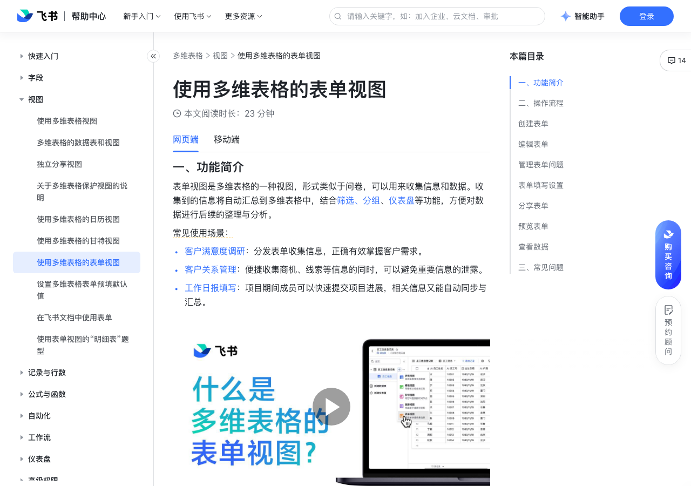

# 使用多维表格的表单视图

> 来源：[飞书帮助中心](https://www.feishu.cn/hc/zh-CN/articles/356120632302)  
> 分类：多维表格 / 视图  
> 抓取时间：2026-09-22T01:23:45.959Z

## 界面截图

### 文档内配图

1. 配图：https://p1-hera.feishucdn.com/tos-cn-i-jbbdkfciu3/3ab09a8ce85249d5b66b407060e751df~tplv-jbbdkfciu3-image:0:0.image
2. 配图：https://p1-hera.feishucdn.com/tos-cn-i-jbbdkfciu3/0f22dae559a04dc38dc7af0bc16bd430~tplv-jbbdkfciu3-image:0:0.image
3. 配图：https://p1-hera.feishucdn.com/tos-cn-i-jbbdkfciu3/d95923f243c6496193d6f1a1cc55b0ce~tplv-jbbdkfciu3-image:0:0.image
4. 配图：https://p1-hera.feishucdn.com/tos-cn-i-jbbdkfciu3/18a88614f45e4b51a1d450e5f981842b~tplv-jbbdkfciu3-image:0:0.image
5. 配图：https://p1-hera.feishucdn.com/tos-cn-i-jbbdkfciu3/f57569c410404202831de3c211bc446c~tplv-jbbdkfciu3-image:0:0.image
6. 配图：https://p1-hera.feishucdn.com/tos-cn-i-jbbdkfciu3/a87a227cb1fe4561ad9ad01b9ce32c47~tplv-jbbdkfciu3-image:0:0.image
7. 配图：https://p1-hera.feishucdn.com/tos-cn-i-jbbdkfciu3/13f99690b613473781576d7a2a1a8e37~tplv-jbbdkfciu3-image:0:0.image
8. 配图：https://p1-hera.feishucdn.com/tos-cn-i-jbbdkfciu3/d87e15f144694edf95e109fbcb050bb8~tplv-jbbdkfciu3-image:0:0.image
9. 配图：https://p1-hera.feishucdn.com/tos-cn-i-jbbdkfciu3/55e51e4e92074d78b737197b44fb94b5~tplv-jbbdkfciu3-image:0:0.image
10. 配图：https://p1-hera.feishucdn.com/tos-cn-i-jbbdkfciu3/accfb57756fc4748950ca8cb5ac084e4~tplv-jbbdkfciu3-image:0:0.image
11. 配图：https://p1-hera.feishucdn.com/tos-cn-i-jbbdkfciu3/7b9ca68d81a0454eacc6c9e8a234e732~tplv-jbbdkfciu3-image:0:0.image
12. 配图：https://p1-hera.feishucdn.com/tos-cn-i-jbbdkfciu3/6fa9e059355a4c31ba8584e1b2663e03~tplv-jbbdkfciu3-image:0:0.image
13. 配图：https://p1-hera.feishucdn.com/tos-cn-i-jbbdkfciu3/1762c7870d4a4e9b929c91eb6e53663c~tplv-jbbdkfciu3-image:0:0.image
14. 配图：https://p1-hera.feishucdn.com/tos-cn-i-jbbdkfciu3/0b06765eb0c24ef793d6cb89659d1b59~tplv-jbbdkfciu3-image:0:0.image
15. 配图：https://p1-hera.feishucdn.com/tos-cn-i-jbbdkfciu3/41e0682d1deb42a4afaa45ce20341ec4~tplv-jbbdkfciu3-image:0:0.image
16. 配图：https://p1-hera.feishucdn.com/tos-cn-i-jbbdkfciu3/4e9a2d9376e24551a5c49a75c1fea431~tplv-jbbdkfciu3-image:0:0.image
17. 配图：https://p1-hera.feishucdn.com/tos-cn-i-jbbdkfciu3/e4593cf98a9d4273a1a414e1c5f8c61c~tplv-jbbdkfciu3-image:0:0.image
18. 配图：https://p1-hera.feishucdn.com/tos-cn-i-jbbdkfciu3/7623422c184f4d81978bce9f5f992b8d~tplv-jbbdkfciu3-image:0:0.image
19. 配图：https://p1-hera.feishucdn.com/tos-cn-i-jbbdkfciu3/f9f3134d384549608564663979ea9881~tplv-jbbdkfciu3-image:0:0.image
20. 配图：https://p1-hera.feishucdn.com/tos-cn-i-jbbdkfciu3/1734a16870274efbb3a564907e1ff94e~tplv-jbbdkfciu3-image:0:0.image
21. 配图：https://p1-hera.feishucdn.com/tos-cn-i-jbbdkfciu3/1fdc3cf035504aa3848122ef0d025972~tplv-jbbdkfciu3-image:0:0.image
22. 配图：https://p1-hera.feishucdn.com/tos-cn-i-jbbdkfciu3/a7a66371f30541af899a3d994e97cc75~tplv-jbbdkfciu3-image:0:0.image
23. 配图：https://p1-hera.feishucdn.com/tos-cn-i-jbbdkfciu3/70b59ae7409c4d4795ee92110456a16d~tplv-jbbdkfciu3-image:0:0.image
24. 配图：https://p1-hera.feishucdn.com/tos-cn-i-jbbdkfciu3/e78ddecc9e36466da74cdd69ffbdde26~tplv-jbbdkfciu3-image:0:0.image
25. 配图：https://p1-hera.feishucdn.com/tos-cn-i-jbbdkfciu3/cbee3e0e896243679910024045ed36d6~tplv-jbbdkfciu3-image:0:0.image
26. 配图：https://p1-hera.feishucdn.com/tos-cn-i-jbbdkfciu3/6d6e322f70d24bbeb9135922eb19ba29~tplv-jbbdkfciu3-image:0:0.image
27. 配图：https://p1-hera.feishucdn.com/tos-cn-i-jbbdkfciu3/c1f0525663924653aaf63ba99518e75c~tplv-jbbdkfciu3-image:0:0.image
28. 配图：https://p1-hera.feishucdn.com/tos-cn-i-jbbdkfciu3/aace20ff9444498dbd9a65bc24eeb7e0~tplv-jbbdkfciu3-image:0:0.image
29. 配图：https://p1-hera.feishucdn.com/tos-cn-i-jbbdkfciu3/8baf8a7c756c43cba609b37414dcfebd~tplv-jbbdkfciu3-image:0:0.image
30. 配图：https://p1-hera.feishucdn.com/tos-cn-i-jbbdkfciu3/1bd68cd76b224bcf973fd8e216a56f80~tplv-jbbdkfciu3-image:0:0.image
31. 配图：https://p1-hera.feishucdn.com/tos-cn-i-jbbdkfciu3/4a9c91fc118b4183b1e068b85a18b2c0~tplv-jbbdkfciu3-image:0:0.image
32. 配图：https://p1-hera.feishucdn.com/tos-cn-i-jbbdkfciu3/4e137cf9e42e44fe988a30552140ae6d~tplv-jbbdkfciu3-image:0:0.image
33. 配图：https://p1-hera.feishucdn.com/tos-cn-i-jbbdkfciu3/8c5f6f2a31ee42a0945f12cf1cb52858~tplv-jbbdkfciu3-image:0:0.image
34. 配图：https://p1-hera.feishucdn.com/tos-cn-i-jbbdkfciu3/170c191d0bbe4df88be49e0fce105b90~tplv-jbbdkfciu3-image:0:0.image
35. 配图：https://p1-hera.feishucdn.com/tos-cn-i-jbbdkfciu3/91438f2239e546e0a6ee62199b3fcc16~tplv-jbbdkfciu3-image:0:0.image

## 功能定位

本页对应飞书帮助中心「多维表格 / 视图」下的「使用多维表格的表单视图」。以下需求描述依据官方说明文档提炼，用于指导 DuoWei 对标实现。

## 功能目标

一、功能简介

## 文档结构（官方章节）

- 一、功能简介 ​
- 二、操作流程​
- 创建表单​
- 方式 1：基于已有表格视图生成表单​
- 方式 2：直接创建一个空白表单​
- 编辑表单​
- 修改表单标题​
- 添加表单描述​
- 管理表单问题​
- 新增表单问题​
- 编辑表单问题​
- 移除和删除表单问题​
- 表单问题和数据表字段的关联关系​
- 设置关联问题​
- 表单填写设置​
- 分享表单​
- 预览表单​
- 查看数据​
- 三、常见问题​

## 详细功能说明

一、功能简介

常见使用场景：

客户满意度调研：分发表单收集信息，正确有效掌握客户需求。

客户关系管理：便捷收集商机、线索等信息的同时，可以避免重要信息的泄露。

工作日报填写：项目期间成员可以快速提交项目进展，相关信息又能自动同步与汇总。

0.5x

0.75x

1.5x

二、操作流程

创建表单

方式 1：基于已有表格视图生成表单

首先在表格视图中，设置好需要填写的字段类型等。如果涉及单选、多选字段，提前设置好选项。若你在表格视图中为单选或多选字段设置了引用选项，表单中也仍然可用。

注：飞书问卷不支持引用选项。

点击视图上方工具栏中的 生成表单 按钮，或是点击视图名称右侧的 + 新建视图 > 表单视图，并设置表单的名称。这样你就可以按已有的表格内容，直接生成一个表单。

方式 2：直接创建一个空白表单

点击左下角的 收集表 > 旧版，就可以自动生成一个名为 收集表 的数据表。数据表中有两个视图：名为“收集表”的表单视图，和名为“收集结果”的表格视图。

直接在表单视图中添加和编辑问题即可。

编辑表单

修改表单标题

添加表单描述

管理表单问题

新增表单问题

编辑表单问题

修改表单问题：单击你需要修改的问题，在 表单问题 处进行修改。修改完成后，点击界面任意空白处即可保存。

修改问题类型：单击你需要修改的问题，进入编辑状态，再点击字段名称 > 修改字段/列，更改字段类型。更改完成后，点击 确定 即可。

添加或修改问题描述：你可以通过以下 2 种方式添加或修改表单中的问题描述。

方式 1：在表单视图中，单击你需要修改的问题，进入编辑状态，在 问题描述 处输入或修改内容。修改完成后，点击界面任意空白处即可保存。

设置必填问题：找到你需要设为必填的问题，开启右侧的 必填 开关。若需取消必填，关闭此开关即可。

调整问题顺序：鼠标按住表单问题左侧的 ⋮⋮ 图标，上下拖拽即可调整问题顺序。

注：在表单中调整问题顺序，不会改变数据表中的字段顺序。

调整单选或多选题的选项顺序：单击你想要调整的单选或多选问题，进入编辑状态。在 选项内容 处，鼠标按住选项左侧的 ⋮⋮ 图标，即可修改选项顺序。修改完成后，点击界面任意空白处即可保存。

移除和删除表单问题

移除表单问题：指的是将问题从表单中移除，你仍然可以在 可选题目 和对应的表格视图中找到对应的字段。

找到你希望移除的问题，点击右侧的 移出表单 图标，即可移除问题。被移除的问题会出现在左侧 可选题目 的下方，点击仍可再次添加。

删除表单问题：相当于是彻底删除此问题，数据表中的字段及已收集到的数据也会被同步删除。

单击你希望删除的问题，进入编辑状态。点击右侧的 删除题目 图标，即可删除问题。

表单问题和数据表字段的关联关系

表单问题和字段的设置是同步变动的，这些设置包括但不限于：字段类型，单选和多选字段的选项增加、删除、修改、顺序调整，评分字段的数值和图形设置，等等。

表单问题和字段名称互不影响。

在表单中调整问题顺序，不会影响数据表中的字段顺序。同理，改变字段的顺序也不会影响表单问题。

若你在数据表中新增了一个字段，它不会直接出现在表单中，而是会出现在 可选题目 下，需手动加入表单。

若你在表单中新增了一个问题，无论该问题在表单中处于哪个位置，在数据表中都会显示在最右侧。

若你在表单中删除了某个问题，则该问题对应的字段和已收集到的结果也会被删除。

设置关联问题

在表单中添加两个问题：“你对本次活动的整体满意度？”（单选题）和“你对本次活动不满意的原因是？”（文本题）。此处需保证问题间的前后顺序：在这个例子中，由于文本题的展示与否取决于单选题的选择结果，因此文本题必须位于“满意度”单选题之后。

点击希望设置展示条件的问题（即本场景中的文本题），开启 当满足条件时展示该问题。

设置展示条件，在当前场景中，希望当“满意度”为“非常不满意”和“不满意”时，让用户填写不满意的原因，因此设置条件为：满意度 包含 非常不满意 和 不满意。

设置完成后，你可以点击上方的 填写表单 查看预览效果。仅当用户填写了“不满意”或“非常不满意”时，才会向用户展示该问题。

表单填写设置

限制每位用户提交次数：你可选择是否限制每位用户提交表单的次数。开启后，你可以从下拉框中选择 总共仅能提交 1 次、每天仅能提交 1 次、每周仅能提交 1 次 或 每月仅能提交 1 次，满足周期性收集信息的需求。

若选择 总共仅能提交 1 次，所有填写者将只有一次机会填写并提交表单。

若选择每天/每周/每月仅能提交 1 次，天/周/月的判断以文档时区为准。

填写需登录验证：若开启此项，填写者必须登录飞书账号才能填写和提交表单。适用于礼品领取、报名等需要区分填写者的场景，方便追溯和后续跟进。

允许用户修改提交记录：提交表单后，所有人都可以查看自己的提交记录。若开启此项，则所有填写者都可以查看并修改自己已提交的记录；若未开启此项，则所有填写者只能查看自己的提交记录，无法修改。

注：表单填写者只能看到自己的提交记录，无法直接看到其他人的填写结果。

有人提交后发送通知：有人填写并提交问卷后，系统会向指定对象发送通知，以便及时查看填写情况。开启后可选择人员或群组作为通知对象。

定时发送填写通知：定时或定期向指定对象发送通知，提醒其填写问卷。开启后需设置发送时间、重复频率和接收人。

注：选择通知对象或接收人时，最多可选择 20 个群组和 200 个人员。

分享表单

点击表单右上角的 分享表单 按钮，开启表单分享。

设置哪些人可填写表单：

仅邀请的人可填写：只有被邀请的人能填写、提交表单。在 邀请填写者 的输入框内可搜索用户、群组等。

组织内获得链接的人可填写：企业组织内的成员都可填写、提交表单。

互联网上获得链接的人可填写：任何人都能填写、提交表单。

注：若开启了 互联网上获得链接的人可填写，为保证数据安全，人员题会对组织外用户隐藏。通过分享链接打开表单的外部用户可以上传附件，但上传的附件将占用多维表格所有者的存储空间。

点击 复制链接，发送给需要填写的人或群组。你也可以定向搜索和邀请填写者，或是通过二维码进行表单的分发。

分享表单时，请勿从浏览器中复制整个多维表格的链接，而是应该复制图中 链接分享 下方的表单链接。

点击 催填，系统会从受邀请的填写者中自动筛选出未填写问卷的人员，并向其单独发送通知。在对部门进行催填时，需要保证部门内的人员不超过 500 人，催填的部门数量不超过 20 个。此外，只能催填当前部门的人员，下级部门的人员不会被催填。如果点击催填的用户和此问卷的所有者不属于同一个企业组织，则无法进行催填。

预览表单

查看数据

三、常见问题

问：哪些人可以设置表单提交次数限制？

问：若提交次数限制由“每周仅能提交 1 次”更改为“每月仅能提交 1 次”，当月已提交表单的用户还能再次提交吗？

问：若设置了固定时间周期内的填写次数限制，时间周期的计算以哪个时区为准？

问：我可以在哪里查看表单收集的数据？

问：我可以让公司以外的人员填写表单吗？

若外部用户通过表单链接打开表单，表单内的人员题将自动隐藏且外部人员不可填写。

通过分享链接打开表单的外部用户可以上传附件，但上传的附件将占用多维表格所有者的存储空间。

问：表单可以自动填写提交时间吗？

问：在填写表单时，未提交的内容是否会自动保存？

问：如果想要知道是哪个人提交的表单，该如何设置？

答：若未开启高级权限，对此数据表拥有编辑权限的用户可以设置。若开启了高级权限，对此数据表拥有可管理权限的用户可进行设置。

答：不能再次提交。更改此设置不会重新计算提交次数。

答：以文档时区为准。250px|700px|reset

答：表单收集的数据将自动汇总至对应的数据表中，你可以在数据表的表格视图中查看这些数据。

答：可以，在表单分享页面中将分享范围设置为 互联网上获得链接的人可填写 即可邀请外部用户填写表单。开启后：若外部用户通过表单链接打开表单，表单内的人员题将自动隐藏且外部人员不可填写。通过分享链接打开表单的外部用户可以上传附件，但上传的附件将占用多维表格所有者的存储空间。

答：可以，你只需要点击日期字段的名称 > 修改字段/列，在面板最下方勾选 新记录自动填写创建时间 即可。250px|700px|reset250px|700px|reset

答：会。在你点击“提交”之前，填写的草稿状态的内容会自动保存，即使页面刷新或重新进入填写界面，都会自动恢复上次已填写的内容。自动保存取决于浏览器或手机的缓存，没有固定的时长限制；如果清除了缓存，未提交的已填写内容就会消失。

答：在汇总表单结果的数据表中，添加一个“创建人”字段即可。如有需要还可以添加“创建时间”字段，来查看具体的提交时间。在数据表中新增这两个字段，不会展示在表单中。注：如果填写者未登录飞书账号，在表格中会展示为“访客”。250px|700px|reset

## 实现要点（对标 DuoWei）

1. **入口与信息架构**：在产品中明确该能力所属模块（视图），并保证用户可从对应导航触达。
2. **核心交互**：按上文「详细功能说明」还原主要操作路径；截图中出现的按钮、字段、面板命名尽量与飞书语义一致或可映射。
3. **数据与权限**：若文档涉及可见范围、可编辑范围、分享或高级权限，实现时需落到角色/成员模型，并保证 API/MCP 与 UI 权限一致。
4. **边界与上限**：若文档提到数量上限、格式限制、导入导出约束，需在实现与错误提示中体现。
5. **验收**：以本页截图场景为用例，完成「能打开 / 能配置 / 能保存 / 能被 Agent 读写（如适用）」四项检查。

## 原始摘录摘要

> 一、功能简介 常见使用场景： 客户满意度调研：分发表单收集信息，正确有效掌握客户需求。 客户关系管理：便捷收集商机、线索等信息的同时，可以避免重要信息的泄露。 工作日报填写：项目期间成员可以快速提交项目进展，相关信息又能自动同步与汇总。 0.5x 0.75x 1.5x 二、操作流程 创建表单 方式 1：基于已有表格视图生成表单 首先在表格视图中，设置好需要填写的字段类型等。如果涉及单选、多选字段，提前设置好选项。若你在表格视图中为单选或多选字段设置了引用选项，表单中也仍然可用。 注：飞书问卷不支持引用选项。 点击视图上方工具栏中的 生成表单 按钮，或是点击视图名称右侧的 + 新建视图 > 表单视图，并设置表单的名称。这样你就可以按已有的表格内容，直接生成一个表单。 方式 2：直接创建一个空白表单 点击左下角的 收集表 > 旧版，就可以自动生成一个名为 收集表 的数据表。数据表中有两个视图：名为“收集表”的表单视图，和名为“收集结果”的表格视图。 直接在表单视图中添加和编辑问题即可。 编辑表单 修改表单标题 添加表单描述 管理表单问题 新增表单问题 编辑表单问题 修改表单问题：单击你需要修改的问题，在 表单问题 处进行修改。修改完成后，点击界面任意空白处即可保存。 修改问题类型：单击你需要修改的问题，进入编辑状态，再点击字段名称 > 修改字段/列，更改字段类型。更改完成后，点击 确定 即可。 添加或修改问题描述：你可以通过以下 2 种方式添加或修改表单中的问题描述。 方式 1：在表单视图中，单击你需要修改的问题，进入编辑状态，在 问题描述 处输入或修改内容。修改完成后，点击界面任意空白处即可保存。 设置必填问题：找到你需要设为必填的问题，开启右侧的 必填 开关。若需取消必填，关闭此开关即可。 调整问题顺序：鼠标按住表单问题左侧的 ⋮⋮ 图标，上下拖拽即可调整问题顺序。 注：在…

## 元数据

- article_id: `6997333889920270364`
- category_id: `7006240778276110337`
- path: `/hc/zh-CN/articles/356120632302`
- extracted_text_length: 3678
