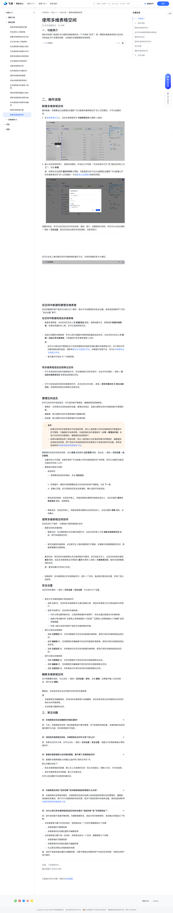

# 使用多维表格空间

> 来源：[飞书帮助中心](https://www.feishu.cn/hc/zh-CN/articles/404834296848)  
> 分类：多维表格 / 快速入门 / 基础设置  
> 抓取时间：2026-09-22T01:15:59.908Z

## 界面截图

### 文档内配图

1. 配图：https://p1-hera.feishucdn.com/tos-cn-i-jbbdkfciu3/322f185a352b4820a9d704aae706d318~tplv-jbbdkfciu3-image:0:0.image
2. 配图：https://p1-hera.feishucdn.com/tos-cn-i-jbbdkfciu3/4374fcc23d774fdca12e889b60cecf61~tplv-jbbdkfciu3-image:0:0.image
3. 配图：https://p1-hera.feishucdn.com/tos-cn-i-jbbdkfciu3/9453a492d72d40e383fb924dd60277c1~tplv-jbbdkfciu3-image:0:0.image
4. 配图：https://p1-hera.feishucdn.com/tos-cn-i-jbbdkfciu3/5c3adb7eabb141c6abb6b844bc950096~tplv-jbbdkfciu3-image:0:0.image
5. 配图：https://p1-hera.feishucdn.com/tos-cn-i-jbbdkfciu3/431f75c646d145deb661e03f4c43ec69~tplv-jbbdkfciu3-image:0:0.image
6. 配图：https://p1-hera.feishucdn.com/tos-cn-i-jbbdkfciu3/a434f839146248c8b4090635d21b2fcb~tplv-jbbdkfciu3-image:0:0.image
7. 配图：https://p1-hera.feishucdn.com/tos-cn-i-jbbdkfciu3/3baa3486ae0f4957a44d77ef8b97393a~tplv-jbbdkfciu3-image:0:0.image
8. 配图：https://p1-hera.feishucdn.com/tos-cn-i-jbbdkfciu3/52650295664c4ac9879986749fd6c036~tplv-jbbdkfciu3-image:0:0.image
9. 配图：https://p1-hera.feishucdn.com/tos-cn-i-jbbdkfciu3/8d74fdff9c0a4f48917e7e1293f86f43~tplv-jbbdkfciu3-image:0:0.image
10. 配图：https://p1-hera.feishucdn.com/tos-cn-i-jbbdkfciu3/1211084e68764d259cdf8a0e5f154283~tplv-jbbdkfciu3-image:0:0.image
11. 配图：https://p1-hera.feishucdn.com/tos-cn-i-jbbdkfciu3/3904b3bccdbb44d6a57be7b256cb4399~tplv-jbbdkfciu3-image:0:0.image
12. 配图：https://p1-hera.feishucdn.com/tos-cn-i-jbbdkfciu3/2dd71d4b181c4cdbb78e2a1425299e64~tplv-jbbdkfciu3-image:0:0.image
13. 配图：https://p1-hera.feishucdn.com/tos-cn-i-jbbdkfciu3/bc1083467e5141ce830b1786c481fae1~tplv-jbbdkfciu3-image:0:0.image
14. 配图：https://p1-hera.feishucdn.com/tos-cn-i-jbbdkfciu3/372bf3a0a0f9471baeab8369677ea366~tplv-jbbdkfciu3-image:0:0.image
15. 配图：https://p1-hera.feishucdn.com/tos-cn-i-jbbdkfciu3/cdf88453645f44aaa0008f89c9d48eed~tplv-jbbdkfciu3-image:0:0.image
16. 配图：https://p1-hera.feishucdn.com/tos-cn-i-jbbdkfciu3/d11a3f2f9739481b8b9f02f0b127099a~tplv-jbbdkfciu3-image:0:0.image
17. 配图：https://p1-hera.feishucdn.com/tos-cn-i-jbbdkfciu3/56c2aee2ced14a52a714c46df6d85f80~tplv-jbbdkfciu3-image:0:0.image
18. 配图：https://p1-hera.feishucdn.com/tos-cn-i-jbbdkfciu3/b796a51615c2468995d326ebd77db555~tplv-jbbdkfciu3-image:0:0.image
19. 配图：https://p1-hera.feishucdn.com/tos-cn-i-jbbdkfciu3/ca755c311709436cb4069441a006f72c~tplv-jbbdkfciu3-image:0:0.image

## 功能定位

本页对应飞书帮助中心「多维表格 / 快速入门 / 基础设置」下的「使用多维表格空间」。以下需求描述依据官方说明文档提炼，用于指导 DuoWei 对标实现。

## 功能目标

一、功能简介

## 文档结构（官方章节）

- 一、功能简介​
- 二、操作流程 ​
- 新建多维表格空间​
- 在空间中新建和管理多维表格​
- 在空间中新建或添加多维表格​
- 将多维表格添加至或移出空间​
- 管理空间成员​
- 使用多维表格空间协作​
- 安全设置​
- 删除多维表格空间​
- 三、常见问题​

## 详细功能说明

一、功能简介

二、操作流程

新建多维表格空间

在多维表格主页上，点击左侧导航栏中 多维表格空间 右侧的 + 图标。

输入空间名称和简介，选择空间图标，并设定公开范围（“仅空间成员可见”或“组织内所有人可见”），点击 新建。

注：如果你无法选择 组织内所有人可见，可能是因为你不在企业管理员设置的“可以新建公开的多维表格空间”的人员范围内，可以联系企业管理员获取该权限。

在空间中新建和管理多维表格

在空间中新建或添加多维表格

新建多维表格：点击空间主页右上角 新建/添加 图标，选择创建方式。如果选择 新建多维表格，在弹出界面的左上角，还可以选择其他空间。

添加已创建的多维表格：你可以将已创建的多维表格批量添加至空间。点击空间主页右上角 新建 > 添加已有多维表格，可批量将已有多维表格移入空间。

你仅可以移动你可管理且位于你有权限移动内容的存储位置的多维表格文件。关于移动文件所需权限的具体信息，请参考移动云文档或文件夹。如果提示权限不足，你可以申请移动云文档或文件夹。

每次最多可添加 10 个多维表格。

将多维表格添加至或移出空间

对于未添加到空间的多维表格文件，在多维表格主页的列表中，点击文件右侧的 ··· 图标 > 添加到多维表格空间 将其添加到指定空间。

对于已经添加到空间的多维表格文件，点击空间主页右侧 ··· 图标 > 更改所属空间 或 移出当前空间，将其移到其他空间或移出当前空间。

管理空间成员

管理员：支持修改空间的信息和设置，管理空间成员，且默认拥有空间内多维表格的可管理权限。

编辑者：默认拥有空间内多维表格的可编辑权限。

阅读者：默认拥有空间内多维表格的可阅读权限。

如果空间中的多维表格未开启高级权限，则以上角色默认对应多维表格协作者面板中的可管理、可编辑和可阅读权限。多维表格的协作者面板中（分享 > 管理协作者）会显示对应的空间管理员、编辑者和阅读者用户。

如果多维表格启用了高级权限，则以上角色默认对应高级权限中的管理员、编辑者和阅读者系统权限。用户实际对多维表格具有的权限取决于高级权限中的设置。具体信息请参考多维表格高级权限角色介绍。

设置空间公开范围：如果你具有“可以新建公开的多维表格空间”的权限，则可以设置空间是否对组织内所有人公开。

管理成员角色与权限：

添加成员：

选择要添加成员的角色，点击 添加成员。

250px|700px|reset

在弹窗中，搜索并选择需要添加为空间成员的用户或群组，点击 下一步。

在确认页面，你可选择是否发送消息通知，确认后即可完成添加。

修改成员的角色：在成员列表上，将鼠标悬停在要修改角色的成员上，点击右侧的 更改为其他角色 图标，选择角色。

移除成员：在成员列表上，将鼠标悬停在要移出空间的成员上，点击右侧的 移除 图标，点击确认。

使用多维表格空间协作

搜索空间和多维表格：

搜索空间：在多维表格主页左侧的导航栏中，点击空间列表上方的 搜索多维表格空间 图标，即可快速查找空间。

按空间搜索多维表格：点击首页左上角的搜索框打开弹窗，在弹窗中选择要搜索的空间，再搜索需要的多维表格。

置顶空间：将空间在多维表格主页左侧导航栏中置顶。在空间的主页上，点击空间名称右侧的 置顶 图标，或点击多维表格主页导航栏 置顶 栏旁的 + 图标 > 多维表格空间，查找并选择要置顶的空间。

注：置顶设置仅对你自己生效。

拖拽排序：在多维表格主页左侧导航栏中，选中一个空间，拖动到任意目标位置，实现个性化的排序。

安全设置

是否允许多维表格被分享到组织外：

选择 允许 时，空间内的多维表格可以通过链接分享、添加协作者等方式分享给组织外的用户。

选择 不允许 时，空间内的多维表格：

对外分享设置将被关闭，之前获得链接的外部用户，将无法通过链接访问多维表格。

链接分享设置中的“互联网上获得链接的人可阅读”“互联网上获得链接的人可编辑”选项将被隐藏。

所有人都无法将外部用户添加为多维表格协作者。

谁可以添加多维表格：

选择 仅管理员 时，仅空间管理员可在空间内新建多维表格，或将已有的多维表格添加进空间。

选择 编辑者 时，空间管理员和编辑者可在空间内新建多维表格，或将已有的多维表格添加进空间。

选择 全部成员 时，所有角色均可在空间内新建多维表格，或将已有的多维表格添加进空间。

谁可以移出多维表格：

选择 仅管理员 时，仅空间管理员可将空间内的多维表格移出空间。

选择 编辑者 时，空间管理员和编辑者可将空间内的多维表格移出空间。

选择 全部成员 时，所有角色均可将空间内的多维表格移出空间。

删除多维表格空间

多维表格空间被删除后，空间内的多维表格不会被删除，但空间成员将无法凭借其在空间中的身份访问多维表格。

无法恢复已删除的空间。

三、常见问题

问：多维表格空间会创建新的存储位置吗？

答：不会。多维表格空间将一组多维表格进行集中管理，并不影响其存储位置。多维表格的实际存储位置仍为云盘、知识库或我的文档库。

问：添加到多维表格空间后，多维表格无法对外分享了怎么办？

答：如果无法对外分享，你可以点击 ··· 图标 > 空间设置 > 安全设置，设置允许多维表格被分享到组织外。

问：新建多维表格默认会存储在哪里，属于哪个多维表格空间？

答：新建的多维表格默认存储在云盘中的“我的文件夹”中。默认所属空间如下：若在多维表格首页新建，默认为上次选择的空间；若从未选择过，则默认为空，可手动选择。若在多维表格空间中新建，默认为当前空间。你可以在创建时手动选择所属空间。250px|700px|reset

问：多维表格空间的“成员权限”和多维表格高级权限是什么关系？

答：多维表格开启高级权限后，多维表格空间成员会默认添加到高级权限对应的管理员、编辑者、阅读者系统角色，用户对于多维表格的实际权限，取决于高级权限中的具体设置。具体信息请参考多维表格高级权限角色介绍。

问：为什么将已有多维表格添加至空间时会提示“添加失败”或“无权限添加”？

答：因为添加者不具备所需权限。为确保数据安全，添加已有多维表格时，添加者必须具备以下权限：当多维表格不属于任何空间时，将其移动至一个空间中需要拥有以下权限：多维表格的可管理权限多维表格所在存储位置的可编辑权限当多维表格已属于某一空间时，将其移动至另一个空间，需要拥有以下权限：多维表格的可管理权限多维表格所在存储位置的可编辑权限可从原空间移出多维表格的权限注：如你不具备存储位置的可编辑权限，可赋予拥有此权限的用户对应的空间权限，并联系该用户进行操作。

## 实现要点（对标 DuoWei）

1. **入口与信息架构**：在产品中明确该能力所属模块（快速入门 / 基础设置），并保证用户可从对应导航触达。
2. **核心交互**：按上文「详细功能说明」还原主要操作路径；截图中出现的按钮、字段、面板命名尽量与飞书语义一致或可映射。
3. **数据与权限**：若文档涉及可见范围、可编辑范围、分享或高级权限，实现时需落到角色/成员模型，并保证 API/MCP 与 UI 权限一致。
4. **边界与上限**：若文档提到数量上限、格式限制、导入导出约束，需在实现与错误提示中体现。
5. **验收**：以本页截图场景为用例，完成「能打开 / 能配置 / 能保存 / 能被 Agent 读写（如适用）」四项检查。

## 原始摘录摘要

> 一、功能简介 二、操作流程 新建多维表格空间 在多维表格主页上，点击左侧导航栏中 多维表格空间 右侧的 + 图标。 输入空间名称和简介，选择空间图标，并设定公开范围（“仅空间成员可见”或“组织内所有人可见”），点击 新建。 注：如果你无法选择 组织内所有人可见，可能是因为你不在企业管理员设置的“可以新建公开的多维表格空间”的人员范围内，可以联系企业管理员获取该权限。 在空间中新建和管理多维表格 在空间中新建或添加多维表格 新建多维表格：点击空间主页右上角 新建/添加 图标，选择创建方式。如果选择 新建多维表格，在弹出界面的左上角，还可以选择其他空间。 添加已创建的多维表格：你可以将已创建的多维表格批量添加至空间。点击空间主页右上角 新建 > 添加已有多维表格，可批量将已有多维表格移入空间。 你仅可以移动你可管理且位于你有权限移动内容的存储位置的多维表格文件。关于移动文件所需权限的具体信息，请参考移动云文档或文件夹。如果提示权限不足，你可以申请移动云文档或文件夹。 每次最多可添加 10 个多维表格。 将多维表格添加至或移出空间 对于未添加到空间的多维表格文件，在多维表格主页的列表中，点击文件右侧的 ··· 图标 > 添加到多维表格空间 将其添加到指定空间。 对于已经添加到空间的多维表格文件，点击空间主页右侧 ··· 图标 > 更改所属空间 或 移出当前空间，将其移到其他空间或移出当前空间。 管理空间成员 管理员：支持修改空间的信息和设置，管理空间成员，且默认拥有空间内多维表格的可管理权限。 编辑者：默认拥有空间内多维表格的可编辑权限。 阅读者：默认拥有空间内多维表格的可阅读权限。 如果空间中的多维表格未开启高级权限，则以上角色默认对应多维表格协作者面板中的可管理、可编辑和可阅读权限。多维表格的协作者面板中（分享 > 管理协作者）会显示对应的空间管理员、编辑者和阅读者用户。 如…

## 元数据

- article_id: `7545392603622113281`
- category_id: `7225072576895254530`
- path: `/hc/zh-CN/articles/404834296848`
- extracted_text_length: 2687
