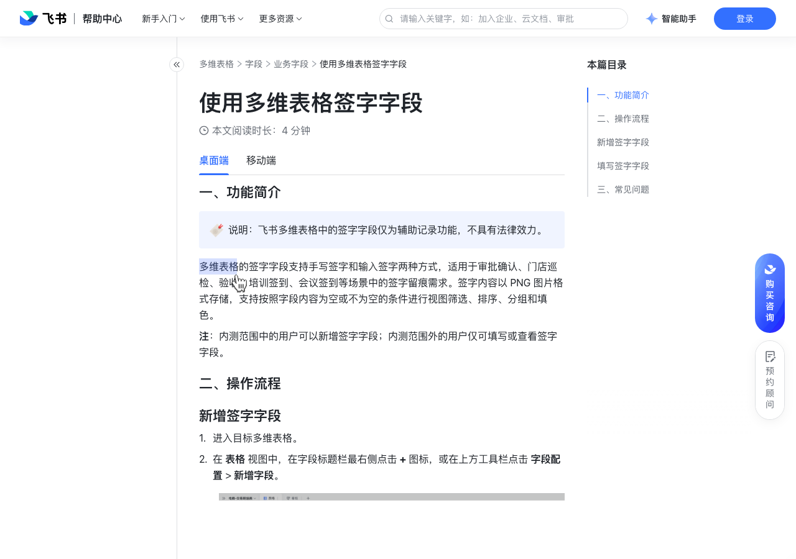

# 使用多维表格签字字段

> 来源：[飞书帮助中心](https://www.feishu.cn/hc/zh-CN/articles/779890335576)  
> 分类：多维表格 / 字段 / 业务字段  
> 抓取时间：2026-09-22T01:21:40.028Z

## 界面截图

### 文档内配图

1. 配图：https://p1-hera.feishucdn.com/tos-cn-i-jbbdkfciu3/5e61c330135c4630a566e0d9144ec7a0~tplv-jbbdkfciu3-image:0:0.image
2. 配图：https://p1-hera.feishucdn.com/tos-cn-i-jbbdkfciu3/ea72fc04eef142008ff5e0b2cac804c2~tplv-jbbdkfciu3-image:0:0.image
3. 配图：https://p1-hera.feishucdn.com/tos-cn-i-jbbdkfciu3/84e1bd4388124992827039e1bcaaa606~tplv-jbbdkfciu3-image:0:0.image

## 功能定位

本页对应飞书帮助中心「多维表格 / 字段 / 业务字段」下的「使用多维表格签字字段」。以下需求描述依据官方说明文档提炼，用于指导 DuoWei 对标实现。

## 功能目标

一、功能简介

## 文档结构（官方章节）

- 一、功能简介​
- 二、操作流程​
- 新增签字字段​
- 填写签字字段​
- 三、常见问题​

## 详细功能说明

一、功能简介

二、操作流程

新增签字字段

进入目标多维表格。

在 表格 视图中，在字段标题栏最右侧点击 + 图标，或在上方工具栏点击 字段配置 > 新增字段。

填写字段标题，将字段类型切换为 签字，点击 确定。

填写签字字段

进入目标多维表格，在签字字段中双击对应的单元格，打开签字面板。

在签字面板中签名，完成后点击 保存。

手写签字：默认模式，通过移动鼠标完成手写体签名。

输入签字：点击 输入签字 切换到此模式，输入姓名后自动生成印刷体签名。

注：签字过程中，点击 清除 可以擦除已有笔迹或文字，重新签字。

三、常见问题

问：在多维表格签字字段中保存签字后，还可以删除或修改签字吗？

桌面端：在签字字段中点击对应的单元格并按下删除键即可删除签字；删除签字后再次点击对应的单元格即可重新签字。

移动端：在签字字段中点击对应的单元格进入记录详情页，点击 签字，按需选择手写签字或输入签字，根据屏幕提示重新签字即可。在记录详情页长按签字图片后点击 删除 可以删除签字。

答：可以。桌面端：在签字字段中点击对应的单元格并按下删除键即可删除签字；删除签字后再次点击对应的单元格即可重新签字。移动端：在签字字段中点击对应的单元格进入记录详情页，点击 签字，按需选择手写签字或输入签字，根据屏幕提示重新签字即可。在记录详情页长按签字图片后点击 删除 可以删除签字。

## 实现要点（对标 DuoWei）

1. **入口与信息架构**：在产品中明确该能力所属模块（字段 / 业务字段），并保证用户可从对应导航触达。
2. **核心交互**：按上文「详细功能说明」还原主要操作路径；截图中出现的按钮、字段、面板命名尽量与飞书语义一致或可映射。
3. **数据与权限**：若文档涉及可见范围、可编辑范围、分享或高级权限，实现时需落到角色/成员模型，并保证 API/MCP 与 UI 权限一致。
4. **边界与上限**：若文档提到数量上限、格式限制、导入导出约束，需在实现与错误提示中体现。
5. **验收**：以本页截图场景为用例，完成「能打开 / 能配置 / 能保存 / 能被 Agent 读写（如适用）」四项检查。

## 原始摘录摘要

> 一、功能简介 二、操作流程 新增签字字段 进入目标多维表格。 在 表格 视图中，在字段标题栏最右侧点击 + 图标，或在上方工具栏点击 字段配置 > 新增字段。 填写字段标题，将字段类型切换为 签字，点击 确定。 填写签字字段 进入目标多维表格，在签字字段中双击对应的单元格，打开签字面板。 在签字面板中签名，完成后点击 保存。 手写签字：默认模式，通过移动鼠标完成手写体签名。 输入签字：点击 输入签字 切换到此模式，输入姓名后自动生成印刷体签名。 注：签字过程中，点击 清除 可以擦除已有笔迹或文字，重新签字。 三、常见问题 问：在多维表格签字字段中保存签字后，还可以删除或修改签字吗？ 桌面端：在签字字段中点击对应的单元格并按下删除键即可删除签字；删除签字后再次点击对应的单元格即可重新签字。 移动端：在签字字段中点击对应的单元格进入记录详情页，点击 签字，按需选择手写签字或输入签字，根据屏幕提示重新签字即可。在记录详情页长按签字图片后点击 删除 可以删除签字。 答：可以。桌面端：在签字字段中点击对应的单元格并按下删除键即可删除签字；删除签字后再次点击对应的单元格即可重新签字。移动端：在签字字段中点击对应的单元格进入记录详情页，点击 签字，按需选择手写签字或输入签字，根据屏幕提示重新签字即可。在记录详情页长按签字图片后点击 删除 可以删除签字。

## 元数据

- article_id: `7659340644778773446`
- category_id: `7187723341653000220`
- path: `/hc/zh-CN/articles/779890335576`
- extracted_text_length: 578
