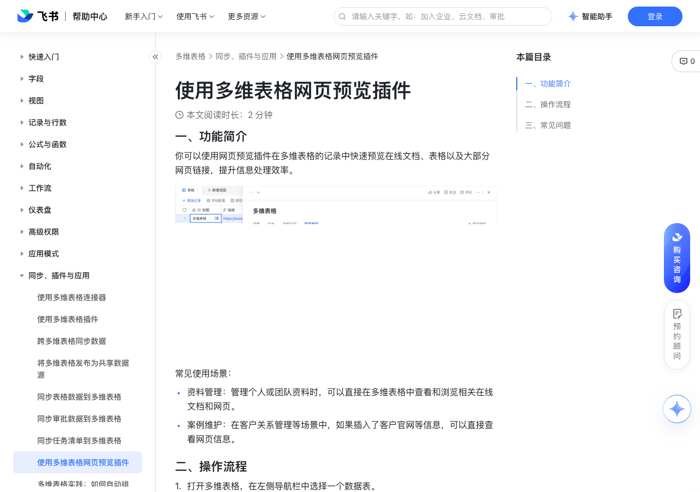

# 使用多维表格网页预览插件

> 来源：[飞书帮助中心](https://www.feishu.cn/hc/zh-CN/articles/788010002801)  
> 分类：多维表格 / 同步、插件与应用  
> 抓取时间：2026-09-22T01:26:35.948Z

## 界面截图

### 文档内配图

1. 配图：https://p1-hera.feishucdn.com/tos-cn-i-jbbdkfciu3/95b8e9daa1b14a498048a78589480344~tplv-jbbdkfciu3-image:0:0.image
2. 配图：https://p1-hera.feishucdn.com/tos-cn-i-jbbdkfciu3/95a876b7b02145bbb2ccb8954dc6d03f~tplv-jbbdkfciu3-image:0:0.image
3. 配图：https://p1-hera.feishucdn.com/tos-cn-i-jbbdkfciu3/9fac0c35fa7b469596b73297fc2c5da1~tplv-jbbdkfciu3-image:0:0.image

## 功能定位

本页对应飞书帮助中心「多维表格 / 同步、插件与应用」下的「使用多维表格网页预览插件」。以下需求描述依据官方说明文档提炼，用于指导 DuoWei 对标实现。

## 功能目标

一、功能简介

## 文档结构（官方章节）

- 一、功能简介 ​
- 二、操作流程 ​
- 三、常见问题​

## 详细功能说明

一、功能简介

资料管理：管理个人或团队资料时，可以直接在多维表格中查看和浏览相关在线文档和网页。

案例维护：在客户关系管理等场景中，如果插入了客户官网等信息，可以直接查看网页信息。

二、操作流程

打开多维表格，在左侧导航栏中选择一个数据表。

将鼠标悬停在任意记录上，点击索引列浮现的 查看详情 图标。

在记录详情页的右上角，点击 + 添加插件，在弹出的页面上添加 网页预览 插件。

添加插件后，在记录详情页上将出现 网页预览 标签页。点击该标签页，可以预览记录中左起第一个网页链接的内容。

打开 网页预览 标签页，可在网页右上角的操作菜单中选择在浏览器中打开网页链接、复制链接，或设置生成网页预览的字段。

你可以移动操作菜单的位置，防止其遮挡预览页面中的信息。

三、常见问题

问：为什么有些网页不支持使用多维表格网页预览插件查看？

答：由于部分网站自身设置的原因，无法使用预览插件进行预览。如果你是网站的管理员，可在 content-security-policy: frame-ancestors 中添加以下域名：https://*.feishupkg.com 、https://*.feishu.cn。250px|700px|reset

问：多维表格中有多个链接字段，可以同时预览吗？

答：无法同时预览多个网页链接，但可以添加多个网页预览插件，选择不同的链接字段。

问：在当前多维表格视图中添加了插件后，还需要在其他视图重新添加吗？

答：不需要，添加后当前数据表内的所有视图中均可使用该插件。如需要在其他数据表中使用，需重新添加。

问：是否可以通过直接点击多维表格字段中的链接预览？

答：暂不支持直接通过点击链接预览。

问：谁可以在多维表格中添加插件？

答：未开启高级权限时，拥有对数据表可编辑、可管理权限的用户可以添加插件。开启高级权限时，仅拥有对数据表可管理权限的用户可以添加插件。

## 实现要点（对标 DuoWei）

1. **入口与信息架构**：在产品中明确该能力所属模块（同步、插件与应用），并保证用户可从对应导航触达。
2. **核心交互**：按上文「详细功能说明」还原主要操作路径；截图中出现的按钮、字段、面板命名尽量与飞书语义一致或可映射。
3. **数据与权限**：若文档涉及可见范围、可编辑范围、分享或高级权限，实现时需落到角色/成员模型，并保证 API/MCP 与 UI 权限一致。
4. **边界与上限**：若文档提到数量上限、格式限制、导入导出约束，需在实现与错误提示中体现。
5. **验收**：以本页截图场景为用例，完成「能打开 / 能配置 / 能保存 / 能被 Agent 读写（如适用）」四项检查。

## 原始摘录摘要

> 一、功能简介 资料管理：管理个人或团队资料时，可以直接在多维表格中查看和浏览相关在线文档和网页。 案例维护：在客户关系管理等场景中，如果插入了客户官网等信息，可以直接查看网页信息。 二、操作流程 打开多维表格，在左侧导航栏中选择一个数据表。 将鼠标悬停在任意记录上，点击索引列浮现的 查看详情 图标。 在记录详情页的右上角，点击 + 添加插件，在弹出的页面上添加 网页预览 插件。 添加插件后，在记录详情页上将出现 网页预览 标签页。点击该标签页，可以预览记录中左起第一个网页链接的内容。 打开 网页预览 标签页，可在网页右上角的操作菜单中选择在浏览器中打开网页链接、复制链接，或设置生成网页预览的字段。 你可以移动操作菜单的位置，防止其遮挡预览页面中的信息。 三、常见问题 问：为什么有些网页不支持使用多维表格网页预览插件查看？ 答：由于部分网站自身设置的原因，无法使用预览插件进行预览。如果你是网站的管理员，可在 content-security-policy: frame-ancestors 中添加以下域名：https://*.feishupkg.com 、https://*.feishu.cn。250px|700px|reset 问：多维表格中有多个链接字段，可以同时预览吗？ 答：无法同时预览多个网页链接，但可以添加多个网页预览插件，选择不同的链接字段。 问：在当前多维表格视图中添加了插件后，还需要在其他视图重新添加吗？ 答：不需要，添加后当前数据表内的所有视图中均可使用该插件。如需要在其他数据表中使用，需重新添加。 问：是否可以通过直接点击多维表格字段中的链接预览？ 答：暂不支持直接通过点击链接预览。 问：谁可以在多维表格中添加插件？ 答：未开启高级权限时，拥有对数据表可编辑、可管理权限的用户可以添加插件。开启高级权限时，仅拥有对数据表可管理权限的用户可以添加插件。

## 元数据

- article_id: `7208802509664976924`
- category_id: `7225134052943200257`
- path: `/hc/zh-CN/articles/788010002801`
- extracted_text_length: 795
