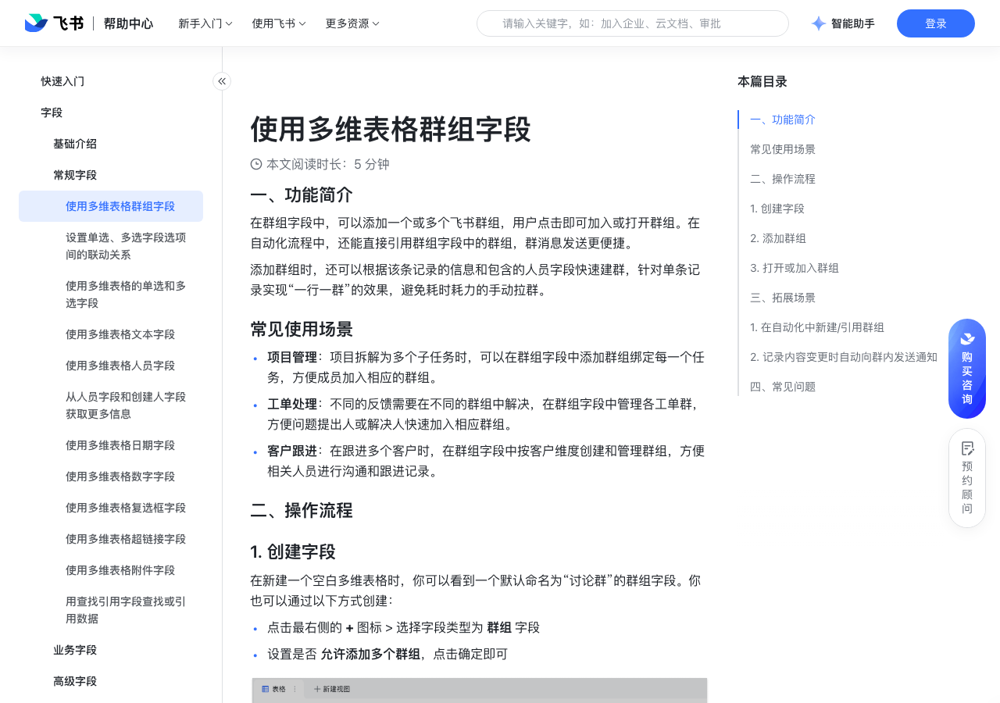

# 使用多维表格群组字段

> 来源：[飞书帮助中心](https://www.feishu.cn/hc/zh-CN/articles/810974523500)  
> 分类：多维表格 / 字段 / 常规字段  
> 抓取时间：2026-09-22T01:21:33.805Z

## 界面截图

### 文档内配图

1. 配图：https://p1-hera.feishucdn.com/tos-cn-i-jbbdkfciu3/9a027b2f648847ccbdc095fb3fb83a85~tplv-jbbdkfciu3-image:0:0.image
2. 配图：https://p1-hera.feishucdn.com/tos-cn-i-jbbdkfciu3/d18f9806779e484d817e5b187320edae~tplv-jbbdkfciu3-image:0:0.image
3. 配图：https://p1-hera.feishucdn.com/tos-cn-i-jbbdkfciu3/ef55ca112b2f448790f6711d62aa04fe~tplv-jbbdkfciu3-image:0:0.image
4. 群组加入.gif：https://p1-hera.feishucdn.com/tos-cn-i-jbbdkfciu3/a720244cfd264a87b486660304db794b~tplv-jbbdkfciu3-image:0:0.image
5. 配图：https://p1-hera.feishucdn.com/tos-cn-i-jbbdkfciu3/65698c1a1da54154b26338679ff31abb~tplv-jbbdkfciu3-image:0:0.image

## 功能定位

本页对应飞书帮助中心「多维表格 / 字段 / 常规字段」下的「使用多维表格群组字段」。以下需求描述依据官方说明文档提炼，用于指导 DuoWei 对标实现。

## 功能目标

一、功能简介

## 文档结构（官方章节）

- 一、功能简介​
- 常见使用场景​
- 二、操作流程​
- 创建字段​
- 添加群组​
- 打开或加入群组​
- 三、拓展场景​
- 在自动化中新建/引用群组​
- 2. 记录内容变更时自动向群内发送通知​
- 四、常见问题​

## 详细功能说明

一、功能简介

常见使用场景

项目管理：项目拆解为多个子任务时，可以在群组字段中添加群组绑定每一个任务，方便成员加入相应的群组。

工单处理：不同的反馈需要在不同的群组中解决，在群组字段中管理各工单群，方便问题提出人或解决人快速加入相应群组。

客户跟进：在跟进多个客户时，在群组字段中按客户维度创建和管理群组，方便相关人员进行沟通和跟进记录。

二、操作流程

创建字段

点击最右侧的 + 图标 > 选择字段类型为 群组 字段

设置是否 允许添加多个群组，点击确定即可

添加群组

打开或加入群组

在桌面端内浏览多维表格时，还可以将鼠标悬浮在 讨论群 字段上，点击 打开，在页面侧边的分页中直接打开群组，无需来回切换页面。

三、拓展场景

在自动化中新建/引用群组

第 1 步：设置触发条件为 添加新纪录时。

第 2 步：选择执行操作为 创建飞书群组，填写群名称，选择群成员和群主等。

第 3 步：添加操作为 修改记录，设置记录内容处选择群组字段，选择填入的内容为 上一步中创建的群组，这样在上一步中创建的飞书群组将被自动记录到群组字段中。

第 4 步：添加操作为 发送飞书消息，并选择发送至群组，在接收群组处选择上一步中的群组字段。

2. 记录内容变更时自动向群内发送通知

点击 自动化，选择 记录内容变更时发送飞书消息。

选择将飞书消息发送至 群组，将接收群组设为记录内已添加的讨论群。

设置成功后，当多维表格中的记录内容发生变化时，均会自动发送消息至讨论群。

四、常见问题

问：为什么我点击了加群后仍然不能加入群组？

答：可能有以下 3 个原因：群组已解散群成员数已达上限群组为企业内部群，企业之外的用户无法加入

问：点击“快速建群”后，修改作为群名的多行文本内容，是否会同步修改群聊名称？

答：否。

问：点击“快速建群”后，人员字段变更时，是否会同步添加或移除群聊成员？

## 实现要点（对标 DuoWei）

1. **入口与信息架构**：在产品中明确该能力所属模块（字段 / 常规字段），并保证用户可从对应导航触达。
2. **核心交互**：按上文「详细功能说明」还原主要操作路径；截图中出现的按钮、字段、面板命名尽量与飞书语义一致或可映射。
3. **数据与权限**：若文档涉及可见范围、可编辑范围、分享或高级权限，实现时需落到角色/成员模型，并保证 API/MCP 与 UI 权限一致。
4. **边界与上限**：若文档提到数量上限、格式限制、导入导出约束，需在实现与错误提示中体现。
5. **验收**：以本页截图场景为用例，完成「能打开 / 能配置 / 能保存 / 能被 Agent 读写（如适用）」四项检查。

## 原始摘录摘要

> 一、功能简介 常见使用场景 项目管理：项目拆解为多个子任务时，可以在群组字段中添加群组绑定每一个任务，方便成员加入相应的群组。 工单处理：不同的反馈需要在不同的群组中解决，在群组字段中管理各工单群，方便问题提出人或解决人快速加入相应群组。 客户跟进：在跟进多个客户时，在群组字段中按客户维度创建和管理群组，方便相关人员进行沟通和跟进记录。 二、操作流程 创建字段 点击最右侧的 + 图标 > 选择字段类型为 群组 字段 设置是否 允许添加多个群组，点击确定即可 添加群组 打开或加入群组 在桌面端内浏览多维表格时，还可以将鼠标悬浮在 讨论群 字段上，点击 打开，在页面侧边的分页中直接打开群组，无需来回切换页面。 三、拓展场景 在自动化中新建/引用群组 第 1 步：设置触发条件为 添加新纪录时。 第 2 步：选择执行操作为 创建飞书群组，填写群名称，选择群成员和群主等。 第 3 步：添加操作为 修改记录，设置记录内容处选择群组字段，选择填入的内容为 上一步中创建的群组，这样在上一步中创建的飞书群组将被自动记录到群组字段中。 第 4 步：添加操作为 发送飞书消息，并选择发送至群组，在接收群组处选择上一步中的群组字段。 2. 记录内容变更时自动向群内发送通知 点击 自动化，选择 记录内容变更时发送飞书消息。 选择将飞书消息发送至 群组，将接收群组设为记录内已添加的讨论群。 设置成功后，当多维表格中的记录内容发生变化时，均会自动发送消息至讨论群。 四、常见问题 问：为什么我点击了加群后仍然不能加入群组？ 答：可能有以下 3 个原因：群组已解散群成员数已达上限群组为企业内部群，企业之外的用户无法加入 问：点击“快速建群”后，修改作为群名的多行文本内容，是否会同步修改群聊名称？ 答：否。 问：点击“快速建群”后，人员字段变更时，是否会同步添加或移除群聊成员？

## 元数据

- article_id: `7202816255844368385`
- category_id: `7187711716854464540`
- path: `/hc/zh-CN/articles/810974523500`
- extracted_text_length: 783
