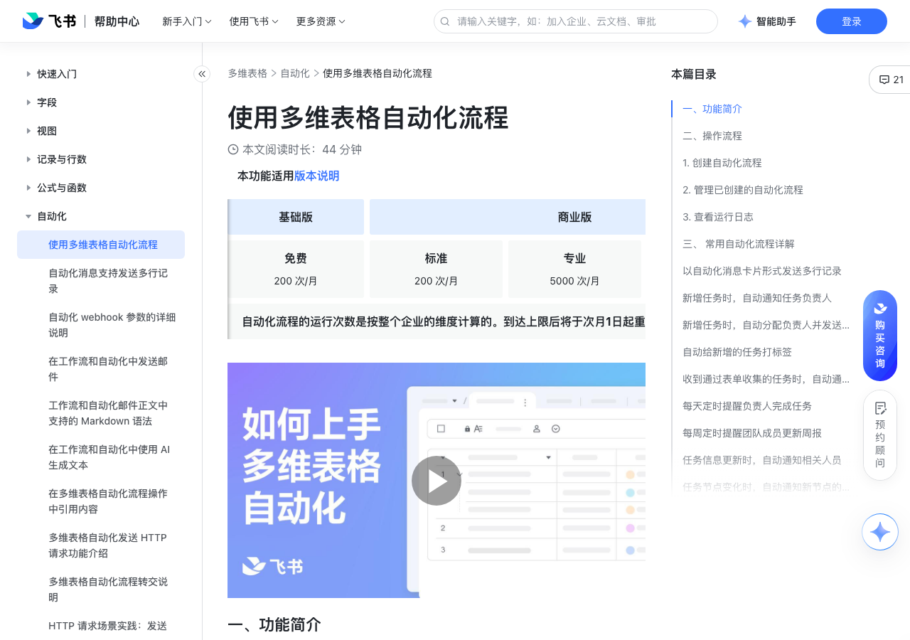

# 使用多维表格自动化流程

> 来源：[飞书帮助中心](https://www.feishu.cn/hc/zh-CN/articles/665088655709)  
> 分类：多维表格 / 自动化  
> 抓取时间：2026-09-22T01:24:00.372Z

## 界面截图

### 文档内配图

1. 配图：https://p1-hera.feishucdn.com/tos-cn-i-jbbdkfciu3/11c3ea1da9194954b81f6e7595ce98aa~tplv-jbbdkfciu3-image:0:0.image
2. 配图：https://p1-hera.feishucdn.com/tos-cn-i-jbbdkfciu3/2151df9aa2b44797a9bb2c99bc083872~tplv-jbbdkfciu3-image:0:0.image
3. 配图：https://p1-hera.feishucdn.com/tos-cn-i-jbbdkfciu3/4521bf6e988446018f6d28e524dcb584~tplv-jbbdkfciu3-image:0:0.image
4. 配图：https://p1-hera.feishucdn.com/tos-cn-i-jbbdkfciu3/44dcae654e424f549c33dda6b3e7bec1~tplv-jbbdkfciu3-image:0:0.image
5. 配图：https://p1-hera.feishucdn.com/tos-cn-i-jbbdkfciu3/13438306c62f4ee3881651b3f4de8798~tplv-jbbdkfciu3-image:0:0.image

## 功能定位

本页对应飞书帮助中心「多维表格 / 自动化」下的「使用多维表格自动化流程」。以下需求描述依据官方说明文档提炼，用于指导 DuoWei 对标实现。

## 功能目标

播放 00:00 / 01:23 直播 00:00 进入全屏 1x 0.5x0.75x1x1.5x2x 点击按住可拖动视频

## 文档结构（官方章节）

- 一、功能简介​
- 二、操作流程​
- 创建自动化流程​
- 2. 管理已创建的自动化流程​
- 查看运行日志​
- 三、 常用自动化流程详解​
- 以自动化消息卡片形式发送多行记录​
- 新增任务时，自动通知任务负责人​
- 新增任务时，自动分配负责人并发送通知 ​
- 自动给新增的任务打标签 ​
- 收到通过表单收集的任务时，自动通知任务负责人 ​
- 每天定时提醒负责人完成任务 ​
- 每周定时提醒团队成员更新周报 ​
- 任务信息更新时，自动通知相关人员​
- 任务节点变化时，自动通知新节点的跟进人 ​
- 在任务截止前提醒负责人跟进任务状态 ​
- 每日提醒负责人上报巡检结果 ​
- 每日提醒负责人补充巡检记录 ​
- 有新的报名和预约时自动通知负责人 ​
- 库存不足时，自动通知库存管理员 ​
- 四、了解更多​

## 详细功能说明

播放 00:00 / 01:23 直播 00:00 进入全屏 1x 0.5x0.75x1x1.5x2x 点击按住可拖动视频

0.5x

0.75x

1.5x

一、功能简介

二、操作流程

创建自动化流程

点击多维表格页面右上方的 自动化 > + 创建自动化流程。

设置触发条件和执行操作。

设置完成后，点击 保存并启用。

2. 管理已创建的自动化流程

搜索自动化流程：在面板左上角的搜索框内输入关键词，通过搜索流程的名称，来定位对应的自动化流程。

筛选自动化流程：支持对“创建人”、“触发数据表”、“触发条件”、“操作”、“运行状态”设置筛选条件。

对自动化流程进行排序：支持根据“最近更新”、创建时间、创建人姓名、流程名称进行排序。

暂停/启用运行流程：点击自动化流程右侧的滑动按钮，启用或停止运行流程。

删除、编辑、重命名：点击自动化流程右侧的 ··· 按钮，选择相应操作。

查看运行日志

三、 常用自动化流程详解

以自动化消息卡片形式发送多行记录

用户反馈/异常情况汇总：将用户反馈或异常情况按每日或每周的频次进行汇总，自动发送给对应负责人或群，便于跟进和查看。

数据定时推送：将各个门店的当日营业额及目标完成进度每日更新到群里，及时监测数据情况。

新增任务时，自动通知任务负责人

新增任务时，自动分配负责人并发送通知

设计：新增一条设计任务时，根据所属设计类型自动分配负责人，并发送通知 。

产品：新增一条反馈时，根据所属产品类型自动分配负责人，并发送通知。

研发：新增一个 bug 时，根据 bug 所属类型自动分配负责人，并发送通知。

自动给新增的任务打标签

收到通过表单收集的任务时，自动通知任务负责人

HR/行政/运营：通过表单收集调研问卷时，自动通知相关人员查看问卷结果。

HR：通过表单上传候选人简历时，自动通知相关成员评估简历。

行政：通过表单收集人员证明等资料时，自动通知相关人员推进到下一步。

产研：通过表单收集产品需求和反馈时，自动提醒相关负责人查看详情。

销售：通过表单提交战报后，自动通知相关人员查看。

每天定时提醒负责人完成任务

每周定时提醒团队成员更新周报

任务信息更新时，自动通知相关人员

销售：销售订单更新后，自动通知销售负责人查看信息更新，了解订单变化。

产研：需求信息更新后，自动通知产品、研发负责人，查看需求变化。

任务节点变化时，自动通知新节点的跟进人

产研：需求状态变更为“待验收”时，自动通知验收负责人及时验收。

销售：订单状态变更为“待交付”时，自动通知交付负责人。

在任务截止前提醒负责人跟进任务状态

每日提醒负责人上报巡检结果

每日提醒负责人补充巡检记录

有新的报名和预约时自动通知负责人

库存不足时，自动通知库存管理员

四、了解更多

## 实现要点（对标 DuoWei）

1. **入口与信息架构**：在产品中明确该能力所属模块（自动化），并保证用户可从对应导航触达。
2. **核心交互**：按上文「详细功能说明」还原主要操作路径；截图中出现的按钮、字段、面板命名尽量与飞书语义一致或可映射。
3. **数据与权限**：若文档涉及可见范围、可编辑范围、分享或高级权限，实现时需落到角色/成员模型，并保证 API/MCP 与 UI 权限一致。
4. **边界与上限**：若文档提到数量上限、格式限制、导入导出约束，需在实现与错误提示中体现。
5. **验收**：以本页截图场景为用例，完成「能打开 / 能配置 / 能保存 / 能被 Agent 读写（如适用）」四项检查。

## 原始摘录摘要

> 播放 00:00 / 01:23 直播 00:00 进入全屏 1x 0.5x0.75x1x1.5x2x 点击按住可拖动视频 0.5x 0.75x 1.5x 一、功能简介 二、操作流程 创建自动化流程 点击多维表格页面右上方的 自动化 > + 创建自动化流程。 设置触发条件和执行操作。 设置完成后，点击 保存并启用。 2. 管理已创建的自动化流程 搜索自动化流程：在面板左上角的搜索框内输入关键词，通过搜索流程的名称，来定位对应的自动化流程。 筛选自动化流程：支持对“创建人”、“触发数据表”、“触发条件”、“操作”、“运行状态”设置筛选条件。 对自动化流程进行排序：支持根据“最近更新”、创建时间、创建人姓名、流程名称进行排序。 暂停/启用运行流程：点击自动化流程右侧的滑动按钮，启用或停止运行流程。 删除、编辑、重命名：点击自动化流程右侧的 ··· 按钮，选择相应操作。 查看运行日志 三、 常用自动化流程详解 以自动化消息卡片形式发送多行记录 用户反馈/异常情况汇总：将用户反馈或异常情况按每日或每周的频次进行汇总，自动发送给对应负责人或群，便于跟进和查看。 数据定时推送：将各个门店的当日营业额及目标完成进度每日更新到群里，及时监测数据情况。 新增任务时，自动通知任务负责人 新增任务时，自动分配负责人并发送通知 设计：新增一条设计任务时，根据所属设计类型自动分配负责人，并发送通知 。 产品：新增一条反馈时，根据所属产品类型自动分配负责人，并发送通知。 研发：新增一个 bug 时，根据 bug 所属类型自动分配负责人，并发送通知。 自动给新增的任务打标签 收到通过表单收集的任务时，自动通知任务负责人 HR/行政/运营：通过表单收集调研问卷时，自动通知相关人员查看问卷结果。 HR：通过表单上传候选人简历时，自动通知相关成员评估简历。 行政：通过表单收集人员证明等资料时，自动通知相关人员…

## 元数据

- article_id: `7027013223400488988`
- category_id: `7165751270974767105`
- path: `/hc/zh-CN/articles/665088655709`
- extracted_text_length: 1144
