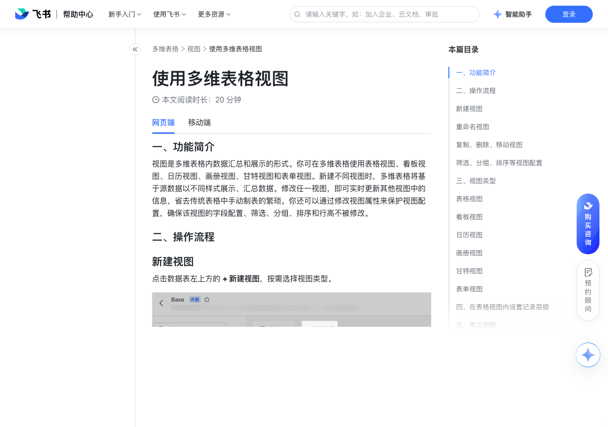

# 使用多维表格视图

> 来源：[飞书帮助中心](https://www.feishu.cn/hc/zh-CN/articles/360049067931)  
> 分类：多维表格 / 视图  
> 抓取时间：2026-09-22T01:21:43.846Z

## 界面截图

### 文档内配图

1. 配图：https://p1-hera.feishucdn.com/tos-cn-i-jbbdkfciu3/476fe0cdc0cf411886fd81cc339351f6~tplv-jbbdkfciu3-image:0:0.image
2. 配图：https://p1-hera.feishucdn.com/tos-cn-i-jbbdkfciu3/3775c8f2af6b4fe08b79f93fdb55195c~tplv-jbbdkfciu3-image:0:0.image
3. 配图：https://p1-hera.feishucdn.com/tos-cn-i-jbbdkfciu3/aa66b6f7f42a4535a87c38225afe59ac~tplv-jbbdkfciu3-image:0:0.image
4. 配图：https://p1-hera.feishucdn.com/tos-cn-i-jbbdkfciu3/f40d7728282d42319bce1630ca84ac5c~tplv-jbbdkfciu3-image:0:0.image
5. 配图：https://p1-hera.feishucdn.com/tos-cn-i-jbbdkfciu3/d9e61243afce4300b09eb2b7ec193001~tplv-jbbdkfciu3-image:0:0.image
6. 配图：https://p1-hera.feishucdn.com/tos-cn-i-jbbdkfciu3/aa9298e5f35f4475be1ebd0a58d49273~tplv-jbbdkfciu3-image:0:0.image
7. 配图：https://p1-hera.feishucdn.com/tos-cn-i-jbbdkfciu3/d582342893154c3594bd7f49106a8da9~tplv-jbbdkfciu3-image:0:0.image
8. 配图：https://p1-hera.feishucdn.com/tos-cn-i-jbbdkfciu3/0546b1e90e924cb78a0ac41f020d1aba~tplv-jbbdkfciu3-image:0:0.image
9. 配图：https://p1-hera.feishucdn.com/tos-cn-i-jbbdkfciu3/e637e1b0177e4a708185944746493410~tplv-jbbdkfciu3-image:0:0.image
10. 配图：https://p1-hera.feishucdn.com/tos-cn-i-jbbdkfciu3/618ec67ac4e04162af493e888cd42065~tplv-jbbdkfciu3-image:0:0.image
11. 配图：https://p1-hera.feishucdn.com/tos-cn-i-jbbdkfciu3/89bb100608ff48178f09142ba9577cca~tplv-jbbdkfciu3-image:0:0.image
12. 配图：https://p1-hera.feishucdn.com/tos-cn-i-jbbdkfciu3/526804f6a4c4436ab54e127652f560a8~tplv-jbbdkfciu3-image:0:0.image
13. 配图：https://p1-hera.feishucdn.com/tos-cn-i-jbbdkfciu3/8d2f4d4c45b04c289cbf7b605e52f522~tplv-jbbdkfciu3-image:0:0.image
14. 配图：https://p1-hera.feishucdn.com/tos-cn-i-jbbdkfciu3/6d9a684da9204016b616903e7ac3242d~tplv-jbbdkfciu3-image:0:0.image
15. 配图：https://p1-hera.feishucdn.com/tos-cn-i-jbbdkfciu3/c1389d642cec4a8a8393f8a550e98364~tplv-jbbdkfciu3-image:0:0.image
16. 配图：https://p1-hera.feishucdn.com/tos-cn-i-jbbdkfciu3/84f1b8b2639f4a518fc13c62cc380aa2~tplv-jbbdkfciu3-image:0:0.image
17. 配图：https://p1-hera.feishucdn.com/tos-cn-i-jbbdkfciu3/d673c4cc8fa742fbb3526616c7c88502~tplv-jbbdkfciu3-image:0:0.image
18. 配图：https://p1-hera.feishucdn.com/tos-cn-i-jbbdkfciu3/cfd779c97b484c73a683f9043c7f9ee1~tplv-jbbdkfciu3-image:0:0.image
19. 配图：https://p1-hera.feishucdn.com/tos-cn-i-jbbdkfciu3/7a374416729c4637ae079876686c6090~tplv-jbbdkfciu3-image:0:0.image

## 功能定位

本页对应飞书帮助中心「多维表格 / 视图」下的「使用多维表格视图」。以下需求描述依据官方说明文档提炼，用于指导 DuoWei 对标实现。

## 功能目标

一、功能简介

## 文档结构（官方章节）

- 一、功能简介​
- 二、操作流程​
- 新建视图​
- 重命名视图​
- 复制、删除、移动视图​
- 筛选、分组、排序等视图配置​
- 三、视图类型​
- 表格视图​
- 看板视图​
- 日历视图​
- 画册视图​
- 甘特视图​
- 表单视图​
- 四、在表格视图内设置记录层级​
- 五、常见问题​

## 详细功能说明

一、功能简介

二、操作流程

新建视图

重命名视图

复制、删除、移动视图

复制、删除视图：点击视图名称右侧的 ，选择 复制视图 或 删除视图。复制的视图将以副本形式保存在原视图右侧。

移动视图：按住视图名称，并向左或向右进行拖拽，对视图重新排序。

筛选、分组、排序等视图配置

设置条件：任意字段都可以作为筛选、分组、排序的条件，也可以设置多个条件。你也可以使用 AI 筛选，即向 AI 描述你需要的筛选条件，AI 会自动分析你的需求并添加相应的筛选条件。

注：仅支持在桌面端和网页端使用 AI 设置筛选条件。

视图临时配置：筛选、分组、排序（包括拖拽某行记录的最左侧来进行排序）、行高、冻结列等动作是临时配置，临时配置结果仅操作人自己可见。不同操作者可以按照需求自行进行设置，互不干扰。若不保存配置，则会在界面刷新后重置。

所有人都可以对视图进行临时配置。仅有阅读权限的用户，可以进行配置，但无法保存。有编辑权限的用户，可以保存自己的视图配置。

注：开启高级权限时，即使用户只能编辑部分字段或部分记录，也可以保存视图配置。

当可编辑用户进行了上述临时配置，视图上方会显示最新的操作，并出现 清除 和 保存 的按钮。点击 清除，清空已有的临时配置；点击 保存，或采用快捷键（Windows: Ctrl + S，Mac: Command + S），则会保存当前的视图配置。

在同一个数据表内切换不同视图时，视图的临时配置不会被清空，仍保留上次的操作结果。

当可编辑用户切出当前数据表（具体包括：切换到其他数据表、新建数据表、新建收集表、新建仪表盘、新建文档等），若存在临时视图配置，则将出现如下提示，用户可选择是否保存。

250px|700px|reset

当可编辑用户分享含有临时配置的视图时，会出现如下提示，用户可选择是否将临时配置同步至分享的视图。

三、视图类型

表格视图

看板视图

日历视图

画册视图

甘特视图

表单视图

四、在表格视图内设置记录层级

0.5x

0.75x

1.5x

添加子记录：右键点击某条记录 > 添加子记录，或是将鼠标悬停在某条记录的索引列上，点击右侧的 + 添加子记录 来添加子记录。

若添加子记录时，表格视图内不存在父记录，则会自动在最后新建一个单向关联字段，默认命名为“父记录”。该单向关联字段默认与当前数据表关联、可关联的数据范围为所有记录，不允许添加多个记录。

子记录不会继承父记录中字段的值。

删除子记录：右键点击需删除的记录 > 删除记录。

注：删除一条父记录时，其对应的子记录不会被删除。

折叠或展开记录：点击单元格左侧的箭头，或右侧的层级按钮，即可展开或折叠记录层级。

拖拽记录：鼠标悬浮至记录左侧，长按 ⋮⋮ 进行拖拽即可。

当你拖拽父记录时，其包含的所有子记录都会跟随移动。

父记录和子记录都可以被拖拽，你可以通过拖拽来更改记录的顺序和层级。

五、常见问题

问：表格视图内最多可以创建几级子记录？

问：为父记录设置高级权限后，其中的子记录是否拥有同样的权限？

问：移动端是否能使用表格视图的子记录功能？

问：子记录是否可以作为分组条件？

问：子记录的筛选和查找结果如何显示？

问：为什么我无法删除某个视图？

该数据表内只有一个视图。你不能删除数据表中的唯一一个视图。

你没有删除视图的权限。如果未开启高级权限，拥有可编辑和可管理权限的用户可删除视图；如果开启了高级权限，你需要有新增、编辑、删除视图的权限。

视图被锁定，在解除锁定之前，任何人都不能删除该视图。

问：为什么我在一个多维表格的表格视图中增加、删除或修改了数据后，其他视图中的数据也发生了变化？

答：在同一张数据表中可以创建多个视图，这些视图具有相同的数据源。因此在任意视图中对数据进行的增、删、改操作，都将影响并反映在其他基于相同数据源的视图中。

问：在多维表格中，如何汇总子记录某个字段的值？

答：一条父记录下最多可再创建 4 级子记录，示意如下。250px|700px|reset

答：否。在设置高级权限时，父记录和子记录的权限相互独立、不具有关联关系。例如，如果你想在高级权限中设置“与成员自己相关的记录”，需要在父记录和子记录中同时填写人员字段才能生效。只在父记录中添加人员无法对其包含的子记录生效。

答：在移动端使用此功能，需将移动端升级至 V6.6 及以上。

答：暂不支持。目前仅以第一级父记录作为分组条件。

答：若筛选或查找的结果在子记录中，则会展示子记录本身及其所属的所有父记录。

答：可能有以下原因：该数据表内只有一个视图。你不能删除数据表中的唯一一个视图。你没有删除视图的权限。如果未开启高级权限，拥有可编辑和可管理权限的用户可删除视图；如果开启了高级权限，你需要有新增、编辑、删除视图的权限。视图被锁定，在解除锁定之前，任何人都不能删除该视图。

答：你可以在多维表格字段捷径中使用“子记录求和”功能。

## 实现要点（对标 DuoWei）

1. **入口与信息架构**：在产品中明确该能力所属模块（视图），并保证用户可从对应导航触达。
2. **核心交互**：按上文「详细功能说明」还原主要操作路径；截图中出现的按钮、字段、面板命名尽量与飞书语义一致或可映射。
3. **数据与权限**：若文档涉及可见范围、可编辑范围、分享或高级权限，实现时需落到角色/成员模型，并保证 API/MCP 与 UI 权限一致。
4. **边界与上限**：若文档提到数量上限、格式限制、导入导出约束，需在实现与错误提示中体现。
5. **验收**：以本页截图场景为用例，完成「能打开 / 能配置 / 能保存 / 能被 Agent 读写（如适用）」四项检查。

## 原始摘录摘要

> 一、功能简介 二、操作流程 新建视图 重命名视图 复制、删除、移动视图 复制、删除视图：点击视图名称右侧的 ，选择 复制视图 或 删除视图。复制的视图将以副本形式保存在原视图右侧。 移动视图：按住视图名称，并向左或向右进行拖拽，对视图重新排序。 筛选、分组、排序等视图配置 设置条件：任意字段都可以作为筛选、分组、排序的条件，也可以设置多个条件。你也可以使用 AI 筛选，即向 AI 描述你需要的筛选条件，AI 会自动分析你的需求并添加相应的筛选条件。 注：仅支持在桌面端和网页端使用 AI 设置筛选条件。 视图临时配置：筛选、分组、排序（包括拖拽某行记录的最左侧来进行排序）、行高、冻结列等动作是临时配置，临时配置结果仅操作人自己可见。不同操作者可以按照需求自行进行设置，互不干扰。若不保存配置，则会在界面刷新后重置。 所有人都可以对视图进行临时配置。仅有阅读权限的用户，可以进行配置，但无法保存。有编辑权限的用户，可以保存自己的视图配置。 注：开启高级权限时，即使用户只能编辑部分字段或部分记录，也可以保存视图配置。 当可编辑用户进行了上述临时配置，视图上方会显示最新的操作，并出现 清除 和 保存 的按钮。点击 清除，清空已有的临时配置；点击 保存，或采用快捷键（Windows: Ctrl + S，Mac: Command + S），则会保存当前的视图配置。 在同一个数据表内切换不同视图时，视图的临时配置不会被清空，仍保留上次的操作结果。 当可编辑用户切出当前数据表（具体包括：切换到其他数据表、新建数据表、新建收集表、新建仪表盘、新建文档等），若存在临时视图配置，则将出现如下提示，用户可选择是否保存。 250px|700px|reset 当可编辑用户分享含有临时配置的视图时，会出现如下提示，用户可选择是否将临时配置同步至分享的视图。 三、视图类型 表格视图 看板视图 日历视图 画册视…

## 元数据

- article_id: `6933484145762959362`
- category_id: `7006240778276110337`
- path: `/hc/zh-CN/articles/360049067931`
- extracted_text_length: 2016
