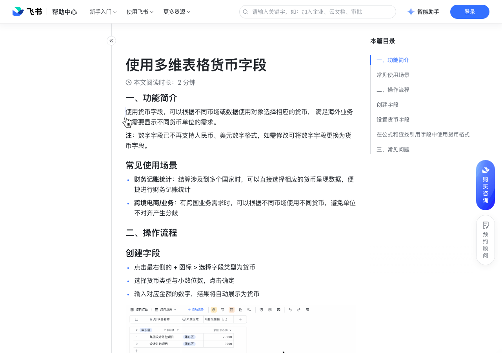

# 使用多维表格货币字段

> 来源：[飞书帮助中心](https://www.feishu.cn/hc/zh-CN/articles/705915388398)  
> 分类：多维表格 / 字段 / 业务字段  
> 抓取时间：2026-09-22T01:21:36.562Z

## 界面截图

### 文档内配图

1. 配图：https://p1-hera.feishucdn.com/tos-cn-i-jbbdkfciu3/acdf2ccfe3664d77b7bcdc68895252d1~tplv-jbbdkfciu3-image:0:0.image
2. 配图：https://p1-hera.feishucdn.com/tos-cn-i-jbbdkfciu3/e8222a6d5e8f4258aa8842e4b060d2b8~tplv-jbbdkfciu3-image:0:0.image

## 功能定位

本页对应飞书帮助中心「多维表格 / 字段 / 业务字段」下的「使用多维表格货币字段」。以下需求描述依据官方说明文档提炼，用于指导 DuoWei 对标实现。

## 功能目标

一、功能简介

## 文档结构（官方章节）

- 一、功能简介​
- 常见使用场景​
- 二、操作流程​
- 创建字段​
- 设置货币字段​
- 在公式和查找引用字段中使用货币格式​
- 三、常见问题​

## 详细功能说明

一、功能简介

常见使用场景

财务记账统计：结算涉及到多个国家时，可以直接选择相应的货币呈现数据，便捷进行财务记账统计

跨境电商/业务：有跨国业务需求时，可以根据不同市场使用不同货币，避免单位不对齐产生分歧

二、操作流程

创建字段

点击最右侧的 + 图标 > 选择字段类型为货币

选择货币类型与小数位数，点击确定

输入对应金额的数字，结果将自动展示为货币

设置货币字段

在公式和查找引用字段中使用货币格式

三、常见问题

问：我可以手动输入货币类型吗？

答：暂不支持，当前仅能从字段菜单中修改货币类型。

问：多维表格的货币字段支持自定义货币单位，如“万元”吗？

答：不支持。多维表格的货币字段支持设定币种和保留小数的位数，但目前不支持自定义货币单位。

## 实现要点（对标 DuoWei）

1. **入口与信息架构**：在产品中明确该能力所属模块（字段 / 业务字段），并保证用户可从对应导航触达。
2. **核心交互**：按上文「详细功能说明」还原主要操作路径；截图中出现的按钮、字段、面板命名尽量与飞书语义一致或可映射。
3. **数据与权限**：若文档涉及可见范围、可编辑范围、分享或高级权限，实现时需落到角色/成员模型，并保证 API/MCP 与 UI 权限一致。
4. **边界与上限**：若文档提到数量上限、格式限制、导入导出约束，需在实现与错误提示中体现。
5. **验收**：以本页截图场景为用例，完成「能打开 / 能配置 / 能保存 / 能被 Agent 读写（如适用）」四项检查。

## 原始摘录摘要

> 一、功能简介 常见使用场景 财务记账统计：结算涉及到多个国家时，可以直接选择相应的货币呈现数据，便捷进行财务记账统计 跨境电商/业务：有跨国业务需求时，可以根据不同市场使用不同货币，避免单位不对齐产生分歧 二、操作流程 创建字段 点击最右侧的 + 图标 > 选择字段类型为货币 选择货币类型与小数位数，点击确定 输入对应金额的数字，结果将自动展示为货币 设置货币字段 在公式和查找引用字段中使用货币格式 三、常见问题 问：我可以手动输入货币类型吗？ 答：暂不支持，当前仅能从字段菜单中修改货币类型。 问：多维表格的货币字段支持自定义货币单位，如“万元”吗？ 答：不支持。多维表格的货币字段支持设定币种和保留小数的位数，但目前不支持自定义货币单位。

## 元数据

- article_id: `7186541148755181570`
- category_id: `7187723341653000220`
- path: `/hc/zh-CN/articles/705915388398`
- extracted_text_length: 323
