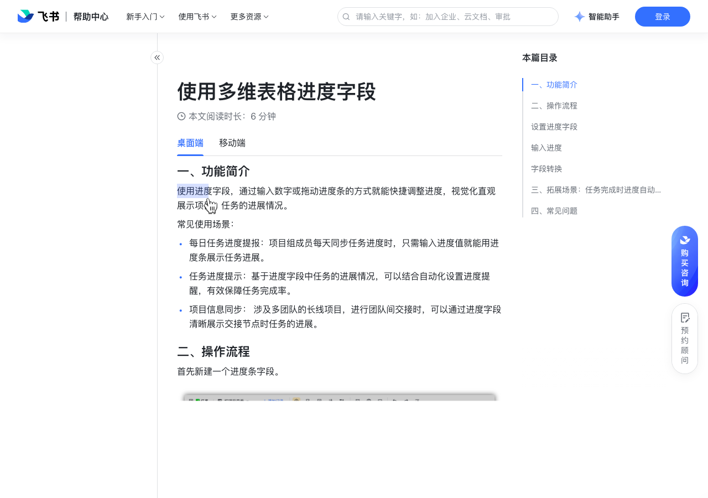

# 使用多维表格进度字段

> 来源：[飞书帮助中心](https://www.feishu.cn/hc/zh-CN/articles/422425843868)  
> 分类：多维表格 / 字段 / 业务字段  
> 抓取时间：2026-09-22T01:21:39.927Z

## 界面截图

### 文档内配图

1. 配图：https://p1-hera.feishucdn.com/tos-cn-i-jbbdkfciu3/d3effffa01ee4f74aad8ce8afbe3a580~tplv-jbbdkfciu3-image:0:0.image
2. 配图：https://p1-hera.feishucdn.com/tos-cn-i-jbbdkfciu3/f803b70f479c40e0b6faa583efbf063b~tplv-jbbdkfciu3-image:0:0.image
3. 配图：https://p1-hera.feishucdn.com/tos-cn-i-jbbdkfciu3/920f8607a2694d99aa59cc2b146296ba~tplv-jbbdkfciu3-image:0:0.image
4. 配图：https://p1-hera.feishucdn.com/tos-cn-i-jbbdkfciu3/0d456969990840ab8e72c83ce36a9ca0~tplv-jbbdkfciu3-image:0:0.image
5. 配图：https://p1-hera.feishucdn.com/tos-cn-i-jbbdkfciu3/0a5cdecc93904c47bab7ffe7f9ec5305~tplv-jbbdkfciu3-image:0:0.image
6. 配图：https://p1-hera.feishucdn.com/tos-cn-i-jbbdkfciu3/29ecf42db7f14dba82d04c5ad4ab1226~tplv-jbbdkfciu3-image:0:0.image
7. 配图：https://p1-hera.feishucdn.com/tos-cn-i-jbbdkfciu3/8dedebf898834ee6b7b003b9e267c169~tplv-jbbdkfciu3-image:0:0.image
8. 配图：https://p1-hera.feishucdn.com/tos-cn-i-jbbdkfciu3/26bc37d31297454288623a2f64f9d41a~tplv-jbbdkfciu3-image:0:0.image

## 功能定位

本页对应飞书帮助中心「多维表格 / 字段 / 业务字段」下的「使用多维表格进度字段」。以下需求描述依据官方说明文档提炼，用于指导 DuoWei 对标实现。

## 功能目标

一、功能简介

## 文档结构（官方章节）

- 一、功能简介​
- 二、操作流程​
- 设置进度字段​
- 输入进度​
- 字段转换​
- 三、拓展场景：任务完成时进度自动变成 100%​
- 四、常见问题​

## 详细功能说明

一、功能简介

常见使用场景：

每日任务进度提报：项目组成员每天同步任务进度时，只需输入进度值就能用进度条展示任务进展。

任务进度提示：基于进度字段中任务的进展情况，可以结合自动化设置进度提醒，有效保障任务完成率。

项目信息同步： 涉及多团队的长线项目，进行团队间交接时，可以通过进度字段清晰展示交接节点时任务的进展。

二、操作流程

设置进度字段

可设置项

截图示意

数字格式：百分比（默认）、数值

250px|700px|reset

小数位数：整数（默认）、1 位小数、2 位小数

进度条颜色：支持单色、渐变色、多段颜色

自定义进度条值：根据实际的业务场景自定义进度条的起始值、目标值

输入进度

单击单元格后直接输入相应的数值，或双击单元格进入编辑态输入相应的数值，即可填写进度值。

鼠标悬停在进度条上，拖动滑块或点击进度条上任意位置即可调整进度。

字段转换

将已有字段的字段类型修改为进度字段。

将已有的数字信息复制粘贴至进度字段。

三、拓展场景：任务完成时进度自动变成 100%

进入自动化流程页面 > 设置触发条件为记录内容变更时 > 选择关注的字段为已完成变更为 ✅ 时。

设置执行操作为修改记录 > 选择第 1 步修改的记录 > 选择进度字段并输入 100。

运行自动化流程即可。

四、常见问题

问：我可以将其他字段直接转换为进度字段吗？

问：可以自定义进度条值吗？

问：在多维表格的进度字段中，子任务进度更新后，能否自动计算并更新父任务的进度？

答：内容为数字的多行文本、数字、单选字段，或是计算结果为数字的公式字段，可以直接转换为进度字段。

答：可以在字段菜单中自定义进度条值，进度条的起始值、目标值并不会限制单元格内可以输入的数值范围。

答：不支持。

可设置项 | 截图示意

数字格式：百分比（默认）、数值 | 250px|700px|reset

## 实现要点（对标 DuoWei）

1. **入口与信息架构**：在产品中明确该能力所属模块（字段 / 业务字段），并保证用户可从对应导航触达。
2. **核心交互**：按上文「详细功能说明」还原主要操作路径；截图中出现的按钮、字段、面板命名尽量与飞书语义一致或可映射。
3. **数据与权限**：若文档涉及可见范围、可编辑范围、分享或高级权限，实现时需落到角色/成员模型，并保证 API/MCP 与 UI 权限一致。
4. **边界与上限**：若文档提到数量上限、格式限制、导入导出约束，需在实现与错误提示中体现。
5. **验收**：以本页截图场景为用例，完成「能打开 / 能配置 / 能保存 / 能被 Agent 读写（如适用）」四项检查。

## 原始摘录摘要

> 一、功能简介 常见使用场景： 每日任务进度提报：项目组成员每天同步任务进度时，只需输入进度值就能用进度条展示任务进展。 任务进度提示：基于进度字段中任务的进展情况，可以结合自动化设置进度提醒，有效保障任务完成率。 项目信息同步： 涉及多团队的长线项目，进行团队间交接时，可以通过进度字段清晰展示交接节点时任务的进展。 二、操作流程 设置进度字段 可设置项 截图示意 数字格式：百分比（默认）、数值 250px|700px|reset 小数位数：整数（默认）、1 位小数、2 位小数 进度条颜色：支持单色、渐变色、多段颜色 自定义进度条值：根据实际的业务场景自定义进度条的起始值、目标值 输入进度 单击单元格后直接输入相应的数值，或双击单元格进入编辑态输入相应的数值，即可填写进度值。 鼠标悬停在进度条上，拖动滑块或点击进度条上任意位置即可调整进度。 字段转换 将已有字段的字段类型修改为进度字段。 将已有的数字信息复制粘贴至进度字段。 三、拓展场景：任务完成时进度自动变成 100% 进入自动化流程页面 > 设置触发条件为记录内容变更时 > 选择关注的字段为已完成变更为 ✅ 时。 设置执行操作为修改记录 > 选择第 1 步修改的记录 > 选择进度字段并输入 100。 运行自动化流程即可。 四、常见问题 问：我可以将其他字段直接转换为进度字段吗？ 问：可以自定义进度条值吗？ 问：在多维表格的进度字段中，子任务进度更新后，能否自动计算并更新父任务的进度？ 答：内容为数字的多行文本、数字、单选字段，或是计算结果为数字的公式字段，可以直接转换为进度字段。 答：可以在字段菜单中自定义进度条值，进度条的起始值、目标值并不会限制单元格内可以输入的数值范围。 答：不支持。 可设置项 | 截图示意 数字格式：百分比（默认）、数值 | 250px|700px|reset

## 元数据

- article_id: `7186496267529256961`
- category_id: `7187723341653000220`
- path: `/hc/zh-CN/articles/422425843868`
- extracted_text_length: 781
