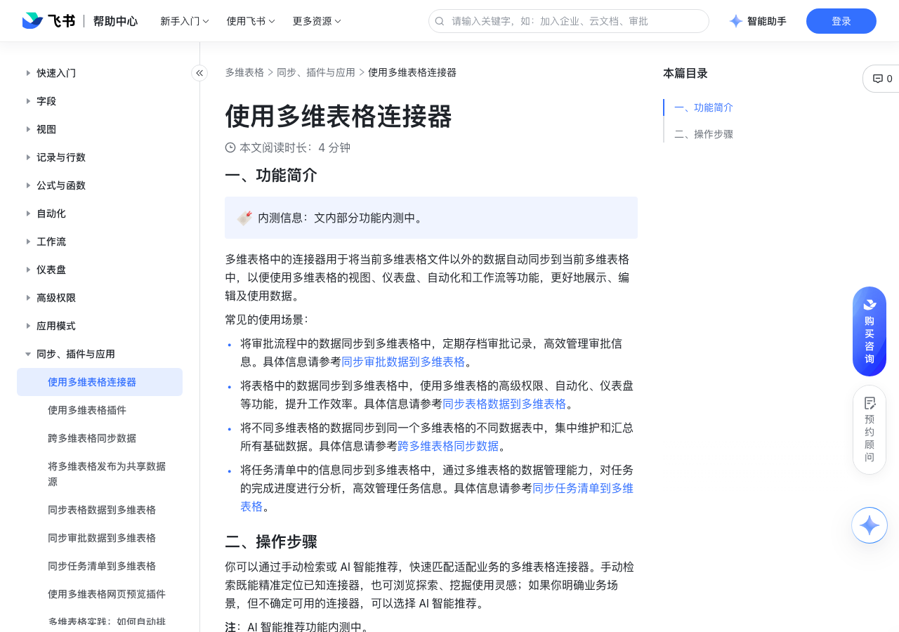

# 使用多维表格连接器

> 来源：[飞书帮助中心](https://www.feishu.cn/hc/zh-CN/articles/725304182725)  
> 分类：多维表格 / 同步、插件与应用  
> 抓取时间：2026-09-22T01:26:33.773Z

## 界面截图

### 文档内配图

1. 配图：https://p1-hera.feishucdn.com/tos-cn-i-jbbdkfciu3/26356c60a26443249f1067f307d1121c~tplv-jbbdkfciu3-image:0:0.image
2. 配图：https://p1-hera.feishucdn.com/tos-cn-i-jbbdkfciu3/3ab3d316668649348840d9d2c53b3691~tplv-jbbdkfciu3-image:0:0.image

## 功能定位

本页对应飞书帮助中心「多维表格 / 同步、插件与应用」下的「使用多维表格连接器」。以下需求描述依据官方说明文档提炼，用于指导 DuoWei 对标实现。

## 功能目标

一、功能简介

## 文档结构（官方章节）

- 一、功能简介​
- 二、操作步骤​
- 手动检索​
- AI 智能推荐（内测中）​

## 详细功能说明

一、功能简介

将审批流程中的数据同步到多维表格中，定期存档审批记录，高效管理审批信息。具体信息请参考同步审批数据到多维表格。

将表格中的数据同步到多维表格中，使用多维表格的高级权限、自动化、仪表盘等功能，提升工作效率。具体信息请参考同步表格数据到多维表格。

将不同多维表格的数据同步到同一个多维表格的不同数据表中，集中维护和汇总所有基础数据。具体信息请参考跨多维表格同步数据。

将任务清单中的信息同步到多维表格中，通过多维表格的数据管理能力，对任务的完成进度进行分析，高效管理任务信息。具体信息请参考同步任务清单到多维表格。

二、操作步骤

手动检索

进入目标多维表格，点击左下角的 新建 > 导入/同步数据 > 连接器中心。

你可以在连接器中心直接搜索目标连接器，然后将鼠标悬停在需要的连接器上，点击 使用 即可进行配置。

完成并保存配置后，多维表格中将自动生成一个带闪电标识的数据表，并自动同步所选范围内的数据。

AI 智能推荐（内测中）

进入目标多维表格，点击右上角 多维表格 AI 图标打开侧边栏。

你可以通过以下任一方式打开智能推荐连接器模式：

方式 1：直接输入并发送连接器相关的需求，AI 会智能识别需求并自动打开 查找插件/连接器 模式。

方式 2：点击“为你推荐”区域的 查找插件/连接器，然后输入并发送你的需求。

方式 3：点击侧边栏底部的 模式，选择 查找插件/连接器，然后输入并发送你的需求。

系统会基于你的需求智能推荐匹配的连接器，并发送对应的配置卡片。例如，你可以在输入框中描述“同步抖音数据”，系统会自动推荐 抖音数据 连接器。

你可以将鼠标悬停在需要的连接器卡片上，点击 使用 即可进行配置；你也可以直接点击需要的连接器卡片，打开连接器详情页，快速了解选中的连接器。

## 实现要点（对标 DuoWei）

1. **入口与信息架构**：在产品中明确该能力所属模块（同步、插件与应用），并保证用户可从对应导航触达。
2. **核心交互**：按上文「详细功能说明」还原主要操作路径；截图中出现的按钮、字段、面板命名尽量与飞书语义一致或可映射。
3. **数据与权限**：若文档涉及可见范围、可编辑范围、分享或高级权限，实现时需落到角色/成员模型，并保证 API/MCP 与 UI 权限一致。
4. **边界与上限**：若文档提到数量上限、格式限制、导入导出约束，需在实现与错误提示中体现。
5. **验收**：以本页截图场景为用例，完成「能打开 / 能配置 / 能保存 / 能被 Agent 读写（如适用）」四项检查。

## 原始摘录摘要

> 一、功能简介 将审批流程中的数据同步到多维表格中，定期存档审批记录，高效管理审批信息。具体信息请参考同步审批数据到多维表格。 将表格中的数据同步到多维表格中，使用多维表格的高级权限、自动化、仪表盘等功能，提升工作效率。具体信息请参考同步表格数据到多维表格。 将不同多维表格的数据同步到同一个多维表格的不同数据表中，集中维护和汇总所有基础数据。具体信息请参考跨多维表格同步数据。 将任务清单中的信息同步到多维表格中，通过多维表格的数据管理能力，对任务的完成进度进行分析，高效管理任务信息。具体信息请参考同步任务清单到多维表格。 二、操作步骤 手动检索 进入目标多维表格，点击左下角的 新建 > 导入/同步数据 > 连接器中心。 你可以在连接器中心直接搜索目标连接器，然后将鼠标悬停在需要的连接器上，点击 使用 即可进行配置。 完成并保存配置后，多维表格中将自动生成一个带闪电标识的数据表，并自动同步所选范围内的数据。 AI 智能推荐（内测中） 进入目标多维表格，点击右上角 多维表格 AI 图标打开侧边栏。 你可以通过以下任一方式打开智能推荐连接器模式： 方式 1：直接输入并发送连接器相关的需求，AI 会智能识别需求并自动打开 查找插件/连接器 模式。 方式 2：点击“为你推荐”区域的 查找插件/连接器，然后输入并发送你的需求。 方式 3：点击侧边栏底部的 模式，选择 查找插件/连接器，然后输入并发送你的需求。 系统会基于你的需求智能推荐匹配的连接器，并发送对应的配置卡片。例如，你可以在输入框中描述“同步抖音数据”，系统会自动推荐 抖音数据 连接器。 你可以将鼠标悬停在需要的连接器卡片上，点击 使用 即可进行配置；你也可以直接点击需要的连接器卡片，打开连接器详情页，快速了解选中的连接器。

## 元数据

- article_id: `7649726390249491644`
- category_id: `7225134052943200257`
- path: `/hc/zh-CN/articles/725304182725`
- extracted_text_length: 748
