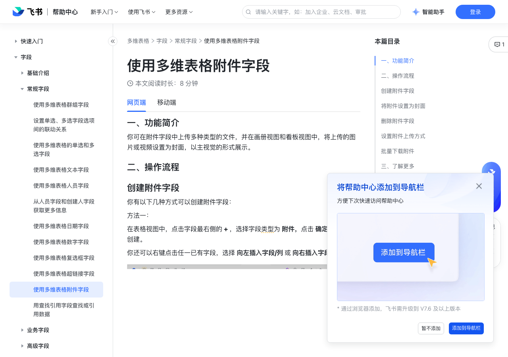

# 使用多维表格附件字段

> 来源：[飞书帮助中心](https://www.feishu.cn/hc/zh-CN/articles/532389628624)  
> 分类：多维表格 / 字段 / 常规字段  
> 抓取时间：2026-09-22T01:21:35.563Z

## 界面截图

### 文档内配图

1. 配图：https://p1-hera.feishucdn.com/tos-cn-i-jbbdkfciu3/e5395e5eebdb4e848aed5a011be2d415~tplv-jbbdkfciu3-image:0:0.image
2. 配图：https://p1-hera.feishucdn.com/tos-cn-i-jbbdkfciu3/164e3b3f55ca4d26af5e7368ca46175a~tplv-jbbdkfciu3-image:0:0.image
3. 配图：https://p1-hera.feishucdn.com/tos-cn-i-jbbdkfciu3/9e440b6b9d314321b37467af2e49cb85~tplv-jbbdkfciu3-image:0:0.image
4. 配图：https://p1-hera.feishucdn.com/tos-cn-i-jbbdkfciu3/662f54032c694010801a478ad8d25f8f~tplv-jbbdkfciu3-image:0:0.image
5. 配图：https://p1-hera.feishucdn.com/tos-cn-i-jbbdkfciu3/e9c10e5bce4b4c3782e535207065e8fd~tplv-jbbdkfciu3-image:0:0.image
6. 配图：https://p1-hera.feishucdn.com/tos-cn-i-jbbdkfciu3/f6baa343b3314bb6835fbb642c875120~tplv-jbbdkfciu3-image:0:0.image
7. 配图：https://p1-hera.feishucdn.com/tos-cn-i-jbbdkfciu3/73cb11e524aa4d1fa55691e0a2232fe7~tplv-jbbdkfciu3-image:0:0.image
8. 配图：https://p1-hera.feishucdn.com/tos-cn-i-jbbdkfciu3/c9383ec17fab4dc7ad729f1a663e2cf1~tplv-jbbdkfciu3-image:0:0.image
9. 配图：https://p1-hera.feishucdn.com/tos-cn-i-jbbdkfciu3/5161ef475e8b4a7492d9cfb92add53ce~tplv-jbbdkfciu3-image:0:0.image
10. 多维表格视频课按钮.png：https://p1-hera.feishucdn.com/tos-cn-i-jbbdkfciu3/6787dbaed3bd49dbb96d4f241a5bf513~tplv-jbbdkfciu3-image:0:0.image

## 功能定位

本页对应飞书帮助中心「多维表格 / 字段 / 常规字段」下的「使用多维表格附件字段」。以下需求描述依据官方说明文档提炼，用于指导 DuoWei 对标实现。

## 功能目标

一、功能简介

## 文档结构（官方章节）

- 一、功能简介​
- 二、操作流程​
- 创建附件字段​
- 将附件设置为封面​
- 删除附件字段​
- 设置附件上传方式​
- 批量下载附件​
- 三、了解更多​
- 四、常见问题​

## 详细功能说明

一、功能简介

二、操作流程

创建附件字段

你有以下几种方式可以创建附件字段：

将附件设置为封面

在卡片中查看单元格中的多个附件：点击附件预览图下方的小圆点，查看对应顺序的附件。

查看附件：点击附件文件即可进行预览。

删除附件字段

设置附件上传方式

批量下载附件

在表格视图中，右键点击附件字段，选择 批量下载附件。

在弹窗中，选择要下载的数据范围，你可以选择仅下载当前视图中的附件，也可以下载数据表中所有的附件。

设置附件的命名方式，你可以选择以附件原本的名称命名，也可以选择索引列（首列）为附件名称。最后点击 下载 即可。

三、了解更多

四、常见问题

问：每个数据表最多支持上传多少个附件？

问：每个单元格最多支持上传多少个附件？

问：附件字段可上传哪些类型的文件？

问：单个附件大小的上限是？

问：批量下载附件有大小限制吗？

问：在附件字段中上传图片或其他格式文件时，为什么会上传失败？

多维表格所有者所在企业的管理员为每个成员设定了云文档存储用量上限，多维表格所有者个人的云文档存储空间不足，因此在 ta 创建的多维表格内上传附件会失败。

该多维表格所有者所在的企业组织的云文档存储空间不足，因此在 ta 创建的多维表格内上传附件会失败。

上传时网络不佳。

问：如何批量向多维表格的附件字段上传附件？

如需批量向单个附件字段的单元格上传附件，可先在本地选中多个文件，再将附件拖拽至上传区域中即可。

如需批量向多个附件字段单元格上传附件，可通过飞书开放平台提供的服务端 API 进行上传。具体信息请参考附件字段说明。

问：在多维表格中可以跨数据表引用附件字段吗

答：可以使用查找引用字段跨数据表引用附件字段。关于如何使用查找引用字段，请参考用查找引用字段查找或引用数据。

问：在多维表格中，如何从附件字段中提取附件信息并填入新的字段？

答：20,000 个。

答：100 个。

答：附件字段支持上传各种类型的文件，包括但不限于图片、PDF、Powerpoint、Excel、音频、视频等。

答：单个附件大小不能超过 2 GB。

答：当前每次最多可下载 1 GB 的附件。超过 1 GB 可使用多维表格“附件批量下载”插件。

答：由于上传附件会占用云文档的存储空间，因此可能有以下原因：多维表格所有者所在企业的管理员为每个成员设定了云文档存储用量上限，多维表格所有者个人的云文档存储空间不足，因此在 ta 创建的多维表格内上传附件会失败。该多维表格所有者所在的企业组织的云文档存储空间不足，因此在 ta 创建的多维表格内上传附件会失败。上传时网络不佳。

答：如需批量向单个附件字段的单元格上传附件，可先在本地选中多个文件，再将附件拖拽至上传区域中即可。如需批量向多个附件字段单元格上传附件，可通过飞书开放平台提供的服务端 API 进行上传。具体信息请参考附件字段说明。

答：不支持。但可以尝试在字段捷径中心中使用 AI 能力从图片和音视频中提取信息。注：每个人的字段捷径中心展示的字段捷径有所不同，需以实际界面为准。

## 实现要点（对标 DuoWei）

1. **入口与信息架构**：在产品中明确该能力所属模块（字段 / 常规字段），并保证用户可从对应导航触达。
2. **核心交互**：按上文「详细功能说明」还原主要操作路径；截图中出现的按钮、字段、面板命名尽量与飞书语义一致或可映射。
3. **数据与权限**：若文档涉及可见范围、可编辑范围、分享或高级权限，实现时需落到角色/成员模型，并保证 API/MCP 与 UI 权限一致。
4. **边界与上限**：若文档提到数量上限、格式限制、导入导出约束，需在实现与错误提示中体现。
5. **验收**：以本页截图场景为用例，完成「能打开 / 能配置 / 能保存 / 能被 Agent 读写（如适用）」四项检查。

## 原始摘录摘要

> 一、功能简介 二、操作流程 创建附件字段 你有以下几种方式可以创建附件字段： 将附件设置为封面 在卡片中查看单元格中的多个附件：点击附件预览图下方的小圆点，查看对应顺序的附件。 查看附件：点击附件文件即可进行预览。 删除附件字段 设置附件上传方式 批量下载附件 在表格视图中，右键点击附件字段，选择 批量下载附件。 在弹窗中，选择要下载的数据范围，你可以选择仅下载当前视图中的附件，也可以下载数据表中所有的附件。 设置附件的命名方式，你可以选择以附件原本的名称命名，也可以选择索引列（首列）为附件名称。最后点击 下载 即可。 三、了解更多 四、常见问题 问：每个数据表最多支持上传多少个附件？ 问：每个单元格最多支持上传多少个附件？ 问：附件字段可上传哪些类型的文件？ 问：单个附件大小的上限是？ 问：批量下载附件有大小限制吗？ 问：在附件字段中上传图片或其他格式文件时，为什么会上传失败？ 多维表格所有者所在企业的管理员为每个成员设定了云文档存储用量上限，多维表格所有者个人的云文档存储空间不足，因此在 ta 创建的多维表格内上传附件会失败。 该多维表格所有者所在的企业组织的云文档存储空间不足，因此在 ta 创建的多维表格内上传附件会失败。 上传时网络不佳。 问：如何批量向多维表格的附件字段上传附件？ 如需批量向单个附件字段的单元格上传附件，可先在本地选中多个文件，再将附件拖拽至上传区域中即可。 如需批量向多个附件字段单元格上传附件，可通过飞书开放平台提供的服务端 API 进行上传。具体信息请参考附件字段说明。 问：在多维表格中可以跨数据表引用附件字段吗 答：可以使用查找引用字段跨数据表引用附件字段。关于如何使用查找引用字段，请参考用查找引用字段查找或引用数据。 问：在多维表格中，如何从附件字段中提取附件信息并填入新的字段？ 答：20,000 个。 答：100 个。 答：附件字段支持上…

## 元数据

- article_id: `6966918744039784450`
- category_id: `7187711716854464540`
- path: `/hc/zh-CN/articles/532389628624`
- extracted_text_length: 1259
