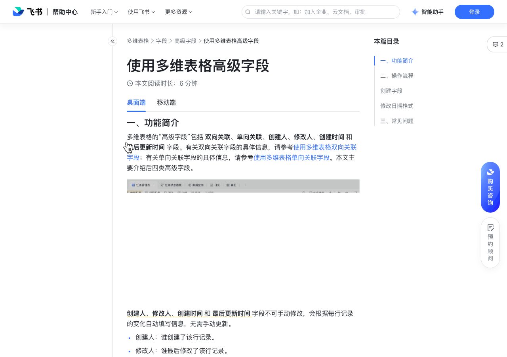

# 使用多维表格高级字段

> 来源：[飞书帮助中心](https://www.feishu.cn/hc/zh-CN/articles/807643284398)  
> 分类：多维表格 / 字段 / 高级字段  
> 抓取时间：2026-09-22T01:21:39.375Z

## 界面截图

### 文档内配图

1. 配图：https://p1-hera.feishucdn.com/tos-cn-i-jbbdkfciu3/bf63bcb8ad2e47e78ace9d68d7b8068e~tplv-jbbdkfciu3-image:0:0.image
2. 配图：https://p1-hera.feishucdn.com/tos-cn-i-jbbdkfciu3/5c6ceee1425542019df4e080f9dcdfb5~tplv-jbbdkfciu3-image:0:0.image
3. 配图：https://p1-hera.feishucdn.com/tos-cn-i-jbbdkfciu3/64cd9f9849b44cad8817a117eb392087~tplv-jbbdkfciu3-image:0:0.image
4. 配图：https://p1-hera.feishucdn.com/tos-cn-i-jbbdkfciu3/bcb0a2943e9c4235ac631775848a719e~tplv-jbbdkfciu3-image:0:0.image
5. 配图：https://p1-hera.feishucdn.com/tos-cn-i-jbbdkfciu3/f5eb57caba4342509dd7d267fada3231~tplv-jbbdkfciu3-image:0:0.image
6. 配图：https://p1-hera.feishucdn.com/tos-cn-i-jbbdkfciu3/1bb40e71d2624db0a79dc56ca252cf63~tplv-jbbdkfciu3-image:0:0.image

## 功能定位

本页对应飞书帮助中心「多维表格 / 字段 / 高级字段」下的「使用多维表格高级字段」。以下需求描述依据官方说明文档提炼，用于指导 DuoWei 对标实现。

## 功能目标

一、功能简介

## 文档结构（官方章节）

- 一、功能简介​
- 二、操作流程​
- 创建字段​
- 修改日期格式​
- 三、常见问题​

## 详细功能说明

一、功能简介

创建人：谁创建了该行记录。

修改人：谁最后修改了该行记录。

创建时间：该行记录的创建日期和时间（若有，取决于你设置的日期格式）。

最后更新时间：该行记录的最后修改日期和时间（若有，取决于你设置的日期格式）。

二、操作流程

创建字段

修改日期格式

三、常见问题

问：我可以修改创建人、修改人、创建时间、最后更新时间这几个字段的内容吗？

答：不可以，这些字段的内容将根据记录的情况自动生成，无法手动修改或填写。

## 实现要点（对标 DuoWei）

1. **入口与信息架构**：在产品中明确该能力所属模块（字段 / 高级字段），并保证用户可从对应导航触达。
2. **核心交互**：按上文「详细功能说明」还原主要操作路径；截图中出现的按钮、字段、面板命名尽量与飞书语义一致或可映射。
3. **数据与权限**：若文档涉及可见范围、可编辑范围、分享或高级权限，实现时需落到角色/成员模型，并保证 API/MCP 与 UI 权限一致。
4. **边界与上限**：若文档提到数量上限、格式限制、导入导出约束，需在实现与错误提示中体现。
5. **验收**：以本页截图场景为用例，完成「能打开 / 能配置 / 能保存 / 能被 Agent 读写（如适用）」四项检查。

## 原始摘录摘要

> 一、功能简介 创建人：谁创建了该行记录。 修改人：谁最后修改了该行记录。 创建时间：该行记录的创建日期和时间（若有，取决于你设置的日期格式）。 最后更新时间：该行记录的最后修改日期和时间（若有，取决于你设置的日期格式）。 二、操作流程 创建字段 修改日期格式 三、常见问题 问：我可以修改创建人、修改人、创建时间、最后更新时间这几个字段的内容吗？ 答：不可以，这些字段的内容将根据记录的情况自动生成，无法手动修改或填写。

## 元数据

- article_id: `6966919675464695809`
- category_id: `7187723536738435074`
- path: `/hc/zh-CN/articles/807643284398`
- extracted_text_length: 210
