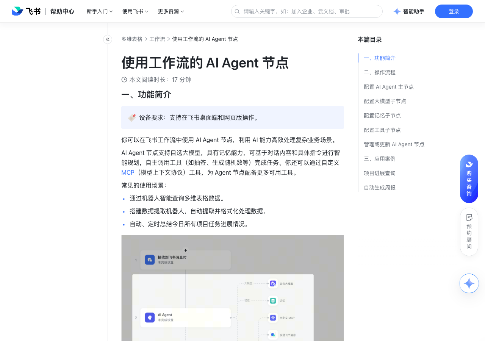

# 使用工作流的 AI Agent 节点

> 来源：[飞书帮助中心](https://www.feishu.cn/hc/zh-CN/articles/643175485940)  
> 分类：多维表格 / 工作流  
> 抓取时间：2026-09-22T01:25:11.361Z

## 界面截图

### 文档内配图

1. 配图：https://p1-hera.feishucdn.com/tos-cn-i-jbbdkfciu3/58ed8c80fac44f9ba36921681a27b5df~tplv-jbbdkfciu3-image:0:0.image
2. 配图：https://p1-hera.feishucdn.com/tos-cn-i-jbbdkfciu3/0046a9c6e9a2463a8e81ccd3b4223dc4~tplv-jbbdkfciu3-image:0:0.image
3. 配图：https://p1-hera.feishucdn.com/tos-cn-i-jbbdkfciu3/bb5f02c8f3f64d6eab7efc1d51642a11~tplv-jbbdkfciu3-image:0:0.image
4. 配图：https://p1-hera.feishucdn.com/tos-cn-i-jbbdkfciu3/66c22c3cd5724ab0af2b643ad022e3fa~tplv-jbbdkfciu3-image:0:0.image
5. 配图：https://p1-hera.feishucdn.com/tos-cn-i-jbbdkfciu3/037d5bab5b894aeb875397b05df57d85~tplv-jbbdkfciu3-image:0:0.image
6. 配图：https://p1-hera.feishucdn.com/tos-cn-i-jbbdkfciu3/09ba33fc5f874e898eb12ea6e95e9316~tplv-jbbdkfciu3-image:0:0.image
7. 配图：https://p1-hera.feishucdn.com/tos-cn-i-jbbdkfciu3/22b7948ee20243d4a1d52d994869b818~tplv-jbbdkfciu3-image:0:0.image
8. 配图：https://p1-hera.feishucdn.com/tos-cn-i-jbbdkfciu3/5e24115131a64cacaf87e139f6686231~tplv-jbbdkfciu3-image:0:0.image

## 功能定位

本页对应飞书帮助中心「多维表格 / 工作流」下的「使用工作流的 AI Agent 节点」。以下需求描述依据官方说明文档提炼，用于指导 DuoWei 对标实现。

## 功能目标

一、功能简介

## 文档结构（官方章节）

- 一、功能简介​
- 二、操作流程​
- 配置 AI Agent 主节点​
- 配置大模型子节点​
- 配置记忆子节点​
- 配置工具子节点​
- 管理或更新 AI Agent 节点​
- 三、应用案例​
- 项目进展查询​
- 自动生成周报​

## 详细功能说明

一、功能简介

通过机器人智能查询多维表格数据。

搭建数据提取机器人，自动提取并格式化处理数据。

自动、定时总结今日所有项目任务进展情况。

注： 工作流中的 AI Agent 节点每月均有一定的免费使用额度。超出免费额度后，可以继续使用企业购买的 AI 额度，具体信息请参考多维表格 AI 功能使用 AI 额度的说明。

二、操作流程

AI Agent 主节点：在 AI Agent 主节点配置输入给模型的指令，并可在输入中引用工作流中产生的数据，还可以定义节点输出内容的格式。

大模型子节点：在大模型子节点中选择模型并设置生成随机性、最大回复长度等参数。

记忆子节点：如果选择接收到飞书消息为触发条件，可以使用记忆子节点设置输入给模型的历史对话轮数。

工具子节点：可设置多种不同类型的工具节点，包括自定义 MCP 工具。

配置 AI Agent 主节点

打开多维表格，在左侧导航栏打开需要添加 AI Agent 节点的工作流。

在画布上点击 就执行，选择 AI Agent。如果需要在已有流程中增加节点，点击流程末尾的 + 图标或将鼠标悬停在两个节点中间，点击浮现的 + 图标即可。

在右侧的配置面板上，完成以下配置：

输入指令（Prompt）：详细描述要让 AI Agent 节点完成的任务。你可以点击输入栏右上角的 ⊕ 图标添加公式，引用 AI Agent 节点前已产生的数据、多维表格变量或自然时间。

注：指令最多支持 10,000 个字符。

自定义输出格式：如果开启，AI 将按照指定格式输出内容。例如，当你需要在后续流程中，以指定格式的请求体发送 HTTP 请求，则可以让 AI 按照格式要求生成请求体。可以选择 简易模式 或 { } JSON 模式。

简易模式：指定字段的数据类型、输出名称，并添加描述。模型将生成具体的值，并按照指定的格式输出内容。点击 + 添加 可增加字段。

{ } JSON 模式：以 JSON 格式定义输出内容，你需要在 JSON 中提供字段名和字段值的示例，例如：

JSON复制{ "客户名称": "张三", "联系邮箱": "zhangsan@example.com" }

注：如果不启用自定义输出格式，则将按照以下格式输出：

JSON复制{"输出": "全部输出内容" }

回复消息：当工作流触发方式为接收飞书消息时触发，你可以选择是否开启 AI 实时回复。开启后，系统会将 AI Agent 节点生成的内容逐字输出，并实时回复至触发工作流的消息，无需等待全部内容生成后才发送消息。

注：回复的消息将以多维表格应用机器人的身份发出，仅支持发送给企业内的用户或群组。因此，如果触发工作流的对象为外部用户或外部群组，开启消息回复会导致流程运行失败。

高级设置：

系统设定：定义系统逻辑，如人设、回复逻辑和语言风格。例如，如果需要执行内容优化任务，可以在这里输入：“你是一个专业的文案内容优化专家”。你可以点击输入栏右上角的 ⊕ 图标添加公式，引用 AI Agent 节点前已产生的数据、多维表格变量或自然时间。

注：系统设定 中输入内容的优先级高于 输入指令 中的内容，可将需要 Agent 严格遵守的指令或任务背景信息添加到这里。

最大迭代次数：设定 AI 在执行复杂任务时使用工具的次数上限。

配置大模型子节点

在画布上 大模型 子节点右侧点击预置的豆包模型，进入模型配置页面。

（可选）点击 更换操作类型 可以切换到 DeepSeek 模型。

点击展开 高级配置，配置以下选项：

生成随机性：调整 AI 生成内容的随机性，数值越大，随机性越高。可输入值的范围为 0 到 1。

最大回复长度：AI 每次生成内容的长度上限，单位为 token，100 token 约等于 150 中文汉字。

超时时间：大模型单次执行时间上限，单位为毫秒，超时则执行失败。

配置记忆子节点

在画布上点击记忆子节点右侧的 + 图标。

在右侧的配置面板中的 读取历史会话次数 中，输入读取的历史会话次数。

对于单聊对话：触发工作流的消息中，消息接收者和消息发送方的 1 问 1 答为 1 次对话。

对于群聊对话：触发工作流的消息中，群聊中任何成员和消息发送方的 1 问 1 答为 1 次对话。

配置工具子节点

在画布上点击工具子节点右侧的 + 图标。选择要添加的工具。

根据所选工具，在右侧配置面板中完成所需配置。

已有工作流节点：按照对应工作节点的配置方式完成配置即可。

MCP 工具：

预置 MCP：系统预置的 MCP 工具，无需提供鉴权信息，开箱即用。以“飞书云文档 MCP”为例，你需要：

选择使用身份：可选当前用户或流程触发者。云文档 MCP 需要使用所选身份的权限执行创建、更新云文档等操作，此处需确保该身份具备足够的权限。

工具列表：启用 MCP 的具体能力。只有在此处启用能力，AI Agent 才能完成和该能力相关的任务。

自定义 MCP：关联自定义 MCP 服务器，你需要确保已在对应的 MCP 服务端进行了相应配置才可在此处关联自定义 MCP。完成以下配置：

MCP 描述：向 AI Agent 说明工具的用途，帮助 AI 更好地理解如何使用工具。

添加方式：可选 Streamable HTTP 或 SSE 协议。

MCP 地址：MCP 服务器地址。

鉴权认证：可选 无需鉴权、Header 鉴权方式 或 Bearer 鉴权方式。如果选择 Header 或 Bearer 鉴权，需要继续输入所需的 Header 键值对或 Bearer Token。

完成 AI Agent 节点的配置后，你可以继续配置后续流程，然后保存或启用工作流。

管理或更新 AI Agent 节点

在工作流画布上，将鼠标悬停在 AI Agent 主节点上，点击右上角的 ··· 图标，你可以重命名、创建副本或删除节点。

在工作流画布上，将鼠标悬停在 AI Agent 子节点上，点击右上角的 ··· 图标，你可以重命名、更换节点类型或删除节点。记忆子节点不支持更换节点类型。

三、应用案例

项目进展查询

进入多维表格，点击左下角 新建 下的 工作流，选择 + 从空白开始。

选择 接收到飞书消息时 作为触发条件。设置接收消息的场景、群组、接收消息范围等选项。

可将接收消息范围设置为 提及机器人的消息。具体信息请参考设置接收飞书消息为自动化触发条件

添加 AI Agent 节点，并进行配置：

在 输入指令（Prompt）中，输入需要让 Agent 执行的任务，例如：

Markdown复制# 人设你是一个专业项目管理 PMO 助手，需要根据要求完成任务。当前多维表格是一个对应的项目管理数据库，需要的时候可以调用工具查看内容。# 任务 [接收到消息时|消息内容]## 注意如果输出包含记录，需要告知对应的记录链接。

注：[接收到消息时|消息内容] 为引用的用户消息，点击输入框右上角的 ⊕ 图标 > 1. 接收到飞书消息时 > 消息内容。

b. 添加大模型、记忆和飞书多维表格子节点。在多维表格节点中，按需开启需要使用的能力。例如，可开启获取全部数据表、获取当前多维表格的记录详情等能力。

添加发送飞书消息节点。

消息发送场景：选择 回复第 1 步接收到的消息。

消息类型：选择 普通消息。

内容：点击输入框右上角的 ⊕ 图标 > 2. AI Agent。

配置完成后，点击 保存并启用。

自动生成周报

选择 定时触发 作为触发条件，设置触发时间和重复频率。例如，你可以设置为每周五定时触发。

添加 查找记录 节点，筛选出数据表中需要生成周报的记录。例如，你可以筛选出日期为前 5 个工作日的项目记录。

Markdown复制# 人设你是一个周报总结助手，能准确分析业务内容、给出建议，并返回文档。# 任务 根据提供的本周项目进展信息，生成一篇项目周报文档。##任务要求：###1.文档格式：{{ // 此处可以附上相关格式要求的文档链接 }}###2.文档内容必须严格按照我给你的项目信息###3.需要对周报内容进行概括总结###4. 生成对应的云文档#项目信息：[直接引用查找到的所有记录]#注意：必须严格按照给定的数据及要求执行。

添加大模型和工具，并为工具开启需要的能力。在生成周报场景中，使用的工具是飞书云文档，需要为其开启创建云文档、更新云文档、从云文档中获取纯文本内容的内容。

添加 新增记录 节点，将上一步创建的周报链接添加到周报记录表中。

添加 发送飞书消息节点，将周报链接发送给指定成员。

## 实现要点（对标 DuoWei）

1. **入口与信息架构**：在产品中明确该能力所属模块（工作流），并保证用户可从对应导航触达。
2. **核心交互**：按上文「详细功能说明」还原主要操作路径；截图中出现的按钮、字段、面板命名尽量与飞书语义一致或可映射。
3. **数据与权限**：若文档涉及可见范围、可编辑范围、分享或高级权限，实现时需落到角色/成员模型，并保证 API/MCP 与 UI 权限一致。
4. **边界与上限**：若文档提到数量上限、格式限制、导入导出约束，需在实现与错误提示中体现。
5. **验收**：以本页截图场景为用例，完成「能打开 / 能配置 / 能保存 / 能被 Agent 读写（如适用）」四项检查。

## 原始摘录摘要

> 一、功能简介 通过机器人智能查询多维表格数据。 搭建数据提取机器人，自动提取并格式化处理数据。 自动、定时总结今日所有项目任务进展情况。 注： 工作流中的 AI Agent 节点每月均有一定的免费使用额度。超出免费额度后，可以继续使用企业购买的 AI 额度，具体信息请参考多维表格 AI 功能使用 AI 额度的说明。 二、操作流程 AI Agent 主节点：在 AI Agent 主节点配置输入给模型的指令，并可在输入中引用工作流中产生的数据，还可以定义节点输出内容的格式。 大模型子节点：在大模型子节点中选择模型并设置生成随机性、最大回复长度等参数。 记忆子节点：如果选择接收到飞书消息为触发条件，可以使用记忆子节点设置输入给模型的历史对话轮数。 工具子节点：可设置多种不同类型的工具节点，包括自定义 MCP 工具。 配置 AI Agent 主节点 打开多维表格，在左侧导航栏打开需要添加 AI Agent 节点的工作流。 在画布上点击 就执行，选择 AI Agent。如果需要在已有流程中增加节点，点击流程末尾的 + 图标或将鼠标悬停在两个节点中间，点击浮现的 + 图标即可。 在右侧的配置面板上，完成以下配置： 输入指令（Prompt）：详细描述要让 AI Agent 节点完成的任务。你可以点击输入栏右上角的 ⊕ 图标添加公式，引用 AI Agent 节点前已产生的数据、多维表格变量或自然时间。 注：指令最多支持 10,000 个字符。 自定义输出格式：如果开启，AI 将按照指定格式输出内容。例如，当你需要在后续流程中，以指定格式的请求体发送 HTTP 请求，则可以让 AI 按照格式要求生成请求体。可以选择 简易模式 或 { } JSON 模式。 简易模式：指定字段的数据类型、输出名称，并添加描述。模型将生成具体的值，并按照指定的格式输出内容。点击 + 添加 可增加字段。 { } J…

## 元数据

- article_id: `7550675263203622913`
- category_id: `7415964452380049412`
- path: `/hc/zh-CN/articles/643175485940`
- extracted_text_length: 3511
