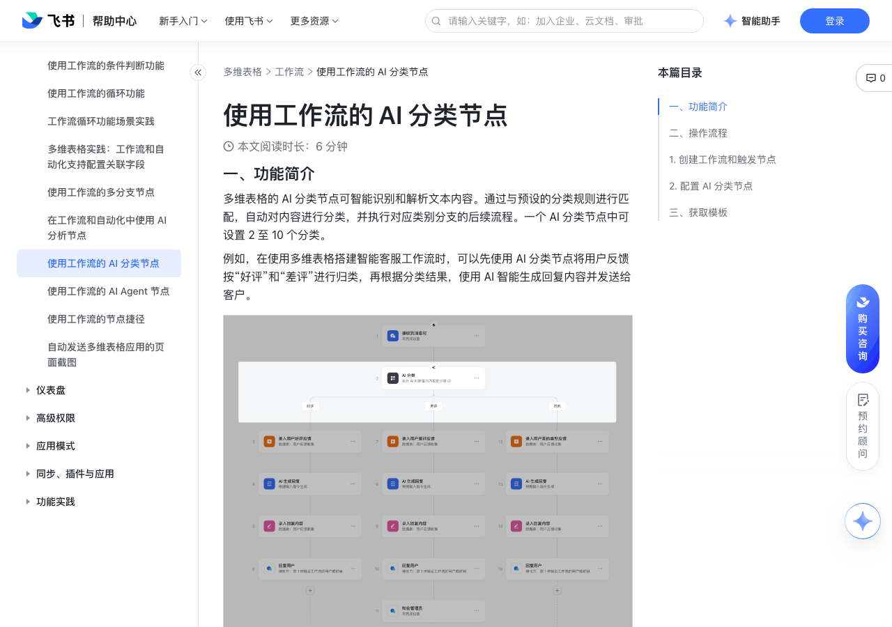

# 使用工作流的 AI 分类节点

> 来源：[飞书帮助中心](https://www.feishu.cn/hc/zh-CN/articles/843535382074)  
> 分类：多维表格 / 工作流  
> 抓取时间：2026-09-22T01:25:12.319Z

## 界面截图

### 文档内配图

1. 配图：https://p1-hera.feishucdn.com/tos-cn-i-jbbdkfciu3/c0cd573b8aa24e098b12981865d6a114~tplv-jbbdkfciu3-image:0:0.image
2. 配图：https://p1-hera.feishucdn.com/tos-cn-i-jbbdkfciu3/7f6f8b2124394214b44865ac6d0ddf87~tplv-jbbdkfciu3-image:0:0.image
3. 配图：https://p1-hera.feishucdn.com/tos-cn-i-jbbdkfciu3/246a5677a2dd43af85377cd62eee15a2~tplv-jbbdkfciu3-image:0:0.image
4. 配图：https://p1-hera.feishucdn.com/tos-cn-i-jbbdkfciu3/cc43202d1c094fa095bb9d41abf6635b~tplv-jbbdkfciu3-image:0:0.image

## 功能定位

本页对应飞书帮助中心「多维表格 / 工作流」下的「使用工作流的 AI 分类节点」。以下需求描述依据官方说明文档提炼，用于指导 DuoWei 对标实现。

## 功能目标

一、功能简介

## 文档结构（官方章节）

- 一、功能简介​
- 二、操作流程​
- 创建工作流和触发节点​
- 配置 AI 分类节点​
- 三、获取模板​

## 详细功能说明

一、功能简介

多维表格的 AI 分类节点可智能识别和解析文本内容。通过与预设的分类规则进行匹配，自动对内容进行分类，并执行对应类别分支的后续流程。一个 AI 分类节点中可设置 2 至 10 个分类。

节点名称

分类方法

适用场景

AI 分类节点

基于大语言模型对文本的解析能力，对输入内容进行分类，执行 AI 判断最为匹配的分类。

智能客服等需要动态判断的场景

多分支节点

严格基于预设条件进行分类，执行符合条件的第一个分支。

分类标准明确的场景

二、操作流程

创建工作流和触发节点

打开多维表格，在左下角点击 工作流 > + 从空白开始。

选择 接收到飞书消息时 触发器。在弹出的配置面板中，设置接收消息的场景、接收消息的群组/个人和消息需满足的条件等选项。具体信息请参考设置接收飞书消息为自动化触发条件。

配置 AI 分类节点

在画布上点击 就执行，选择 AI 分类。如果需要在已有流程中增加节点，点击流程末尾的 + 或将鼠标悬停在两个节点中间，点击浮现的 + 即可。

在弹出的 AI 分类 面板上，配置如下选项：

执行逻辑：当前仅支持执行 AI 判断最为匹配的分类。

用于分类的内容：输入或引用需要 AI 进行分类的内容。点击输入栏右上角的 ⊕ 图标可以引用分类节点前已产生的数据、多维表格变量或自然时间。

在本例中，点击 ⊕ 图标后，先将鼠标悬停在 1. 接收到消息时 选项上，点击 继续，再将鼠标悬停在 消息内容 选项上，点击 选择。

250px|700px|reset

分类规则：设置分类规则，规则由名称和描述组成。

如果名称已可以清楚描述规则，可以省略描述；如果规则复杂，可在描述栏提供更多信息。本例中，在 分类 1 的标题中填写 好评，分类 2 的标题中填写 差评 即可。

注：点击下方 + 添加分类 来增加类别，将鼠标悬停在一个分类上，点击右上角 删除 图标，删除分类。

没有匹配的分类时：选择当 AI 没有匹配到分类时的行为。可选项为：

归为其他分类：执行 其他 分类下的流程。

当前节点执行失败：分类节点执行失败，该节点的后续流程将终止执行。

全局分类规则（可选）：可填入对分类规则的整体概括或需要补充的其他信息。

你可以在工作流的后续节点中引用 AI 分类结果的分类名称。

你可以在工作流的循环节点中嵌套 AI 分类节点，在每次循环中分类。例如，如果希望定时集中处理并回复用户消息，可将 AI 分类流程嵌套在循环节点中，每次循环处理一条信息。

三、获取模板

节点名称 | 分类方法 | 适用场景

AI 分类节点 | 基于大语言模型对文本的解析能力，对输入内容进行分类，执行 AI 判断最为匹配的分类。 | 智能客服等需要动态判断的场景

多分支节点 | 严格基于预设条件进行分类，执行符合条件的第一个分支。 | 分类标准明确的场景

## 实现要点（对标 DuoWei）

1. **入口与信息架构**：在产品中明确该能力所属模块（工作流），并保证用户可从对应导航触达。
2. **核心交互**：按上文「详细功能说明」还原主要操作路径；截图中出现的按钮、字段、面板命名尽量与飞书语义一致或可映射。
3. **数据与权限**：若文档涉及可见范围、可编辑范围、分享或高级权限，实现时需落到角色/成员模型，并保证 API/MCP 与 UI 权限一致。
4. **边界与上限**：若文档提到数量上限、格式限制、导入导出约束，需在实现与错误提示中体现。
5. **验收**：以本页截图场景为用例，完成「能打开 / 能配置 / 能保存 / 能被 Agent 读写（如适用）」四项检查。

## 原始摘录摘要

> 一、功能简介 多维表格的 AI 分类节点可智能识别和解析文本内容。通过与预设的分类规则进行匹配，自动对内容进行分类，并执行对应类别分支的后续流程。一个 AI 分类节点中可设置 2 至 10 个分类。 节点名称 分类方法 适用场景 AI 分类节点 基于大语言模型对文本的解析能力，对输入内容进行分类，执行 AI 判断最为匹配的分类。 智能客服等需要动态判断的场景 多分支节点 严格基于预设条件进行分类，执行符合条件的第一个分支。 分类标准明确的场景 二、操作流程 创建工作流和触发节点 打开多维表格，在左下角点击 工作流 > + 从空白开始。 选择 接收到飞书消息时 触发器。在弹出的配置面板中，设置接收消息的场景、接收消息的群组/个人和消息需满足的条件等选项。具体信息请参考设置接收飞书消息为自动化触发条件。 配置 AI 分类节点 在画布上点击 就执行，选择 AI 分类。如果需要在已有流程中增加节点，点击流程末尾的 + 或将鼠标悬停在两个节点中间，点击浮现的 + 即可。 在弹出的 AI 分类 面板上，配置如下选项： 执行逻辑：当前仅支持执行 AI 判断最为匹配的分类。 用于分类的内容：输入或引用需要 AI 进行分类的内容。点击输入栏右上角的 ⊕ 图标可以引用分类节点前已产生的数据、多维表格变量或自然时间。 在本例中，点击 ⊕ 图标后，先将鼠标悬停在 1. 接收到消息时 选项上，点击 继续，再将鼠标悬停在 消息内容 选项上，点击 选择。 250px|700px|reset 分类规则：设置分类规则，规则由名称和描述组成。 如果名称已可以清楚描述规则，可以省略描述；如果规则复杂，可在描述栏提供更多信息。本例中，在 分类 1 的标题中填写 好评，分类 2 的标题中填写 差评 即可。 注：点击下方 + 添加分类 来增加类别，将鼠标悬停在一个分类上，点击右上角 删除 图标，删除分类。 没有匹配的…

## 元数据

- article_id: `7528273569546158108`
- category_id: `7415964452380049412`
- path: `/hc/zh-CN/articles/843535382074`
- extracted_text_length: 1176
