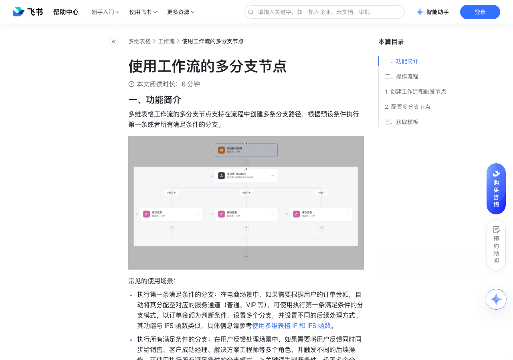

# 使用工作流的多分支节点

> 来源：[飞书帮助中心](https://www.feishu.cn/hc/zh-CN/articles/576337753396)  
> 分类：多维表格 / 工作流  
> 抓取时间：2026-09-22T01:25:11.917Z

## 界面截图

### 文档内配图

1. 配图：https://p1-hera.feishucdn.com/tos-cn-i-jbbdkfciu3/1e454b7844e3488c9bfbd53389a39f79~tplv-jbbdkfciu3-image:0:0.image
2. 配图：https://p1-hera.feishucdn.com/tos-cn-i-jbbdkfciu3/451403193d0d4583a59d12f53d51f8a6~tplv-jbbdkfciu3-image:0:0.image
3. 配图：https://p1-hera.feishucdn.com/tos-cn-i-jbbdkfciu3/818817df04c84da6870e6665188a6b5f~tplv-jbbdkfciu3-image:0:0.image
4. 配图：https://p1-hera.feishucdn.com/tos-cn-i-jbbdkfciu3/bcd681b52cfa4db9bc0e811365e63838~tplv-jbbdkfciu3-image:0:0.image

## 功能定位

本页对应飞书帮助中心「多维表格 / 工作流」下的「使用工作流的多分支节点」。以下需求描述依据官方说明文档提炼，用于指导 DuoWei 对标实现。

## 功能目标

一、功能简介

## 文档结构（官方章节）

- 一、功能简介​
- 二、操作流程​
- 创建工作流和触发节点​
- 配置多分支节点​
- 三、获取模板​

## 详细功能说明

一、功能简介

执行第一条满足条件的分支：在电商场景中，如果需要根据用户的订单金额，自动将其分配至对应的服务通道（普通、VIP 等），可使用执行第一条满足条件的分支模式，以订单金额为判断条件，设置多个分支，并设置不同的后续处理方式。其功能与 IFS 函数类似，具体信息请参考使用多维表格 IF 和 IFS 函数。

执行所有满足条件的分支：在用户反馈处理场景中，如果需要将用户反馈同时同步给销售、客户成功经理、解决方案工程师等多个角色，并触发不同的后续操作，可使用执行所有满足条件的分支模式，以关键词为判断条件，设置多个分支，并设置不同的后续处理方式。

二、操作流程

创建工作流和触发节点

配置多分支节点

在画布上点击 就执行，选择 多分支（Switch）。如果需要在已有流程中增加节点，点击流程末尾的 + 图标或将鼠标悬停在两个节点中间，点击浮现的 + 图标即可。

在弹出的 多分支（Switch）面板上，配置如下选项：

执行逻辑：选择执行第一条满足条件的分支或所有满足条件的分支，按照配置面板从上到下，或者画布从左到右的顺序，逐个进行判断。

分支条件：配置触发分支的条件。按照以下步骤配置单个分支：

点击 如果 下的第一个下拉栏，将鼠标悬停在某个选项或步骤上，点击右侧浮现的 继续。

本案例以订单表中的订单金额为条件，因此选择 1. 添加新记录时 引用新增记录的订单金额。

在弹出的可选字段中，将鼠标悬停在 订单金额 上，点击右侧的 选择。

注：将鼠标悬停在一个可选字段上时，还会出现 继续 选项，点击该选项，你可以选择引用字段 ID 或字段名。

在第二个下拉栏中，选择条件运算符。

在第三个下拉栏中，输入固定值或点击右侧的 ⊕ 来选择要引用的值。

注：如果需要设置组合条件，点击 + 并且 或 + 或者，按照上述方式进行配置。

250px|700px|reset

点击 + 添加分支，可新增条件分支。

要调整分支顺序，将鼠标悬停在一个分支上，点击左上角浮现的 ⋮⋮ 图标并上下拖拽分支。

选择所有条件均不满足时的处理方式：

如果执行逻辑为 执行第一条满足条件的分支，可以选择执行其他分支，或选择当前节点执行失败。

如果执行逻辑为 执行所有满足条件的分支，可以选择跳过当前节点，或选择当前节点执行失败。

选择分支执行出错时的处理方式：仅执行逻辑为 执行所有满足条件的分支 时有该选项，可以选择跳过当前分支并继续执行其他分支，或选择当前节点执行失败。如果每个分支都执行出错，即使选择了跳出当前分支，整个节点依然会执行失败。

完成多分支节点配置后，你可以点击每个分支下的 + 图标，继续配置后续流程。例如，你可以在每个订单金额分支下添加修改记录节点，根据金额对订单进行分类。你还可以将鼠标悬停在分支名右侧的 ··· 图标上，点击浮现的 重命名 图标，修改分支名称。

三、获取模板

## 实现要点（对标 DuoWei）

1. **入口与信息架构**：在产品中明确该能力所属模块（工作流），并保证用户可从对应导航触达。
2. **核心交互**：按上文「详细功能说明」还原主要操作路径；截图中出现的按钮、字段、面板命名尽量与飞书语义一致或可映射。
3. **数据与权限**：若文档涉及可见范围、可编辑范围、分享或高级权限，实现时需落到角色/成员模型，并保证 API/MCP 与 UI 权限一致。
4. **边界与上限**：若文档提到数量上限、格式限制、导入导出约束，需在实现与错误提示中体现。
5. **验收**：以本页截图场景为用例，完成「能打开 / 能配置 / 能保存 / 能被 Agent 读写（如适用）」四项检查。

## 原始摘录摘要

> 一、功能简介 执行第一条满足条件的分支：在电商场景中，如果需要根据用户的订单金额，自动将其分配至对应的服务通道（普通、VIP 等），可使用执行第一条满足条件的分支模式，以订单金额为判断条件，设置多个分支，并设置不同的后续处理方式。其功能与 IFS 函数类似，具体信息请参考使用多维表格 IF 和 IFS 函数。 执行所有满足条件的分支：在用户反馈处理场景中，如果需要将用户反馈同时同步给销售、客户成功经理、解决方案工程师等多个角色，并触发不同的后续操作，可使用执行所有满足条件的分支模式，以关键词为判断条件，设置多个分支，并设置不同的后续处理方式。 二、操作流程 创建工作流和触发节点 配置多分支节点 在画布上点击 就执行，选择 多分支（Switch）。如果需要在已有流程中增加节点，点击流程末尾的 + 图标或将鼠标悬停在两个节点中间，点击浮现的 + 图标即可。 在弹出的 多分支（Switch）面板上，配置如下选项： 执行逻辑：选择执行第一条满足条件的分支或所有满足条件的分支，按照配置面板从上到下，或者画布从左到右的顺序，逐个进行判断。 分支条件：配置触发分支的条件。按照以下步骤配置单个分支： 点击 如果 下的第一个下拉栏，将鼠标悬停在某个选项或步骤上，点击右侧浮现的 继续。 本案例以订单表中的订单金额为条件，因此选择 1. 添加新记录时 引用新增记录的订单金额。 在弹出的可选字段中，将鼠标悬停在 订单金额 上，点击右侧的 选择。 注：将鼠标悬停在一个可选字段上时，还会出现 继续 选项，点击该选项，你可以选择引用字段 ID 或字段名。 在第二个下拉栏中，选择条件运算符。 在第三个下拉栏中，输入固定值或点击右侧的 ⊕ 来选择要引用的值。 注：如果需要设置组合条件，点击 + 并且 或 + 或者，按照上述方式进行配置。 250px|700px|reset 点击 + 添加分支，可新增条件分支…

## 元数据

- article_id: `7527144250478411778`
- category_id: `7415964452380049412`
- path: `/hc/zh-CN/articles/576337753396`
- extracted_text_length: 1187
