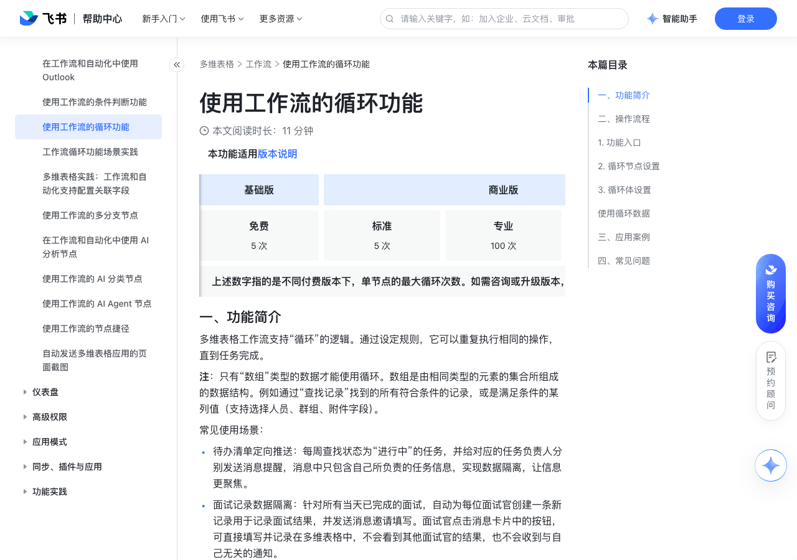

# 使用工作流的循环功能

> 来源：[飞书帮助中心](https://www.feishu.cn/hc/zh-CN/articles/998420967277)  
> 分类：多维表格 / 工作流  
> 抓取时间：2026-09-22T01:25:10.238Z

## 界面截图

### 文档内配图

1. 配图：https://p1-hera.feishucdn.com/tos-cn-i-jbbdkfciu3/cb4a4f6bc6dd4ca6b711cc6c22e8da92~tplv-jbbdkfciu3-image:0:0.image
2. 配图：https://p1-hera.feishucdn.com/tos-cn-i-jbbdkfciu3/21fb5da11aaa4e4e81a12debd08d3c92~tplv-jbbdkfciu3-image:0:0.image
3. 配图：https://p1-hera.feishucdn.com/tos-cn-i-jbbdkfciu3/e4903ec89739483b94fb27b3219bc44c~tplv-jbbdkfciu3-image:0:0.image
4. 配图：https://p1-hera.feishucdn.com/tos-cn-i-jbbdkfciu3/a47ee1d6dc354af0a1a2bbe92db150b2~tplv-jbbdkfciu3-image:0:0.image
5. 配图：https://p1-hera.feishucdn.com/tos-cn-i-jbbdkfciu3/ec556c11a50d49288db58616573d2e4a~tplv-jbbdkfciu3-image:0:0.image
6. 配图：https://p1-hera.feishucdn.com/tos-cn-i-jbbdkfciu3/d73f4a4682e349dcbce6af37de3078b6~tplv-jbbdkfciu3-image:0:0.image
7. 配图：https://p1-hera.feishucdn.com/tos-cn-i-jbbdkfciu3/3fa14c6a1c0c483284758d45dc80c15b~tplv-jbbdkfciu3-image:0:0.image
8. 配图：https://p1-hera.feishucdn.com/tos-cn-i-jbbdkfciu3/738020e5e43a41bdba9530fe22aef382~tplv-jbbdkfciu3-image:0:0.image
9. 配图：https://p1-hera.feishucdn.com/tos-cn-i-jbbdkfciu3/be31b8fcd8ff459abc04de99e00d8e5c~tplv-jbbdkfciu3-image:0:0.image
10. 配图：https://p1-hera.feishucdn.com/tos-cn-i-jbbdkfciu3/5aebeeac60af4df9b5b41fc880aa1fa9~tplv-jbbdkfciu3-image:0:0.image
11. 配图：https://p1-hera.feishucdn.com/tos-cn-i-jbbdkfciu3/140df9793df54063a1960004f30da538~tplv-jbbdkfciu3-image:0:0.image
12. 配图：https://p1-hera.feishucdn.com/tos-cn-i-jbbdkfciu3/692a1bc2e92b4e2dbafbfeb4d9714634~tplv-jbbdkfciu3-image:0:0.image
13. 配图：https://p1-hera.feishucdn.com/tos-cn-i-jbbdkfciu3/3c80b9db4eb24d94afe64235530ae41a~tplv-jbbdkfciu3-image:0:0.image
14. 配图：https://p1-hera.feishucdn.com/tos-cn-i-jbbdkfciu3/e1aedd21845b48d2a3fa922b0613e9c7~tplv-jbbdkfciu3-image:0:0.image

## 功能定位

本页对应飞书帮助中心「多维表格 / 工作流」下的「使用工作流的循环功能」。以下需求描述依据官方说明文档提炼，用于指导 DuoWei 对标实现。

## 功能目标

一、功能简介

## 文档结构（官方章节）

- 一、功能简介​
- 二、操作流程​
- 功能入口​
- 循环节点设置​
- 循环体设置​
- 添加循环操作​
- 使用循环数据​
- 三、应用案例​
- 业务场景​
- 操作步骤​
- 配置效果​
- 四、常见问题​

## 详细功能说明

一、功能简介

待办清单定向推送：每周查找状态为“进行中”的任务，并给对应的任务负责人分别发送消息提醒，消息中只包含自己所负责的任务信息，实现数据隔离，让信息更聚焦。

面试记录数据隔离：针对所有当天已完成的面试，自动为每位面试官创建一条新记录用于记录面试结果，并发送消息邀请填写。面试官点击消息卡片中的按钮，可直接填写并记录在多维表格中，不会看到其他面试官的结果，也不会收到与自己无关的通知。

向多个群组批量添加群成员：若一个群组字段中添加了多个群组，使用循环功能可以便捷地将人员一次性添加到多个群组中。

二、操作流程

功能入口

打开多维表格，点击左下角的 工作流 创建一个工作流。

选择你需要的触发条件后，点击带有 就执行操作 字样的按钮，选择 循环 的执行操作。

注：一个工作流中最多可添加 5 个循环节点。

循环节点设置

循环方式：目前支持 依次处理每条数据 的循环方式，即：对一组数据依次执行相同的操作。例如，给任务清单中的每项任务的负责人发送催办，或将任务清单中的每项任务都标记为完成。

需要依次处理的数据：当循环方式选择了 依次处理每条数据 时，需设置此项。此处仅支持引用前序步骤中产生的数据，且只能引用“数组”类型的数据。你可以使用公式对引用的数据进行处理，但需要使用可生成数组的函数，如 List 函数，具体信息请参考在工作流和自动化中使用公式。

具体可选的数组如下：

HTTP 请求或 webhook 触发所输出的 json.array。

当触发条件为 添加新记录时、修改记录时、新增/修改的记录满足条件时、到达记录中的时间时，或是当执行操作为 新增记录 或 修改记录 时，可选择这些步骤中输出的人员、群组和附件字段。

注：同一个单元格中可存在多个人员、群组、附件。

查找记录 操作输出结果。

类别说明场景举例查找到的所有记录循环将按记录逐条遍历查找结果。因此循环次数等于查找到的记录数。适用于需要对每条记录中的数据进行处理的场景。查询本月所有销售订单记录，循环每条订单记录，累加订单金额，计算本月总销售额。查找到的第 1 条记录仅支持人员、群组、附件、单向关联、双向关联字段。循环将遍历查找结果中按随机顺序获取的第 1 条记录中特定字段的值。适用于查询结果只有一条记录，且特定字段有多个值的场景。查询值班表中当天的值班人员，循环给值班人员依次发送提醒消息。查找到的所有记录的某列值仅支持人员、群组、附件、单向关联、双向关联字段。循环将逐个遍历查找结果。因此循环次数可能小于或大于记录数。适用于需要基于单个字段进行处理的场景。注：循环人员、群组、附件数据时，系统会进行去重。查询当天过生日的所有成员，循环给每个成员发送生日祝福。

场景举例

查找到的所有记录

循环将按记录逐条遍历查找结果。因此循环次数等于查找到的记录数。适用于需要对每条记录中的数据进行处理的场景。

查询本月所有销售订单记录，循环每条订单记录，累加订单金额，计算本月总销售额。

查找到的第 1 条记录

仅支持人员、群组、附件、单向关联、双向关联字段。循环将遍历查找结果中按随机顺序获取的第 1 条记录中特定字段的值。适用于查询结果只有一条记录，且特定字段有多个值的场景。

查询值班表中当天的值班人员，循环给值班人员依次发送提醒消息。

查找到的所有记录的某列值

仅支持人员、群组、附件、单向关联、双向关联字段。循环将逐个遍历查找结果。因此循环次数可能小于或大于记录数。适用于需要基于单个字段进行处理的场景。注：循环人员、群组、附件数据时，系统会进行去重。

查询当天过生日的所有成员，循环给每个成员发送生日祝福。

最大循环次数：在此处输入你希望此节点循环的最大次数。当循环次数达到最大时，将不再执行后续循环。不同付费版本下，单节点的最大循环次数不同，详情可参考下表。

飞书版本基础版商业版企业版免费标准专业旗舰标准专业旗舰单节点最大循环次数5 次5 次100 次1,000 次1,000 次1,000 次1,000 次

飞书版本

单节点最大循环次数

100 次

1,000 次

若循环出错时 的处理方式：在整个循环的执行过程中，若其中某一次出现了错误，你可以选择 仅跳过当次循环，继续执行后续循环 和 终止执行，流程失败 两种处理方式。

若你选择了 仅跳过当次循环，继续执行后续循环 的选项，流程运行时可能会出现“部分运行成功、部分运行失败”的情况。你可以在运行日志中查看具体的运行情况。

循环体设置

添加循环操作

使用循环数据

三、应用案例

业务场景

操作步骤

选择 定时触发 的触发条件。设置时间为周一早上 10 点，并选择 每周重复。

添加一个 查找记录 的操作，查找所有进行中的任务。选择任务所在的数据表，并设置筛选条件为 状态 等于 进行中。按需设置查找内容，此处我们选择“任务负责人”字段。

添加一个 循环 的操作，并进行循环节点设置。

选择 依次处理每条数据 的循环方式。

在 需要依次处理的数据 处，点击输入框，选择 2.查找记录 > 查找到的所有记录的某列值 > 任务负责人。

按需设置 最大循环次数 和循环出错时的处理方式。

完成上述设置后，意味着你将会对“第二步找到的所有记录”中的“任务负责人”字段执行完全一致的操作。

添加一个 查找记录 的操作，并添加两个筛选条件：状态 等于 进行中；任务负责人 包含 3.循环 > 当前循环数据。

按需设置你想要查找的字段内容，此处设置为“任务名称”“任务负责人”“状态”“最新进展记录”。

添加一个 发送飞书消息 的操作。在 接收方 处，选择之前步骤产生的数据，选择 3.循环 > 当前循环数据。

按需设置消息标题和内容。在消息内容中，你可以点击 ⊕ 引用值 引用循环数据，例如引用任务负责人姓名及对应的任务。

配置效果

四、常见问题

问：在工作流的循环已经开始后，如果我对数据表内容做了修改，是否会影响循环？

答：不会影响。循环被触发之后，循环的次数和内容就已经确定，是不可变更的数据。

问：含有循环节点的工作流，是否有运行时长的上限？

答：流程执行时间最多为 3 小时，超出 3 小时的工作流会出现报错。

问：在一个工作流中，最多可添加几个循环节点？

答：5 个。

问：在一个工作流中，最多可嵌套几层循环？

答：3 层。250px|700px|reset

问：使用工作流的循环功能时，运行次数是如何计算的？

答：按整个工作流的执行次数计算，而不是“每循环一次就消耗一次运行次数”。你也可以查看工作流的运行日志，一行“运行状态”就会对应一次次数。以图中的运行日志为例，该流程虽然循环了 4 次，但只会计算为 1 次运行次数。250px|700px|reset

类别 | 说明 | 场景举例

查找到的所有记录 | 循环将按记录逐条遍历查找结果。因此循环次数等于查找到的记录数。适用于需要对每条记录中的数据进行处理的场景。 | 查询本月所有销售订单记录，循环每条订单记录，累加订单金额，计算本月总销售额。

查找到的第 1 条记录 | 仅支持人员、群组、附件、单向关联、双向关联字段。循环将遍历查找结果中按随机顺序获取的第 1 条记录中特定字段的值。适用于查询结果只有一条记录，且特定字段有多个值的场景。 | 查询值班表中当天的值班人员，循环给值班人员依次发送提醒消息。

查找到的所有记录的某列值 | 仅支持人员、群组、附件、单向关联、双向关联字段。循环将逐个遍历查找结果。因此循环次数可能小于或大于记录数。适用于需要基于单个字段进行处理的场景。注：循环人员、群组、附件数据时，系统会进行去重。 | 查询当天过生日的所有成员，循环给每个成员发送生日祝福。

飞书版本 | 基础版 | 商业版 | | | 企业版 | |

| 免费 | 标准 | 专业 | 旗舰 | 标准 | 专业 | 旗舰

单节点最大循环次数 | 5 次 | 5 次 | 100 次 | 1,000 次 | 1,000 次 | 1,000 次 | 1,000 次

## 实现要点（对标 DuoWei）

1. **入口与信息架构**：在产品中明确该能力所属模块（工作流），并保证用户可从对应导航触达。
2. **核心交互**：按上文「详细功能说明」还原主要操作路径；截图中出现的按钮、字段、面板命名尽量与飞书语义一致或可映射。
3. **数据与权限**：若文档涉及可见范围、可编辑范围、分享或高级权限，实现时需落到角色/成员模型，并保证 API/MCP 与 UI 权限一致。
4. **边界与上限**：若文档提到数量上限、格式限制、导入导出约束，需在实现与错误提示中体现。
5. **验收**：以本页截图场景为用例，完成「能打开 / 能配置 / 能保存 / 能被 Agent 读写（如适用）」四项检查。

## 原始摘录摘要

> 一、功能简介 待办清单定向推送：每周查找状态为“进行中”的任务，并给对应的任务负责人分别发送消息提醒，消息中只包含自己所负责的任务信息，实现数据隔离，让信息更聚焦。 面试记录数据隔离：针对所有当天已完成的面试，自动为每位面试官创建一条新记录用于记录面试结果，并发送消息邀请填写。面试官点击消息卡片中的按钮，可直接填写并记录在多维表格中，不会看到其他面试官的结果，也不会收到与自己无关的通知。 向多个群组批量添加群成员：若一个群组字段中添加了多个群组，使用循环功能可以便捷地将人员一次性添加到多个群组中。 二、操作流程 功能入口 打开多维表格，点击左下角的 工作流 创建一个工作流。 选择你需要的触发条件后，点击带有 就执行操作 字样的按钮，选择 循环 的执行操作。 注：一个工作流中最多可添加 5 个循环节点。 循环节点设置 循环方式：目前支持 依次处理每条数据 的循环方式，即：对一组数据依次执行相同的操作。例如，给任务清单中的每项任务的负责人发送催办，或将任务清单中的每项任务都标记为完成。 需要依次处理的数据：当循环方式选择了 依次处理每条数据 时，需设置此项。此处仅支持引用前序步骤中产生的数据，且只能引用“数组”类型的数据。你可以使用公式对引用的数据进行处理，但需要使用可生成数组的函数，如 List 函数，具体信息请参考在工作流和自动化中使用公式。 具体可选的数组如下： HTTP 请求或 webhook 触发所输出的 json.array。 当触发条件为 添加新记录时、修改记录时、新增/修改的记录满足条件时、到达记录中的时间时，或是当执行操作为 新增记录 或 修改记录 时，可选择这些步骤中输出的人员、群组和附件字段。 注：同一个单元格中可存在多个人员、群组、附件。 查找记录 操作输出结果。 类别说明场景举例查找到的所有记录循环将按记录逐条遍历查找结果。因此循环次数等于查找到的记录…

## 元数据

- article_id: `7423988136488910849`
- category_id: `7415964452380049412`
- path: `/hc/zh-CN/articles/998420967277`
- extracted_text_length: 3282
