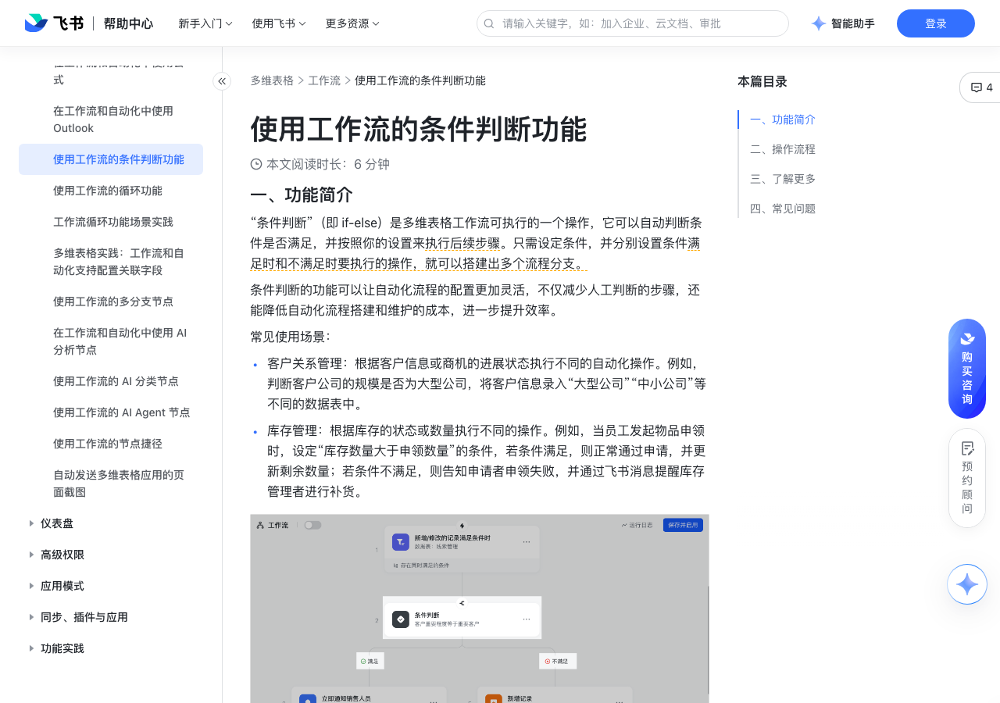

# 使用工作流的条件判断功能

> 来源：[飞书帮助中心](https://www.feishu.cn/hc/zh-CN/articles/425305456302)  
> 分类：多维表格 / 工作流  
> 抓取时间：2026-09-22T01:25:10.238Z

## 界面截图

### 文档内配图

1. 配图：https://p1-hera.feishucdn.com/tos-cn-i-jbbdkfciu3/7def8b1bdb224853869c8f1ce6a0d0fb~tplv-jbbdkfciu3-image:0:0.image
2. 配图：https://p1-hera.feishucdn.com/tos-cn-i-jbbdkfciu3/0cc216c7c6ae48819638974e8c5af36f~tplv-jbbdkfciu3-image:0:0.image
3. 配图：https://p1-hera.feishucdn.com/tos-cn-i-jbbdkfciu3/d39283d1e5714fef8c5655687325fe3b~tplv-jbbdkfciu3-image:0:0.image
4. 配图：https://p1-hera.feishucdn.com/tos-cn-i-jbbdkfciu3/61f2ecb11b784a27ad01b0ac47bba469~tplv-jbbdkfciu3-image:0:0.image
5. 配图：https://p1-hera.feishucdn.com/tos-cn-i-jbbdkfciu3/afb28e30ff7f4883b4545cb300844643~tplv-jbbdkfciu3-image:0:0.image
6. 配图：https://p1-hera.feishucdn.com/tos-cn-i-jbbdkfciu3/80680ac45c784e529a53a30d3460456f~tplv-jbbdkfciu3-image:0:0.image
7. 配图：https://p1-hera.feishucdn.com/tos-cn-i-jbbdkfciu3/4cc8fe55c1f940f38d9f0d5152cb7915~tplv-jbbdkfciu3-image:0:0.image
8. 配图：https://p1-hera.feishucdn.com/tos-cn-i-jbbdkfciu3/bcf8fe8ec1b44e158a431dc75dcdc755~tplv-jbbdkfciu3-image:0:0.image
9. 配图：https://p1-hera.feishucdn.com/tos-cn-i-jbbdkfciu3/498066db8bff400ebdc25cc9fa027c22~tplv-jbbdkfciu3-image:0:0.image
10. 配图：https://p1-hera.feishucdn.com/tos-cn-i-jbbdkfciu3/4916e1fbb7b346ddb388c2636cd8ba1e~tplv-jbbdkfciu3-image:0:0.image

## 功能定位

本页对应飞书帮助中心「多维表格 / 工作流」下的「使用工作流的条件判断功能」。以下需求描述依据官方说明文档提炼，用于指导 DuoWei 对标实现。

## 功能目标

一、功能简介

## 文档结构（官方章节）

- 一、功能简介​
- 二、操作流程​
- 三、了解更多​
- 四、常见问题​

## 详细功能说明

一、功能简介

客户关系管理：根据客户信息或商机的进展状态执行不同的自动化操作。例如，判断客户公司的规模是否为大型公司，将客户信息录入“大型公司”“中小公司”等不同的数据表中。

库存管理：根据库存的状态或数量执行不同的操作。例如，当员工发起物品申领时，设定“库存数量大于申领数量”的条件，若条件满足，则正常通过申请，并更新剩余数量；若条件不满足，则告知申请者申领失败，并通过飞书消息提醒库存管理者进行补货。

二、操作流程

打开一个多维表格，点击左下角的 工作流 来新建一个工作流页面。

设定好触发条件后，点击带有 就执行操作 字样的按钮，并选择 条件判断。如果你需要在已设定的步骤中插入一个“条件判断”操作，可以将鼠标悬停在流程连接线上，并点击出现的 + 图标 > 条件判断。

点击条件判断节点后，在右侧可以看到它的配置界面。在配置界面中，你可以设置一个或多个条件。如下图所示，一组[字段]+[运算条件]+[值]构成了一个完整的判断条件。在判断条件中，你可以引用变量和前序步骤中产生的数据。

条件判断可设置 并且（同时满足）和 或者（满足其一即可）的逻辑关系，满足更多需求。

注：在一个条件判断的操作中，“并且”和“或者”的所有判断条件，加起来最多可设置 10 个。

添加条件判断后，工作流会自动为你生成两个流程分支，左侧为 满足 时的分支，右侧为 不满足 时的分支。分别点击最下方的 + 图标来继续添加节点。

注：此处你仍然可以选择 条件判断 的执行操作，来实现嵌套。 一个工作流中，最多可存在 10 层“条件判断”的嵌套。以下图为例，图中展示了 6 层嵌套，最多可添加到 10 层。

250px|700px|reset

两条分支下的节点支持一键对调和清空。

将鼠标悬停在 满足 或 不满足 的字样上，点击 清空，可删除该分支下的所有节点。

将鼠标悬停在 条件判断 节点的下方，点击 移动两条分支下的操作 图标，即可将条件满足时的流程分支和条件不满足时的流程分支进行对调。

重命名或删除：

点击 条件判断 节点右侧的 ··· 图标，你可以对该节点进行 重命名 或 删除 的操作。当你删除一个 条件判断 节点时，其下方的所有节点和它本身都会被删除，且删除后不可恢复。

不同于其他的执行操作，“条件判断”不支持切换节点类型，也不支持创建副本。

拖拽移动位置：

条件判断节点支持拖拽移动位置。将鼠标悬停在想要移动的节点上，左键按住并拖拽节点即可改变节点位置。

当你移动一个 条件判断 节点时，其下方 满足 和 不满足 两条分支下的所有节点都会跟随移动。

注：如果移动的目标位置后面还有其他节点，那么后面的节点会自动被移动到“满足”分支下。

三、了解更多

四、常见问题

问：一个工作流中最多可以嵌套几层“条件判断”的执行操作？

答：一个工作流中，最多可存在 10 层“条件判断”的嵌套。以下图为例，图中展示了 6 层嵌套，最多可添加到 10 层。250px|700px|reset

问：在工作流条件判断的执行操作中，最多可以添加几个判断条件？

答：10 个。如下图所示，[字段]+[运算条件]+[值]可称为一个“判断条件”。在一个条件判断的操作中，并且 和 或者 两种逻辑下的条件相加，总共最多可设置 10 个条件。250px|700px|reset

问：工作流条件判断下的流程分支是否支持合并？

答：不支持。

问：工作流条件判断下的分支操作是否支持对调？

答：支持。将鼠标悬停在 条件判断 节点的下方，点击 移动两条分支下的操作 图标，即可将条件满足时的分支操作和条件不满足时的分支操作进行对调。250px|700px|reset

## 实现要点（对标 DuoWei）

1. **入口与信息架构**：在产品中明确该能力所属模块（工作流），并保证用户可从对应导航触达。
2. **核心交互**：按上文「详细功能说明」还原主要操作路径；截图中出现的按钮、字段、面板命名尽量与飞书语义一致或可映射。
3. **数据与权限**：若文档涉及可见范围、可编辑范围、分享或高级权限，实现时需落到角色/成员模型，并保证 API/MCP 与 UI 权限一致。
4. **边界与上限**：若文档提到数量上限、格式限制、导入导出约束，需在实现与错误提示中体现。
5. **验收**：以本页截图场景为用例，完成「能打开 / 能配置 / 能保存 / 能被 Agent 读写（如适用）」四项检查。

## 原始摘录摘要

> 一、功能简介 客户关系管理：根据客户信息或商机的进展状态执行不同的自动化操作。例如，判断客户公司的规模是否为大型公司，将客户信息录入“大型公司”“中小公司”等不同的数据表中。 库存管理：根据库存的状态或数量执行不同的操作。例如，当员工发起物品申领时，设定“库存数量大于申领数量”的条件，若条件满足，则正常通过申请，并更新剩余数量；若条件不满足，则告知申请者申领失败，并通过飞书消息提醒库存管理者进行补货。 二、操作流程 打开一个多维表格，点击左下角的 工作流 来新建一个工作流页面。 设定好触发条件后，点击带有 就执行操作 字样的按钮，并选择 条件判断。如果你需要在已设定的步骤中插入一个“条件判断”操作，可以将鼠标悬停在流程连接线上，并点击出现的 + 图标 > 条件判断。 点击条件判断节点后，在右侧可以看到它的配置界面。在配置界面中，你可以设置一个或多个条件。如下图所示，一组[字段]+[运算条件]+[值]构成了一个完整的判断条件。在判断条件中，你可以引用变量和前序步骤中产生的数据。 条件判断可设置 并且（同时满足）和 或者（满足其一即可）的逻辑关系，满足更多需求。 注：在一个条件判断的操作中，“并且”和“或者”的所有判断条件，加起来最多可设置 10 个。 添加条件判断后，工作流会自动为你生成两个流程分支，左侧为 满足 时的分支，右侧为 不满足 时的分支。分别点击最下方的 + 图标来继续添加节点。 注：此处你仍然可以选择 条件判断 的执行操作，来实现嵌套。 一个工作流中，最多可存在 10 层“条件判断”的嵌套。以下图为例，图中展示了 6 层嵌套，最多可添加到 10 层。 250px|700px|reset 两条分支下的节点支持一键对调和清空。 将鼠标悬停在 满足 或 不满足 的字样上，点击 清空，可删除该分支下的所有节点。 将鼠标悬停在 条件判断 节点的下方，点击 移动两条分支下的…

## 元数据

- article_id: `7402838809118834689`
- category_id: `7415964452380049412`
- path: `/hc/zh-CN/articles/425305456302`
- extracted_text_length: 1512
