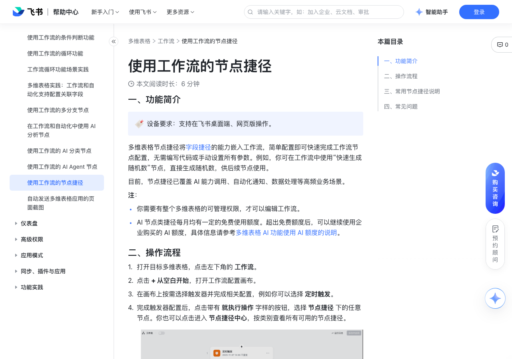

# 使用工作流的节点捷径

> 来源：[飞书帮助中心](https://www.feishu.cn/hc/zh-CN/articles/583057189738)  
> 分类：多维表格 / 工作流  
> 抓取时间：2026-09-22T01:25:12.505Z

## 界面截图

### 文档内配图

1. 配图：https://p1-hera.feishucdn.com/tos-cn-i-jbbdkfciu3/ae45436a31f746e69bd32b5f7f4e0ee4~tplv-jbbdkfciu3-image:0:0.image

## 功能定位

本页对应飞书帮助中心「多维表格 / 工作流」下的「使用工作流的节点捷径」。以下需求描述依据官方说明文档提炼，用于指导 DuoWei 对标实现。

## 功能目标

一、功能简介

## 文档结构（官方章节）

- 一、功能简介​
- 二、操作流程​
- 三、常用节点捷径说明​
- 四、常见问题​

## 详细功能说明

一、功能简介

你需要有整个多维表格的可管理权限，才可以编辑工作流。

AI 节点类捷径每月均有一定的免费使用额度。超出免费额度后，可以继续使用企业购买的 AI 额度，具体信息请参考多维表格 AI 功能使用 AI 额度的说明。

二、操作流程

打开目标多维表格，点击左下角的 工作流。

点击 + 从空白开始，打开工作流配置画布。

在画布上按需选择触发器并完成相关配置，例如你可以选择 定时触发。

完成触发器配置后，点击带有 就执行操作 字样的按钮，选择 节点捷径 下的任意节点。你也可以点击进入 节点捷径中心，按类别查看所有可用的节点捷径。

选中节点捷径，在右侧弹窗中进行快速配置。

保存并启用工作流。流程启动后，只要满足触发条件，节点捷径操作就会自动执行，不需要人工干预。

三、常用节点捷径说明

节点捷径

应用场景

参考模板（仅为部分复杂场景提供模板）

发送企业微信群机器人消息

自动向指定的企业微信群发送消息。

项目管理-发送企业微信群消息：通过此模板，你可以在多维表格里管理消息内容。勾选“发送消息”后，对应的消息内容会自动发送到对应的微信群。

发送钉钉群机器人消息

自动向指定的钉钉群发送消息。

项目管理-发送钉钉群消息：通过此模板，你可以在多维表格里管理消息内容。勾选“发送消息”后，对应的消息内容会自动发送到对应的钉钉群。

简易公式（Excel）

使用常用的 Excel 公式处理流程中的数据。

简易公式-投票：通过此模板，你可以使用表单收集团建地址投票，投票结果会自动汇总。

文本转数组

根据特定分隔符（如空格、/）将文本转成数组，可用作后续的循环操作。

文本转数组-循环创建记录：通过此模板，你可以自动拆分涉及多个模块的营销活动，为每个模块的营销活动单独创建一条记录，便于后续跟进各模块的活动进度。

数据转换器

快速进行数据提取、转换和生成，如提取文本中的 URL。

JSON 提取器

从 JSON 字符串中提取指定字段的值。

排版打印 - 生成文档

使用多维表格内的数据，快速生成具有专业外观的排版，并可灵活调整布局，所见即所得。

二维码生成

选择字段内容及样式，生成对应的二维码图片。

随机数生成

生成指定范围内的随机数。

短链接生成器

将长链接转为短链接，可用于追踪链接点击数据。

Deepseek R1（不同版本）

通过不同版本的 DeepSeek 执行自定义指令，满足各类业务场景。

豆包 1.6（多模态+深度思考）

通过豆包最新的 1.6 模型执行自定义指令，支持理解多模态内容（图片和视频）和深度思考。

AI 搜索

输入问题，使用 AI 进行搜索。

AI 搜索-定时推送消息：通过此模板，你可以在多维表格内管理话题和对应的关注人，AI 会自动检索相关新闻，并定时推送给关注人。

AI 读取网页链接

根据用户提供的 URL 和自定义指令，智能地访问和处理网页内容。

AI 生成图片（豆包）

利用最新的豆包生图模型，依据给定的中文或英文文字描述，自动生成对应的图像。

扣子工作流调用

调用扣子工作流，实现扣子工作流的自动化执行和数据处理。

四、常见问题

问：我可以自定义工作流中的节点捷径吗？

答：可以。进入多维表格工作流，在添加节点的面板打开 节点捷径，进入节点捷径中心。点击左下角 + 添加自定义捷径，参考开发指南开发专属节点捷径，满足个性化业务需求。250px|700px|reset

节点捷径 | 应用场景 | 参考模板（仅为部分复杂场景提供模板）

发送企业微信群机器人消息 | 自动向指定的企业微信群发送消息。 | 项目管理-发送企业微信群消息：通过此模板，你可以在多维表格里管理消息内容。勾选“发送消息”后，对应的消息内容会自动发送到对应的微信群。

发送钉钉群机器人消息 | 自动向指定的钉钉群发送消息。 | 项目管理-发送钉钉群消息：通过此模板，你可以在多维表格里管理消息内容。勾选“发送消息”后，对应的消息内容会自动发送到对应的钉钉群。

简易公式（Excel） | 使用常用的 Excel 公式处理流程中的数据。 | 简易公式-投票：通过此模板，你可以使用表单收集团建地址投票，投票结果会自动汇总。

文本转数组 | 根据特定分隔符（如空格、/）将文本转成数组，可用作后续的循环操作。 | 文本转数组-循环创建记录：通过此模板，你可以自动拆分涉及多个模块的营销活动，为每个模块的营销活动单独创建一条记录，便于后续跟进各模块的活动进度。

数据转换器 | 快速进行数据提取、转换和生成，如提取文本中的 URL。 | 无

JSON 提取器 | 从 JSON 字符串中提取指定字段的值。 | 无

排版打印 - 生成文档 | 使用多维表格内的数据，快速生成具有专业外观的排版，并可灵活调整布局，所见即所得。 | 无

二维码生成 | 选择字段内容及样式，生成对应的二维码图片。 | 无

随机数生成 | 生成指定范围内的随机数。 | 无

短链接生成器 | 将长链接转为短链接，可用于追踪链接点击数据。 | 无

Deepseek R1（不同版本） | 通过不同版本的 DeepSeek 执行自定义指令，满足各类业务场景。 | 无

豆包 1.6（多模态+深度思考） | 通过豆包最新的 1.6 模型执行自定义指令，支持理解多模态内容（图片和视频）和深度思考。 | 无

AI 搜索 | 输入问题，使用 AI 进行搜索。 | AI 搜索-定时推送消息：通过此模板，你可以在多维表格内管理话题和对应的关注人，AI 会自动检索相关新闻，并定时推送给关注人。

AI 读取网页链接 | 根据用户提供的 URL 和自定义指令，智能地访问和处理网页内容。 | 无

AI 生成图片（豆包） | 利用最新的豆包生图模型，依据给定的中文或英文文字描述，自动生成对应的图像。 | 无

扣子工作流调用 | 调用扣子工作流，实现扣子工作流的自动化执行和数据处理。 | 无

## 实现要点（对标 DuoWei）

1. **入口与信息架构**：在产品中明确该能力所属模块（工作流），并保证用户可从对应导航触达。
2. **核心交互**：按上文「详细功能说明」还原主要操作路径；截图中出现的按钮、字段、面板命名尽量与飞书语义一致或可映射。
3. **数据与权限**：若文档涉及可见范围、可编辑范围、分享或高级权限，实现时需落到角色/成员模型，并保证 API/MCP 与 UI 权限一致。
4. **边界与上限**：若文档提到数量上限、格式限制、导入导出约束，需在实现与错误提示中体现。
5. **验收**：以本页截图场景为用例，完成「能打开 / 能配置 / 能保存 / 能被 Agent 读写（如适用）」四项检查。

## 原始摘录摘要

> 一、功能简介 你需要有整个多维表格的可管理权限，才可以编辑工作流。 AI 节点类捷径每月均有一定的免费使用额度。超出免费额度后，可以继续使用企业购买的 AI 额度，具体信息请参考多维表格 AI 功能使用 AI 额度的说明。 二、操作流程 打开目标多维表格，点击左下角的 工作流。 点击 + 从空白开始，打开工作流配置画布。 在画布上按需选择触发器并完成相关配置，例如你可以选择 定时触发。 完成触发器配置后，点击带有 就执行操作 字样的按钮，选择 节点捷径 下的任意节点。你也可以点击进入 节点捷径中心，按类别查看所有可用的节点捷径。 选中节点捷径，在右侧弹窗中进行快速配置。 保存并启用工作流。流程启动后，只要满足触发条件，节点捷径操作就会自动执行，不需要人工干预。 三、常用节点捷径说明 节点捷径 应用场景 参考模板（仅为部分复杂场景提供模板） 发送企业微信群机器人消息 自动向指定的企业微信群发送消息。 项目管理-发送企业微信群消息：通过此模板，你可以在多维表格里管理消息内容。勾选“发送消息”后，对应的消息内容会自动发送到对应的微信群。 发送钉钉群机器人消息 自动向指定的钉钉群发送消息。 项目管理-发送钉钉群消息：通过此模板，你可以在多维表格里管理消息内容。勾选“发送消息”后，对应的消息内容会自动发送到对应的钉钉群。 简易公式（Excel） 使用常用的 Excel 公式处理流程中的数据。 简易公式-投票：通过此模板，你可以使用表单收集团建地址投票，投票结果会自动汇总。 文本转数组 根据特定分隔符（如空格、/）将文本转成数组，可用作后续的循环操作。 文本转数组-循环创建记录：通过此模板，你可以自动拆分涉及多个模块的营销活动，为每个模块的营销活动单独创建一条记录，便于后续跟进各模块的活动进度。 数据转换器 快速进行数据提取、转换和生成，如提取文本中的 URL。 JSON 提取器 从 …

## 元数据

- article_id: `7566556832811515908`
- category_id: `7415964452380049412`
- path: `/hc/zh-CN/articles/583057189738`
- extracted_text_length: 2429
