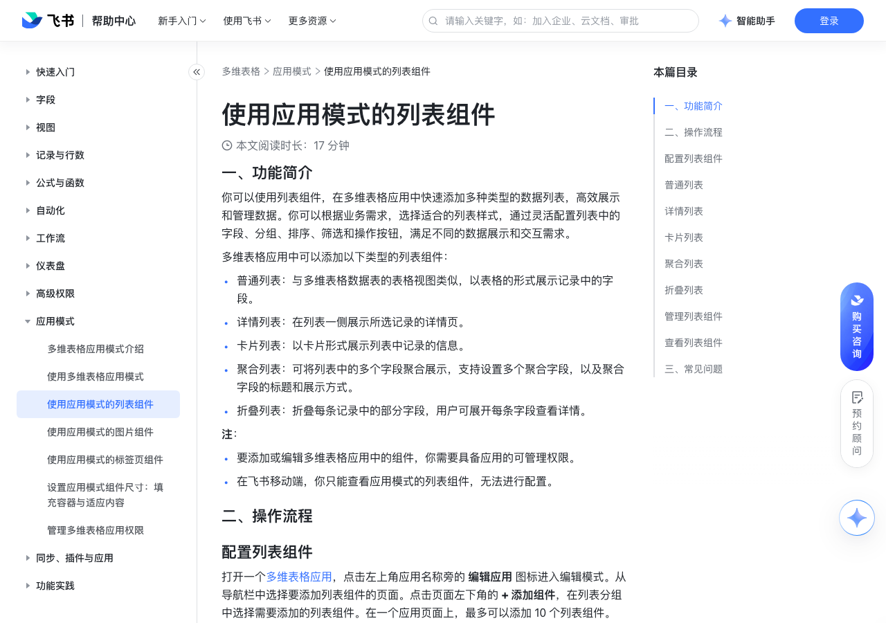

# 使用应用模式的列表组件

> 来源：[飞书帮助中心](https://www.feishu.cn/hc/zh-CN/articles/470339519167)  
> 分类：多维表格 / 应用模式  
> 抓取时间：2026-09-22T01:26:32.566Z

## 界面截图

### 文档内配图

1. 配图：https://p1-hera.feishucdn.com/tos-cn-i-jbbdkfciu3/32bde25eeb764403ae952bdd2413b0ee~tplv-jbbdkfciu3-image:0:0.image
2. 配图：https://p1-hera.feishucdn.com/tos-cn-i-jbbdkfciu3/5afc1effef974354be057a665ba12d76~tplv-jbbdkfciu3-image:0:0.image
3. 配图：https://p1-hera.feishucdn.com/tos-cn-i-jbbdkfciu3/5d80d52ab41d4a498cd83c65d4ecc743~tplv-jbbdkfciu3-image:0:0.image
4. 配图：https://p1-hera.feishucdn.com/tos-cn-i-jbbdkfciu3/f289aa0f3c4b4bdbb00b0babb3886d32~tplv-jbbdkfciu3-image:0:0.image
5. 配图：https://p1-hera.feishucdn.com/tos-cn-i-jbbdkfciu3/e57fe0776cf64269b306a395ae9ba75a~tplv-jbbdkfciu3-image:0:0.image

## 功能定位

本页对应飞书帮助中心「多维表格 / 应用模式」下的「使用应用模式的列表组件」。以下需求描述依据官方说明文档提炼，用于指导 DuoWei 对标实现。

## 功能目标

一、功能简介

## 文档结构（官方章节）

- 一、功能简介​
- 二、操作流程​
- 配置列表组件​
- 普通列表​
- 详情列表​
- 卡片列表​
- 聚合列表​
- 折叠列表​
- 管理列表组件​
- 查看列表组件​
- 三、常见问题​

## 详细功能说明

一、功能简介

普通列表：与多维表格数据表的表格视图类似，以表格的形式展示记录中的字段。

详情列表：在列表一侧展示所选记录的详情页。

卡片列表：以卡片形式展示列表中记录的信息。

聚合列表：可将列表中的多个字段聚合展示，支持设置多个聚合字段，以及聚合字段的标题和展示方式。

折叠列表：折叠每条记录中的部分字段，用户可展开每条字段查看详情。

要添加或编辑多维表格应用中的组件，你需要具备应用的可管理权限。

在飞书移动端，你只能查看应用模式的列表组件，无法进行配置。

二、操作流程

配置列表组件

标题：选择是否展示标题并按需修改标题。

多维表格数据表：选择多维表格中的一个数据表作为数据源。你可以选择应用所在多维表格空间中，你拥有可管理权限的任意多维表格数据表。如果没有符合条件的数据表，则无法创建列表组件。

数据范围：在源数据表中指定数据范围。默认范围为数据表的全部数据，可点击数据范围选择框设定筛选条件。在 设置筛选条件 弹窗中，可添加多个条件。在弹窗右上角可选择筛选出满足任意条件或所有条件的记录。

普通列表

基础配置

自定义配置

配置列表中的字段：拖拽字段调整顺序。点击字段右侧的 眼睛 图标，选择显示或隐藏该字段。注：在完成配置后，源数据表中新增的字段默认隐藏。如果需要创建聚合字段，点击字段列表右上角的 + 创建聚合字段，或点击字段右侧的 ··· 图标 > 创建聚合字段。注：聚合字段可将多个字段聚合在一起显示。输入字段标题并在右下角选择是否展示字段名。如果数据表中存在存储图片的附件字段，可以在 图片 中选择该字段，并选择图片展示尺寸。选择要聚合的字段。最多可选择 5 个字段。选择是否突出首个字段。配置完成后点击 确定。可按照上述方式继续添加多个聚合字段。设置操作列：选择是否显示源数据表中的按钮字段，并设置按钮的显示条件。如果选择了显示某个按钮字段，则该字段会出现在列表组件的 操作 列中。你还可以设置按钮在记录中被展示的条件，如果添加多个条件，需选择显示满足所有或任意条件的按钮。注：使用者需要对按钮字段和记录拥有可阅读权限，才能查看和点击记录中的按钮。默认分组：设置记录默认的分组方式，点击输入框 > + 添加条件，选择用来分组的字段和排序方式，可以选择多个字段，进行嵌套分组。默认排序：设置记录默认的排序方式，点击输入框 > + 添加条件，选择用来排序的字段和排序方式，可以选择多个字段，进行嵌套排序。

配置列表中的字段：

拖拽字段调整顺序。

点击字段右侧的 眼睛 图标，选择显示或隐藏该字段。

注：在完成配置后，源数据表中新增的字段默认隐藏。

如果需要创建聚合字段，点击字段列表右上角的 + 创建聚合字段，或点击字段右侧的 ··· 图标 > 创建聚合字段。

注：聚合字段可将多个字段聚合在一起显示。

输入字段标题并在右下角选择是否展示字段名。

如果数据表中存在存储图片的附件字段，可以在 图片 中选择该字段，并选择图片展示尺寸。

选择要聚合的字段。最多可选择 5 个字段。

选择是否突出首个字段。

配置完成后点击 确定。可按照上述方式继续添加多个聚合字段。

设置操作列：选择是否显示源数据表中的按钮字段，并设置按钮的显示条件。

如果选择了显示某个按钮字段，则该字段会出现在列表组件的 操作 列中。

你还可以设置按钮在记录中被展示的条件，如果添加多个条件，需选择显示满足所有或任意条件的按钮。

注：使用者需要对按钮字段和记录拥有可阅读权限，才能查看和点击记录中的按钮。

默认分组：设置记录默认的分组方式，点击输入框 > + 添加条件，选择用来分组的字段和排序方式，可以选择多个字段，进行嵌套分组。

默认排序：设置记录默认的排序方式，点击输入框 > + 添加条件，选择用来排序的字段和排序方式，可以选择多个字段，进行嵌套排序。

顶部栏中展示的功能或按钮；可开启或关闭筛选、分组、排序、搜索功能。是否允许添加记录：如果开启，可设置按钮显示的文字。自定义按钮：可添加多个按钮，并为每个按钮设置展示文字和点击时执行的操作。在输入框中输入按钮上展示的文字。点击右侧 齿轮 图标，展开 执行操作 菜单，可选操作如下：跳转页面：跳转至应用中的其他页面，需选择页面。跳转链接：跳转至指定链接，需输入链接。执行自动化/执行工作流：执行多维表格数据源中设置的可被按钮组件触发的自定义自动化流程或工作流。你也可以新建自动化或工作流。注：选择 推荐 板块下的推荐流程，将基于模板，创建新的自动化流程。你可以在选项下方查看操作示意图，点击右侧的 跳转 图标打开自动化或工作流配置界面，还可以点击 ··· 图标，查看运行日志或将操作解绑。列表区展示的功能或按钮：是否使用分页器。注：如果设置了记录分组，则不支持展示分页器。是否允许查看记录详情页。是否允许删除记录。展开行记录：是否可以展开按列查看记录详情。可选择单列展示或多列展示，再选择要展示的字段。

顶部栏中展示的功能或按钮；

可开启或关闭筛选、分组、排序、搜索功能。

是否允许添加记录：如果开启，可设置按钮显示的文字。

自定义按钮：可添加多个按钮，并为每个按钮设置展示文字和点击时执行的操作。

在输入框中输入按钮上展示的文字。

点击右侧 齿轮 图标，展开 执行操作 菜单，可选操作如下：

跳转页面：跳转至应用中的其他页面，需选择页面。

跳转链接：跳转至指定链接，需输入链接。

执行自动化/执行工作流：执行多维表格数据源中设置的可被按钮组件触发的自定义自动化流程或工作流。你也可以新建自动化或工作流。

选择 推荐 板块下的推荐流程，将基于模板，创建新的自动化流程。

你可以在选项下方查看操作示意图，点击右侧的 跳转 图标打开自动化或工作流配置界面，还可以点击 ··· 图标，查看运行日志或将操作解绑。

列表区展示的功能或按钮：

是否使用分页器。

注：如果设置了记录分组，则不支持展示分页器。

是否允许查看记录详情页。

是否允许删除记录。

展开行记录：是否可以展开按列查看记录详情。可选择单列展示或多列展示，再选择要展示的字段。

详情列表

如果数据表中存在存储图片的附件字段，可以在 图片 中选择该字段，并选择图片展示尺寸。配置列表中的字段：拖拽字段调整顺序。点击字段右侧的 眼睛 图标，选择显示或隐藏该字段。是否突出首个字段。是否展示字段名。默认排序：设置记录默认的排序方式，点击输入框 > + 添加条件，选择用来排序的字段和排序方式，可以选择多个字段，进行嵌套排序。

是否突出首个字段。

是否展示字段名。

顶部栏中展示的功能或按钮；可开启或关闭筛选、排序、搜索功能。是否允许添加记录：如果开启，可设置按钮显示的文字。自定义按钮：可添加多个按钮，并为每个按钮设置展示文字和点击时执行的操作。在输入框中输入按钮上展示的文字。点击右侧 齿轮 图标，展开 执行操作 菜单，可选操作如下：跳转页面：跳转至应用中的其他页面，需选择页面。跳转链接：跳转至指定链接，需输入链接。执行自动化/执行工作流：执行多维表格数据源中设置的可被按钮组件触发的自定义自动化流程或工作流。你也可以新建自动化或工作流。注：选择 推荐 板块下的推荐流程，将基于模板，创建新的自动化流程。你可以在选项下方查看操作示意图，点击右侧的 跳转 图标打开自动化或工作流配置界面，还可以点击 ··· 图标，查看运行日志或将操作解绑。列表区展示的功能或按钮：是否使用分页器。注：如果设置了记录分组，则不支持展示分页器。是否允许删除记录。

可开启或关闭筛选、排序、搜索功能。

卡片列表

选择作为卡片标题的字段。如果数据表中存在存储图片的附件字段，可以在 图片 中选择该字段，并选择图片展示尺寸。配置列表中的字段：拖拽字段调整顺序。点击字段右侧的 眼睛 图标，选择显示或隐藏该字段。设置操作列：选择是否显示源数据表中的按钮字段，并设置按钮的显示条件。如果选择了显示某个按钮字段，则该字段会出现在列表组件的 操作 列中。你还可以设置按钮在记录中被展示的条件，如果添加多个条件，需选择显示满足所有或任意条件的按钮。注：使用者需要对按钮字段和记录拥有可阅读权限，才能查看和点击记录中的按钮。展示模式：单列或双列展示。字段展示样式：字段名和值的排布方式，可选左右排布或上下排布是否展示字段名。默认排序：设置记录默认的排序方式，点击输入框 > + 添加条件，选择用来排序的字段和排序方式，可以选择多个字段，进行嵌套排序。

选择作为卡片标题的字段。

展示模式：单列或双列展示。

字段展示样式：字段名和值的排布方式，可选左右排布或上下排布

顶部栏中展示的功能或按钮；可开启或关闭筛选、排序、搜索功能。是否允许添加记录：如果开启，可设置按钮显示的文字。自定义按钮：可添加多个按钮，并为每个按钮设置展示文字和点击时执行的操作。在输入框中输入按钮上展示的文字。点击右侧 齿轮 图标，展开 执行操作 菜单，可选操作如下：跳转页面：跳转至应用中的其他页面，需选择页面。跳转链接：跳转至指定链接，需输入链接。执行自动化/执行工作流：执行多维表格数据源中设置的可被按钮组件触发的自定义自动化流程或工作流。你也可以新建自动化或工作流。注：选择 推荐 板块下的推荐流程，将基于模板，创建新的自动化流程。你可以在选项下方查看操作示意图，点击右侧的 跳转 图标打开自动化或工作流配置界面，还可以点击 ··· 图标，查看运行日志或将操作解绑。列表区展示的功能或按钮：是否使用分页器。注：如果设置了记录分组，则不支持展示分页器。是否允许查看记录详情页。是否允许删除记录。

聚合列表

基础配置：参考普通列表的基础配置方式进行配置。

自定义配置：

顶部栏中展示的功能或按钮：

是否可以展开行记录：如选择可展开，可继续设置：

展开时显示的字段及顺序。

字段展示样式：字段名和值排布方式，可选左右或上下排布。

折叠列表

管理列表组件

查看列表组件

三、常见问题

问：为什么我在页面上无法添加更多的列表组件？

答：单页面最多支持添加 10 个列表组件。超出上限后将无法继续添加。

问：我可以调整列表组件的列宽吗？

答：可以，可以通过拖拽调整列表中的列宽。创建者调整后，非创建者用户在使用时将按照调整后的列宽显示。但如果非创建者用户调整了列宽，则后续将按照用户自己的列宽设置展示。

基础配置 | 自定义配置

配置列表中的字段：拖拽字段调整顺序。点击字段右侧的 眼睛 图标，选择显示或隐藏该字段。注：在完成配置后，源数据表中新增的字段默认隐藏。如果需要创建聚合字段，点击字段列表右上角的 + 创建聚合字段，或点击字段右侧的 ··· 图标 > 创建聚合字段。注：聚合字段可将多个字段聚合在一起显示。输入字段标题并在右下角选择是否展示字段名。如果数据表中存在存储图片的附件字段，可以在 图片 中选择该字段，并选择图片展示尺寸。选择要聚合的字段。最多可选择 5 个字段。选择是否突出首个字段。配置完成后点击 确定。可按照上述方式继续添加多个聚合字段。设置操作列：选择是否显示源数据表中的按钮字段，并设置按钮的显示条件。如果选择了显示某个按钮字段，则该字段会出现在列表组件的 操作 列中。你还可以设置按钮在记录中被展示的条件，如果添加多个条件，需选择显示满足所有或任意条件的按钮。注：使用者需要对按钮字段和记录拥有可阅读权限，才能查看和点击记录中的按钮。默认分组：设置记录默认的分组方式，点击输入框 > + 添加条件，选择用来分组的字段和排序方式，可以选择多个字段，进行嵌套分组。默认排序：设置记录默认的排序方式，点击输入框 > + 添加条件，选择用来排序的字段和排序方式，可以选择多个字段，进行嵌套排序。 | 顶部栏中展示的功能或按钮；可开启或关闭筛选、分组、排序、搜索功能。是否允许添加记录：如果开启，可设置按钮显示的文字。自定义按钮：可添加多个按钮，并为每个按钮设置展示文字和点击时执行的操作。在输入框中输入按钮上展示的文字。点击右侧 齿轮 图标，展开 执行操作 菜单，可选操作如下：跳转页面：跳转至应用中的其他页面，需选择页面。跳转链接：跳转至指定链接，需输入链接。执行自动化/执行工作流：执行多维表格数据源中设置的可被按钮组件触发的自定义自动化流程或工作流。你也可以新建自动化或工作流。注：选择 推荐 板块下的推荐流程，将基于模板，创建新的自动化流程。你可以在选项下方查看操作示意图，点击右侧的 跳转 图标打开自动化或工作流配置界面，还可以点击 ··· 图标，查看运行日志或将操作解绑。列表区展示的功能或按钮：是否使用分页器。注：如果设置了记录分组，则不支持展示分页器。是否允许查看记录详情页。是否允许删除记录。展开行记录：是否可以展开按列查看记录详情。可选择单列展示或多列展示，再选择要展示的字段。

如果数据表中存在存储图片的附件字段，可以在 图片 中选择该字段，并选择图片展示尺寸。配置列表中的字段：拖拽字段调整顺序。点击字段右侧的 眼睛 图标，选择显示或隐藏该字段。是否突出首个字段。是否展示字段名。默认排序：设置记录默认的排序方式，点击输入框 > + 添加条件，选择用来排序的字段和排序方式，可以选择多个字段，进行嵌套排序。 | 顶部栏中展示的功能或按钮；可开启或关闭筛选、排序、搜索功能。是否允许添加记录：如果开启，可设置按钮显示的文字。自定义按钮：可添加多个按钮，并为每个按钮设置展示文字和点击时执行的操作。在输入框中输入按钮上展示的文字。点击右侧 齿轮 图标，展开 执行操作 菜单，可选操作如下：跳转页面：跳转至应用中的其他页面，需选择页面。跳转链接：跳转至指定链接，需输入链接。执行自动化/执行工作流：执行多维表格数据源中设置的可被按钮组件触发的自定义自动化流程或工作流。你也可以新建自动化或工作流。注：选择 推荐 板块下的推荐流程，将基于模板，创建新的自动化流程。你可以在选项下方查看操作示意图，点击右侧的 跳转 图标打开自动化或工作流配置界面，还可以点击 ··· 图标，查看运行日志或将操作解绑。列表区展示的功能或按钮：是否使用分页器。注：如果设置了记录分组，则不支持展示分页器。是否允许删除记录。

选择作为卡片标题的字段。如果数据表中存在存储图片的附件字段，可以在 图片 中选择该字段，并选择图片展示尺寸。配置列表中的字段：拖拽字段调整顺序。点击字段右侧的 眼睛 图标，选择显示或隐藏该字段。设置操作列：选择是否显示源数据表中的按钮字段，并设置按钮的显示条件。如果选择了显示某个按钮字段，则该字段会出现在列表组件的 操作 列中。你还可以设置按钮在记录中被展示的条件，如果添加多个条件，需选择显示满足所有或任意条件的按钮。注：使用者需要对按钮字段和记录拥有可阅读权限，才能查看和点击记录中的按钮。展示模式：单列或双列展示。字段展示样式：字段名和值的排布方式，可选左右排布或上下排布是否展示字段名。默认排序：设置记录默认的排序方式，点击输入框 > + 添加条件，选择用来排序的字段和排序方式，可以选择多个字段，进行嵌套排序。 | 顶部栏中展示的功能或按钮；可开启或关闭筛选、排序、搜索功能。是否允许添加记录：如果开启，可设置按钮显示的文字。自定义按钮：可添加多个按钮，并为每个按钮设置展示文字和点击时执行的操作。在输入框中输入按钮上展示的文字。点击右侧 齿轮 图标，展开 执行操作 菜单，可选操作如下：跳转页面：跳转至应用中的其他页面，需选择页面。跳转链接：跳转至指定链接，需输入链接。执行自动化/执行工作流：执行多维表格数据源中设置的可被按钮组件触发的自定义自动化流程或工作流。你也可以新建自动化或工作流。注：选择 推荐 板块下的推荐流程，将基于模板，创建新的自动化流程。你可以在选项下方查看操作示意图，点击右侧的 跳转 图标打开自动化或工作流配置界面，还可以点击 ··· 图标，查看运行日志或将操作解绑。列表区展示的功能或按钮：是否使用分页器。注：如果设置了记录分组，则不支持展示分页器。是否允许查看记录详情页。是否允许删除记录。

## 实现要点（对标 DuoWei）

1. **入口与信息架构**：在产品中明确该能力所属模块（应用模式），并保证用户可从对应导航触达。
2. **核心交互**：按上文「详细功能说明」还原主要操作路径；截图中出现的按钮、字段、面板命名尽量与飞书语义一致或可映射。
3. **数据与权限**：若文档涉及可见范围、可编辑范围、分享或高级权限，实现时需落到角色/成员模型，并保证 API/MCP 与 UI 权限一致。
4. **边界与上限**：若文档提到数量上限、格式限制、导入导出约束，需在实现与错误提示中体现。
5. **验收**：以本页截图场景为用例，完成「能打开 / 能配置 / 能保存 / 能被 Agent 读写（如适用）」四项检查。

## 原始摘录摘要

> 一、功能简介 普通列表：与多维表格数据表的表格视图类似，以表格的形式展示记录中的字段。 详情列表：在列表一侧展示所选记录的详情页。 卡片列表：以卡片形式展示列表中记录的信息。 聚合列表：可将列表中的多个字段聚合展示，支持设置多个聚合字段，以及聚合字段的标题和展示方式。 折叠列表：折叠每条记录中的部分字段，用户可展开每条字段查看详情。 要添加或编辑多维表格应用中的组件，你需要具备应用的可管理权限。 在飞书移动端，你只能查看应用模式的列表组件，无法进行配置。 二、操作流程 配置列表组件 标题：选择是否展示标题并按需修改标题。 多维表格数据表：选择多维表格中的一个数据表作为数据源。你可以选择应用所在多维表格空间中，你拥有可管理权限的任意多维表格数据表。如果没有符合条件的数据表，则无法创建列表组件。 数据范围：在源数据表中指定数据范围。默认范围为数据表的全部数据，可点击数据范围选择框设定筛选条件。在 设置筛选条件 弹窗中，可添加多个条件。在弹窗右上角可选择筛选出满足任意条件或所有条件的记录。 普通列表 基础配置 自定义配置 配置列表中的字段：拖拽字段调整顺序。点击字段右侧的 眼睛 图标，选择显示或隐藏该字段。注：在完成配置后，源数据表中新增的字段默认隐藏。如果需要创建聚合字段，点击字段列表右上角的 + 创建聚合字段，或点击字段右侧的 ··· 图标 > 创建聚合字段。注：聚合字段可将多个字段聚合在一起显示。输入字段标题并在右下角选择是否展示字段名。如果数据表中存在存储图片的附件字段，可以在 图片 中选择该字段，并选择图片展示尺寸。选择要聚合的字段。最多可选择 5 个字段。选择是否突出首个字段。配置完成后点击 确定。可按照上述方式继续添加多个聚合字段。设置操作列：选择是否显示源数据表中的按钮字段，并设置按钮的显示条件。如果选择了显示某个按钮字段，则该字段会出现在列表组件的 操作 列中。…

## 元数据

- article_id: `7549189314673262593`
- category_id: `7550306356478574620`
- path: `/hc/zh-CN/articles/470339519167`
- extracted_text_length: 6545
