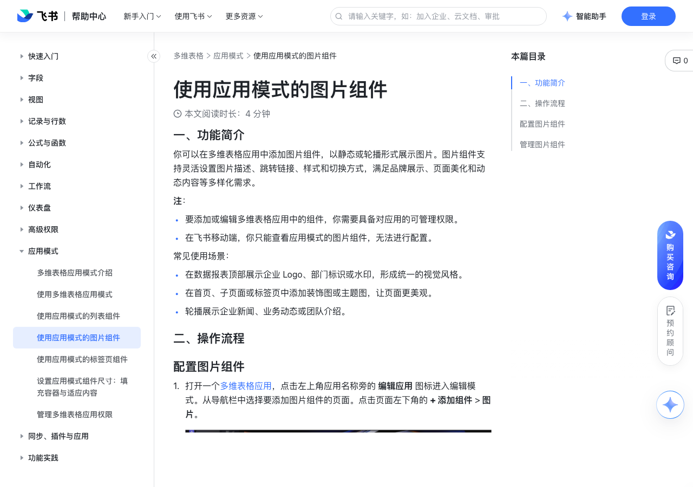

# 使用应用模式的图片组件

> 来源：[飞书帮助中心](https://www.feishu.cn/hc/zh-CN/articles/863432416278)  
> 分类：多维表格 / 应用模式  
> 抓取时间：2026-09-22T01:26:32.470Z

## 界面截图

### 文档内配图

1. 配图：https://p1-hera.feishucdn.com/tos-cn-i-jbbdkfciu3/2846f391cff848d992572ff88dabb3a1~tplv-jbbdkfciu3-image:0:0.image
2. 配图：https://p1-hera.feishucdn.com/tos-cn-i-jbbdkfciu3/10d6ae2668384b4385196d9376e301b6~tplv-jbbdkfciu3-image:0:0.image
3. 配图：https://p1-hera.feishucdn.com/tos-cn-i-jbbdkfciu3/f19455d1e0cb4b92b404142f725b4771~tplv-jbbdkfciu3-image:0:0.image
4. 配图：https://p1-hera.feishucdn.com/tos-cn-i-jbbdkfciu3/23e5692e55264e738d08f27065bd453e~tplv-jbbdkfciu3-image:0:0.image

## 功能定位

本页对应飞书帮助中心「多维表格 / 应用模式」下的「使用应用模式的图片组件」。以下需求描述依据官方说明文档提炼，用于指导 DuoWei 对标实现。

## 功能目标

一、功能简介

## 文档结构（官方章节）

- 一、功能简介​
- 二、操作流程​
- 配置图片组件​
- 管理图片组件​

## 详细功能说明

一、功能简介

要添加或编辑多维表格应用中的组件，你需要具备对应用的可管理权限。

在飞书移动端，你只能查看应用模式的图片组件，无法进行配置。

在数据报表顶部展示企业 Logo、部门标识或水印，形成统一的视觉风格。

在首页、子页面或标签页中添加装饰图或主题图，让页面更美观。

轮播展示企业新闻、业务动态或团队介绍。

二、操作流程

配置图片组件

打开一个多维表格应用，点击左上角应用名称旁的 编辑应用 图标进入编辑模式。从导航栏中选择要添加图片组件的页面。点击页面左下角的 + 添加组件 > 图片。

250px|700px|reset

在右侧配置面板的基础配置标签页上，配置以下选项：

图片组件的标题以及是否展示标题

图片配置：

点击下方 + 添加图片，从本地文件中选择要添加的图片。支持 JPG、JPEG、PNG、GIF、WEBP、SVG 等多种格式，单张图片大小不能超过 20 MB。最多可添加 20 张图片，你可在 自定义配置 中选择是否轮播图片和轮播速度。

点击图片右侧的 编辑 图标，为图片添加文字描述和跳转链接。文字描述将展示在图片上，如果设置了跳转链接，点击图片后会跳转至对应链接。

拖拽图片左侧的 ⋮⋮ 图标，调整图片顺序。

在自定义配置标签页中，设置以下选项：

背景：图片组件的背景色，如果图片填充方式选择了 适应，图片可能不会填满组件，此时图片周围会显示背景色。

文字样式：图片中文字的样式。

文字位置：文字在图片中的位置，选择一个位置，文字将展示在图片的对应位置。

图片填充方式：支持填充、适应和拉伸。

图片不透明度

图片切换动画：选择 滑动 切换或 淡入淡出 切换。

是否自动轮播图片，以及每张图片展示的时间。

管理图片组件

## 实现要点（对标 DuoWei）

1. **入口与信息架构**：在产品中明确该能力所属模块（应用模式），并保证用户可从对应导航触达。
2. **核心交互**：按上文「详细功能说明」还原主要操作路径；截图中出现的按钮、字段、面板命名尽量与飞书语义一致或可映射。
3. **数据与权限**：若文档涉及可见范围、可编辑范围、分享或高级权限，实现时需落到角色/成员模型，并保证 API/MCP 与 UI 权限一致。
4. **边界与上限**：若文档提到数量上限、格式限制、导入导出约束，需在实现与错误提示中体现。
5. **验收**：以本页截图场景为用例，完成「能打开 / 能配置 / 能保存 / 能被 Agent 读写（如适用）」四项检查。

## 原始摘录摘要

> 一、功能简介 要添加或编辑多维表格应用中的组件，你需要具备对应用的可管理权限。 在飞书移动端，你只能查看应用模式的图片组件，无法进行配置。 在数据报表顶部展示企业 Logo、部门标识或水印，形成统一的视觉风格。 在首页、子页面或标签页中添加装饰图或主题图，让页面更美观。 轮播展示企业新闻、业务动态或团队介绍。 二、操作流程 配置图片组件 打开一个多维表格应用，点击左上角应用名称旁的 编辑应用 图标进入编辑模式。从导航栏中选择要添加图片组件的页面。点击页面左下角的 + 添加组件 > 图片。 250px|700px|reset 在右侧配置面板的基础配置标签页上，配置以下选项： 图片组件的标题以及是否展示标题 图片配置： 点击下方 + 添加图片，从本地文件中选择要添加的图片。支持 JPG、JPEG、PNG、GIF、WEBP、SVG 等多种格式，单张图片大小不能超过 20 MB。最多可添加 20 张图片，你可在 自定义配置 中选择是否轮播图片和轮播速度。 点击图片右侧的 编辑 图标，为图片添加文字描述和跳转链接。文字描述将展示在图片上，如果设置了跳转链接，点击图片后会跳转至对应链接。 拖拽图片左侧的 ⋮⋮ 图标，调整图片顺序。 在自定义配置标签页中，设置以下选项： 背景：图片组件的背景色，如果图片填充方式选择了 适应，图片可能不会填满组件，此时图片周围会显示背景色。 文字样式：图片中文字的样式。 文字位置：文字在图片中的位置，选择一个位置，文字将展示在图片的对应位置。 图片填充方式：支持填充、适应和拉伸。 图片不透明度 图片切换动画：选择 滑动 切换或 淡入淡出 切换。 是否自动轮播图片，以及每张图片展示的时间。 管理图片组件

## 元数据

- article_id: `7549192424652931074`
- category_id: `7550306356478574620`
- path: `/hc/zh-CN/articles/863432416278`
- extracted_text_length: 721
