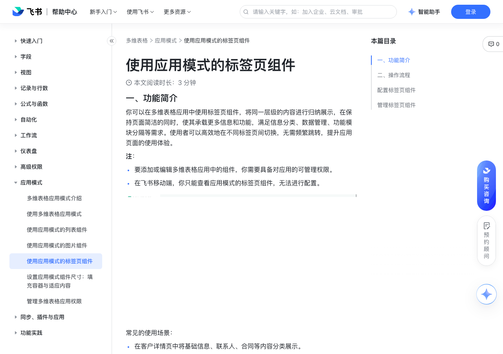

# 使用应用模式的标签页组件

> 来源：[飞书帮助中心](https://www.feishu.cn/hc/zh-CN/articles/785908030493)  
> 分类：多维表格 / 应用模式  
> 抓取时间：2026-09-22T01:26:33.078Z

## 界面截图

### 文档内配图

1. 配图：https://p1-hera.feishucdn.com/tos-cn-i-jbbdkfciu3/735e48d4711041ee98f779203c63dcc5~tplv-jbbdkfciu3-image:0:0.image
2. 配图：https://p1-hera.feishucdn.com/tos-cn-i-jbbdkfciu3/06b9130c655d4fcdb3ce768a640006a4~tplv-jbbdkfciu3-image:0:0.image
3. 配图：https://p1-hera.feishucdn.com/tos-cn-i-jbbdkfciu3/6c04a73d4a4647ffb7470d92de98b525~tplv-jbbdkfciu3-image:0:0.image

## 功能定位

本页对应飞书帮助中心「多维表格 / 应用模式」下的「使用应用模式的标签页组件」。以下需求描述依据官方说明文档提炼，用于指导 DuoWei 对标实现。

## 功能目标

一、功能简介

## 文档结构（官方章节）

- 一、功能简介​
- 二、操作流程​
- 配置标签页组件​
- 管理标签页组件​

## 详细功能说明

一、功能简介

要添加或编辑多维表格应用中的组件，你需要具备对应用的可管理权限。

在飞书移动端，你只能查看应用模式的标签页组件，无法进行配置。

在客户详情页中将基础信息、联系人、合同等内容分类展示。

在订单管理后台中切换不同订单状态（全部订单、待支付、已完成等）。

在报表中心区分销售报表、客户分析、库存报表等功能模块。

二、操作流程

配置标签页组件

打开一个多维表格应用，点击左上角应用名称旁的 编辑应用 图标进入编辑模式。从导航栏中选择要添加标签页组件的页面。点击页面左下角的 + 添加组件 > 标签页。

在右侧配置面板的基础配置标签页上，配置以下选项：

标签页组件的标题以及是否展示标题。

标签页组件中包含的标签：

点击下方 + 添加标签，新增标签。单个标签页组件中最多支持添加 20 个标签。

对每个标签，你可以：

设置标签标题。

点击 ··· 图标 > 移入组件，向标签页中添加其他组件，你也可以通过拖拽将组件移入或移出标签。

注：不支持标签页组件的嵌套使用，即在标签中添加标签页组件。

设置标签样式和位置。

在自定义配置标签页中，还可以设置标签的背景色，以及在选中状态和默认状态下的颜色。

管理标签页组件

## 实现要点（对标 DuoWei）

1. **入口与信息架构**：在产品中明确该能力所属模块（应用模式），并保证用户可从对应导航触达。
2. **核心交互**：按上文「详细功能说明」还原主要操作路径；截图中出现的按钮、字段、面板命名尽量与飞书语义一致或可映射。
3. **数据与权限**：若文档涉及可见范围、可编辑范围、分享或高级权限，实现时需落到角色/成员模型，并保证 API/MCP 与 UI 权限一致。
4. **边界与上限**：若文档提到数量上限、格式限制、导入导出约束，需在实现与错误提示中体现。
5. **验收**：以本页截图场景为用例，完成「能打开 / 能配置 / 能保存 / 能被 Agent 读写（如适用）」四项检查。

## 原始摘录摘要

> 一、功能简介 要添加或编辑多维表格应用中的组件，你需要具备对应用的可管理权限。 在飞书移动端，你只能查看应用模式的标签页组件，无法进行配置。 在客户详情页中将基础信息、联系人、合同等内容分类展示。 在订单管理后台中切换不同订单状态（全部订单、待支付、已完成等）。 在报表中心区分销售报表、客户分析、库存报表等功能模块。 二、操作流程 配置标签页组件 打开一个多维表格应用，点击左上角应用名称旁的 编辑应用 图标进入编辑模式。从导航栏中选择要添加标签页组件的页面。点击页面左下角的 + 添加组件 > 标签页。 在右侧配置面板的基础配置标签页上，配置以下选项： 标签页组件的标题以及是否展示标题。 标签页组件中包含的标签： 点击下方 + 添加标签，新增标签。单个标签页组件中最多支持添加 20 个标签。 对每个标签，你可以： 设置标签标题。 点击 ··· 图标 > 移入组件，向标签页中添加其他组件，你也可以通过拖拽将组件移入或移出标签。 注：不支持标签页组件的嵌套使用，即在标签中添加标签页组件。 设置标签样式和位置。 在自定义配置标签页中，还可以设置标签的背景色，以及在选中状态和默认状态下的颜色。 管理标签页组件

## 元数据

- article_id: `7549191496152514588`
- category_id: `7550306356478574620`
- path: `/hc/zh-CN/articles/785908030493`
- extracted_text_length: 507
