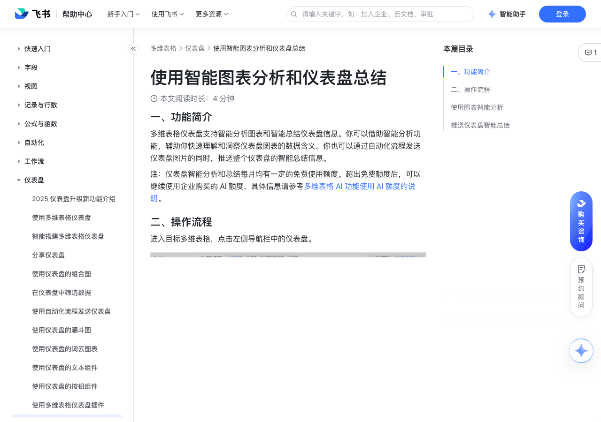

# 使用智能图表分析和仪表盘总结

> 来源：[飞书帮助中心](https://www.feishu.cn/hc/zh-CN/articles/645002225954)  
> 分类：多维表格 / 仪表盘  
> 抓取时间：2026-09-22T01:27:03.591Z

## 界面截图

### 文档内配图

1. 配图：https://p1-hera.feishucdn.com/tos-cn-i-jbbdkfciu3/eb5385213cd842fa8244d50b00ff60cb~tplv-jbbdkfciu3-image:0:0.image
2. 配图：https://p1-hera.feishucdn.com/tos-cn-i-jbbdkfciu3/9728aab427b6401ab0e3781f09cd2571~tplv-jbbdkfciu3-image:0:0.image
3. 配图：https://p1-hera.feishucdn.com/tos-cn-i-jbbdkfciu3/8610c3d70a0f42ac8a0e760061f74ea0~tplv-jbbdkfciu3-image:0:0.image
4. 配图：https://p1-hera.feishucdn.com/tos-cn-i-jbbdkfciu3/d4c71f3e14e14af29678fd823dc20d60~tplv-jbbdkfciu3-image:0:0.image
5. 配图：https://p1-hera.feishucdn.com/tos-cn-i-jbbdkfciu3/ade44b65b60047028e2e6e6a734d867c~tplv-jbbdkfciu3-image:0:0.image
6. 配图：https://p1-hera.feishucdn.com/tos-cn-i-jbbdkfciu3/5665cdc0c554419c85d41323bdd4bbcd~tplv-jbbdkfciu3-image:0:0.image
7. 配图：https://p1-hera.feishucdn.com/tos-cn-i-jbbdkfciu3/f6fdcb2b6f0a4696be71dcfc7a763b8f~tplv-jbbdkfciu3-image:0:0.image
8. 配图：https://p1-hera.feishucdn.com/tos-cn-i-jbbdkfciu3/daac932aa3cd4376a4be206d0ed1aba3~tplv-jbbdkfciu3-image:0:0.image
9. 配图：https://p1-hera.feishucdn.com/tos-cn-i-jbbdkfciu3/6a4b16bb3a1941ceb0c9a9448841ceef~tplv-jbbdkfciu3-image:0:0.image
10. 配图：https://p1-hera.feishucdn.com/tos-cn-i-jbbdkfciu3/54fbec923a874775bbaae7e8024c9091~tplv-jbbdkfciu3-image:0:0.image
11. 配图：https://p1-hera.feishucdn.com/tos-cn-i-jbbdkfciu3/a2ae49c4c58a44c9b73b3335c27fdbd8~tplv-jbbdkfciu3-image:0:0.image

## 功能定位

本页对应飞书帮助中心「多维表格 / 仪表盘」下的「使用智能图表分析和仪表盘总结」。以下需求描述依据官方说明文档提炼，用于指导 DuoWei 对标实现。

## 功能目标

一、功能简介

## 文档结构（官方章节）

- 一、功能简介​
- 二、操作流程​
- 使用图表智能分析​
- 推送仪表盘智能总结​

## 详细功能说明

一、功能简介

二、操作流程

使用图表智能分析

推送仪表盘智能总结

## 实现要点（对标 DuoWei）

1. **入口与信息架构**：在产品中明确该能力所属模块（仪表盘），并保证用户可从对应导航触达。
2. **核心交互**：按上文「详细功能说明」还原主要操作路径；截图中出现的按钮、字段、面板命名尽量与飞书语义一致或可映射。
3. **数据与权限**：若文档涉及可见范围、可编辑范围、分享或高级权限，实现时需落到角色/成员模型，并保证 API/MCP 与 UI 权限一致。
4. **边界与上限**：若文档提到数量上限、格式限制、导入导出约束，需在实现与错误提示中体现。
5. **验收**：以本页截图场景为用例，完成「能打开 / 能配置 / 能保存 / 能被 Agent 读写（如适用）」四项检查。

## 原始摘录摘要

> 一、功能简介 二、操作流程 使用图表智能分析 推送仪表盘智能总结

## 元数据

- article_id: `7407282069897019420`
- category_id: `7165754521875005468`
- path: `/hc/zh-CN/articles/645002225954`
- extracted_text_length: 32
