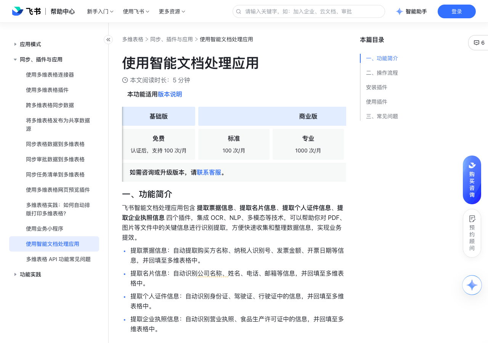

# 使用智能文档处理应用

> 来源：[飞书帮助中心](https://www.feishu.cn/hc/zh-CN/articles/068282371382)  
> 分类：多维表格 / 同步、插件与应用  
> 抓取时间：2026-09-22T01:26:36.900Z

## 界面截图

### 文档内配图

1. 配图：https://p1-hera.feishucdn.com/tos-cn-i-jbbdkfciu3/462b610b4f5a4a9eb1c8fbe59cea2d0a~tplv-jbbdkfciu3-image:0:0.image
2. 配图：https://p1-hera.feishucdn.com/tos-cn-i-jbbdkfciu3/baf90388da3646418964d1ad454cd334~tplv-jbbdkfciu3-image:0:0.image
3. 配图：https://p1-hera.feishucdn.com/tos-cn-i-jbbdkfciu3/df5e08adf1a24a17a147e7a4f7c6b469~tplv-jbbdkfciu3-image:0:0.image
4. 配图：https://p1-hera.feishucdn.com/tos-cn-i-jbbdkfciu3/3a450f54377a47c793d936ace0e4b8a6~tplv-jbbdkfciu3-image:0:0.image
5. 配图：https://p1-hera.feishucdn.com/tos-cn-i-jbbdkfciu3/f59763c19ad8443eac2e776b6544fe2c~tplv-jbbdkfciu3-image:0:0.image
6. 配图：https://p1-hera.feishucdn.com/tos-cn-i-jbbdkfciu3/afc83180f15641c799e1336bf6a72659~tplv-jbbdkfciu3-image:0:0.image
7. 配图：https://p1-hera.feishucdn.com/tos-cn-i-jbbdkfciu3/fb33121b0405438abb31225a56e13ff6~tplv-jbbdkfciu3-image:0:0.image
8. 配图：https://p1-hera.feishucdn.com/tos-cn-i-jbbdkfciu3/b597effcca5d41e2869deb7c69ad73ef~tplv-jbbdkfciu3-image:0:0.image

## 功能定位

本页对应飞书帮助中心「多维表格 / 同步、插件与应用」下的「使用智能文档处理应用」。以下需求描述依据官方说明文档提炼，用于指导 DuoWei 对标实现。

## 功能目标

一、功能简介

## 文档结构（官方章节）

- 一、功能简介​
- 二、操作流程​
- 安装插件​
- 使用插件​
- 三、常见问题​

## 详细功能说明

一、功能简介

提取票据信息：自动提取购买方名称、纳税人识别号、发票金额、开票日期等信息，并回填至多维表格中。

提取名片信息：自动识别公司名称、姓名、电话、邮箱等信息，并回填至多维表格中。

提取个人证件信息：自动识别身份证、驾驶证、行驶证中的信息，并回填至多维表格中。

提取企业执照信息：自动识别营业执照、食品生产许可证中的信息，并回填至多维表格中。

二、操作流程

安装插件

企业管理员：在飞书应用中心搜索并安装飞书智能文档处理应用，点击 获取，并完成相关配置。也可在桌面端个人头像 > 管理后台 > 工作台 > 应用管理，搜索 飞书智能文档处理，完成并调整相关配置。

企业成员：在飞书应用中心中搜索飞书智能文档处理应用，点击 申请使用 按钮，填写申请理由，点击 提交申请 按钮，待审批通过后即可使用。

使用插件

预置提取字段：根据业务需求，在多维表格中新建几个字段，用于存放待提取的信息。在多维表格内预先设置的字段可根据个人需求设定。

注：开票日期字段需要设置为 文本 字段。

创建自动化流程：点击右上角 自动化 > 创建自动化流程，进入流程编辑页面。

在触发条件处选择 新增/修改的记录满足条件时，按需求选择记录所在的数据表，并设置满足的条件。

在执行操作处选择 自动化插件 下的 提取票据信息。

设置发票类型（即 选择场景），并选择需提取信息的文件所在的字段。提取票据信息时，支持识别增值税发票、出租车发票和火车票。

点击 添加操作 按钮，选择 修改记录，并完善信息回填的操作设置。按照需求选择记录所在的数据表，并选择 第 1 步满足条件的记录，点击 + 设置字段值 按钮，将多维表格中的字段与发票要素逐一对应。

点击 保存并启用，即可完成配置。

三、常见问题

问：谁可以成为飞书智能文档处理应用的审批人？

答：应用的审批人需为企业超级管理员或拥有全部应用管理权限的管理员。更多信息请参考应用审核的负责人。

## 实现要点（对标 DuoWei）

1. **入口与信息架构**：在产品中明确该能力所属模块（同步、插件与应用），并保证用户可从对应导航触达。
2. **核心交互**：按上文「详细功能说明」还原主要操作路径；截图中出现的按钮、字段、面板命名尽量与飞书语义一致或可映射。
3. **数据与权限**：若文档涉及可见范围、可编辑范围、分享或高级权限，实现时需落到角色/成员模型，并保证 API/MCP 与 UI 权限一致。
4. **边界与上限**：若文档提到数量上限、格式限制、导入导出约束，需在实现与错误提示中体现。
5. **验收**：以本页截图场景为用例，完成「能打开 / 能配置 / 能保存 / 能被 Agent 读写（如适用）」四项检查。

## 原始摘录摘要

> 一、功能简介 提取票据信息：自动提取购买方名称、纳税人识别号、发票金额、开票日期等信息，并回填至多维表格中。 提取名片信息：自动识别公司名称、姓名、电话、邮箱等信息，并回填至多维表格中。 提取个人证件信息：自动识别身份证、驾驶证、行驶证中的信息，并回填至多维表格中。 提取企业执照信息：自动识别营业执照、食品生产许可证中的信息，并回填至多维表格中。 二、操作流程 安装插件 企业管理员：在飞书应用中心搜索并安装飞书智能文档处理应用，点击 获取，并完成相关配置。也可在桌面端个人头像 > 管理后台 > 工作台 > 应用管理，搜索 飞书智能文档处理，完成并调整相关配置。 企业成员：在飞书应用中心中搜索飞书智能文档处理应用，点击 申请使用 按钮，填写申请理由，点击 提交申请 按钮，待审批通过后即可使用。 使用插件 预置提取字段：根据业务需求，在多维表格中新建几个字段，用于存放待提取的信息。在多维表格内预先设置的字段可根据个人需求设定。 注：开票日期字段需要设置为 文本 字段。 创建自动化流程：点击右上角 自动化 > 创建自动化流程，进入流程编辑页面。 在触发条件处选择 新增/修改的记录满足条件时，按需求选择记录所在的数据表，并设置满足的条件。 在执行操作处选择 自动化插件 下的 提取票据信息。 设置发票类型（即 选择场景），并选择需提取信息的文件所在的字段。提取票据信息时，支持识别增值税发票、出租车发票和火车票。 点击 添加操作 按钮，选择 修改记录，并完善信息回填的操作设置。按照需求选择记录所在的数据表，并选择 第 1 步满足条件的记录，点击 + 设置字段值 按钮，将多维表格中的字段与发票要素逐一对应。 点击 保存并启用，即可完成配置。 三、常见问题 问：谁可以成为飞书智能文档处理应用的审批人？ 答：应用的审批人需为企业超级管理员或拥有全部应用管理权限的管理员。更多信息请参考应用审核…

## 元数据

- article_id: `7289049183774867484`
- category_id: `7225134052943200257`
- path: `/hc/zh-CN/articles/068282371382`
- extracted_text_length: 805
