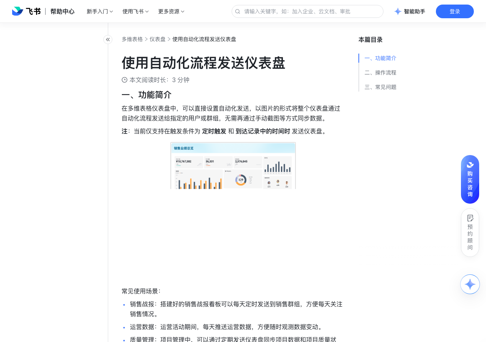

# 使用自动化流程发送仪表盘

> 来源：[飞书帮助中心](https://www.feishu.cn/hc/zh-CN/articles/899488863472)  
> 分类：多维表格 / 仪表盘  
> 抓取时间：2026-09-22T01:25:16.304Z

## 界面截图

### 文档内配图

1. 配图：https://p1-hera.feishucdn.com/tos-cn-i-jbbdkfciu3/1894d68a3d0e49fb838f66508ae49c1d~tplv-jbbdkfciu3-image:0:0.image
2. 配图：https://p1-hera.feishucdn.com/tos-cn-i-jbbdkfciu3/547eccc183974dbf8496d462e19aa362~tplv-jbbdkfciu3-image:0:0.image
3. 配图：https://p1-hera.feishucdn.com/tos-cn-i-jbbdkfciu3/69c8346ca6d54a15b61e33b2c77cb837~tplv-jbbdkfciu3-image:0:0.image

## 功能定位

本页对应飞书帮助中心「多维表格 / 仪表盘」下的「使用自动化流程发送仪表盘」。以下需求描述依据官方说明文档提炼，用于指导 DuoWei 对标实现。

## 功能目标

一、功能简介

## 文档结构（官方章节）

- 一、功能简介​
- 二、操作流程​
- 三、常见问题​

## 详细功能说明

一、功能简介

常见使用场景：

销售战报：搭建好的销售战报看板可以每天定时发送到销售群组，方便每天关注销售情况。

运营数据：运营活动期间，每天推送运营数据，方便随时观测数据变动。

质量管理：项目管理中，可以通过定期发送仪表盘同步项目数据和项目质量状态。

二、操作流程

进入目标多维表格，点击左侧导航栏中的仪表盘。

点击上方的 设置自动化发送，打开自动推送仪表盘面板。

点击面板下方的 更多配置，进入自动化设置页面。

按需修改自动化中的触发条件，触发条件默认为 定时触发，可根据需要改为 到达记录中的时间时。

按需修改自动化中的执行操作，你可以选择将仪表盘发送给个人或群组。设置完成后启用自动化流程，即可在即时消息中接收到由自动化发送的仪表盘了。

有关多维表格自动化的具体信息，请参考使用多维表格自动化流程和自动化流程触发条件与执行操作一览。

通过自动化流程发送的仪表盘会显示为真实数据的缩略图，即自动化触发时的仪表盘的截图。消息左下角会显示“来自[多维表格名称]”的字样，证明这条消息是由多维表格中的自动化流程发送的。

如果你在仪表盘中使用了筛选功能，那么自动化发出的仪表盘将是筛选后的数据。因此，如果发现实际数据与发送的仪表盘数据不符，请检查是否开启了仪表盘筛选。

不支持设置自动化发送仪表盘图片的分辨率。你可以在正式启用自动化发送前，测试待发送仪表盘图片的清晰度。

三、常见问题

问：谁能通过自动化流程推送仪表盘中的数据？

答：该功能权限与自动化设置权限保持一致，即：未开启高级权限：多维表格所有者、有管理权限或编辑权限的协作者可通过自动化推送仪表盘。已开启高级权限：多维表格所有者、有管理权限的协作者可通过自动化推送仪表盘。注：如果不具备上述权限，在仪表盘上将不会显示 设置自动化发送 按钮。

问：发送的仪表盘中的数据是实时更新的吗？

答：不是，仪表盘是以图片的形式发送，且以推送时的数据为准。

问：我可以一次性选择发送多个仪表盘吗？

答：可以，最多可同时选择 100 个仪表盘。

## 实现要点（对标 DuoWei）

1. **入口与信息架构**：在产品中明确该能力所属模块（仪表盘），并保证用户可从对应导航触达。
2. **核心交互**：按上文「详细功能说明」还原主要操作路径；截图中出现的按钮、字段、面板命名尽量与飞书语义一致或可映射。
3. **数据与权限**：若文档涉及可见范围、可编辑范围、分享或高级权限，实现时需落到角色/成员模型，并保证 API/MCP 与 UI 权限一致。
4. **边界与上限**：若文档提到数量上限、格式限制、导入导出约束，需在实现与错误提示中体现。
5. **验收**：以本页截图场景为用例，完成「能打开 / 能配置 / 能保存 / 能被 Agent 读写（如适用）」四项检查。

## 原始摘录摘要

> 一、功能简介 常见使用场景： 销售战报：搭建好的销售战报看板可以每天定时发送到销售群组，方便每天关注销售情况。 运营数据：运营活动期间，每天推送运营数据，方便随时观测数据变动。 质量管理：项目管理中，可以通过定期发送仪表盘同步项目数据和项目质量状态。 二、操作流程 进入目标多维表格，点击左侧导航栏中的仪表盘。 点击上方的 设置自动化发送，打开自动推送仪表盘面板。 点击面板下方的 更多配置，进入自动化设置页面。 按需修改自动化中的触发条件，触发条件默认为 定时触发，可根据需要改为 到达记录中的时间时。 按需修改自动化中的执行操作，你可以选择将仪表盘发送给个人或群组。设置完成后启用自动化流程，即可在即时消息中接收到由自动化发送的仪表盘了。 有关多维表格自动化的具体信息，请参考使用多维表格自动化流程和自动化流程触发条件与执行操作一览。 通过自动化流程发送的仪表盘会显示为真实数据的缩略图，即自动化触发时的仪表盘的截图。消息左下角会显示“来自[多维表格名称]”的字样，证明这条消息是由多维表格中的自动化流程发送的。 如果你在仪表盘中使用了筛选功能，那么自动化发出的仪表盘将是筛选后的数据。因此，如果发现实际数据与发送的仪表盘数据不符，请检查是否开启了仪表盘筛选。 不支持设置自动化发送仪表盘图片的分辨率。你可以在正式启用自动化发送前，测试待发送仪表盘图片的清晰度。 三、常见问题 问：谁能通过自动化流程推送仪表盘中的数据？ 答：该功能权限与自动化设置权限保持一致，即：未开启高级权限：多维表格所有者、有管理权限或编辑权限的协作者可通过自动化推送仪表盘。已开启高级权限：多维表格所有者、有管理权限的协作者可通过自动化推送仪表盘。注：如果不具备上述权限，在仪表盘上将不会显示 设置自动化发送 按钮。 问：发送的仪表盘中的数据是实时更新的吗？ 答：不是，仪表盘是以图片的形式发送，且以推送时的数据为准。 …

## 元数据

- article_id: `7165750396961849345`
- category_id: `7165754521875005468`
- path: `/hc/zh-CN/articles/899488863472`
- extracted_text_length: 842
