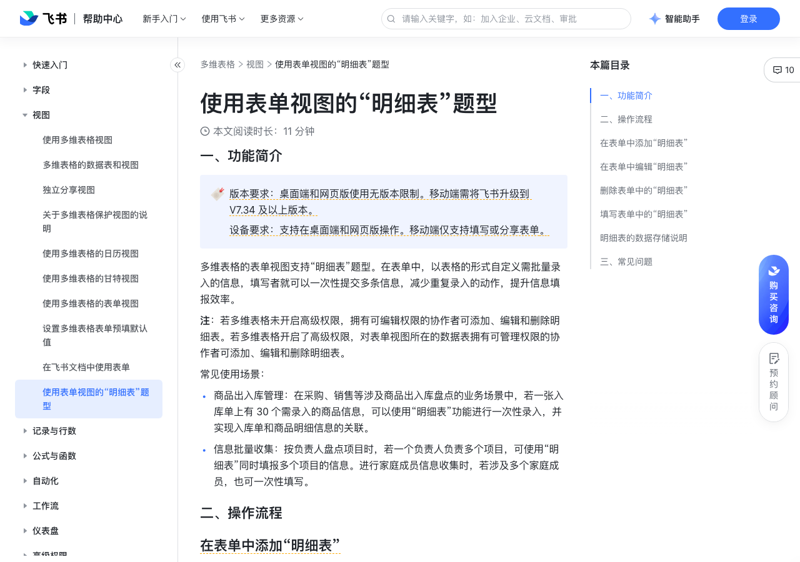

# 使用表单视图的“明细表”题型

> 来源：[飞书帮助中心](https://www.feishu.cn/hc/zh-CN/articles/495944706565)  
> 分类：多维表格 / 视图  
> 抓取时间：2026-09-22T01:23:45.201Z

## 界面截图

### 文档内配图

1. 配图：https://p1-hera.feishucdn.com/tos-cn-i-jbbdkfciu3/85965e9f287347a9866f90b69dcf8751~tplv-jbbdkfciu3-image:0:0.image
2. 配图：https://p1-hera.feishucdn.com/tos-cn-i-jbbdkfciu3/6ce96cf8e4694727833332885ad5604e~tplv-jbbdkfciu3-image:0:0.image
3. 配图：https://p1-hera.feishucdn.com/tos-cn-i-jbbdkfciu3/4c0173fe818149b1bca8e6848e93fcf8~tplv-jbbdkfciu3-image:0:0.image
4. 配图：https://p1-hera.feishucdn.com/tos-cn-i-jbbdkfciu3/06ca4cd9d7f141f2ac474d9e283e3203~tplv-jbbdkfciu3-image:0:0.image
5. 配图：https://p1-hera.feishucdn.com/tos-cn-i-jbbdkfciu3/4051fdb04f664959ba105703c4ed2d44~tplv-jbbdkfciu3-image:0:0.image
6. 配图：https://p1-hera.feishucdn.com/tos-cn-i-jbbdkfciu3/02cccd3f47b64482aea155247e9e10eb~tplv-jbbdkfciu3-image:0:0.image
7. 配图：https://p1-hera.feishucdn.com/tos-cn-i-jbbdkfciu3/c335f50a0f254a00ba8aac1eaa79a1be~tplv-jbbdkfciu3-image:0:0.image
8. 配图：https://p1-hera.feishucdn.com/tos-cn-i-jbbdkfciu3/b5774fbcfb88416094343b7cbfd6af1c~tplv-jbbdkfciu3-image:0:0.image
9. 配图：https://p1-hera.feishucdn.com/tos-cn-i-jbbdkfciu3/d6a0690e19ff49808c7188d4b6179f01~tplv-jbbdkfciu3-image:0:0.image
10. 配图：https://p1-hera.feishucdn.com/tos-cn-i-jbbdkfciu3/a352a4c9c5014cbcbdcddaf6f33e4151~tplv-jbbdkfciu3-image:0:0.image
11. 配图：https://p1-hera.feishucdn.com/tos-cn-i-jbbdkfciu3/08037130c6f54b32b712f7f2ad55e4c6~tplv-jbbdkfciu3-image:0:0.image
12. 配图：https://p1-hera.feishucdn.com/tos-cn-i-jbbdkfciu3/919dc9623eed4c7998ffca601bc5a007~tplv-jbbdkfciu3-image:0:0.image
13. 配图：https://p1-hera.feishucdn.com/tos-cn-i-jbbdkfciu3/eb3b7455dac94510b94b60b3a1bb6adf~tplv-jbbdkfciu3-image:0:0.image
14. 配图：https://p1-hera.feishucdn.com/tos-cn-i-jbbdkfciu3/3c21ea7d945d488689a2ab6c52126123~tplv-jbbdkfciu3-image:0:0.image
15. 配图：https://p1-hera.feishucdn.com/tos-cn-i-jbbdkfciu3/9f2880a61300451c8af39fa5d01d5828~tplv-jbbdkfciu3-image:0:0.image
16. 配图：https://p1-hera.feishucdn.com/tos-cn-i-jbbdkfciu3/52f2909257f5471380c61b42889ac23d~tplv-jbbdkfciu3-image:0:0.image
17. 配图：https://p1-hera.feishucdn.com/tos-cn-i-jbbdkfciu3/5d723cf2bf7f4f42a34fa2ceee5786c6~tplv-jbbdkfciu3-image:0:0.image
18. 配图：https://p1-hera.feishucdn.com/tos-cn-i-jbbdkfciu3/c16c99a3d9c241208294952591c74036~tplv-jbbdkfciu3-image:0:0.image
19. 配图：https://p1-hera.feishucdn.com/tos-cn-i-jbbdkfciu3/1f0396c4cddd4296937f5b4f0a5256e1~tplv-jbbdkfciu3-image:0:0.image
20. 配图：https://p1-hera.feishucdn.com/tos-cn-i-jbbdkfciu3/8398218c31f54cea96eefc14beb256ed~tplv-jbbdkfciu3-image:0:0.image
21. 配图：https://p1-hera.feishucdn.com/tos-cn-i-jbbdkfciu3/da93f9da18064f9e963a1da2046ffd6b~tplv-jbbdkfciu3-image:0:0.image
22. 配图：https://p1-hera.feishucdn.com/tos-cn-i-jbbdkfciu3/d116e9cd626e468c910c7d52373c0eca~tplv-jbbdkfciu3-image:0:0.image

## 功能定位

本页对应飞书帮助中心「多维表格 / 视图」下的「使用表单视图的“明细表”题型」。以下需求描述依据官方说明文档提炼，用于指导 DuoWei 对标实现。

## 功能目标

一、功能简介

## 文档结构（官方章节）

- 一、功能简介​
- 二、操作流程​
- 在表单中添加“明细表”​
- 在表单中编辑“明细表”​
- 在明细表中新增字段​
- 修改明细表中字段的类型或标题​
- 复制或删除明细表中的字段​
- 更改字段位置​
- 设置必填​
- 移出表单​
- 对明细表的其他设置​
- 删除表单中的“明细表”​
- 填写表单中的“明细表”​
- 在网页端和桌面端填写​
- 在移动端填写​
- 明细表的数据存储说明​
- 三、常见问题​

## 详细功能说明

一、功能简介

商品出入库管理：在采购、销售等涉及商品出入库盘点的业务场景中，若一张入库单上有 30 个需录入的商品信息，可以使用“明细表”功能进行一次性录入，并实现入库单和商品明细信息的关联。

信息批量收集：按负责人盘点项目时，若一个负责人负责多个项目，可使用“明细表”同时填报多个项目的信息。进行家庭成员信息收集时，若涉及多个家庭成员，也可一次性填写。

二、操作流程

在表单中添加“明细表”

在表单中编辑“明细表”

在明细表中新增字段

修改明细表中字段的类型或标题

复制或删除明细表中的字段

复制字段：右键点击明细表中需复制的字段的名称，选择 复制字段/列，即可在当前字段的右侧新增一个副本字段。

删除字段：右键点击明细表中需删除的字段的名称，选择 删除字段/列。当明细表中仅剩一个字段时，不支持被删除。

更改字段位置

设置必填

设置“明细表”题型是否必填：

开启 明细表 组件右上角的 必填 开关，即可将该问题设置为必填。若你仅开启了此开关，未对各个字段进行单独的设置，那么明细表内只要有一个字段被填写，就会被判断为“已填写”。因此，此设置无法确保所有字段都被填写，只能保证明细表不为空。

设置明细表中各个字段是否必填：

右键点击明细表中需要设置为必填的字段的名称，并开启 必填 开关。设置为必填的字段，名称右侧会带有红色星号。通过这种方式，你可以针对各个字段进行设置，方便进行更严格的管控。

移出表单

将整个明细表移出表单：

该操作相当于把明细表中的字段批量移出表单。点击 明细表 组件右上角的 移出表单 按钮，即可把明细表从表单中移出。移出后，这些字段不会被删除，你仍然可以在左侧的 可选题目 下方以及对应的表格视图中找到它们。

注：后续如果你点击 + 图标或 全部添加，将这些字段重新添加到表单中，它们只会作为独立的表单问题，不会再以表格的形式展示。

将明细表中的某个字段移出表单：

右键点击明细表中需移出的字段的名称，选择 移出表单。移出表单的字段不会被删除，你仍然可以在左侧的 可选题目 下方以及对应的表格视图中找到它们。当明细表中仅剩一个字段时，不支持被移出表单。

和移除整个明细表不同的是，通过这个路径移出表单的字段，在重新添加到表单时仍然会作为明细表的一部分。

对明细表的其他设置

修改 表单问题：在新建了 明细表 之后，表单问题 默认为“明细表”，可自行修改。修改此处的表单问题对数据表中的字段名称无任何影响。

输入或修改 问题描述：你可以在 问题描述 处输入对该问题的说明，非必填。

设置 填写行数上限：你可以设置该明细表的填写行数上限，即一个填写者最多可在明细表中添加几行数据。该数值默认为 10，可输入 1 到 100 之间的任意整数。

复制明细表：点击明细表的名称并选择 复制，即可复制明细表的全部设置和内容。

删除表单中的“明细表”

填写表单中的“明细表”

在网页端和桌面端填写

添加一行：

方式 1：添加点击表格下方的 + 添加一行，即可新增一行用于填写新数据。

方式 2：右键点击某一行，并选择 向上插入 [数字] 行 或 向下插入 [数字] 行 来进行新增。

删除一行：

方式 1：将鼠标悬停在需删除的行上，点击右侧出现的 删除该行 图标即可。

方式 2：右键点击某一行，并选择 删除该行 来进行删除。

在移动端填写

添加一行：在表单的填写界面，点击 + 添加一行，即可新增一行用于填写新数据。

界面底部有 保存 和 保存并继续添加 两个按钮，填写完成后，若你需要继续添加新的行，点击 保存并继续添加 即可；若你无需再新增行，点击 保存 即可跳转回表单。

删除一行：点击需删除的行，跳转到详情页，并点击右上角的 删除 按钮。删除后无法撤销。

明细表的数据存储说明

三、常见问题

问：一个表单视图内，最多支持添加多少个明细表？

答：20 个。

问：一个明细表最多支持添加多少行数据？

答：最多可添加 100 行。同时取决于不同明细表的设置，若 填写行数上限 输入的值小于 100，以设置的填写行数上限为准。

问：若使用的移动端版本在 V7.34 以下，移动端会如何显示明细表的数据？

答：明细表中的字段会平铺展示为多个表单问题。若你对明细表设置了显隐条件，或是把明细表作为其他问题的展示条件，那么显隐设置不会生效，涉及到的问题会全部展示在表单中。

## 实现要点（对标 DuoWei）

1. **入口与信息架构**：在产品中明确该能力所属模块（视图），并保证用户可从对应导航触达。
2. **核心交互**：按上文「详细功能说明」还原主要操作路径；截图中出现的按钮、字段、面板命名尽量与飞书语义一致或可映射。
3. **数据与权限**：若文档涉及可见范围、可编辑范围、分享或高级权限，实现时需落到角色/成员模型，并保证 API/MCP 与 UI 权限一致。
4. **边界与上限**：若文档提到数量上限、格式限制、导入导出约束，需在实现与错误提示中体现。
5. **验收**：以本页截图场景为用例，完成「能打开 / 能配置 / 能保存 / 能被 Agent 读写（如适用）」四项检查。

## 原始摘录摘要

> 一、功能简介 商品出入库管理：在采购、销售等涉及商品出入库盘点的业务场景中，若一张入库单上有 30 个需录入的商品信息，可以使用“明细表”功能进行一次性录入，并实现入库单和商品明细信息的关联。 信息批量收集：按负责人盘点项目时，若一个负责人负责多个项目，可使用“明细表”同时填报多个项目的信息。进行家庭成员信息收集时，若涉及多个家庭成员，也可一次性填写。 二、操作流程 在表单中添加“明细表” 在表单中编辑“明细表” 在明细表中新增字段 修改明细表中字段的类型或标题 复制或删除明细表中的字段 复制字段：右键点击明细表中需复制的字段的名称，选择 复制字段/列，即可在当前字段的右侧新增一个副本字段。 删除字段：右键点击明细表中需删除的字段的名称，选择 删除字段/列。当明细表中仅剩一个字段时，不支持被删除。 更改字段位置 设置必填 设置“明细表”题型是否必填： 开启 明细表 组件右上角的 必填 开关，即可将该问题设置为必填。若你仅开启了此开关，未对各个字段进行单独的设置，那么明细表内只要有一个字段被填写，就会被判断为“已填写”。因此，此设置无法确保所有字段都被填写，只能保证明细表不为空。 设置明细表中各个字段是否必填： 右键点击明细表中需要设置为必填的字段的名称，并开启 必填 开关。设置为必填的字段，名称右侧会带有红色星号。通过这种方式，你可以针对各个字段进行设置，方便进行更严格的管控。 移出表单 将整个明细表移出表单： 该操作相当于把明细表中的字段批量移出表单。点击 明细表 组件右上角的 移出表单 按钮，即可把明细表从表单中移出。移出后，这些字段不会被删除，你仍然可以在左侧的 可选题目 下方以及对应的表格视图中找到它们。 注：后续如果你点击 + 图标或 全部添加，将这些字段重新添加到表单中，它们只会作为独立的表单问题，不会再以表格的形式展示。 将明细表中的某个字段移出表单： 右键点…

## 元数据

- article_id: `7439336061127622658`
- category_id: `7006240778276110337`
- path: `/hc/zh-CN/articles/495944706565`
- extracted_text_length: 1791
