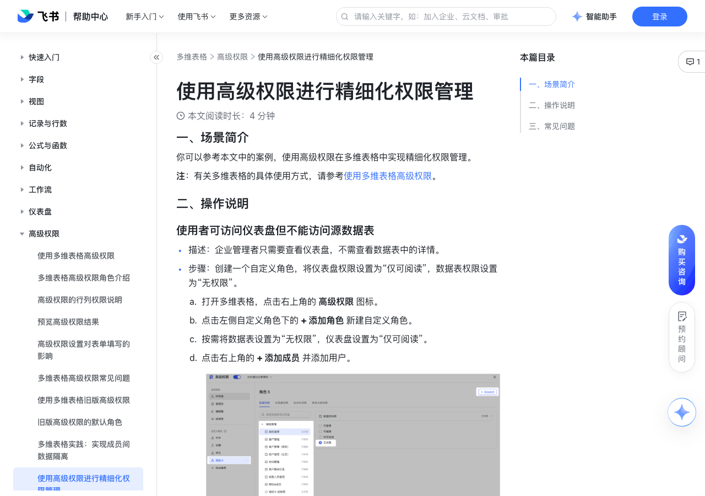

# 使用高级权限进行精细化权限管理

> 来源：[飞书帮助中心](https://www.feishu.cn/hc/zh-CN/articles/129175931267)  
> 分类：多维表格 / 高级权限  
> 抓取时间：2026-09-22T01:26:31.306Z

## 界面截图

### 文档内配图

1. image.png：https://p1-hera.feishucdn.com/tos-cn-i-jbbdkfciu3/0eba56328f23474d911d284505c90fef.png~tplv-jbbdkfciu3-png:0:0.png
2. 配图：https://p1-hera.feishucdn.com/tos-cn-i-jbbdkfciu3/5b69681d2ad544b1bc4a07287551b5b4~tplv-jbbdkfciu3-image:0:0.image
3. 配图：https://p1-hera.feishucdn.com/tos-cn-i-jbbdkfciu3/98e616f9732a420ba7bd1a841f3f68d5~tplv-jbbdkfciu3-image:0:0.image

## 功能定位

本页对应飞书帮助中心「多维表格 / 高级权限」下的「使用高级权限进行精细化权限管理」。以下需求描述依据官方说明文档提炼，用于指导 DuoWei 对标实现。

## 功能目标

一、场景简介

## 文档结构（官方章节）

- 一、场景简介 ​
- 二、操作说明​
- 使用者可访问仪表盘但不能访问源数据表​
- 使用者可填写或修改内容，但不能修改表头或新增数据表​
- 使用者仅能查看或编辑本人创建或分配给自己的记录​
- 三、常见问题​

## 详细功能说明

一、场景简介

二、操作说明

使用者可访问仪表盘但不能访问源数据表

描述：企业管理者只需要查看仪表盘，不需查看数据表中的详情。

步骤：创建一个自定义角色，将仪表盘权限设置为“仅可阅读”，数据表权限设置为“无权限”。

打开多维表格，点击右上角的 高级权限 图标。

点击左侧自定义角色下的 + 添加角色 新建自定义角色。

按需将数据表设置为“无权限”，仪表盘设置为“仅可阅读”。

点击右上角的 + 添加成员 并添加用户。

250px|700px|reset

点击 保存并预览，在预览界面右侧的列表中选择本角色下的用户，预览权限设置。

点击左上角的 退出预览 > 保存，权限设置生效。

使用者可填写或修改内容，但不能修改表头或新增数据表

描述：企业员工可以在数据表中填写内容，但无法修改数据表结构或新建数据表。

步骤：创建一个自定义角色，将数据表权限设置为“可编辑”。

将需要使用者编辑的数据表设置为“可编辑”。

使用者仅能查看或编辑本人创建或分配给自己的记录

描述：用户需要在数据表中填入敏感信息，因此每个用户只能看到和修改自己创建的记录。或者在分配任务时，每个用户只能修改分配给自己的任务。

步骤：在数据表的“记录权限”设置中，设置用户仅可编辑与本人相关的记录。

展开 记录权限，勾选 可新增记录 和 可删除记录。在 可编辑和删除的记录范围 下，选择 与成员本人相关的记录，并按需设置条件。

如需设置用户只能编辑本人创建的记录，选择 成员本人创建的记录。

如需设置用户只能编辑分配给自己的记录，选择 以下字段包含成员本人的记录，并继续选择人员字段。

如希望用户可阅读记录的范围与可编辑的范围一致，在 可阅读的记录范围 下选择 上述设置为可编辑的记录。

三、常见问题

问：如何批量为多维表格的高级权限角色添加用户？

答：如果需要批量为多个用户授予多维表格的高级权限角色，你可以直接添加群组、部门或用户组，无需逐个添加用户。

## 实现要点（对标 DuoWei）

1. **入口与信息架构**：在产品中明确该能力所属模块（高级权限），并保证用户可从对应导航触达。
2. **核心交互**：按上文「详细功能说明」还原主要操作路径；截图中出现的按钮、字段、面板命名尽量与飞书语义一致或可映射。
3. **数据与权限**：若文档涉及可见范围、可编辑范围、分享或高级权限，实现时需落到角色/成员模型，并保证 API/MCP 与 UI 权限一致。
4. **边界与上限**：若文档提到数量上限、格式限制、导入导出约束，需在实现与错误提示中体现。
5. **验收**：以本页截图场景为用例，完成「能打开 / 能配置 / 能保存 / 能被 Agent 读写（如适用）」四项检查。

## 原始摘录摘要

> 一、场景简介 二、操作说明 使用者可访问仪表盘但不能访问源数据表 描述：企业管理者只需要查看仪表盘，不需查看数据表中的详情。 步骤：创建一个自定义角色，将仪表盘权限设置为“仅可阅读”，数据表权限设置为“无权限”。 打开多维表格，点击右上角的 高级权限 图标。 点击左侧自定义角色下的 + 添加角色 新建自定义角色。 按需将数据表设置为“无权限”，仪表盘设置为“仅可阅读”。 点击右上角的 + 添加成员 并添加用户。 250px|700px|reset 点击 保存并预览，在预览界面右侧的列表中选择本角色下的用户，预览权限设置。 点击左上角的 退出预览 > 保存，权限设置生效。 使用者可填写或修改内容，但不能修改表头或新增数据表 描述：企业员工可以在数据表中填写内容，但无法修改数据表结构或新建数据表。 步骤：创建一个自定义角色，将数据表权限设置为“可编辑”。 将需要使用者编辑的数据表设置为“可编辑”。 使用者仅能查看或编辑本人创建或分配给自己的记录 描述：用户需要在数据表中填入敏感信息，因此每个用户只能看到和修改自己创建的记录。或者在分配任务时，每个用户只能修改分配给自己的任务。 步骤：在数据表的“记录权限”设置中，设置用户仅可编辑与本人相关的记录。 展开 记录权限，勾选 可新增记录 和 可删除记录。在 可编辑和删除的记录范围 下，选择 与成员本人相关的记录，并按需设置条件。 如需设置用户只能编辑本人创建的记录，选择 成员本人创建的记录。 如需设置用户只能编辑分配给自己的记录，选择 以下字段包含成员本人的记录，并继续选择人员字段。 如希望用户可阅读记录的范围与可编辑的范围一致，在 可阅读的记录范围 下选择 上述设置为可编辑的记录。 三、常见问题 问：如何批量为多维表格的高级权限角色添加用户？ 答：如果需要批量为多个用户授予多维表格的高级权限角色，你可以直接添加群组、部门或用户组，无…

## 元数据

- article_id: `7537625913392529436`
- category_id: `7165750460006055938`
- path: `/hc/zh-CN/articles/129175931267`
- extracted_text_length: 808
