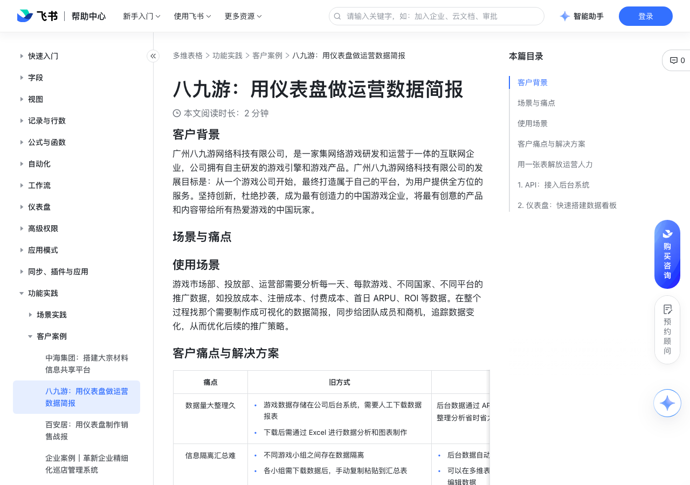

# 八九游：用仪表盘做运营数据简报

> 来源：[飞书帮助中心](https://www.feishu.cn/hc/zh-CN/articles/989422767480)  
> 分类：多维表格 / 功能实践 / 客户案例  
> 抓取时间：2026-09-22T01:26:50.748Z

## 界面截图

### 文档内配图

1. 配图：https://p1-hera.feishucdn.com/tos-cn-i-jbbdkfciu3/2dff82bb88974a9cba2631fe5a06c5cf~tplv-jbbdkfciu3-image:0:0.image
2. image.png：https://p1-hera.feishucdn.com/tos-cn-i-jbbdkfciu3/d9e692f2c4d54e0a909d2bfc45ea3cc0~tplv-jbbdkfciu3-image:0:0.image

## 功能定位

本页对应飞书帮助中心「多维表格 / 功能实践 / 客户案例」下的「八九游：用仪表盘做运营数据简报」。以下需求描述依据官方说明文档提炼，用于指导 DuoWei 对标实现。

## 功能目标

客户背景

## 文档结构（官方章节）

- 客户背景​
- 场景与痛点​
- 使用场景​
- 客户痛点与解决方案​
- 用一张表解放运营人力​
- API：接入后台系统​
- 仪表盘：快速搭建数据看板​

## 详细功能说明

客户背景

场景与痛点

使用场景

客户痛点与解决方案

数据量大整理久

游戏数据存储在公司后台系统，需要人工下载数据报表下载后需通过 Excel 进行数据分析和图表制作

游戏数据存储在公司后台系统，需要人工下载数据报表

下载后需通过 Excel 进行数据分析和图表制作

后台数据通过 API 导入多维表格，一表管理所有信息，整理分析省时省力

信息隔离汇总难

不同游戏小组之间存在数据隔离各小组需下载数据后，手动复制粘贴到汇总表

不同游戏小组之间存在数据隔离

各小组需下载数据后，手动复制粘贴到汇总表

后台数据自动导入与更新，无需人工提醒填写可以在多维表格中通过高级权限设置谁可以查看和编辑数据

后台数据自动导入与更新，无需人工提醒填写

可以在多维表格中通过高级权限设置谁可以查看和编辑数据

报表制作成本高

Excel 制表花费时间长，数据可视化差

用仪表盘实现数据可视化，图表自由搭配，简单又美观

每周重复效率低

每周重复同样的操作，人工修改报表数据

接入 API 后，即可实现数据的自动更新，无需手动填入数据制作图表

用一张表解放运营人力

API：接入后台系统

仪表盘：快速搭建数据看板

痛点 | 旧方式 | 新方式

数据量大整理久 | 游戏数据存储在公司后台系统，需要人工下载数据报表下载后需通过 Excel 进行数据分析和图表制作 | 后台数据通过 API 导入多维表格，一表管理所有信息，整理分析省时省力

信息隔离汇总难 | 不同游戏小组之间存在数据隔离各小组需下载数据后，手动复制粘贴到汇总表 | 后台数据自动导入与更新，无需人工提醒填写可以在多维表格中通过高级权限设置谁可以查看和编辑数据

报表制作成本高 | Excel 制表花费时间长，数据可视化差 | 用仪表盘实现数据可视化，图表自由搭配，简单又美观

每周重复效率低 | 每周重复同样的操作，人工修改报表数据 | 接入 API 后，即可实现数据的自动更新，无需手动填入数据制作图表

## 实现要点（对标 DuoWei）

1. **入口与信息架构**：在产品中明确该能力所属模块（功能实践 / 客户案例），并保证用户可从对应导航触达。
2. **核心交互**：按上文「详细功能说明」还原主要操作路径；截图中出现的按钮、字段、面板命名尽量与飞书语义一致或可映射。
3. **数据与权限**：若文档涉及可见范围、可编辑范围、分享或高级权限，实现时需落到角色/成员模型，并保证 API/MCP 与 UI 权限一致。
4. **边界与上限**：若文档提到数量上限、格式限制、导入导出约束，需在实现与错误提示中体现。
5. **验收**：以本页截图场景为用例，完成「能打开 / 能配置 / 能保存 / 能被 Agent 读写（如适用）」四项检查。

## 原始摘录摘要

> 客户背景 场景与痛点 使用场景 客户痛点与解决方案 数据量大整理久 游戏数据存储在公司后台系统，需要人工下载数据报表下载后需通过 Excel 进行数据分析和图表制作 游戏数据存储在公司后台系统，需要人工下载数据报表 下载后需通过 Excel 进行数据分析和图表制作 后台数据通过 API 导入多维表格，一表管理所有信息，整理分析省时省力 信息隔离汇总难 不同游戏小组之间存在数据隔离各小组需下载数据后，手动复制粘贴到汇总表 不同游戏小组之间存在数据隔离 各小组需下载数据后，手动复制粘贴到汇总表 后台数据自动导入与更新，无需人工提醒填写可以在多维表格中通过高级权限设置谁可以查看和编辑数据 后台数据自动导入与更新，无需人工提醒填写 可以在多维表格中通过高级权限设置谁可以查看和编辑数据 报表制作成本高 Excel 制表花费时间长，数据可视化差 用仪表盘实现数据可视化，图表自由搭配，简单又美观 每周重复效率低 每周重复同样的操作，人工修改报表数据 接入 API 后，即可实现数据的自动更新，无需手动填入数据制作图表 用一张表解放运营人力 API：接入后台系统 仪表盘：快速搭建数据看板 痛点 | 旧方式 | 新方式 数据量大整理久 | 游戏数据存储在公司后台系统，需要人工下载数据报表下载后需通过 Excel 进行数据分析和图表制作 | 后台数据通过 API 导入多维表格，一表管理所有信息，整理分析省时省力 信息隔离汇总难 | 不同游戏小组之间存在数据隔离各小组需下载数据后，手动复制粘贴到汇总表 | 后台数据自动导入与更新，无需人工提醒填写可以在多维表格中通过高级权限设置谁可以查看和编辑数据 报表制作成本高 | Excel 制表花费时间长，数据可视化差 | 用仪表盘实现数据可视化，图表自由搭配，简单又美观 每周重复效率低 | 每周重复同样的操作，人工修改报表数据 | 接入 API 后，即可实…

## 元数据

- article_id: `7116515884826443804`
- category_id: `7225155397370363906`
- path: `/hc/zh-CN/articles/989422767480`
- extracted_text_length: 821
