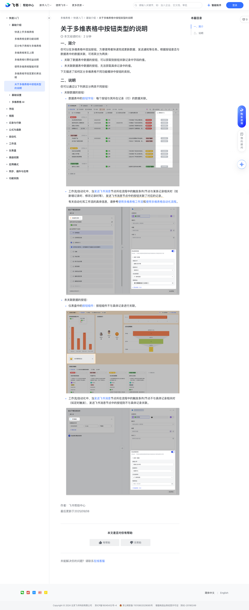

# 关于多维表格中按钮类型的说明

> 来源：[飞书帮助中心](https://www.feishu.cn/hc/zh-CN/articles/297830150616)  
> 分类：多维表格 / 快速入门 / 基础介绍  
> 抓取时间：2026-09-22T00:46:15.961Z

## 界面截图

### 文档内配图

1. 配图：https://p1-hera.feishucdn.com/tos-cn-i-jbbdkfciu3/4380db34dca642bb95288c58a116c4ca~tplv-jbbdkfciu3-image:0:0.image
2. 配图：https://p1-hera.feishucdn.com/tos-cn-i-jbbdkfciu3/867a4ccf21764f52a2e7b2ded05655a3~tplv-jbbdkfciu3-image:0:0.image
3. 配图：https://p1-hera.feishucdn.com/tos-cn-i-jbbdkfciu3/05a0a65b95384fb8a1bc5cba068a7880~tplv-jbbdkfciu3-image:0:0.image
4. 配图：https://p1-hera.feishucdn.com/tos-cn-i-jbbdkfciu3/6841aa28756d46b29ac69063d45f8288~tplv-jbbdkfciu3-image:0:0.image

## 功能定位

本页对应飞书帮助中心「多维表格 / 快速入门 / 基础介绍」下的「关于多维表格中按钮类型的说明」。以下需求描述依据官方说明文档提炼，用于指导 DuoWei 对标实现。

## 功能目标

一、简介

## 文档结构（官方章节）

- 一、简介​
- 二、说明​

## 详细功能说明

一、简介

关联了数据表中数据的按钮，可以获取到按钮关联记录中字段的值。

未关联数据表中数据的按钮，无法获取具体记录中的值。

二、说明

关联数据的按钮：

数据表中的按钮字段：每个按钮与其所在记录（行）的数据关联。

工作流/自动化中，当发送飞书消息节点所在流程中的触发条件/节点与某条记录相关时（如新增记录时、修改记录时等），发送飞书消息节点中的按钮关联了对应的记录。

有关自动化和工作流的具体信息，请参考使用多维表格工作流和使用多维表格自动化流程。

未关联数据的按钮：

仪表盘中的按钮组件：按钮组件不与具体记录进行关联。

工作流/自动化中，当发送飞书消息节点所在流程中的触发条件/节点不与具体记录相关时（如定时触发），发送飞书消息节点中的按钮则不与具体记录关联。

一、简介你可以在多维表格中添加按钮，方便使用者快速完成更新数据、发送通知等任务。根据按钮是否与数据表中的数据关联，可将其分为两类：关联了数据表中数据的按钮，可以获取到按钮关联记录中字段的值。未关联数据表中数据的按钮，无法获取具体记录中的值。下文描述了如何区分多维表格不同功能模块中按钮的类别。二、说明你可以通过以下列表区分两类不同按钮：关联数据的按钮：数据表中的按钮字段：每个按钮与其所在记录（行）的数据关联。250px|700px|reset工作流/自动化中，当发送飞书消息节点所在流程中的触发条件/节点与某条记录相关时（如新增记录时、修改记录时等），发送飞书消息节点中的按钮关联了对应的记录。有关自动化和工作流的具体信息，请参考使用多维表格工作流和使用多维表格自动化流程。250px|700px|reset未关联数据的按钮：仪表盘中的按钮组件：按钮组件不与具体记录进行关联。250px|700px|reset工作流/自动化中，当发送飞书消息节点所在流程中的触发条件/节点不与具体记录相关时（如定时触发），发送飞书消息节点中的按钮则不与具体记录关联。250px|700px|reset

## 实现要点（对标 DuoWei）

1. **入口与信息架构**：在产品中明确该能力所属模块（快速入门 / 基础介绍），并保证用户可从对应导航触达。
2. **核心交互**：按上文「详细功能说明」还原主要操作路径；截图中出现的按钮、字段、面板命名尽量与飞书语义一致或可映射。
3. **数据与权限**：若文档涉及可见范围、可编辑范围、分享或高级权限，实现时需落到角色/成员模型，并保证 API/MCP 与 UI 权限一致。
4. **边界与上限**：若文档提到数量上限、格式限制、导入导出约束，需在实现与错误提示中体现。
5. **验收**：以本页截图场景为用例，完成「能打开 / 能配置 / 能保存 / 能被 Agent 读写（如适用）」四项检查。

## 原始摘录摘要

> 一、简介 关联了数据表中数据的按钮，可以获取到按钮关联记录中字段的值。 未关联数据表中数据的按钮，无法获取具体记录中的值。 二、说明 关联数据的按钮： 数据表中的按钮字段：每个按钮与其所在记录（行）的数据关联。 工作流/自动化中，当发送飞书消息节点所在流程中的触发条件/节点与某条记录相关时（如新增记录时、修改记录时等），发送飞书消息节点中的按钮关联了对应的记录。 有关自动化和工作流的具体信息，请参考使用多维表格工作流和使用多维表格自动化流程。 未关联数据的按钮： 仪表盘中的按钮组件：按钮组件不与具体记录进行关联。 工作流/自动化中，当发送飞书消息节点所在流程中的触发条件/节点不与具体记录相关时（如定时触发），发送飞书消息节点中的按钮则不与具体记录关联。 一、简介你可以在多维表格中添加按钮，方便使用者快速完成更新数据、发送通知等任务。根据按钮是否与数据表中的数据关联，可将其分为两类：关联了数据表中数据的按钮，可以获取到按钮关联记录中字段的值。未关联数据表中数据的按钮，无法获取具体记录中的值。下文描述了如何区分多维表格不同功能模块中按钮的类别。二、说明你可以通过以下列表区分两类不同按钮：关联数据的按钮：数据表中的按钮字段：每个按钮与其所在记录（行）的数据关联。250px|700px|reset工作流/自动化中，当发送飞书消息节点所在流程中的触发条件/节点与某条记录相关时（如新增记录时、修改记录时等），发送飞书消息节点中的按钮关联了对应的记录。有关自动化和工作流的具体信息，请参考使用多维表格工作流和使用多维表格自动化流程。250px|700px|reset未关联数据的按钮：仪表盘中的按钮组件：按钮组件不与具体记录进行关联。250px|700px|reset工作流/自动化中，当发送飞书消息节点所在流程中的触发条件/节点不与具体记录相关时（如定时触发），发送飞书消息节点中的按钮则不与…

## 元数据

- article_id: `7546245388295307266`
- category_id: `7225072370607013890`
- path: `/hc/zh-CN/articles/297830150616`
- extracted_text_length: 493
