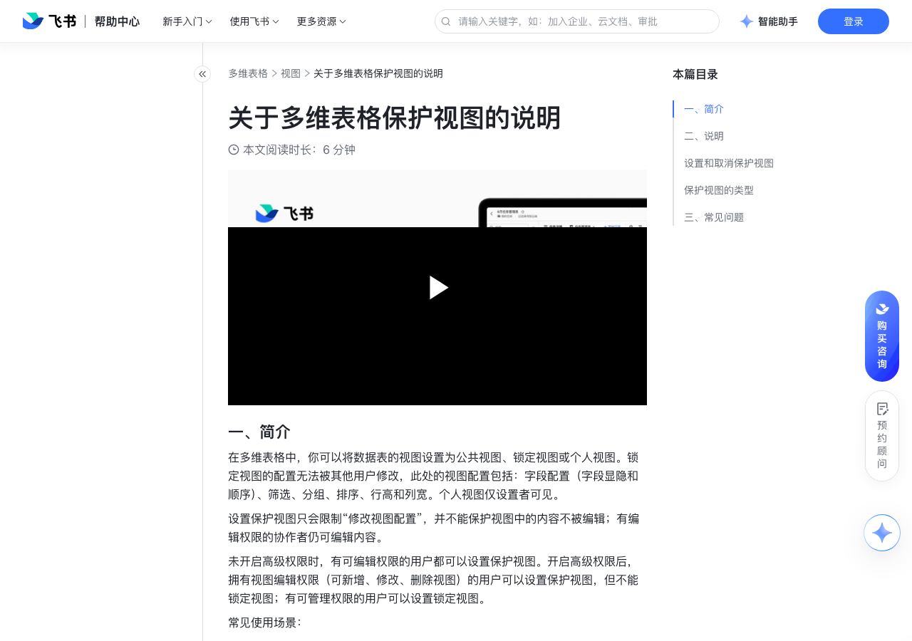

# 关于多维表格保护视图的说明

> 来源：[飞书帮助中心](https://www.feishu.cn/hc/zh-CN/articles/155456528277)  
> 分类：多维表格 / 视图  
> 抓取时间：2026-09-22T01:21:43.710Z

## 界面截图

### 文档内配图

1. 配图：https://p1-hera.feishucdn.com/tos-cn-i-jbbdkfciu3/95f7e69d79664e4a97d57c49f8d93551~tplv-jbbdkfciu3-image:0:0.image
2. 配图：https://p1-hera.feishucdn.com/tos-cn-i-jbbdkfciu3/77d9e89c1e5149f1a1a167e19f43cf76~tplv-jbbdkfciu3-image:0:0.image

## 功能定位

本页对应飞书帮助中心「多维表格 / 视图」下的「关于多维表格保护视图的说明」。以下需求描述依据官方说明文档提炼，用于指导 DuoWei 对标实现。

## 功能目标

播放 00:00 / 00:00 直播 00:00 进入全屏 1x 0.5x0.75x1x1.5x2x 点击按住可拖动视频

## 文档结构（官方章节）

- ​
    
    
    
    
      
       
       
      
    
      
  

    
    
  

  

    
    
    
      
      
    
    
  

  

     播放
    
    00:00
    /
    00:00
    直播
    
      
    
      
        
      
      
        
          
        
        
      
      00:00
      
      
    
    
    
      
      
    
    
  

  

     
    进入全屏
    
    
    
      
      
  
  

  
  

  
  

      
        
        
          
        
      
    
    
    
   
    
    1x
   0.5x0.75x1x1.5x2x
    
    
   
    
    
   
    
    
      
      
       
    点击按住可拖动视频
    
      
      
        
          
        
      
      
      
  

  

      ​​
- 一、简介​
- 二、说明​
- 设置和取消保护视图​
- 保护视图的类型​
- 三、常见问题​

## 详细功能说明

播放 00:00 / 00:00 直播 00:00 进入全屏 1x 0.5x0.75x1x1.5x2x 点击按住可拖动视频

0.5x

0.75x

1.5x

一、简介

常见使用场景：

个人透视表：团队同时查看数据、多人协作的场景下，可以新建仅自己可见的视图来设置筛选、分组，聚焦与自己相关的信息，也避免干扰他人。

避免误操作：锁定视图，避免该视图被误删，或是避免设置好的表格结构、字段顺序、分组条件等被修改。

二、说明

设置和取消保护视图

设置保护视图：点击视图名称右侧的 图标，选择 保护视图 > 锁定视图 或 个人视图。

取消保护视图：将视图重新设置为 公共视图 即可取消视图保护。

保护视图的类型

公共视图：新创建的视图默认为公共视图。拥有视图编辑权限的用户都能删除此视图，显示或隐藏此视图的字段，调整字段顺序，使用筛选、分组、排序，或是调整行高和列宽。

锁定视图：所有人（包括多维表格所有者和锁定该视图的人）都无法修改视图配置，包括字段显隐、字段顺序、筛选、分组、排序、调整行高或列宽、删除该视图。有编辑权限的协作者仍可修改视图中的内容。

有权设置保护视图的用户，都可以解除锁定视图。解除后，该视图将转为公共视图。

个人视图：该视图仅你可见，其他协作者无法查看视图内容。你只能将自己创建的视图设置为个人视图。

三、常见问题

问：哪些人有权限设置保护视图？

答：未开启高级权限时，有可编辑权限的用户都可以设置保护视图。开启高级权限后，拥有视图编辑权限（可新增、修改、删除视图）的用户和有可管理权限的用户才可以设置保护视图。可设置保护视图的权限和可解除锁定视图的权限一致。

问：为什么无法设置视图为个人视图？

答：有 2 种可能：当前的数据表中只有一个视图。每个数据表中至少需要有一个公共视图或锁定视图，不能将唯一的视图设置为个人视图。该视图并非由你创建。仅支持将你创建的视图设置为个人视图。

## 实现要点（对标 DuoWei）

1. **入口与信息架构**：在产品中明确该能力所属模块（视图），并保证用户可从对应导航触达。
2. **核心交互**：按上文「详细功能说明」还原主要操作路径；截图中出现的按钮、字段、面板命名尽量与飞书语义一致或可映射。
3. **数据与权限**：若文档涉及可见范围、可编辑范围、分享或高级权限，实现时需落到角色/成员模型，并保证 API/MCP 与 UI 权限一致。
4. **边界与上限**：若文档提到数量上限、格式限制、导入导出约束，需在实现与错误提示中体现。
5. **验收**：以本页截图场景为用例，完成「能打开 / 能配置 / 能保存 / 能被 Agent 读写（如适用）」四项检查。

## 原始摘录摘要

> 播放 00:00 / 00:00 直播 00:00 进入全屏 1x 0.5x0.75x1x1.5x2x 点击按住可拖动视频 0.5x 0.75x 1.5x 一、简介 常见使用场景： 个人透视表：团队同时查看数据、多人协作的场景下，可以新建仅自己可见的视图来设置筛选、分组，聚焦与自己相关的信息，也避免干扰他人。 避免误操作：锁定视图，避免该视图被误删，或是避免设置好的表格结构、字段顺序、分组条件等被修改。 二、说明 设置和取消保护视图 设置保护视图：点击视图名称右侧的 图标，选择 保护视图 > 锁定视图 或 个人视图。 取消保护视图：将视图重新设置为 公共视图 即可取消视图保护。 保护视图的类型 公共视图：新创建的视图默认为公共视图。拥有视图编辑权限的用户都能删除此视图，显示或隐藏此视图的字段，调整字段顺序，使用筛选、分组、排序，或是调整行高和列宽。 锁定视图：所有人（包括多维表格所有者和锁定该视图的人）都无法修改视图配置，包括字段显隐、字段顺序、筛选、分组、排序、调整行高或列宽、删除该视图。有编辑权限的协作者仍可修改视图中的内容。 有权设置保护视图的用户，都可以解除锁定视图。解除后，该视图将转为公共视图。 个人视图：该视图仅你可见，其他协作者无法查看视图内容。你只能将自己创建的视图设置为个人视图。 三、常见问题 问：哪些人有权限设置保护视图？ 答：未开启高级权限时，有可编辑权限的用户都可以设置保护视图。开启高级权限后，拥有视图编辑权限（可新增、修改、删除视图）的用户和有可管理权限的用户才可以设置保护视图。可设置保护视图的权限和可解除锁定视图的权限一致。 问：为什么无法设置视图为个人视图？ 答：有 2 种可能：当前的数据表中只有一个视图。每个数据表中至少需要有一个公共视图或锁定视图，不能将唯一的视图设置为个人视图。该视图并非由你创建。仅支持将你创建的视图设置为个人视图。

## 元数据

- article_id: `6971366279756120066`
- category_id: `7006240778276110337`
- path: `/hc/zh-CN/articles/155456528277`
- extracted_text_length: 797
