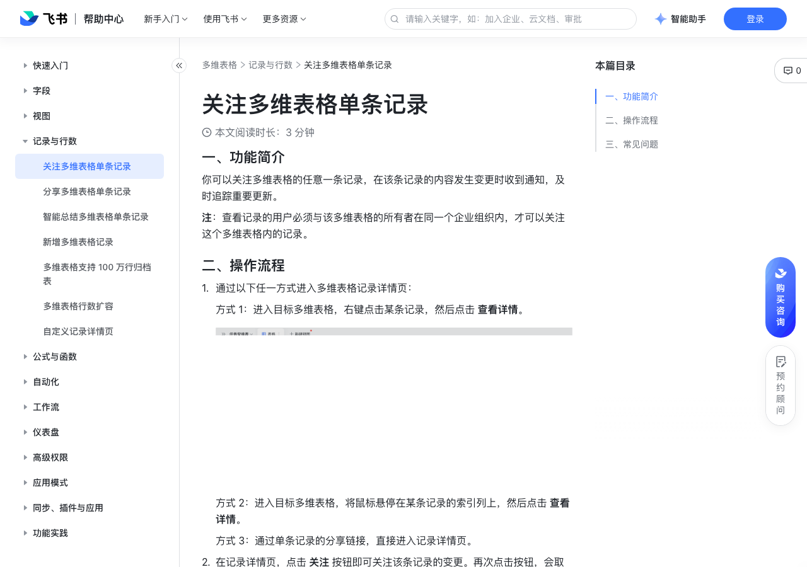

# 关注多维表格单条记录

> 来源：[飞书帮助中心](https://www.feishu.cn/hc/zh-CN/articles/453817491270)  
> 分类：多维表格 / 记录与行数  
> 抓取时间：2026-09-22T01:23:45.170Z

## 界面截图

### 文档内配图

1. 配图：https://p1-hera.feishucdn.com/tos-cn-i-jbbdkfciu3/96c14ce24a8f43229456e687da504680~tplv-jbbdkfciu3-image:0:0.image
2. 配图：https://p1-hera.feishucdn.com/tos-cn-i-jbbdkfciu3/738e579733e84e799f8ff1a36abb884f~tplv-jbbdkfciu3-image:0:0.image

## 功能定位

本页对应飞书帮助中心「多维表格 / 记录与行数」下的「关注多维表格单条记录」。以下需求描述依据官方说明文档提炼，用于指导 DuoWei 对标实现。

## 功能目标

一、功能简介

## 文档结构（官方章节）

- 一、功能简介​
- 二、操作流程​
- 三、常见问题​

## 详细功能说明

一、功能简介

二、操作流程

通过以下任一方式进入多维表格记录详情页：

方式 1：进入目标多维表格，右键点击某条记录，然后点击 查看详情。

250px|700px|reset

方式 2：进入目标多维表格，将鼠标悬停在某条记录的索引列上，然后点击 查看详情。

方式 3：通过单条记录的分享链接，直接进入记录详情页。

在记录详情页，点击 关注 按钮即可关注该条记录的变更。再次点击按钮，会取消关注。

当你关注某条记录后，如果对记录中各字段内容进行编辑和清空操作（包括由自动化流程、API 触发的单条记录的内容变更），对应的多维表格应用机器人会立即向你发送通知消息。

记录的编辑者（即触发变更的人）不会收到变更通知。

以下操作不会触发变更通知，但可在历史记录中查看。

批量编辑操作：如在表格视图内批量复制粘贴数据、批量 API 写入信息等。

对整列信息所做的编辑操作：如字段类型的变更、字段的删除。

三、常见问题

问：为什么我无法看到多维表格关注记录的入口？

答：这可能是由于你和多维表格所有者不在同一个企业组织内。

问：若对方关注了多维表格某条记录，但没有记录中某个字段的阅读权限，当我编辑这个字段时，对方是否会收到通知？

答：不会。若多维表格开启了高级权限，关注该条记录的用户没有其中某一字段的阅读权限，那么当这一字段的内容发生修改时，不会发送变更通知。

问：我关注了某条多维表格记录，在失去该条记录的访问权限后还能收到变更通知吗？

答：不能。没有该条记录的访问权限后，就不会再收到变更通知；当权限恢复时，恢复发送通知。

## 实现要点（对标 DuoWei）

1. **入口与信息架构**：在产品中明确该能力所属模块（记录与行数），并保证用户可从对应导航触达。
2. **核心交互**：按上文「详细功能说明」还原主要操作路径；截图中出现的按钮、字段、面板命名尽量与飞书语义一致或可映射。
3. **数据与权限**：若文档涉及可见范围、可编辑范围、分享或高级权限，实现时需落到角色/成员模型，并保证 API/MCP 与 UI 权限一致。
4. **边界与上限**：若文档提到数量上限、格式限制、导入导出约束，需在实现与错误提示中体现。
5. **验收**：以本页截图场景为用例，完成「能打开 / 能配置 / 能保存 / 能被 Agent 读写（如适用）」四项检查。

## 原始摘录摘要

> 一、功能简介 二、操作流程 通过以下任一方式进入多维表格记录详情页： 方式 1：进入目标多维表格，右键点击某条记录，然后点击 查看详情。 250px|700px|reset 方式 2：进入目标多维表格，将鼠标悬停在某条记录的索引列上，然后点击 查看详情。 方式 3：通过单条记录的分享链接，直接进入记录详情页。 在记录详情页，点击 关注 按钮即可关注该条记录的变更。再次点击按钮，会取消关注。 当你关注某条记录后，如果对记录中各字段内容进行编辑和清空操作（包括由自动化流程、API 触发的单条记录的内容变更），对应的多维表格应用机器人会立即向你发送通知消息。 记录的编辑者（即触发变更的人）不会收到变更通知。 以下操作不会触发变更通知，但可在历史记录中查看。 批量编辑操作：如在表格视图内批量复制粘贴数据、批量 API 写入信息等。 对整列信息所做的编辑操作：如字段类型的变更、字段的删除。 三、常见问题 问：为什么我无法看到多维表格关注记录的入口？ 答：这可能是由于你和多维表格所有者不在同一个企业组织内。 问：若对方关注了多维表格某条记录，但没有记录中某个字段的阅读权限，当我编辑这个字段时，对方是否会收到通知？ 答：不会。若多维表格开启了高级权限，关注该条记录的用户没有其中某一字段的阅读权限，那么当这一字段的内容发生修改时，不会发送变更通知。 问：我关注了某条多维表格记录，在失去该条记录的访问权限后还能收到变更通知吗？ 答：不能。没有该条记录的访问权限后，就不会再收到变更通知；当权限恢复时，恢复发送通知。

## 元数据

- article_id: `7287905927754186780`
- category_id: `7341334412564381698`
- path: `/hc/zh-CN/articles/453817491270`
- extracted_text_length: 658
