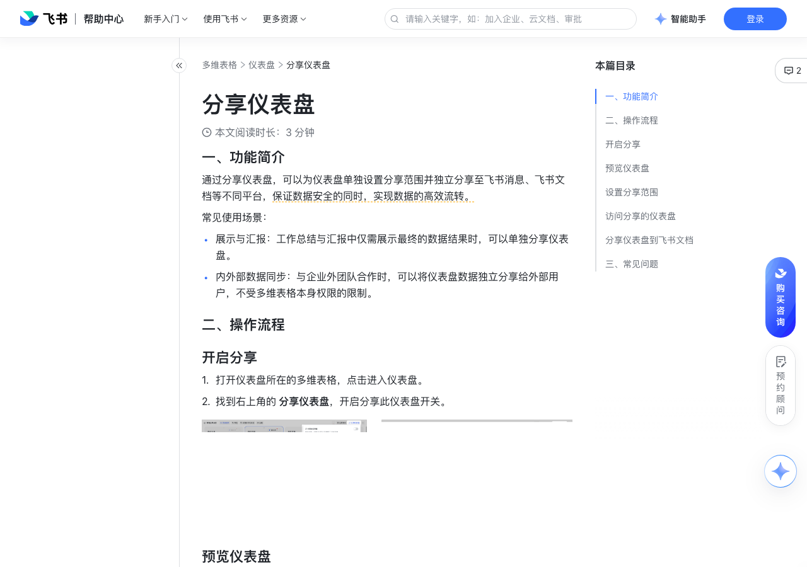

# 分享仪表盘

> 来源：[飞书帮助中心](https://www.feishu.cn/hc/zh-CN/articles/338781326544)  
> 分类：多维表格 / 仪表盘  
> 抓取时间：2026-09-22T01:25:13.805Z

## 界面截图

### 文档内配图

1. 配图：https://p1-hera.feishucdn.com/tos-cn-i-jbbdkfciu3/b6caaca8014541508a10dd9d8d2c0c74~tplv-jbbdkfciu3-image:0:0.image
2. 配图：https://p1-hera.feishucdn.com/tos-cn-i-jbbdkfciu3/a6af0b82c704496aa247100c657c8806~tplv-jbbdkfciu3-image:0:0.image
3. image.png：https://p1-hera.feishucdn.com/tos-cn-i-jbbdkfciu3/67f59a96d68c4b3eb86f576765a1759d~tplv-jbbdkfciu3-png:0:0.png
4. 配图：https://p1-hera.feishucdn.com/tos-cn-i-jbbdkfciu3/7fef4c0e26ae4f5ab56cc320642f5786~tplv-jbbdkfciu3-image:0:0.image
5. 配图：https://p1-hera.feishucdn.com/tos-cn-i-jbbdkfciu3/2c95ac1f004246b298227b86cacc44c6~tplv-jbbdkfciu3-image:0:0.image
6. 配图：https://p1-hera.feishucdn.com/tos-cn-i-jbbdkfciu3/e220cbfe43274b88ab6391695be51956~tplv-jbbdkfciu3-image:0:0.image
7. 配图：https://p1-hera.feishucdn.com/tos-cn-i-jbbdkfciu3/7f6a0cb6c58549d08e2571025fe56687~tplv-jbbdkfciu3-image:0:0.image
8. 配图：https://p1-hera.feishucdn.com/tos-cn-i-jbbdkfciu3/3d657513d5914a81bbaa275e2c8a95ac~tplv-jbbdkfciu3-image:0:0.image

## 功能定位

本页对应飞书帮助中心「多维表格 / 仪表盘」下的「分享仪表盘」。以下需求描述依据官方说明文档提炼，用于指导 DuoWei 对标实现。

## 功能目标

一、功能简介

## 文档结构（官方章节）

- 一、功能简介​
- 二、操作流程​
- 开启分享​
- 预览仪表盘​
- 设置分享范围​
- 访问分享的仪表盘​
- 分享仪表盘到飞书文档​
- 三、常见问题​

## 详细功能说明

一、功能简介

常见使用场景：

展示与汇报：工作总结与汇报中仅需展示最终的数据结果时，可以单独分享仪表盘。

内外部数据同步：与企业外团队合作时，可以将仪表盘数据独立分享给外部用户，不受多维表格本身权限的限制。

二、操作流程

开启分享

打开仪表盘所在的多维表格，点击进入仪表盘。

找到右上角的 分享仪表盘，开启分享此仪表盘开关。

预览仪表盘

设置分享范围

访问分享的仪表盘

分享仪表盘到飞书文档

找到右上角的 分享此仪表盘，开启分享并复制仪表盘链接。

打开飞书文档，粘贴刚才复制的链接并选择显示为 链接视图、标题视图、卡片视图 或者 预览视图。

三、常见问题

问：谁可以分享仪表盘？

答：未开启高级权限时，拥有可编辑权限、可管理权限、多维表格所有者能看到“分享此仪表盘”的入口并获取分享链接。开启高级权限时，仅可管理权限、多维表格所有者能看到“分此享仪表盘”的入口并获取分享链接。

问：分享的仪表盘能被编辑吗？

答：不能，分享的仪表盘仅可被查看，不支持编辑操作，也不能查看数据详情。

问：分享的仪表盘的数据是实时自动更新吗？

答：每次访问仪表盘的分享链接时将获取最新数据；在查看过程中如果数据发生变更，将收到刷新提示，此时点击刷新即可查看最新数据。

问：开启高级权限后会影响仪表盘的分享吗？

答：不会，仪表盘的分享独立于多维表格权限设置。

问：可以将仪表盘分享给外部用户吗？

答：可以，将分享范围设置为“互联网上获得链接的人可阅读”即可。注：如果仪表盘所在多维表格设置了文档密级、或文档/知识库权限中设置了不可对外分享，仪表盘将无法设置为“互联网上获得链接的人可阅读”。如仪表盘在此前已设置了可对外分享，外部用户获得链接后将无法访问仪表盘。

问：在会话界面发送的仪表盘，为什么有的显示为色块，有的显示为真实的缩略图？

答：这是由于分享到会话的方式不同。当你通过“分享仪表盘”的方式，将仪表盘的分享链接粘贴至会话并发送，发送出去的仪表盘会显示为通用的色块，不展示仪表盘的详细图表内容。此时，消息左下角会显示“查看分享的仪表盘”的字样。250px|700px|reset250px|700px|reset当你通过“自动化流程发送仪表盘”的方式，将仪表盘发送到会话，此时自动化流程发送的是仪表盘的截图，因此会显示为真实的缩略图。此时，消息左下角会显示“来自{多维表格名称}”的字样，证明这条消息是由多维表格中的自动化流程发送的。250px|700px|reset250px|700px|reset

问：A 多维表格文件中的仪表盘可以复制到 B 多维表格文件中吗？

答：不可以。

问：多维表格的仪表盘能否导出为图片？

答：暂不支持以图片格式导出仪表盘。当使用自动化流程发送仪表盘时，仪表盘将以图片格式发送给接收者。

## 实现要点（对标 DuoWei）

1. **入口与信息架构**：在产品中明确该能力所属模块（仪表盘），并保证用户可从对应导航触达。
2. **核心交互**：按上文「详细功能说明」还原主要操作路径；截图中出现的按钮、字段、面板命名尽量与飞书语义一致或可映射。
3. **数据与权限**：若文档涉及可见范围、可编辑范围、分享或高级权限，实现时需落到角色/成员模型，并保证 API/MCP 与 UI 权限一致。
4. **边界与上限**：若文档提到数量上限、格式限制、导入导出约束，需在实现与错误提示中体现。
5. **验收**：以本页截图场景为用例，完成「能打开 / 能配置 / 能保存 / 能被 Agent 读写（如适用）」四项检查。

## 原始摘录摘要

> 一、功能简介 常见使用场景： 展示与汇报：工作总结与汇报中仅需展示最终的数据结果时，可以单独分享仪表盘。 内外部数据同步：与企业外团队合作时，可以将仪表盘数据独立分享给外部用户，不受多维表格本身权限的限制。 二、操作流程 开启分享 打开仪表盘所在的多维表格，点击进入仪表盘。 找到右上角的 分享仪表盘，开启分享此仪表盘开关。 预览仪表盘 设置分享范围 访问分享的仪表盘 分享仪表盘到飞书文档 找到右上角的 分享此仪表盘，开启分享并复制仪表盘链接。 打开飞书文档，粘贴刚才复制的链接并选择显示为 链接视图、标题视图、卡片视图 或者 预览视图。 三、常见问题 问：谁可以分享仪表盘？ 答：未开启高级权限时，拥有可编辑权限、可管理权限、多维表格所有者能看到“分享此仪表盘”的入口并获取分享链接。开启高级权限时，仅可管理权限、多维表格所有者能看到“分此享仪表盘”的入口并获取分享链接。 问：分享的仪表盘能被编辑吗？ 答：不能，分享的仪表盘仅可被查看，不支持编辑操作，也不能查看数据详情。 问：分享的仪表盘的数据是实时自动更新吗？ 答：每次访问仪表盘的分享链接时将获取最新数据；在查看过程中如果数据发生变更，将收到刷新提示，此时点击刷新即可查看最新数据。 问：开启高级权限后会影响仪表盘的分享吗？ 答：不会，仪表盘的分享独立于多维表格权限设置。 问：可以将仪表盘分享给外部用户吗？ 答：可以，将分享范围设置为“互联网上获得链接的人可阅读”即可。注：如果仪表盘所在多维表格设置了文档密级、或文档/知识库权限中设置了不可对外分享，仪表盘将无法设置为“互联网上获得链接的人可阅读”。如仪表盘在此前已设置了可对外分享，外部用户获得链接后将无法访问仪表盘。 问：在会话界面发送的仪表盘，为什么有的显示为色块，有的显示为真实的缩略图？ 答：这是由于分享到会话的方式不同。当你通过“分享仪表盘”的方式，将仪表盘的分享链接粘贴…

## 元数据

- article_id: `7143917391045459969`
- category_id: `7165754521875005468`
- path: `/hc/zh-CN/articles/338781326544`
- extracted_text_length: 1151
