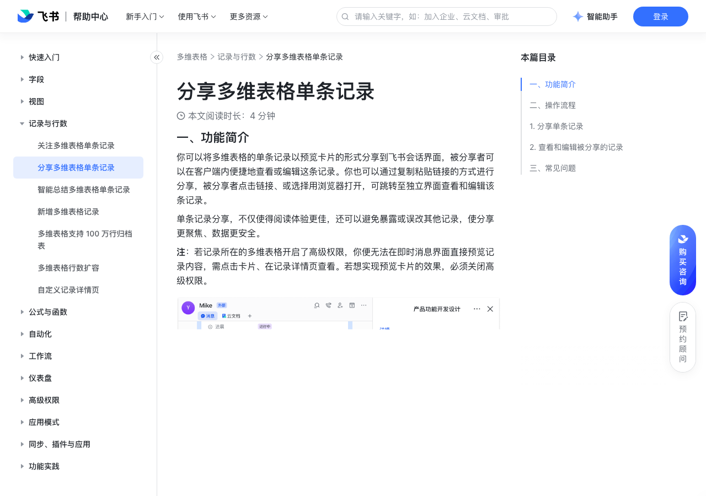

# 分享多维表格单条记录

> 来源：[飞书帮助中心](https://www.feishu.cn/hc/zh-CN/articles/450170798997)  
> 分类：多维表格 / 记录与行数  
> 抓取时间：2026-09-22T01:23:45.144Z

## 界面截图

### 文档内配图

1. 配图：https://p1-hera.feishucdn.com/tos-cn-i-jbbdkfciu3/603520ed49824a908b8b7bbd839aa63d~tplv-jbbdkfciu3-image:0:0.image
2. 配图：https://p1-hera.feishucdn.com/tos-cn-i-jbbdkfciu3/c9bab1a0437c4d52a51312dec8bc144e~tplv-jbbdkfciu3-image:0:0.image
3. 配图：https://p1-hera.feishucdn.com/tos-cn-i-jbbdkfciu3/4e772c0b639343aaa8171333ff48890a~tplv-jbbdkfciu3-image:0:0.image
4. 配图：https://p1-hera.feishucdn.com/tos-cn-i-jbbdkfciu3/3a70a47cc2d24e87b48e3a337026e590~tplv-jbbdkfciu3-image:0:0.image
5. 配图：https://p1-hera.feishucdn.com/tos-cn-i-jbbdkfciu3/9da5d9240267486e90d3965ed3a791b5~tplv-jbbdkfciu3-image:0:0.image

## 功能定位

本页对应飞书帮助中心「多维表格 / 记录与行数」下的「分享多维表格单条记录」。以下需求描述依据官方说明文档提炼，用于指导 DuoWei 对标实现。

## 功能目标

一、功能简介

## 文档结构（官方章节）

- 一、功能简介​
- 常用场景​
- 二、操作流程​
- 分享单条记录​
- 查看和编辑被分享的记录​
- 三、常见问题​

## 详细功能说明

一、功能简介

常用场景

聚焦协作：针对选定的记录进行分享，协作更聚焦。例如，需由不同部门合作处理的工单，可将单条工单记录分享至群聊，不同部门可直接参考此条信息进行协作、填写对应内容，避免混用或误改其他工单信息。

数据保护：仅分享和查看想要展示的单条信息，避免暴露原表其他数据。例如，单个面试候选人的信息可直接发送给对应的 HR 及面试官，在便捷地查看和填写评价的同时，还能避免暴露其他候选人信息。

二、操作流程

分享单条记录

右键点击某条记录的任意单元格 > 分享此记录。

右键点击某条记录的任意单元格 > 展开详情，或点击索引列的 详情 按钮，在记录详情页的右上角点击 分享。

查看和编辑被分享的记录

注：若记录所在的多维表格开启了高级权限，你便无法在即时消息界面直接预览记录内容，需点击卡片、在记录详情页查看。若想实现预览卡片的效果，必须关闭高级权限。

三、常见问题

问：谁可以分享单条记录？

答：对该条记录拥有阅读权限的用户均可进行分享。

问：谁可以查看或编辑被分享的记录？

答：对被分享记录的阅读和编辑权限，取决于原多维表格的权限和高级权限设置。

问：被分享的记录数据是否可以自动更新？

答：是。被分享的记录可自动更新数据；同时，你也可以手动刷新界面来查看最新数据（客户端内刷新路径：在记录详情页的右上角选择 ··· > 刷新）。

问：是否支持一次性分享多条记录？

答：暂不支持。

问：消息预览卡片中的字段及其顺序是如何展示的？

答：预览卡片最多展示包括索引列在内的前 6 个字段（索引列字段作为卡片标题），展示的字段及其顺序与多维表格内该数据表的首个非表单视图的字段配置保持一致。预览卡片中暂不支持展示复选框、附件、按钮、群组、条码、进度、货币字段。

## 实现要点（对标 DuoWei）

1. **入口与信息架构**：在产品中明确该能力所属模块（记录与行数），并保证用户可从对应导航触达。
2. **核心交互**：按上文「详细功能说明」还原主要操作路径；截图中出现的按钮、字段、面板命名尽量与飞书语义一致或可映射。
3. **数据与权限**：若文档涉及可见范围、可编辑范围、分享或高级权限，实现时需落到角色/成员模型，并保证 API/MCP 与 UI 权限一致。
4. **边界与上限**：若文档提到数量上限、格式限制、导入导出约束，需在实现与错误提示中体现。
5. **验收**：以本页截图场景为用例，完成「能打开 / 能配置 / 能保存 / 能被 Agent 读写（如适用）」四项检查。

## 原始摘录摘要

> 一、功能简介 常用场景 聚焦协作：针对选定的记录进行分享，协作更聚焦。例如，需由不同部门合作处理的工单，可将单条工单记录分享至群聊，不同部门可直接参考此条信息进行协作、填写对应内容，避免混用或误改其他工单信息。 数据保护：仅分享和查看想要展示的单条信息，避免暴露原表其他数据。例如，单个面试候选人的信息可直接发送给对应的 HR 及面试官，在便捷地查看和填写评价的同时，还能避免暴露其他候选人信息。 二、操作流程 分享单条记录 右键点击某条记录的任意单元格 > 分享此记录。 右键点击某条记录的任意单元格 > 展开详情，或点击索引列的 详情 按钮，在记录详情页的右上角点击 分享。 查看和编辑被分享的记录 注：若记录所在的多维表格开启了高级权限，你便无法在即时消息界面直接预览记录内容，需点击卡片、在记录详情页查看。若想实现预览卡片的效果，必须关闭高级权限。 三、常见问题 问：谁可以分享单条记录？ 答：对该条记录拥有阅读权限的用户均可进行分享。 问：谁可以查看或编辑被分享的记录？ 答：对被分享记录的阅读和编辑权限，取决于原多维表格的权限和高级权限设置。 问：被分享的记录数据是否可以自动更新？ 答：是。被分享的记录可自动更新数据；同时，你也可以手动刷新界面来查看最新数据（客户端内刷新路径：在记录详情页的右上角选择 ··· > 刷新）。 问：是否支持一次性分享多条记录？ 答：暂不支持。 问：消息预览卡片中的字段及其顺序是如何展示的？ 答：预览卡片最多展示包括索引列在内的前 6 个字段（索引列字段作为卡片标题），展示的字段及其顺序与多维表格内该数据表的首个非表单视图的字段配置保持一致。预览卡片中暂不支持展示复选框、附件、按钮、群组、条码、进度、货币字段。

## 元数据

- article_id: `7241161607416381468`
- category_id: `7341334412564381698`
- path: `/hc/zh-CN/articles/450170798997`
- extracted_text_length: 730
