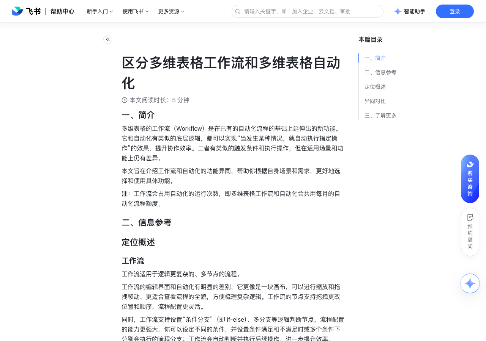

# 区分多维表格工作流和多维表格自动化

> 来源：[飞书帮助中心](https://www.feishu.cn/hc/zh-CN/articles/470261575139)  
> 分类：多维表格 / 工作流  
> 抓取时间：2026-09-22T01:24:07.811Z

## 界面截图

### 文档内配图

1. 配图：https://p1-hera.feishucdn.com/tos-cn-i-jbbdkfciu3/5505533a9c2d4469942d30c59c9651ea~tplv-jbbdkfciu3-image:0:0.image
2. 配图：https://p1-hera.feishucdn.com/tos-cn-i-jbbdkfciu3/a2ea77932ae4426eb2b3f6b71a8d190b~tplv-jbbdkfciu3-image:0:0.image
3. 配图：https://p1-hera.feishucdn.com/tos-cn-i-jbbdkfciu3/3a91480bb679462fba5580008b551c3b~tplv-jbbdkfciu3-image:0:0.image

## 功能定位

本页对应飞书帮助中心「多维表格 / 工作流」下的「区分多维表格工作流和多维表格自动化」。以下需求描述依据官方说明文档提炼，用于指导 DuoWei 对标实现。

## 功能目标

一、简介

## 文档结构（官方章节）

- 一、简介​
- 二、信息参考​
- 定位概述​
- 工作流​
- 自动化​
- 异同对比​
- 功能入口及配置界面​
- 节点编辑​
- 三、了解更多​

## 详细功能说明

一、简介

二、信息参考

定位概述

异同对比

功能入口及配置界面

节点编辑

触发条件

支持以下触发条件设置 添加新记录时、修改记录时、新增/修改的记录满足条件时、到达记录中的时间时、定时触发、点击按钮时 和 接收到 webhook 时、 接收到飞书消息时 作为触发条件。

与自动化相同。

执行操作

支持基础操作、飞书应用、自定义插件等多种执行操作。

和自动化相比，还支持条件判断等逻辑节点、多种 AI 功能节点，且提供节点捷径中心，可选择更多类型的节点。

节点命名

节点名称不可编辑，不支持自定义。

支持自定义节点的名称。

节点拖拽

支持拖拽节点以更改顺序。

三、了解更多

什么是多维表格工作流

使用多维表格自动化流程

自动化流程触发条件与执行操作一览

使用多维表格工作流

| 自动化 | 工作流

触发条件 | 支持以下触发条件设置 添加新记录时、修改记录时、新增/修改的记录满足条件时、到达记录中的时间时、定时触发、点击按钮时 和 接收到 webhook 时、 接收到飞书消息时 作为触发条件。 | 与自动化相同。

执行操作 | 支持基础操作、飞书应用、自定义插件等多种执行操作。 | 和自动化相比，还支持条件判断等逻辑节点、多种 AI 功能节点，且提供节点捷径中心，可选择更多类型的节点。

节点命名 | 节点名称不可编辑，不支持自定义。 | 支持自定义节点的名称。

节点拖拽 | 不支持 | 支持拖拽节点以更改顺序。

## 实现要点（对标 DuoWei）

1. **入口与信息架构**：在产品中明确该能力所属模块（工作流），并保证用户可从对应导航触达。
2. **核心交互**：按上文「详细功能说明」还原主要操作路径；截图中出现的按钮、字段、面板命名尽量与飞书语义一致或可映射。
3. **数据与权限**：若文档涉及可见范围、可编辑范围、分享或高级权限，实现时需落到角色/成员模型，并保证 API/MCP 与 UI 权限一致。
4. **边界与上限**：若文档提到数量上限、格式限制、导入导出约束，需在实现与错误提示中体现。
5. **验收**：以本页截图场景为用例，完成「能打开 / 能配置 / 能保存 / 能被 Agent 读写（如适用）」四项检查。

## 原始摘录摘要

> 一、简介 二、信息参考 定位概述 异同对比 功能入口及配置界面 节点编辑 触发条件 支持以下触发条件设置 添加新记录时、修改记录时、新增/修改的记录满足条件时、到达记录中的时间时、定时触发、点击按钮时 和 接收到 webhook 时、 接收到飞书消息时 作为触发条件。 与自动化相同。 执行操作 支持基础操作、飞书应用、自定义插件等多种执行操作。 和自动化相比，还支持条件判断等逻辑节点、多种 AI 功能节点，且提供节点捷径中心，可选择更多类型的节点。 节点命名 节点名称不可编辑，不支持自定义。 支持自定义节点的名称。 节点拖拽 支持拖拽节点以更改顺序。 三、了解更多 什么是多维表格工作流 使用多维表格自动化流程 自动化流程触发条件与执行操作一览 使用多维表格工作流 | 自动化 | 工作流 触发条件 | 支持以下触发条件设置 添加新记录时、修改记录时、新增/修改的记录满足条件时、到达记录中的时间时、定时触发、点击按钮时 和 接收到 webhook 时、 接收到飞书消息时 作为触发条件。 | 与自动化相同。 执行操作 | 支持基础操作、飞书应用、自定义插件等多种执行操作。 | 和自动化相比，还支持条件判断等逻辑节点、多种 AI 功能节点，且提供节点捷径中心，可选择更多类型的节点。 节点命名 | 节点名称不可编辑，不支持自定义。 | 支持自定义节点的名称。 节点拖拽 | 不支持 | 支持拖拽节点以更改顺序。

## 元数据

- article_id: `7408841918977572867`
- category_id: `7415964452380049412`
- path: `/hc/zh-CN/articles/470261575139`
- extracted_text_length: 609
