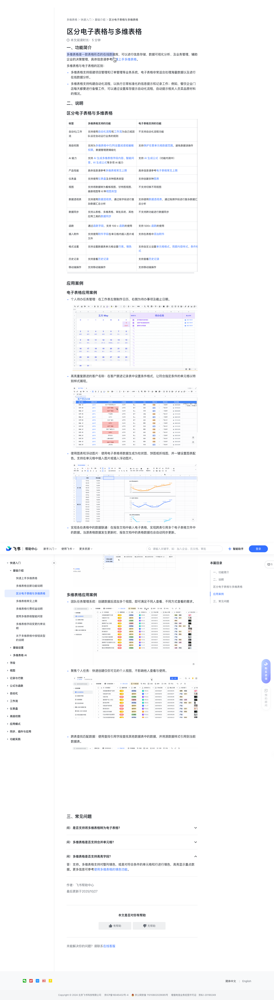

# 区分电子表格与多维表格

> 来源：[飞书帮助中心](https://www.feishu.cn/hc/zh-CN/articles/501142825365)  
> 分类：多维表格 / 快速入门 / 基础介绍  
> 抓取时间：2026-09-22T00:43:31.800Z

## 界面截图

### 文档内配图

1. 配图：https://p1-hera.feishucdn.com/tos-cn-i-jbbdkfciu3/54facaee98b54218b1af4bc1d072a0c7~tplv-jbbdkfciu3-image:0:0.image
2. 配图：https://p1-hera.feishucdn.com/tos-cn-i-jbbdkfciu3/d5828e2675c44231a0fa37fac8c08731~tplv-jbbdkfciu3-image:0:0.image
3. 配图：https://p1-hera.feishucdn.com/tos-cn-i-jbbdkfciu3/d6580ffe4954494d8c3c2ec2550a821e~tplv-jbbdkfciu3-image:0:0.image
4. 配图：https://p1-hera.feishucdn.com/tos-cn-i-jbbdkfciu3/98418c3ab6a3495997242c2e7e91e117~tplv-jbbdkfciu3-image:0:0.image
5. 配图：https://p1-hera.feishucdn.com/tos-cn-i-jbbdkfciu3/2da750d72f1f481bab19302d555ea8b4~tplv-jbbdkfciu3-image:0:0.image
6. 配图：https://p1-hera.feishucdn.com/tos-cn-i-jbbdkfciu3/5bc98d2ed5364b2d8764caee625db71a~tplv-jbbdkfciu3-image:0:0.image
7. 查找引用操作.gif：https://p1-hera.feishucdn.com/tos-cn-i-jbbdkfciu3/3cac88e7048b48a29649cf3ba99b8855~tplv-jbbdkfciu3-image:0:0.image

## 功能定位

本页对应飞书帮助中心「多维表格 / 快速入门 / 基础介绍」下的「区分电子表格与多维表格」。以下需求描述依据官方说明文档提炼，用于指导 DuoWei 对标实现。

## 功能目标

一、功能简介

## 文档结构（官方章节）

- 一、功能简介​
- 二、说明​
- 区分电子表格与多维表格​
- 应用案例​
- 电子表格应用案例​
- 多维表格应用案例​
- 三、常见问题​

## 详细功能说明

一、功能简介

多维表格支持搭建项目管理和订单管理等业务系统，电子表格非常适合处理海量数据以及进行在线数据分析。

多维表格支持构建自动化流程，以执行日常标准化的信息提示和记录工作；例如，餐饮企业门店每天都要进行备餐工作，可以通过设置库存提示自动化流程，自动提示相关人员菜品原材料的情况。

二、说明

区分电子表格与多维表格

多维表格支持的功能

电子表格支持的功能

自动化/工作流

支持使用自动化流程和工作流为自己或团队设定自动运行业务的规则

不支持自动化流程功能

高级权限

支持为多维表格中行/列设置阅读或编辑权限，数据管理更精细化

支持保护任意单元格数据范围，避免数据误操作

AI 能力

支持 AI 生成多维表格字段内容、智能问答、AI 生成公式等多项 AI 能力

支持 AI 生成公式（功能内测中）

产品性能

具体信息请参考多维表格常见上限

具体信息请参考电子表格常见上限

支持使用仪表盘及多种图表类型

支持创建多种图表

支持将数据转为看板视图、甘特图视图、画册视图等 6 种视图类型

不支持切换不同视图

数据透视表

支持使用数据透视表，通过拖字段进行复杂数据汇总分析

支持使用数据透视表，通过拖拽字段进行复杂数据汇总分析

数据同步

支持从表格、多维表格、审批系统、其他应用工具的数据同步

不支持跨功能进行数据同步

通过函数字段，支持 100 + 函数的使用

支持 500+ 函数的使用

插入附件

支持使用附件字段在单元格内插入图片或文件

支持在表格中添加附件

格式设置

支持设置数据表单元格设置行高、填色

支持自定义设置单元格格式、局部内容样式、条件格式

历史记录

支持查看历史记录

移动端操作

支持移动端操作

应用案例

电子表格应用案例

个人待办任务管理：在工作表左侧制作日历，右侧为待办事项及截止日期。

高亮重复跟进的客户名称：在客户跟进记录表中设置条件格式，让符合指定条件的单元格以特别样式展现。

使用图表和浮动图片：使用电子表格将数据生成为柱状图、饼图或折线图，并一键设置图表配色。支持在单元格中插入图片或插入浮动图片。

实现各处表格中的数据联通：在报告文档中嵌入电子表格，实现跨表引用多个电子表格文件中的数据。当源表格数据发生更新时，报告文档中的表格数据也会自动同步更新。

多维表格应用案例

团队任务管理系统：创建数据后添加多个视图，即可满足不同人查看、不同方式查看的需求。

聚焦个人任务：快速创建仅你可见的个人视图，不影响他人查看与使用。

跨表查找匹配数据：使用查找引用字段查找其他数据表中的数据，并将源数据样式引用到当前数据表。

三、常见问题

一、功能简介多维表格是一款表格形态的在线数据库，对内容有疑问？选中评论吧我们将评估你的评论，及时优化内容知道了可以进行信息存储、数据可视化分析、及业务管理，辅助企业的决策管理，具体信息请参考快速上手多维表格。多维表格与电子表格的区别：多维表格支持搭建项目管理和订单管理等业务系统，电子表格非常适合处理海量数据以及进行在线数据分析。多维表格支持构建自动化流程，以执行日常标准化的信息提示和记录工作；例如，餐饮企业门店每天都要进行备餐工作，可以通过设置库存提示自动化流程，自动提示相关人员菜品原材料的情况。二、说明区分电子表格与多维表格标签多维表格支持的功能电子表格支持的功能自动化/工作流支持使用自动化流程和工作流为自己或团队设定自动运行业务的规则不支持自动化流程功能高级权限支持为多维表格中行/列设置阅读或编辑权限，数据管理更精细化支持保护任意单元格数据范围，避免数据误操作AI 能力支持 AI 生成多维表格字段内容、智能问答、AI 生成公式等多项 AI 能力 支持 AI 生成公式（功能内测中）产品性能具体信息请参考多维表格常见上限具体信息请参考电子表格常见上限仪表盘支持使用仪表盘及多种图表类型支持创建多种图表视图支持将数据转为看板视图、甘特图视图、画册视图等 6 种视图类型不支持切换不同视图数据透视表支持使用数据透视表，通过拖字段进行复杂数据汇总分析支持使用数据透视表，通过拖拽字段进行复杂数据汇总分析数据同步支持从表格、多维表格、审批系统、其他应用工具的数据同步不支持跨功能进行数据同步函数通过函数字段，支持 100 + 函数的使用支持 500+ 函数的使用插入附件支持使用附件字段在单元格内插入图片或文件支持在表格中添加附件格式设置支持设置数据表单元格设置行高、填色支持自定义设置单元格格式、局部内容样式、条件格式历史记录支持查看历史记录支持查看历史记录移动端操作支持移动端操作支持移动端操作应用案例电子表格应用案例个人待办任务管理：在工作表左侧制作日历，右侧为待办事项及截止日期。 250px|700px|reset高亮重复跟进的客户名称：在客户跟进记录表中设置条件格式，让符合指定条件的单元格以特别样式展现。250px|700px|reset使用图表和浮动图片：使用电子表格将数据生成为柱状图、饼图或折线图，并一键设置图表配色。支持在单元格中插入图片或插入浮动图片。 250px|700px|reset实现各处表格中的数据联通：在报告文档中嵌入电子表格，实现跨表引用多个电子表格文件中的数据。当源表格数据发生更新时，报告文档中的表格数据也会自动同步更新。250px|700px|reset多维表格应用案例团队任务管理系统：创建数据后添加多个视图，即可满足不同人查看、不同方式查看的需求。250px|700px|reset聚焦个人任务：快速创建仅你可见的个人视图，不影响他人查看与使用。 250px|700px|reset跨表查找匹配数据：使用查找引用字段查找其他数据表中的数据，并将源数据样式引用到当前数据表。250px|700px|reset三、常见问题

标签 | 多维表格支持的功能 | 电子表格支持的功能

自动化/工作流 | 支持使用自动化流程和工作流为自己或团队设定自动运行业务的规则 | 不支持自动化流程功能

高级权限 | 支持为多维表格中行/列设置阅读或编辑权限，数据管理更精细化 | 支持保护任意单元格数据范围，避免数据误操作

AI 能力 | 支持 AI 生成多维表格字段内容、智能问答、AI 生成公式等多项 AI 能力 | 支持 AI 生成公式（功能内测中）

产品性能 | 具体信息请参考多维表格常见上限 | 具体信息请参考电子表格常见上限

仪表盘 | 支持使用仪表盘及多种图表类型 | 支持创建多种图表

视图 | 支持将数据转为看板视图、甘特图视图、画册视图等 6 种视图类型 | 不支持切换不同视图

数据透视表 | 支持使用数据透视表，通过拖字段进行复杂数据汇总分析 | 支持使用数据透视表，通过拖拽字段进行复杂数据汇总分析

数据同步 | 支持从表格、多维表格、审批系统、其他应用工具的数据同步 | 不支持跨功能进行数据同步

函数 | 通过函数字段，支持 100 + 函数的使用 | 支持 500+ 函数的使用

插入附件 | 支持使用附件字段在单元格内插入图片或文件 | 支持在表格中添加附件

格式设置 | 支持设置数据表单元格设置行高、填色 | 支持自定义设置单元格格式、局部内容样式、条件格式

历史记录 | 支持查看历史记录 | 支持查看历史记录

移动端操作 | 支持移动端操作 | 支持移动端操作

## 实现要点（对标 DuoWei）

1. **入口与信息架构**：在产品中明确该能力所属模块（快速入门 / 基础介绍），并保证用户可从对应导航触达。
2. **核心交互**：按上文「详细功能说明」还原主要操作路径；截图中出现的按钮、字段、面板命名尽量与飞书语义一致或可映射。
3. **数据与权限**：若文档涉及可见范围、可编辑范围、分享或高级权限，实现时需落到角色/成员模型，并保证 API/MCP 与 UI 权限一致。
4. **边界与上限**：若文档提到数量上限、格式限制、导入导出约束，需在实现与错误提示中体现。
5. **验收**：以本页截图场景为用例，完成「能打开 / 能配置 / 能保存 / 能被 Agent 读写（如适用）」四项检查。

## 原始摘录摘要

> 一、功能简介 多维表格支持搭建项目管理和订单管理等业务系统，电子表格非常适合处理海量数据以及进行在线数据分析。 多维表格支持构建自动化流程，以执行日常标准化的信息提示和记录工作；例如，餐饮企业门店每天都要进行备餐工作，可以通过设置库存提示自动化流程，自动提示相关人员菜品原材料的情况。 二、说明 区分电子表格与多维表格 多维表格支持的功能 电子表格支持的功能 自动化/工作流 支持使用自动化流程和工作流为自己或团队设定自动运行业务的规则 不支持自动化流程功能 高级权限 支持为多维表格中行/列设置阅读或编辑权限，数据管理更精细化 支持保护任意单元格数据范围，避免数据误操作 AI 能力 支持 AI 生成多维表格字段内容、智能问答、AI 生成公式等多项 AI 能力 支持 AI 生成公式（功能内测中） 产品性能 具体信息请参考多维表格常见上限 具体信息请参考电子表格常见上限 支持使用仪表盘及多种图表类型 支持创建多种图表 支持将数据转为看板视图、甘特图视图、画册视图等 6 种视图类型 不支持切换不同视图 数据透视表 支持使用数据透视表，通过拖字段进行复杂数据汇总分析 支持使用数据透视表，通过拖拽字段进行复杂数据汇总分析 数据同步 支持从表格、多维表格、审批系统、其他应用工具的数据同步 不支持跨功能进行数据同步 通过函数字段，支持 100 + 函数的使用 支持 500+ 函数的使用 插入附件 支持使用附件字段在单元格内插入图片或文件 支持在表格中添加附件 格式设置 支持设置数据表单元格设置行高、填色 支持自定义设置单元格格式、局部内容样式、条件格式 历史记录 支持查看历史记录 移动端操作 支持移动端操作 应用案例 电子表格应用案例 个人待办任务管理：在工作表左侧制作日历，右侧为待办事项及截止日期。 高亮重复跟进的客户名称：在客户跟进记录表中设置条件格式，让符合指定条件的单元格以特别样式展…

## 元数据

- article_id: `6966915386017136641`
- category_id: `7225072370607013890`
- path: `/hc/zh-CN/articles/501142825365`
- extracted_text_length: 1286
