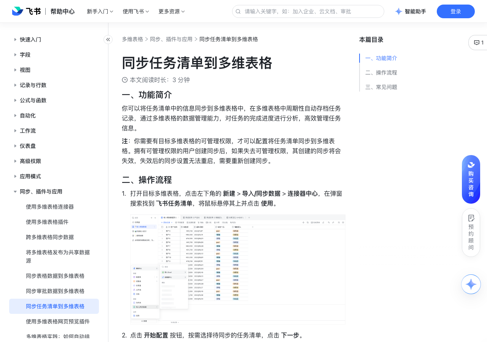

# 同步任务清单到多维表格

> 来源：[飞书帮助中心](https://www.feishu.cn/hc/zh-CN/articles/604887378842)  
> 分类：多维表格 / 同步、插件与应用  
> 抓取时间：2026-09-22T01:26:35.902Z

## 界面截图

### 文档内配图

1. 配图：https://p1-hera.feishucdn.com/tos-cn-i-jbbdkfciu3/f471dcbe0ade44c6946a902e7e00f575~tplv-jbbdkfciu3-image:0:0.image
2. 配图：https://p1-hera.feishucdn.com/tos-cn-i-jbbdkfciu3/af47a3569f424c2e992dc20d4ee5f60d~tplv-jbbdkfciu3-image:0:0.image
3. 配图：https://p1-hera.feishucdn.com/tos-cn-i-jbbdkfciu3/52512408df984d7d9ac2f8c6ee81c9a8~tplv-jbbdkfciu3-image:0:0.image

## 功能定位

本页对应飞书帮助中心「多维表格 / 同步、插件与应用」下的「同步任务清单到多维表格」。以下需求描述依据官方说明文档提炼，用于指导 DuoWei 对标实现。

## 功能目标

一、功能简介

## 文档结构（官方章节）

- 一、功能简介​
- 二、操作流程​
- 三、常见问题​

## 详细功能说明

一、功能简介

二、操作流程

打开目标多维表格，点击左下角的 新建 > 导入/同步数据 > 连接器中心，在弹窗搜索找到 飞书任务清单，将鼠标悬停其上并点击 使用。

250px|700px|reset

点击 开始配置 按钮，按需选择待同步的任务清单，点击 下一步。

注：你可以选择拥有阅读、编辑、管理权限的任务清单进行同步。

按需求选择待同步的字段及自动同步的频率即可。如开启 自动同步，数据源的更新将按每小时一次的频率自动同步至当前数据表。

保存并同步：点击 保存并同步 后，多维表格将自动生成带闪电标识的数据表，并自动同步所选字段内的任务清单数据。你可以按需进行如下操作：

重命名：数据表名称默认与任务清单一致。点击同步后的数据表右侧 ⋮ 图标，点击 重命名 并完成命名操作。

复制数据表：点击同步后的数据表右侧 ⋮ 图标，点击 复制数据表 即可，复制后的数据表将变为普通数据表，不支持自动同步源数据。

同步数据：如需手动同步数据，可点击同步后的数据表右侧 ⋮ 图标，点击 同步数据。

修改连接器配置：如需修改同步的字段、同步的时间范围，可点击同步后的数据表右侧 ⋮ 图标，点击 修改连接器配置。

移除配置：点击同步后的数据表右侧 ⋮ 图标，点击 移除配置，移除后同步表将变为普通数据表并保留已有数据，不再同步源数据。

三、常见问题

问：同步到多维表格中的任务清单，是否支持编辑？

答：不支持。

问：开启自动同步后，任务清单更新后会自动同步到多维表格中吗？

答：会，数据更新将每小时自动同步到多维表格中；同时支持点击数据表名称右侧 ⋮ 图标，点击 同步数据 即可手动同步。

问：在一个多维表格中是否支持同步多个任务清单？

答：支持，同一个任务清单会同步至多维表格的同一张数据表中。

问：同步在任务清单中创建的单个重复任务，会生成多少条多维表格记录？

答：重复任务在完成后，会自动产生下一个重复任务。因此重复任务在创建时同步至多维表格仅为单条记录，当重复任务在完成后，自动产生的下一个重复任务也会被同步至多维表格中，会生成下一条多维表格记录，直到任务完成，任务循环的所有次数，将会被同步至多维表格中形成记录。

问：是否支持同步任务至多维表格？

答：不支持，仅支持同步任务清单至多维表格。你可将任务添加到任务清单中，具体信息请参考将任务添加到任务清单中。

## 实现要点（对标 DuoWei）

1. **入口与信息架构**：在产品中明确该能力所属模块（同步、插件与应用），并保证用户可从对应导航触达。
2. **核心交互**：按上文「详细功能说明」还原主要操作路径；截图中出现的按钮、字段、面板命名尽量与飞书语义一致或可映射。
3. **数据与权限**：若文档涉及可见范围、可编辑范围、分享或高级权限，实现时需落到角色/成员模型，并保证 API/MCP 与 UI 权限一致。
4. **边界与上限**：若文档提到数量上限、格式限制、导入导出约束，需在实现与错误提示中体现。
5. **验收**：以本页截图场景为用例，完成「能打开 / 能配置 / 能保存 / 能被 Agent 读写（如适用）」四项检查。

## 原始摘录摘要

> 一、功能简介 二、操作流程 打开目标多维表格，点击左下角的 新建 > 导入/同步数据 > 连接器中心，在弹窗搜索找到 飞书任务清单，将鼠标悬停其上并点击 使用。 250px|700px|reset 点击 开始配置 按钮，按需选择待同步的任务清单，点击 下一步。 注：你可以选择拥有阅读、编辑、管理权限的任务清单进行同步。 按需求选择待同步的字段及自动同步的频率即可。如开启 自动同步，数据源的更新将按每小时一次的频率自动同步至当前数据表。 保存并同步：点击 保存并同步 后，多维表格将自动生成带闪电标识的数据表，并自动同步所选字段内的任务清单数据。你可以按需进行如下操作： 重命名：数据表名称默认与任务清单一致。点击同步后的数据表右侧 ⋮ 图标，点击 重命名 并完成命名操作。 复制数据表：点击同步后的数据表右侧 ⋮ 图标，点击 复制数据表 即可，复制后的数据表将变为普通数据表，不支持自动同步源数据。 同步数据：如需手动同步数据，可点击同步后的数据表右侧 ⋮ 图标，点击 同步数据。 修改连接器配置：如需修改同步的字段、同步的时间范围，可点击同步后的数据表右侧 ⋮ 图标，点击 修改连接器配置。 移除配置：点击同步后的数据表右侧 ⋮ 图标，点击 移除配置，移除后同步表将变为普通数据表并保留已有数据，不再同步源数据。 三、常见问题 问：同步到多维表格中的任务清单，是否支持编辑？ 答：不支持。 问：开启自动同步后，任务清单更新后会自动同步到多维表格中吗？ 答：会，数据更新将每小时自动同步到多维表格中；同时支持点击数据表名称右侧 ⋮ 图标，点击 同步数据 即可手动同步。 问：在一个多维表格中是否支持同步多个任务清单？ 答：支持，同一个任务清单会同步至多维表格的同一张数据表中。 问：同步在任务清单中创建的单个重复任务，会生成多少条多维表格记录？ 答：重复任务在完成后，会自动产生下一个重复任务。因…

## 元数据

- article_id: `7353178020016324610`
- category_id: `7225134052943200257`
- path: `/hc/zh-CN/articles/604887378842`
- extracted_text_length: 975
