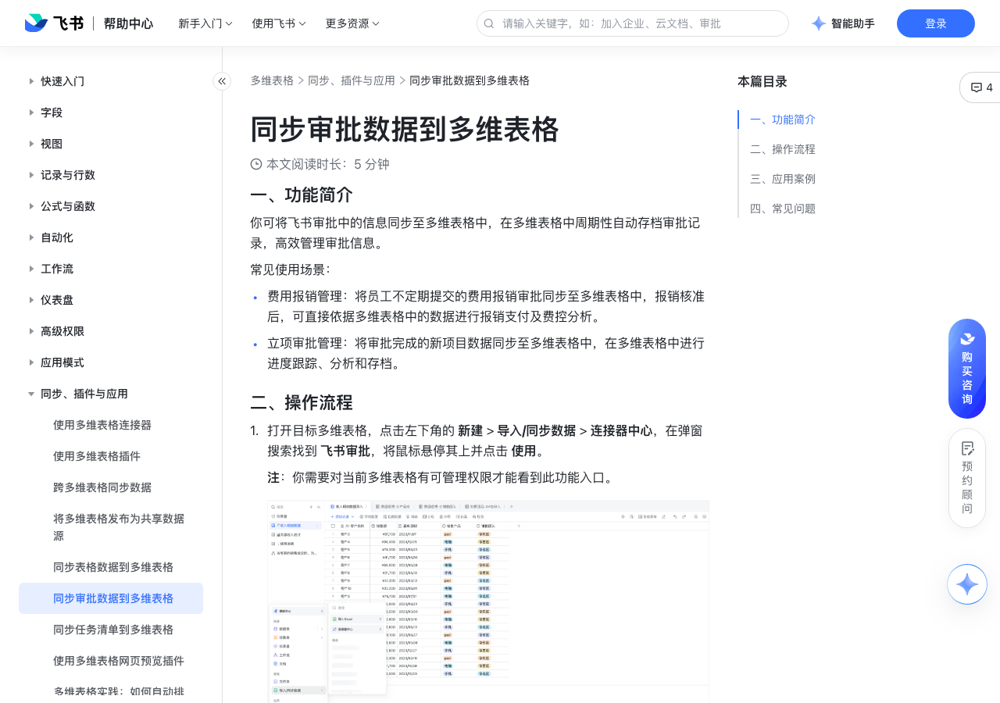

# 同步审批数据到多维表格

> 来源：[飞书帮助中心](https://www.feishu.cn/hc/zh-CN/articles/276492308920)  
> 分类：多维表格 / 同步、插件与应用  
> 抓取时间：2026-09-22T01:26:35.469Z

## 界面截图

### 文档内配图

1. 配图：https://p1-hera.feishucdn.com/tos-cn-i-jbbdkfciu3/71d310e3e6214b11af7adb091ea0283f~tplv-jbbdkfciu3-image:0:0.image
2. 配图：https://p1-hera.feishucdn.com/tos-cn-i-jbbdkfciu3/46375d8a9653415689309e5e8ed96604~tplv-jbbdkfciu3-image:0:0.image
3. 配图：https://p1-hera.feishucdn.com/tos-cn-i-jbbdkfciu3/055a7391952a46f9bbfd90c9b6f84ea4~tplv-jbbdkfciu3-image:0:0.image
4. 配图：https://p1-hera.feishucdn.com/tos-cn-i-jbbdkfciu3/693cfb41d19946a19281f59a7c2ed09e~tplv-jbbdkfciu3-image:0:0.image

## 功能定位

本页对应飞书帮助中心「多维表格 / 同步、插件与应用」下的「同步审批数据到多维表格」。以下需求描述依据官方说明文档提炼，用于指导 DuoWei 对标实现。

## 功能目标

一、功能简介

## 文档结构（官方章节）

- 一、功能简介​
- 二、操作流程​
- 三、应用案例​
- 四、常见问题​

## 详细功能说明

一、功能简介

费用报销管理：将员工不定期提交的费用报销审批同步至多维表格中，报销核准后，可直接依据多维表格中的数据进行报销支付及费控分析。

立项审批管理：将审批完成的新项目数据同步至多维表格中，在多维表格中进行进度跟踪、分析和存档。

二、操作流程

打开目标多维表格，点击左下角的 新建 > 导入/同步数据 > 连接器中心，在弹窗搜索找到 飞书审批，将鼠标悬停其上并点击 使用。

注：你需要对当前多维表格有可管理权限才能看到此功能入口。

250px|700px|reset

点击 开始配置，按需选择审批流程作为数据源，并选择待同步的时间范围，然后点击 下一步。注：若选择的时间范围中的开始日期，早于审批首次发起的时间，则时间范围以审批发起时间为准。

按需求选择待同步的字段及是否自动同步即可。如果同步的部分字段内含有多项明细数据，可选择拆分同步或合并同步。开启自动同步后，系统将每小时自动将数据源的更新同步至当前数据表。

点击 保存并同步 后，多维表格中将自动生成一个带闪电标识的数据表，并自动同步所选时间范围内的审批数据。

数据表名称默认与审批流程一致，可自行重命名。

同步而来的数据表不支持手动新增和删除记录，不支持修改字段类型和字段内容，也不支持删除已有的字段。但你可以在数据表中新增字段来进行数据管理。

你可以对同步而来的数据表进行复制，复制后的副本数据表只是一个普通的数据表，其中的内容可以被编辑，与数据源没有同步关系。

你可以按需进行如下操作：

重命名：点击同步生成的数据表右侧 ⋮ 图标，点击 重命名 并完成命名操作。

复制数据表：点击同步生成的数据表右侧 ⋮ 图标，点击 复制数据表 即可，复制后的数据表将变为普通数据表，不支持自动同步源数据。

同步数据：如需手动同步数据，可点击同步生成的数据表右侧 ⋮ 图标，点击 同步数据。

修改连接器配置：如需调整同步的字段、同步的时间范围，可点击同步生成的数据表右侧 ⋮ 图标，点击 修改连接器配置。

移除配置：点击同步生成的数据表右侧 ⋮ 图标，点击 移除配置，移除后，该同步表将变为普通数据表并保留已有数据，不再同步源数据。

三、应用案例

配置审批流程：使用飞书桌面端，通过工作台或搜索，进入 审批 应用。在审批应用右上角，点击进入 管理后台。按需完成合同申请流程的配置。

设置数据同步：在多维表格中点击左下角的 新建 > 导入/同步数据 > 连接器中心，在弹窗搜索找到 飞书审批，将鼠标悬停其上并点击 使用。

在审批流程中选择 合同申请，并选择时间范围，点击 下一步。

选择需同步的字段及是否自动同步，点击 保存并同步。

管理数据同步：同步后的信息将自动存储为数据表，并以审批流程的名字命名。如需调整配置，可点击数据表右侧 ⋮ 图标。

四、常见问题

问：在多维表格中支持同步哪些审批数据？

答：不同权限的用户可以同步各自权限范围内的审批数据：审批管理员：可添加自己管理权限范围内的审批数据。具体信息请参考飞书审批管理员手册。成员：在自己具有提交权限的审批范围中，可添加自己提交的、审批的、办理的、被抄送的审批数据。

问：同步到多维表格中的审批数据，是否支持编辑？

答：不支持。同步而来的数据表不支持手动新增和删除记录，不支持修改字段类型和字段内容，也不支持删除已有的字段。

问：开启同步后，审批中的数据更新后会自动同步到多维表格中吗？

答：开启自动同步后，数据更新将每小时自动同步到多维表格中；同时支持点击数据表名称右侧 ⋮ 图标 > 同步数据 进行手动同步。

问：在一个多维表格中是否支持同步多个审批流程？

答：支持，多个审批流程可同步为一个多维表格中的不同数据表。

问：未完成的审批撤回后再次发起，是否会同步多个审批记录？

答：是，未完成的审批撤回后，原始审批数据和再次发起的审批数据均会被同步至多维表格中。

问：开启同步后，未完成的审批是否会同步至多维表格中？

答：是，只要审批发起，无论是否完成审批，审批数据都会被同步至多维表格中。

问：开启同步后，审批撤回后再次提交是否会同步至多维表格中？

答：是，审批撤回后若再次提交，审批数据会被同步至多维表格中。

问：若审批管理员或多维表格管理员离职，是否会影响数据同步？

答：不影响，数据会持续按照配置进行正常同步。

问：审批数据同步至多维表格后，是否可以修改多维表格名称或字段名称？

答：同步设置完成后，不建议修改多维表格名称及字段名称。数据首次同步时，系统会匹配多维表格名称及字段名称，修改后可能造成数据无法匹配，导致同步失败。

问：将审批同步至多维表格后出现多行重复数据怎么办？

答：这可能是因为审批流程中存在明细控件或审批中含有明细数据。遇到这种情况，如无法调整审批流程，可在数据同步完成后移除同步配置，然后手动删除重复数据。

问：同步审批数据到多维表格时，是否有审批流程修改版本的限制？

答：有，支持同步最新 30 次修改的审批版本（一次修改对应一个版本）。例如，一个采购申请，如果在后台修改设置超过了 30 次，则只会同步最新 30 个修改版本的审批数据到多维表格。

问：审批数据同步到多维表格，为什么部分字段被删除了？

答：可能是以下原因。在多维表格中，修改了 配置同步字段 的设置，导致同步字段范围有了变化。在审批管理后台，修改、发布了审批流程，导致旧流程所产生的审批数据被删除了（仅支持同步最近 30 次修改、发布的审批流程所产生的审批数据，之前更早期的流程所产生的审批数据会被删除）。

问：审批数据同步到多维表格时，如果在审批管理后台修改了审批，同步的审批数据会有影响吗？

答：最近 30 次修改、发布的审批流程所产生的审批数据会正常同步；30 次之前旧流程所产生的审批数据会被删除。

## 实现要点（对标 DuoWei）

1. **入口与信息架构**：在产品中明确该能力所属模块（同步、插件与应用），并保证用户可从对应导航触达。
2. **核心交互**：按上文「详细功能说明」还原主要操作路径；截图中出现的按钮、字段、面板命名尽量与飞书语义一致或可映射。
3. **数据与权限**：若文档涉及可见范围、可编辑范围、分享或高级权限，实现时需落到角色/成员模型，并保证 API/MCP 与 UI 权限一致。
4. **边界与上限**：若文档提到数量上限、格式限制、导入导出约束，需在实现与错误提示中体现。
5. **验收**：以本页截图场景为用例，完成「能打开 / 能配置 / 能保存 / 能被 Agent 读写（如适用）」四项检查。

## 原始摘录摘要

> 一、功能简介 费用报销管理：将员工不定期提交的费用报销审批同步至多维表格中，报销核准后，可直接依据多维表格中的数据进行报销支付及费控分析。 立项审批管理：将审批完成的新项目数据同步至多维表格中，在多维表格中进行进度跟踪、分析和存档。 二、操作流程 打开目标多维表格，点击左下角的 新建 > 导入/同步数据 > 连接器中心，在弹窗搜索找到 飞书审批，将鼠标悬停其上并点击 使用。 注：你需要对当前多维表格有可管理权限才能看到此功能入口。 250px|700px|reset 点击 开始配置，按需选择审批流程作为数据源，并选择待同步的时间范围，然后点击 下一步。注：若选择的时间范围中的开始日期，早于审批首次发起的时间，则时间范围以审批发起时间为准。 按需求选择待同步的字段及是否自动同步即可。如果同步的部分字段内含有多项明细数据，可选择拆分同步或合并同步。开启自动同步后，系统将每小时自动将数据源的更新同步至当前数据表。 点击 保存并同步 后，多维表格中将自动生成一个带闪电标识的数据表，并自动同步所选时间范围内的审批数据。 数据表名称默认与审批流程一致，可自行重命名。 同步而来的数据表不支持手动新增和删除记录，不支持修改字段类型和字段内容，也不支持删除已有的字段。但你可以在数据表中新增字段来进行数据管理。 你可以对同步而来的数据表进行复制，复制后的副本数据表只是一个普通的数据表，其中的内容可以被编辑，与数据源没有同步关系。 你可以按需进行如下操作： 重命名：点击同步生成的数据表右侧 ⋮ 图标，点击 重命名 并完成命名操作。 复制数据表：点击同步生成的数据表右侧 ⋮ 图标，点击 复制数据表 即可，复制后的数据表将变为普通数据表，不支持自动同步源数据。 同步数据：如需手动同步数据，可点击同步生成的数据表右侧 ⋮ 图标，点击 同步数据。 修改连接器配置：如需调整同步的字段、同步的时间范围，可点…

## 元数据

- article_id: `7238500054946971676`
- category_id: `7225134052943200257`
- path: `/hc/zh-CN/articles/276492308920`
- extracted_text_length: 2359
