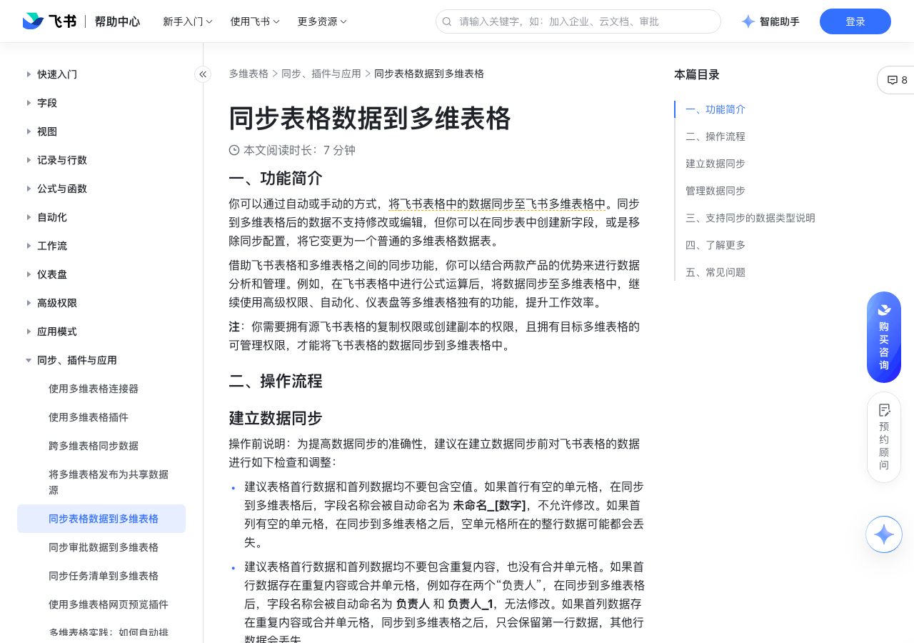

# 同步表格数据到多维表格

> 来源：[飞书帮助中心](https://www.feishu.cn/hc/zh-CN/articles/843893161820)  
> 分类：多维表格 / 同步、插件与应用  
> 抓取时间：2026-09-22T01:26:34.859Z

## 界面截图

### 文档内配图

1. 配图：https://p1-hera.feishucdn.com/tos-cn-i-jbbdkfciu3/ada17889c54d41e9a8ee55ef63799941~tplv-jbbdkfciu3-image:0:0.image
2. 配图：https://p1-hera.feishucdn.com/tos-cn-i-jbbdkfciu3/9081d100a18b4b3ba10801f7d84c29d6~tplv-jbbdkfciu3-image:0:0.image
3. 配图：https://p1-hera.feishucdn.com/tos-cn-i-jbbdkfciu3/f0c3f6b13f174d6681a18695a53bd277~tplv-jbbdkfciu3-image:0:0.image

## 功能定位

本页对应飞书帮助中心「多维表格 / 同步、插件与应用」下的「同步表格数据到多维表格」。以下需求描述依据官方说明文档提炼，用于指导 DuoWei 对标实现。

## 功能目标

一、功能简介

## 文档结构（官方章节）

- 一、功能简介​
- 二、操作流程​
- 建立数据同步​
- 管理数据同步​
- 三、支持同步的数据类型说明​
- 四、了解更多​
- 五、常见问题​

## 详细功能说明

一、功能简介

二、操作流程

建立数据同步

建议表格首行数据和首列数据均不要包含空值。如果首行有空的单元格，在同步到多维表格后，字段名称会被自动命名为 未命名_[数字]，不允许修改。如果首列有空的单元格，在同步到多维表格之后，空单元格所在的整行数据可能都会丢失。

建议表格首行数据和首列数据均不要包含重复内容，也没有合并单元格。如果首行数据存在重复内容或合并单元格，例如存在两个“负责人”，在同步到多维表格后，字段名称会被自动命名为 负责人 和 负责人_1，无法修改。如果首列数据存在重复内容或合并单元格，同步到多维表格之后，只会保留第一行数据，其他行数据会丢失。

打开目标多维表格，点击左下角的 + 新建 > 导入/同步数据 > 连接器中心，在弹窗中找到 飞书表格，将鼠标悬停其上并点击 使用。

注：你需要对当前多维表格有可管理权限才能看到此功能入口。

250px|700px|reset

在配置窗口完成以下设置并确认创建数据同步：

在 参数设置 区域，选择需要同步的 飞书表格文件 和具体的 工作表，支持输入关键词进行搜索。

注：此处你只能选择你拥有复制权限或创建副本权限的飞书表格文件。选择工作表时，不支持选择飞书表格中的多维表格视图。

按需选择要同步的字段，即飞书表格中的“列”。你可以选择全部字段，包括未来新增字段进行同步，也可以只勾选指定字段进行同步。

开启 同步设置，开启后数据源的更新将每小时自动同步到当前数据表。如不开启，则后续需要手动同步数据源的更新。

管理数据同步

同步而来的数据表会带有闪电标识，你可以对该数据表进行重命名、复制、删除等操作，也可以在数据表中新增字段来进行数据管理。该数据表中同步而来的字段也都会带有闪电标识，不支持在多维表格中编辑内容或修改字段类型，也不支持删除。

注：如果对同步的数据表进行复制，复制后的副本数据表只是一个普通的数据表，其中的内容可以被修改和编辑，与数据源没有同步关系。

手动同步数据：点击同步而来的数据表，再点击数据表名称右侧的 ⋮ 图标 > 同步数据，即可手动同步数据。

注：若同步后的多维表格未开启高级权限，有可管理或可编辑权限的用户可以进行手动同步。若同步后的多维表格开启了高级权限，对多维表格有可管理权限的用户可以进行手动同步。

调整数据同步的配置：点击同步而来的数据表，再点击数据表名称右侧的 ⋮ 图标 > 修改连接器配置，即可调整要同步的字段，以及开启或关闭自动同步。调整完成后，点击 保存 即可。

注：只有对同步后的多维表格有可管理权限的用户才可以调整同步配置。此处不支持修改数据源，即不能更换要同步的飞书表格文件、也不能更改工作表。如需修改，需要建立新的同步关系。

移除同步配置：如果你需要停止同步，点击同步而来的数据表，再点击数据表名称右侧的 ⋮ 图标 > 移除配置，即可解除同步。移除后，当前数据表将变为普通数据表，无法再继续同步数据源中的数据，已同步的数据将会保留。同时，移除配置的操作不可撤销。

注：只有对同步后的多维表格有可管理权限的用户才可以移除同步配置。

三、支持同步的数据类型说明

飞书表格中的数据格式

对应转换成多维表格的字段类型

数字字段

日期注：在飞书表格中通过 VLOOKUP 等函数计算出来的日期，无法被识别为多维表格的日期字段。

日期字段

文本字段

科学记数

超链接字段

四、了解更多

五、常见问题

问：被同步至多维表格的飞书表格，需要注意哪些内容？

答：建议飞书表格的首行和首列数据都不为空、不包含重复内容、没有合并单元格。建立同步后，不能删除飞书表格中的首列数据，不能移动首列位置。建立同步后，不能修改飞书表格的首行最左侧的单元格内容。表格首行最左侧的单元格会被同步为多维表格的索引列的字段名称，如果被修改，会导致后续同步失败。将内容恢复到修改前即可继续同步。建立同步后，尽量不修改飞书表格的首行的其他数据。修改表格中首行的其他数据，会导致多维表格中原有的字段被删除、新的字段被创建，因此可能会影响引用这些字段的仪表盘、自动化、高级权限等功能。

问：谁可以将飞书表格的数据同步至多维表格？

答：用户需拥有源飞书表格的复制权限或创建副本的权限，且拥有目标多维表格的可管理权限，才能将飞书表格的数据同步到多维表格中。

问：同步飞书表格的数据至多维表格时，单次最多支持同步多少行？

答：单次最多支持同步 2 万行。注：由于各版本可用的行数上限不同，单次同步可能会受限制。有关各版本行数上限的信息，请参考多维表格行数容量常见问题。

问：如果同步至多维表格的飞书表格中存在合并单元格，数据会如何处理？

答：若表格的首行存在合并单元格，同步时会识别为重复内容，产生多个字段（列）。例如，表格中存在一个值为“负责人”、占位 3 格的合并单元格，在同步到多维表格后，会产生 3 列字段，名称分别为 负责人、负责人_1、负责人_2。若表格的首列存在合并单元格，同步时会识别为重复内容，只保留第一行的数据，其他行数据丢失。若表格的其他位置（非首行或首列）存在合并单元格，同步到多维表格中时会自动拆分开，在对应位置的单元格中填入同样的值。

问：飞书表格中被隐藏的数据是否会被同步至多维表格？

答：会。

问：将飞书表格数据同步至多维表格时没有报错，但出现了同步数据不全的情况，是什么原因？

答：这可能是因为源表格文件中有单元格开启了数据验证。开启了数据验证的数据，不支持同步到多维表格中，需清除单元格的数据验证后才可以同步。

问：为什么数字格式的数据，同步到多维表格后变成了文本字段？

答：可能是因为这列数据中存在过多空白单元格等非数字格式的数据。在同步飞书表格的数据时，数据是分批进行同步的，因此如果第一批处理的字段为空值，字段类型就可能被修改。例如，当你将一列数字格式的数据从表格同步到多维表格，如果在前 40 行中有数字，且整列的数据格式均为“数值”，在多维表格内就会被识别为数字字段。若前面空白单元格过多，则可能会被识别为文本字段。只有当飞书表格中的整列值都是数字或日期格式的时候，多维表格才会将其识别为数字字段或日期字段。如果整列中存在任何其他类型的值（例如空格或文本），同步后都可能变成文本字段，来兼容所有的数据类型。解决方式：你可以在空白单元格中使用 0 来进行占位，确保同步后是数字字段。你也可以在建立同步后，在多维表格中新增一个公式字段，使用 VALUE 函数将文本字段转成数字。

问：为什么从表格中同步的日期和数字格式，在多维表格中格式不一样？

答：在飞书表格中，即使是同一列的日期和数字，也可以存在多种格式。但在多维表格中，日期和数字字段都是只能设置一种格式的，因此可能导致源数据和同步后的数据存在差异。

问：能否将多张表格的数据同步到同一张多维表格的数据表中？

答：不可以。每一张源表格在多维表格里都对应一个单独的数据表，不会合并到同一个数据表内。

飞书表格中的数据格式 | 对应转换成多维表格的字段类型

数值 | 数字字段

货币 | 数字字段

日期注：在飞书表格中通过 VLOOKUP 等函数计算出来的日期，无法被识别为多维表格的日期字段。 | 日期字段

时间 | 文本字段

百分比 | 数字字段

科学记数 | 数字字段

文本 | 文本字段

常规 | 文本字段

公式 | 文本字段

附件 | 文本字段

链接 | 超链接字段

## 实现要点（对标 DuoWei）

1. **入口与信息架构**：在产品中明确该能力所属模块（同步、插件与应用），并保证用户可从对应导航触达。
2. **核心交互**：按上文「详细功能说明」还原主要操作路径；截图中出现的按钮、字段、面板命名尽量与飞书语义一致或可映射。
3. **数据与权限**：若文档涉及可见范围、可编辑范围、分享或高级权限，实现时需落到角色/成员模型，并保证 API/MCP 与 UI 权限一致。
4. **边界与上限**：若文档提到数量上限、格式限制、导入导出约束，需在实现与错误提示中体现。
5. **验收**：以本页截图场景为用例，完成「能打开 / 能配置 / 能保存 / 能被 Agent 读写（如适用）」四项检查。

## 原始摘录摘要

> 一、功能简介 二、操作流程 建立数据同步 建议表格首行数据和首列数据均不要包含空值。如果首行有空的单元格，在同步到多维表格后，字段名称会被自动命名为 未命名_[数字]，不允许修改。如果首列有空的单元格，在同步到多维表格之后，空单元格所在的整行数据可能都会丢失。 建议表格首行数据和首列数据均不要包含重复内容，也没有合并单元格。如果首行数据存在重复内容或合并单元格，例如存在两个“负责人”，在同步到多维表格后，字段名称会被自动命名为 负责人 和 负责人_1，无法修改。如果首列数据存在重复内容或合并单元格，同步到多维表格之后，只会保留第一行数据，其他行数据会丢失。 打开目标多维表格，点击左下角的 + 新建 > 导入/同步数据 > 连接器中心，在弹窗中找到 飞书表格，将鼠标悬停其上并点击 使用。 注：你需要对当前多维表格有可管理权限才能看到此功能入口。 250px|700px|reset 在配置窗口完成以下设置并确认创建数据同步： 在 参数设置 区域，选择需要同步的 飞书表格文件 和具体的 工作表，支持输入关键词进行搜索。 注：此处你只能选择你拥有复制权限或创建副本权限的飞书表格文件。选择工作表时，不支持选择飞书表格中的多维表格视图。 按需选择要同步的字段，即飞书表格中的“列”。你可以选择全部字段，包括未来新增字段进行同步，也可以只勾选指定字段进行同步。 开启 同步设置，开启后数据源的更新将每小时自动同步到当前数据表。如不开启，则后续需要手动同步数据源的更新。 管理数据同步 同步而来的数据表会带有闪电标识，你可以对该数据表进行重命名、复制、删除等操作，也可以在数据表中新增字段来进行数据管理。该数据表中同步而来的字段也都会带有闪电标识，不支持在多维表格中编辑内容或修改字段类型，也不支持删除。 注：如果对同步的数据表进行复制，复制后的副本数据表只是一个普通的数据表，其中的内容可以被修改和…

## 元数据

- article_id: `7316429088150028289`
- category_id: `7225134052943200257`
- path: `/hc/zh-CN/articles/843893161820`
- extracted_text_length: 3016
