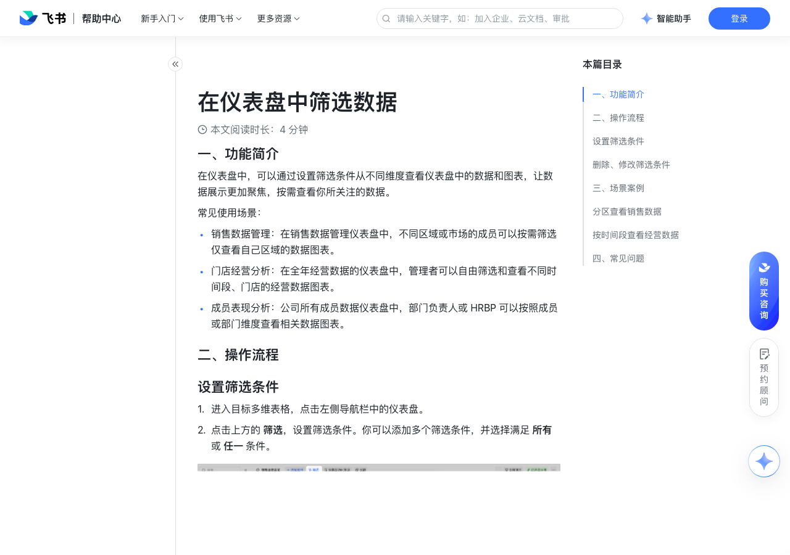

# 在仪表盘中筛选数据

> 来源：[飞书帮助中心](https://www.feishu.cn/hc/zh-CN/articles/493084579750)  
> 分类：多维表格 / 仪表盘  
> 抓取时间：2026-09-22T01:25:14.300Z

## 界面截图

### 文档内配图

1. 配图：https://p1-hera.feishucdn.com/tos-cn-i-jbbdkfciu3/987712ca055848219bb6e820179fefe4~tplv-jbbdkfciu3-image:0:0.image
2. 配图：https://p1-hera.feishucdn.com/tos-cn-i-jbbdkfciu3/9142e5056ca0463692469313ff8ca1d6~tplv-jbbdkfciu3-image:0:0.image
3. 配图：https://p1-hera.feishucdn.com/tos-cn-i-jbbdkfciu3/3dc32ef9975e4bba9f738bc2caf8ef5d~tplv-jbbdkfciu3-image:0:0.image
4. 配图：https://p1-hera.feishucdn.com/tos-cn-i-jbbdkfciu3/abfd2848150c4d86aa85f0962ad2d6c0~tplv-jbbdkfciu3-image:0:0.image
5. 配图：https://p1-hera.feishucdn.com/tos-cn-i-jbbdkfciu3/bd31e051095444d7b661c1ca8e2e00e8~tplv-jbbdkfciu3-image:0:0.image

## 功能定位

本页对应飞书帮助中心「多维表格 / 仪表盘」下的「在仪表盘中筛选数据」。以下需求描述依据官方说明文档提炼，用于指导 DuoWei 对标实现。

## 功能目标

一、功能简介

## 文档结构（官方章节）

- 一、功能简介​
- 二、操作流程​
- 设置筛选条件​
- 删除、修改筛选条件​
- 三、场景案例​
- 分区查看销售数据​
- 按时间段查看经营数据​
- 四、常见问题​

## 详细功能说明

一、功能简介

常见使用场景：

销售数据管理：在销售数据管理仪表盘中，不同区域或市场的成员可以按需筛选仅查看自己区域的数据图表。

门店经营分析：在全年经营数据的仪表盘中，管理者可以自由筛选和查看不同时间段、门店的经营数据图表。

成员表现分析：公司所有成员数据仪表盘中，部门负责人或 HRBP 可以按照成员或部门维度查看相关数据图表。

二、操作流程

设置筛选条件

进入目标多维表格，点击左侧导航栏中的仪表盘。

点击上方的 筛选，设置筛选条件。你可以添加多个筛选条件，并选择满足 所有 或 任一 条件。

设置完成后，点击 保存 即可应用所设置的筛选条件，所有协作者都将看到筛选后的图表。

删除、修改筛选条件

删除筛选条件：点击仪表盘上方导航栏中的 筛选，进入设置页面，点击条件右侧的 X 即可删除筛选条件。

修改筛选条件：点击仪表盘上方导航栏中的 筛选，进入设置页面，找到要修改的筛选条件更换数据表、字段、条件设置即可。

三、场景案例

分区查看销售数据

在销售数据汇总（第一季度）仪表盘中，添加筛选条件为 销售地区 等于 华北区、华南区、华东区 或 华中区 等区域。

负责人可通过分享仪表盘或截图等方式将本区域的销售数据粘贴至总结文档中。

按时间段查看经营数据

四、常见问题

问：谁可以在仪表盘中筛选数据？

答：未开启高级权限多维表格所有者、可管理、可编辑权限的用户能够筛选仪表盘可阅读权限的用户暂不支持筛选仪表盘开启高级权限后仅多维表格所有者、可管理权限的用户能够筛选仪表盘其他用户暂不支持筛选仪表盘

问：我筛选了数据后，会影响其他用户查看数据吗？

答：设置筛选并保存后，所有协作者都将看到筛选后的图表。

问：分享的仪表盘支持筛选数据吗？

答：暂不支持。分享的仪表盘中将仅展示筛选后的数据和图表，被分享人无法进行筛选设置。

问：复制仪表盘或创建多维表格副本时，会保留已设置的筛选条件吗？

答：是的。

问：我可以在移动端筛选仪表盘吗？

答：暂不支持，当前仅支持在移动端查看筛选后的仪表盘。

问：移动端是否有版本限制？

答：需将移动端升级至 V6.4 及以上才可查看筛选后的仪表盘。

## 实现要点（对标 DuoWei）

1. **入口与信息架构**：在产品中明确该能力所属模块（仪表盘），并保证用户可从对应导航触达。
2. **核心交互**：按上文「详细功能说明」还原主要操作路径；截图中出现的按钮、字段、面板命名尽量与飞书语义一致或可映射。
3. **数据与权限**：若文档涉及可见范围、可编辑范围、分享或高级权限，实现时需落到角色/成员模型，并保证 API/MCP 与 UI 权限一致。
4. **边界与上限**：若文档提到数量上限、格式限制、导入导出约束，需在实现与错误提示中体现。
5. **验收**：以本页截图场景为用例，完成「能打开 / 能配置 / 能保存 / 能被 Agent 读写（如适用）」四项检查。

## 原始摘录摘要

> 一、功能简介 常见使用场景： 销售数据管理：在销售数据管理仪表盘中，不同区域或市场的成员可以按需筛选仅查看自己区域的数据图表。 门店经营分析：在全年经营数据的仪表盘中，管理者可以自由筛选和查看不同时间段、门店的经营数据图表。 成员表现分析：公司所有成员数据仪表盘中，部门负责人或 HRBP 可以按照成员或部门维度查看相关数据图表。 二、操作流程 设置筛选条件 进入目标多维表格，点击左侧导航栏中的仪表盘。 点击上方的 筛选，设置筛选条件。你可以添加多个筛选条件，并选择满足 所有 或 任一 条件。 设置完成后，点击 保存 即可应用所设置的筛选条件，所有协作者都将看到筛选后的图表。 删除、修改筛选条件 删除筛选条件：点击仪表盘上方导航栏中的 筛选，进入设置页面，点击条件右侧的 X 即可删除筛选条件。 修改筛选条件：点击仪表盘上方导航栏中的 筛选，进入设置页面，找到要修改的筛选条件更换数据表、字段、条件设置即可。 三、场景案例 分区查看销售数据 在销售数据汇总（第一季度）仪表盘中，添加筛选条件为 销售地区 等于 华北区、华南区、华东区 或 华中区 等区域。 负责人可通过分享仪表盘或截图等方式将本区域的销售数据粘贴至总结文档中。 按时间段查看经营数据 四、常见问题 问：谁可以在仪表盘中筛选数据？ 答：未开启高级权限多维表格所有者、可管理、可编辑权限的用户能够筛选仪表盘可阅读权限的用户暂不支持筛选仪表盘开启高级权限后仅多维表格所有者、可管理权限的用户能够筛选仪表盘其他用户暂不支持筛选仪表盘 问：我筛选了数据后，会影响其他用户查看数据吗？ 答：设置筛选并保存后，所有协作者都将看到筛选后的图表。 问：分享的仪表盘支持筛选数据吗？ 答：暂不支持。分享的仪表盘中将仅展示筛选后的数据和图表，被分享人无法进行筛选设置。 问：复制仪表盘或创建多维表格副本时，会保留已设置的筛选条件吗？ 答：是的。 问：…

## 元数据

- article_id: `7224042548480802817`
- category_id: `7165754521875005468`
- path: `/hc/zh-CN/articles/493084579750`
- extracted_text_length: 887
