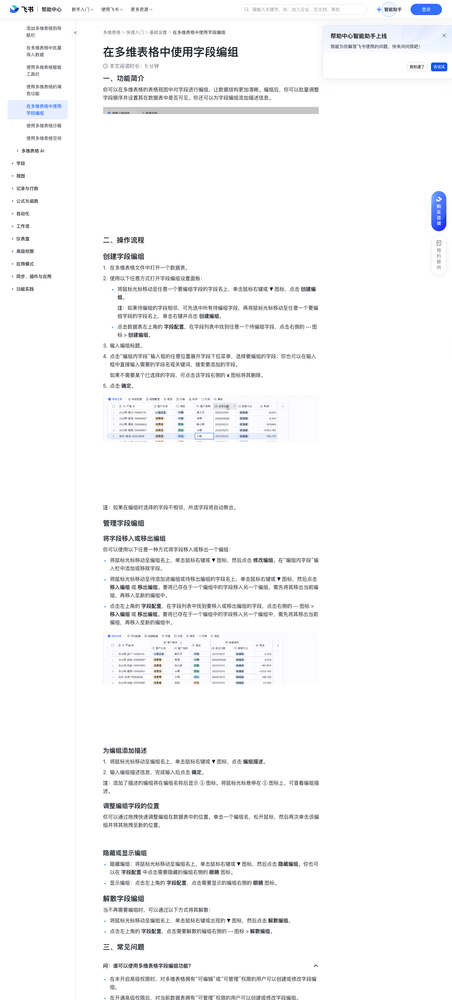

# 在多维表格中使用字段编组

> 来源：[飞书帮助中心](https://www.feishu.cn/hc/zh-CN/articles/271416222099)  
> 分类：多维表格 / 快速入门 / 基础设置  
> 抓取时间：2026-09-22T01:16:02.793Z

## 界面截图

### 文档内配图

1. 配图：https://p1-hera.feishucdn.com/tos-cn-i-jbbdkfciu3/7dbfb06a5d624c05854639eef7ba360d~tplv-jbbdkfciu3-image:0:0.image
2. 配图：https://p1-hera.feishucdn.com/tos-cn-i-jbbdkfciu3/9d37167d8f4c4426a266d62f32f2b3fc~tplv-jbbdkfciu3-image:0:0.image
3. 配图：https://p1-hera.feishucdn.com/tos-cn-i-jbbdkfciu3/7bf58bfaa7034067803ecf1c58dc6010~tplv-jbbdkfciu3-image:0:0.image
4. 配图：https://p1-hera.feishucdn.com/tos-cn-i-jbbdkfciu3/59af6bb4b0864be9bcd5518434531581~tplv-jbbdkfciu3-image:0:0.image

## 功能定位

本页对应飞书帮助中心「多维表格 / 快速入门 / 基础设置」下的「在多维表格中使用字段编组」。以下需求描述依据官方说明文档提炼，用于指导 DuoWei 对标实现。

## 功能目标

一、功能简介

## 文档结构（官方章节）

- 一、功能简介​
- 二、操作流程​
- 创建字段编组​
- 管理字段编组​
- 将字段移入或移出编组​
- 为编组添加描述​
- 调整编组字段的位置​
- 隐藏或显示编组​
- 解散字段编组​
- 三、常见问题​

## 详细功能说明

一、功能简介

二、操作流程

创建字段编组

在多维表格文件中打开一个数据表。

使用以下任意方式打开字段编组设置面板：

将鼠标光标移动至任意一个要编组字段的字段名上，单击鼠标右键或 ▼ 图标，点击 创建编组。

注：如果待编组的字段相邻，可先选中所有待编组字段，再将鼠标光标移动至任意一个要编组字段的字段名上，单击右键并点击 创建编组。

点击数据表左上角的 字段配置，在字段列表中找到任意一个待编组字段，点击右侧的 ··· 图标 > 创建编组。

输入编组标题。

点击“编组内字段”输入框的任意位置展开字段下拉菜单，选择要编组的字段；你也可以在输入框中直接输入需要的字段名或关键词，搜索要添加的字段。

如果不需要某个已选择的字段，可点击该字段右侧的 x 图标将其删除。

点击 确定。

管理字段编组

将字段移入或移出编组

将鼠标光标移动至编组名上，单击鼠标右键或 ▼ 图标，然后点击 修改编组。在“编组内字段”输入栏中添加或移除字段。

将鼠标光标移动至待添加进编组或待移出编组的字段名上，单击鼠标右键或 ▼ 图标，然后点击 移入编组 或 移出编组。要将已存在于一个编组中的字段移入另一个编组，需先将其移出当前编组，再移入至新的编组中。

点击左上角的 字段配置，在字段列表中找到要移入或移出编组的字段，点击右侧的 ··· 图标 > 移入编组 或 移出编组。要将已存在于一个编组中的字段移入另一个编组中，需先将其移出当前编组，再移入至新的编组中。

为编组添加描述

将鼠标光标移动至编组名上，单击鼠标右键或 ▼ 图标，点击 编组描述。

输入编组描述信息，完成输入后点击 确定。

调整编组字段的位置

隐藏或显示编组

隐藏编组：将鼠标光标移动至编组名上，单击鼠标右键或 ▼ 图标，然后点击 隐藏编组。你也可以在 字段配置 中点击需要隐藏的编组右侧的 眼睛 图标。

显示编组：点击左上角的 字段配置，点击需要显示的编组右侧的 眼睛 图标。

解散字段编组

将鼠标光标移动至编组名上，单击鼠标右键或出现的 ▼ 图标，然后点击 解散编组。

点击左上角的 字段配置，点击需要解散的编组右侧的 ··· 图标 > 解散编组。

三、常见问题

问：谁可以使用多维表格字段编组功能？

在未开启高级权限时，对多维表格拥有“可编辑”或“可管理”权限的用户可以创建或修改字段编组。在开通高级权限后，对当前数据表拥有“可管理”权限的用户可以创建或修改字段编组。

问：一个多维表格数据表中最多可以创建多少个编组？

答：单张数据表最多支持创建 300 个字段编组。

问：在多维表格表格视图中设置的字段编组是否会应用于其他视图？

答：是的，字段编组设置将应用于数据表的所有视图，你可以在其他视图中查看编组设置。

问： 复制多维表格数据表时，字段编组设置会被同步复制吗？

答：不会，在同一个多维表格文件中复制数据表或跨多维表进行数据同步时，字段编组设置均不会被同步。

## 实现要点（对标 DuoWei）

1. **入口与信息架构**：在产品中明确该能力所属模块（快速入门 / 基础设置），并保证用户可从对应导航触达。
2. **核心交互**：按上文「详细功能说明」还原主要操作路径；截图中出现的按钮、字段、面板命名尽量与飞书语义一致或可映射。
3. **数据与权限**：若文档涉及可见范围、可编辑范围、分享或高级权限，实现时需落到角色/成员模型，并保证 API/MCP 与 UI 权限一致。
4. **边界与上限**：若文档提到数量上限、格式限制、导入导出约束，需在实现与错误提示中体现。
5. **验收**：以本页截图场景为用例，完成「能打开 / 能配置 / 能保存 / 能被 Agent 读写（如适用）」四项检查。

## 原始摘录摘要

> 一、功能简介 二、操作流程 创建字段编组 在多维表格文件中打开一个数据表。 使用以下任意方式打开字段编组设置面板： 将鼠标光标移动至任意一个要编组字段的字段名上，单击鼠标右键或 ▼ 图标，点击 创建编组。 注：如果待编组的字段相邻，可先选中所有待编组字段，再将鼠标光标移动至任意一个要编组字段的字段名上，单击右键并点击 创建编组。 点击数据表左上角的 字段配置，在字段列表中找到任意一个待编组字段，点击右侧的 ··· 图标 > 创建编组。 输入编组标题。 点击“编组内字段”输入框的任意位置展开字段下拉菜单，选择要编组的字段；你也可以在输入框中直接输入需要的字段名或关键词，搜索要添加的字段。 如果不需要某个已选择的字段，可点击该字段右侧的 x 图标将其删除。 点击 确定。 管理字段编组 将字段移入或移出编组 将鼠标光标移动至编组名上，单击鼠标右键或 ▼ 图标，然后点击 修改编组。在“编组内字段”输入栏中添加或移除字段。 将鼠标光标移动至待添加进编组或待移出编组的字段名上，单击鼠标右键或 ▼ 图标，然后点击 移入编组 或 移出编组。要将已存在于一个编组中的字段移入另一个编组，需先将其移出当前编组，再移入至新的编组中。 点击左上角的 字段配置，在字段列表中找到要移入或移出编组的字段，点击右侧的 ··· 图标 > 移入编组 或 移出编组。要将已存在于一个编组中的字段移入另一个编组中，需先将其移出当前编组，再移入至新的编组中。 为编组添加描述 将鼠标光标移动至编组名上，单击鼠标右键或 ▼ 图标，点击 编组描述。 输入编组描述信息，完成输入后点击 确定。 调整编组字段的位置 隐藏或显示编组 隐藏编组：将鼠标光标移动至编组名上，单击鼠标右键或 ▼ 图标，然后点击 隐藏编组。你也可以在 字段配置 中点击需要隐藏的编组右侧的 眼睛 图标。 显示编组：点击左上角的 字段配置，点击需要显示的编组右侧…

## 元数据

- article_id: `7501927376073900034`
- category_id: `7225072576895254530`
- path: `/hc/zh-CN/articles/271416222099`
- extracted_text_length: 1205
