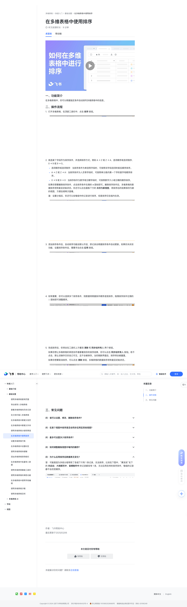

# 在多维表格中使用排序

> 来源：[飞书帮助中心](https://www.feishu.cn/hc/zh-CN/articles/793587578327)  
> 分类：多维表格 / 快速入门 / 基础设置  
> 抓取时间：2026-09-22T00:55:58.588Z

## 界面截图

### 文档内配图

1. 配图：https://p1-hera.feishucdn.com/tos-cn-i-jbbdkfciu3/ec246f7ab706442aa0d862c9deb318ce~tplv-jbbdkfciu3-image:0:0.image
2. 配图：https://p1-hera.feishucdn.com/tos-cn-i-jbbdkfciu3/f96482baddcc4570bfa2a0571c90f867~tplv-jbbdkfciu3-image:0:0.image
3. 配图：https://p1-hera.feishucdn.com/tos-cn-i-jbbdkfciu3/30493b60570449f9af4b09fa776cbe8d~tplv-jbbdkfciu3-image:0:0.image
4. 配图：https://p1-hera.feishucdn.com/tos-cn-i-jbbdkfciu3/f9a823a8ab584924b08d3862521019be~tplv-jbbdkfciu3-image:0:0.image
5. 配图：https://p1-hera.feishucdn.com/tos-cn-i-jbbdkfciu3/a5acfc4bcfbf41e19e9bc8422a966da5~tplv-jbbdkfciu3-image:0:0.image
6. 配图：https://p1-hera.feishucdn.com/tos-cn-i-jbbdkfciu3/0434492d6b7843848fc774b9e88f5459~tplv-jbbdkfciu3-image:0:0.image
7. 配图：https://p1-hera.feishucdn.com/tos-cn-i-jbbdkfciu3/f7cf48b079504ac7b689f1c2a9bdfee2~tplv-jbbdkfciu3-image:0:0.image

## 功能定位

本页对应飞书帮助中心「多维表格 / 快速入门 / 基础设置」下的「在多维表格中使用排序」。以下需求描述依据官方说明文档提炼，用于指导 DuoWei 对标实现。

## 功能目标

播放 00:00 / 01:18 直播 00:00 进入全屏 1x 0.5x0.75x1x1.5x2x 点击按住可拖动视频

## 文档结构（官方章节）

- ​
    
    
    
    
      
       
       
      
    
      
  

    
    
  

  

    
    
    
      
      
    
    
  

  

     播放
    
    00:00
    /
    01:18
    直播
    
      
    
      
        
      
      
        
          
        
        
      
      00:00
      
      
    
    
    
      
      
    
    
  

  

     
    进入全屏
    
    
    
      
      
  
  

  
  

  
  

      
        
        
          
        
      
    
    
    
   
    
    1x
   0.5x0.75x1x1.5x2x
    
    
   
    
    
   
    
    
      
      
       
    点击按住可拖动视频
    
      
      
        
          
        
      
      
      
  

  

      ​​
- 一、功能简介​
- 二、操作流程​
- 三、常见问题​

## 详细功能说明

播放 00:00 / 01:18 直播 00:00 进入全屏 1x 0.5x0.75x1x1.5x2x 点击按住可拖动视频

0.5x

0.75x

1.5x

一、功能简介

二、操作流程

打开多维表格，在顶部工具栏中，点击 排序 按钮。

挑选某个字段作为排序条件，并选择排序方式。例如 A → Z 或 Z → A、选项顺序或选项倒序、0 → 9 或 9 → 0。

选项顺序或选项倒序：当排序条件为单选等字段时，可按照该字段选项的前后顺序排序。

A → Z 或 Z → A：当排序条件为人员等字段时，可按照单元格内第一个字的首字母顺序排序。

0 → 9 或 9 → 0：当排序条件为数字或日期字段时，可按照数字大小或日期的顺序排序。

如果你想要删除排序条件，点击排序条件右侧的 × 图标即可。删除排序条件后，多维表格的数据排序将恢复至初始状态。你还可以点击面板下方的 另存为新视图，将排序后的结果保存为新的视图，方便后续再次查看。

注：设置分组后，你还可以给每组中的记录进行排序，但是排序仅在组内生效。

添加排序条件后，自动排序功能会默认开启，即记录会根据排序条件自动更新。如果你关闭该功能，设置排序条件后，需要手动点击 应用 按钮。

如有需要，你可以选择多个排序条件，则数据将根据条件顺序逐层排序。拖拽排序条件左侧的 ⋮⋮ 图标即可调整顺序。

完成排序后，你将会在工具栏上方看到 清除 和 同步给所有人 两个按钮。

如果你想让多维表格的其他协作者都看到你的排序结果，你可以点击 同步给所有人 按钮。若不点击，那么该操作仅你自己可见，且不会被保存。当你刷新界面后，排序将会被重置。

如果你想要取消排序，可以点击 清除 按钮，多维表格的数据排序将恢复至初始状态。

三、常见问题

问：谁可以设置、修改、删除排序条件？

未开启高级权限时，多维表格所有者、拥有可管理或可编辑权限的用户都可以设置、修改或删除排序条件。

已开启高级权限时，多维表格所有者、拥有可管理权限的用户可以设置、修改或删除排序条件；拥有可编辑权限的用户可以针对可编辑范围内的字段进行排序操作。

问：在某个视图中排序是否会同步应用至其他视图？

问：最多可设置多少排序条件？

问：如何调整看板视图中每列的顺序？

问：为什么应用排序后数据表无变化？

桌面端移动端更多

00:00

01:18

进入全屏

0.5x0.75x1x1.5x2x

点击按住可拖动视频

一、功能简介在多维表格中，你可以根据指定条件自动排列多维表格中的信息。二、操作流程打开多维表格，在顶部工具栏中，点击 排序 按钮。250px|700px|reset挑选某个字段作为排序条件，并选择排序方式。例如 A → Z 或 Z → A、选项顺序或选项倒序、0 → 9 或 9 → 0。选项顺序或选项倒序：当排序条件为单选等字段时，可按照该字段选项的前后顺序排序。A → Z 或 Z → A：当排序条件为人员等字段时，可按照单元格内第一个字的首字母顺序排序。0 → 9 或 9 → 0：当排序条件为数字或日期字段时，可按照数字大小或日期的顺序排序。如果你想要删除排序条件，点击排序条件右侧的 × 图标即可。删除排序条件后，多维表格的数据排序将恢复至初始状态。你还可以点击面板下方的 另存为新视图，将排序后的结果保存为新的视图，方便后续再次查看。注：设置分组后，你还可以给每组中的记录进行排序，但是排序仅在组内生效。250px|700px|reset添加排序条件后，自动排序功能会默认开启，即记录会根据排序条件自动更新。如果你关闭该功能，设置排序条件后，需要手动点击 应用 按钮。250px|700px|reset如有需要，你可以选择多个排序条件，则数据将根据条件顺序逐层排序。拖拽排序条件左侧的 ⋮⋮ 图标即可调整顺序。250px|700px|reset完成排序后，你将会在工具栏上方看到 清除 和 同步给所有人 两个按钮。如果你想让多维表格的其他协作者都看到你的排序结果，你可以点击 同步给所有人 按钮。若不点击，那么该操作仅你自己可见，且不会被保存。当你刷新界面后，排序将会被重置。如果你想要取消排序，可以点击 清除 按钮，多维表格的数据排序将恢复至初始状态。250px|700px|reset三、常见问题问：谁可以设置、修改、删除排序条件？答：未开启高级权限时，多维表格所有者、拥有可管理或可编辑权限的用户都可以设置、修改或删除排序条件。已开启高级权限时，多维表格所有者、拥有可管理权限的用户可以设置、修改或删除排序条件；拥有可编辑权限的用户可以针对可编辑范围内的字段进行排序操作。注：当开启锁定视图时，所有人都不能进行排序设置。问：在某个视图中排序是否会同步应用至其他视图？答：不会。排序仅应用于当前视图。问：最多可设置多少排序条件？答：排序条件数量无限制，你可按需设置排序条件。问：如何调整看板视图中每列的顺序？答：排序功能只会调整每列中卡片的上下顺序。如需修改每列的左右顺序，可直接将该列拖拽到新的位置。250px|700px|reset问：为什么应用排序后数据表无变化？答：可能是因为多级分组导致了各组下只有 1 条记录，无法排序。比如在下图中，“黄泡泡”名下的 未启动、大纲撰写中、音频制作中 的记录都各有 1 条，无论应用怎样的排序条件，每组的记录都不会改变顺序。250px|700px|reset

## 实现要点（对标 DuoWei）

1. **入口与信息架构**：在产品中明确该能力所属模块（快速入门 / 基础设置），并保证用户可从对应导航触达。
2. **核心交互**：按上文「详细功能说明」还原主要操作路径；截图中出现的按钮、字段、面板命名尽量与飞书语义一致或可映射。
3. **数据与权限**：若文档涉及可见范围、可编辑范围、分享或高级权限，实现时需落到角色/成员模型，并保证 API/MCP 与 UI 权限一致。
4. **边界与上限**：若文档提到数量上限、格式限制、导入导出约束，需在实现与错误提示中体现。
5. **验收**：以本页截图场景为用例，完成「能打开 / 能配置 / 能保存 / 能被 Agent 读写（如适用）」四项检查。

## 原始摘录摘要

> 播放 00:00 / 01:18 直播 00:00 进入全屏 1x 0.5x0.75x1x1.5x2x 点击按住可拖动视频 0.5x 0.75x 1.5x 一、功能简介 二、操作流程 打开多维表格，在顶部工具栏中，点击 排序 按钮。 挑选某个字段作为排序条件，并选择排序方式。例如 A → Z 或 Z → A、选项顺序或选项倒序、0 → 9 或 9 → 0。 选项顺序或选项倒序：当排序条件为单选等字段时，可按照该字段选项的前后顺序排序。 A → Z 或 Z → A：当排序条件为人员等字段时，可按照单元格内第一个字的首字母顺序排序。 0 → 9 或 9 → 0：当排序条件为数字或日期字段时，可按照数字大小或日期的顺序排序。 如果你想要删除排序条件，点击排序条件右侧的 × 图标即可。删除排序条件后，多维表格的数据排序将恢复至初始状态。你还可以点击面板下方的 另存为新视图，将排序后的结果保存为新的视图，方便后续再次查看。 注：设置分组后，你还可以给每组中的记录进行排序，但是排序仅在组内生效。 添加排序条件后，自动排序功能会默认开启，即记录会根据排序条件自动更新。如果你关闭该功能，设置排序条件后，需要手动点击 应用 按钮。 如有需要，你可以选择多个排序条件，则数据将根据条件顺序逐层排序。拖拽排序条件左侧的 ⋮⋮ 图标即可调整顺序。 完成排序后，你将会在工具栏上方看到 清除 和 同步给所有人 两个按钮。 如果你想让多维表格的其他协作者都看到你的排序结果，你可以点击 同步给所有人 按钮。若不点击，那么该操作仅你自己可见，且不会被保存。当你刷新界面后，排序将会被重置。 如果你想要取消排序，可以点击 清除 按钮，多维表格的数据排序将恢复至初始状态。 三、常见问题 问：谁可以设置、修改、删除排序条件？ 未开启高级权限时，多维表格所有者、拥有可管理或可编辑权限的用户都可以设置、修改或删除排序条件…

## 元数据

- article_id: `6966920035256500226`
- category_id: `7225072576895254530`
- path: `/hc/zh-CN/articles/793587578327`
- extracted_text_length: 1886
