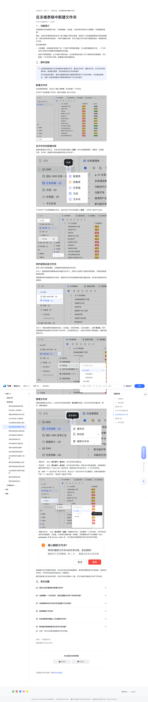

# 在多维表格中新建文件夹

> 来源：[飞书帮助中心](https://www.feishu.cn/hc/zh-CN/articles/900270410106)  
> 分类：多维表格 / 快速入门 / 基础设置  
> 抓取时间：2026-09-22T00:55:54.975Z

## 界面截图

### 文档内配图

1. 配图：https://p1-hera.feishucdn.com/tos-cn-i-jbbdkfciu3/0f843fe618fa426c9d2676ffc4e0f0b8~tplv-jbbdkfciu3-image:0:0.image
2. 配图：https://p1-hera.feishucdn.com/tos-cn-i-jbbdkfciu3/d5a9ba73d1ea4412a9bfe77b0c64174a~tplv-jbbdkfciu3-image:0:0.image
3. 配图：https://p1-hera.feishucdn.com/tos-cn-i-jbbdkfciu3/f97725a32e944cb9a67f1c3471da5797~tplv-jbbdkfciu3-image:0:0.image
4. 配图：https://p1-hera.feishucdn.com/tos-cn-i-jbbdkfciu3/1eb48253f0bd4679a9c0e54d2185c4eb~tplv-jbbdkfciu3-image:0:0.image
5. 配图：https://p1-hera.feishucdn.com/tos-cn-i-jbbdkfciu3/c297f20f53e046a1b6688209607b842c~tplv-jbbdkfciu3-image:0:0.image
6. 配图：https://p1-hera.feishucdn.com/tos-cn-i-jbbdkfciu3/33818a370eb34a0586a6fca4ae75c412~tplv-jbbdkfciu3-image:0:0.image
7. 配图：https://p1-hera.feishucdn.com/tos-cn-i-jbbdkfciu3/8fd6c7cad1754881b7656e8696141ae0~tplv-jbbdkfciu3-image:0:0.image
8. 配图：https://p1-hera.feishucdn.com/tos-cn-i-jbbdkfciu3/c74f3deb620746c3a0eb66976b9df581~tplv-jbbdkfciu3-image:0:0.image

## 功能定位

本页对应飞书帮助中心「多维表格 / 快速入门 / 基础设置」下的「在多维表格中新建文件夹」。以下需求描述依据官方说明文档提炼，用于指导 DuoWei 对标实现。

## 功能目标

一、功能简介

## 文档结构（官方章节）

- 一、功能简介​
- 二、操作流程​
- 新建文件夹​
- 在文件夹内新建内容​
- 将内容移动至文件夹​
- 管理文件夹​
- 三、常见问题​

## 详细功能说明

一、功能简介

常见使用场景：

分类整理：多维表格内存储了同一个项目不同季度的数据，可以按季度新建文件夹，一个文件夹内只存放对应周期内的数据表和仪表盘。

收纳不常用数据表：出于信息引用的目的，在多维表格内添加了多个跨表同步的数据表，可以新建一个文件夹用于收纳，数据展示更加清晰简洁。

二、操作流程

新建文件夹

在文件夹内新建内容

将内容移动至文件夹

管理文件夹

“重命名”：点击 ⋮ 更多操作 > 重命名，对文件夹进行重命名。

“移动至”：点击 ⋮ 更多操作 > 移动至，对文件夹进行移动。移动文件夹的前提是，多维表格左侧的列表中存在 2 个及以上的一级文件夹。被移动的文件夹会作为一个子文件夹存在。

注：如果一个一级文件夹下有子文件夹，那么这个一级文件夹不可以被移动。如果多维表格中只有一个一级文件夹，“移动至”功能也不可用。

“删除文件夹”：点击 ⋮ 更多操作 > 删除，来删除文件夹。当你删除一个文件夹时，文件夹内包含的所有数据表、仪表盘、文档等内容都会被一并删除。这种删除动作不支持撤销（Mac: command + Z 或 Windows: ctrl + Z），你只能在多维表格的历史记录中进行恢复。

三、常见问题

一、功能简介多维表格内支持新建文件夹，可将数据表、仪表盘、文档页等内容进行分类整理，方便查看和管理。例如，当你的多维表格内存在多个统计维度不同的仪表盘，或是多个从其他数据源同步而来的数据表，导致左侧列表内容混杂、不便于查看的时候，你可以通过文件夹进行整理和收纳、按照需求进行分类。常见使用场景：分类整理：多维表格内存储了同一个项目不同季度的数据，可以按季度新建文件夹，一个文件夹内只存放对应周期内的数据表和仪表盘。收纳不常用数据表：出于信息引用的目的，在多维表格内添加了多个跨表同步的数据表，可以新建一个文件夹用于收纳，数据展示更加清晰简洁。二、操作流程🔖此权限说明适用于在多维表格中新建文件夹、重命名文件夹、删除文件夹、在文件夹中新建内容、拖拽更改顺序、将内容移动至文件夹等操作：未开启高级权限时，拥有可编辑权限和可管理权限的用户可以进行操作。开启高级权限后，对整个多维表格拥有可管理权限的用户可以进行操作。新建文件夹在多维表格界面，点击左下角的 文件夹，即可新建一个文件夹。文件夹下支持新建子文件夹，最多可新建一级子文件夹。250px|700px|reset在文件夹内新建内容将鼠标悬停在文件夹上，点击文件夹名称右侧的 + 新建，你可以新建数据表、收集表、仪表盘、文档、文件夹。新建的内容会直接存放在本文件夹下。250px|700px|reset子文件夹下不支持再新建文件夹。当你点击子文件夹右侧的 + 新建，“文件夹”选项不可点击。250px|700px|reset将内容移动至文件夹你有 2 种方式将数据表、仪表盘等内容移动到文件夹内。方式 1：直接拖拽你想要移动的对象到文件夹下。这种方式适用于左侧的列表较短、方便快速拖拽移动的情况。将数据表等内容拖拽到文件夹时，被选中的文件夹会被高亮并展示虚线边框，此时松开鼠标即可完成移动。250px|700px|reset方式 2：将鼠标悬停在数据表名称上（仪表盘、文档页同理），点击右侧的 ⋮，选择 移动至，即可将数据表移动到其他文件夹或子文件夹中。当左侧列表过长、内容过多导致不易拖拽时，推荐采取此种方式。250px|700px|reset管理文件夹将鼠标悬停在文件夹上，点击文件夹名称右侧的 ⋮ 更多操作 按钮，可对文件夹进行重命名、移动、删除等操作。250px|700px|reset“重命名”：点击 ⋮ 更多操作 > 重命名，对文件夹进行重命名。“移动至”：点击 ⋮ 更多操作 > 移动至，对文件夹进行移动。移动文件夹的前提是，多维表格左侧的列表中存在 2 个及以上的一级文件夹。被移动的文件夹会作为一个子文件夹存在。注：如果一个一级文件夹下有子文件夹，那么这个一级文件夹不可以被移动。如果多维表格中只有一个一级文件夹，“移动至”功能也不可用。250px|700px|reset“删除文件夹”：点击 ⋮ 更多操作 > 删除，来删除文件夹。当你删除一个文件夹时，文件夹内包含的所有数据表、仪表盘、文档等内容都会被一并删除。这种删除动作不支持撤销（Mac: command + Z 或 Windows: ctrl + Z），你只能在多维表格的历史记录中进行恢复。250px|700px|reset拖拽更改文件夹顺序和层级：文件夹本身也支持拖拽移动，更改排列顺序或文件夹层级。当移动文件夹时，文件夹内包含的内容也会一并被移动。展开或收起文件夹内的内容：点击文件夹左侧的小三角，你可以展开或收起文件夹下的内容。三、常见问题

## 实现要点（对标 DuoWei）

1. **入口与信息架构**：在产品中明确该能力所属模块（快速入门 / 基础设置），并保证用户可从对应导航触达。
2. **核心交互**：按上文「详细功能说明」还原主要操作路径；截图中出现的按钮、字段、面板命名尽量与飞书语义一致或可映射。
3. **数据与权限**：若文档涉及可见范围、可编辑范围、分享或高级权限，实现时需落到角色/成员模型，并保证 API/MCP 与 UI 权限一致。
4. **边界与上限**：若文档提到数量上限、格式限制、导入导出约束，需在实现与错误提示中体现。
5. **验收**：以本页截图场景为用例，完成「能打开 / 能配置 / 能保存 / 能被 Agent 读写（如适用）」四项检查。

## 原始摘录摘要

> 一、功能简介 常见使用场景： 分类整理：多维表格内存储了同一个项目不同季度的数据，可以按季度新建文件夹，一个文件夹内只存放对应周期内的数据表和仪表盘。 收纳不常用数据表：出于信息引用的目的，在多维表格内添加了多个跨表同步的数据表，可以新建一个文件夹用于收纳，数据展示更加清晰简洁。 二、操作流程 新建文件夹 在文件夹内新建内容 将内容移动至文件夹 管理文件夹 “重命名”：点击 ⋮ 更多操作 > 重命名，对文件夹进行重命名。 “移动至”：点击 ⋮ 更多操作 > 移动至，对文件夹进行移动。移动文件夹的前提是，多维表格左侧的列表中存在 2 个及以上的一级文件夹。被移动的文件夹会作为一个子文件夹存在。 注：如果一个一级文件夹下有子文件夹，那么这个一级文件夹不可以被移动。如果多维表格中只有一个一级文件夹，“移动至”功能也不可用。 “删除文件夹”：点击 ⋮ 更多操作 > 删除，来删除文件夹。当你删除一个文件夹时，文件夹内包含的所有数据表、仪表盘、文档等内容都会被一并删除。这种删除动作不支持撤销（Mac: command + Z 或 Windows: ctrl + Z），你只能在多维表格的历史记录中进行恢复。 三、常见问题 一、功能简介多维表格内支持新建文件夹，可将数据表、仪表盘、文档页等内容进行分类整理，方便查看和管理。例如，当你的多维表格内存在多个统计维度不同的仪表盘，或是多个从其他数据源同步而来的数据表，导致左侧列表内容混杂、不便于查看的时候，你可以通过文件夹进行整理和收纳、按照需求进行分类。常见使用场景：分类整理：多维表格内存储了同一个项目不同季度的数据，可以按季度新建文件夹，一个文件夹内只存放对应周期内的数据表和仪表盘。收纳不常用数据表：出于信息引用的目的，在多维表格内添加了多个跨表同步的数据表，可以新建一个文件夹用于收纳，数据展示更加清晰简洁。二、操作流程🔖此权限说明适用于在…

## 元数据

- article_id: `7350251123909492739`
- category_id: `7225072576895254530`
- path: `/hc/zh-CN/articles/900270410106`
- extracted_text_length: 1438
