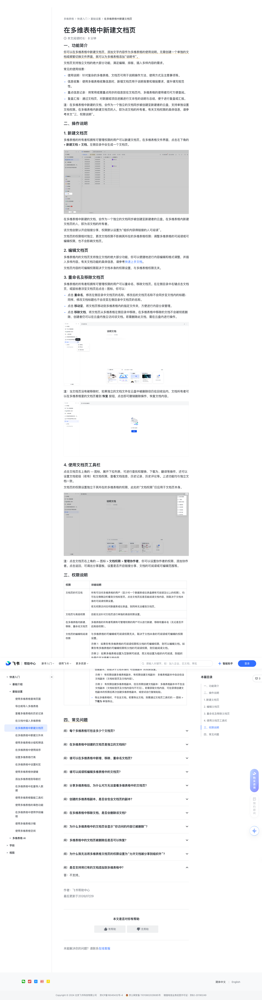

# 在多维表格中新建文档页

> 来源：[飞书帮助中心](https://www.feishu.cn/hc/zh-CN/articles/978342549435)  
> 分类：多维表格 / 快速入门 / 基础设置  
> 抓取时间：2026-09-22T00:55:53.170Z

## 界面截图

### 文档内配图

1. 配图：https://p1-hera.feishucdn.com/tos-cn-i-jbbdkfciu3/b786b031c71145b4bde35f898e25c166~tplv-jbbdkfciu3-image:0:0.image
2. 配图：https://p1-hera.feishucdn.com/tos-cn-i-jbbdkfciu3/2c0341f204cd4d2b9d31abba6b112513~tplv-jbbdkfciu3-image:0:0.image
3. 配图：https://p1-hera.feishucdn.com/tos-cn-i-jbbdkfciu3/d94d1c558d984fb4b8595d77023b1079~tplv-jbbdkfciu3-image:0:0.image
4. 配图：https://p1-hera.feishucdn.com/tos-cn-i-jbbdkfciu3/42fdc35f109642398c34cba59b6d9c0a~tplv-jbbdkfciu3-image:0:0.image

## 功能定位

本页对应飞书帮助中心「多维表格 / 快速入门 / 基础设置」下的「在多维表格中新建文档页」。以下需求描述依据官方说明文档提炼，用于指导 DuoWei 对标实现。

## 功能目标

一、功能简介

## 文档结构（官方章节）

- 一、功能简介​
- 二、操作说明​
- 新建文档页​
- 编辑文档页​
- 重命名及移除文档页​
- 使用文档页工具栏​
- 三、权限说明​
- 四、常见问题​

## 详细功能说明

一、功能简介

使用说明：针对复杂的多维表格，文档页可用于说明操作方法、使用方式及注意事项等。

信息收集：使用多维表格收集信息时，新增文档页用于说明背景和填报要求，提升填写规范性。

重点信息记录：将常用或需重点同步的信息放在文档页内，多维表格的使用者均可方便查阅。

复盘汇报：通过文档页，对数据或项目进展进行文本性的说明与总结，便于进行复盘或汇报。

二、操作说明

新建文档页

编辑文档页

重命名及移除文档页

点击 重命名，修改左侧目录中文档页的名称。修改后的文档页名称不会同步至文档内的标题；同样，修改文档标题也不会改变左侧目录中文档页的名称。

点击 移动至，将文档页移动到多维表格内的指定文件夹，方便进行内容分类管理。

点击 移除文档，将文档页从多维表格左侧目录中移除。在多维表格中移除的文档不会被彻底删除，创建者仍可以在云盘内独立访问该文档。若需删除此文档，需在云盘内进行操作。

使用文档页工具栏

三、权限说明

详细说明

文档页的可见性

所有可访问多维表格的用户（至少对一个数据表或仪表盘拥有可阅读及以上的权限），均可在左侧侧边栏看到文档标签页。点击文档页后是否能阅读文档内容，则取决于文档本身的可阅读权限设置。若无权限访问任何数据表或仪表盘，则同样无法看到文档页。

文档页与高级权限

目前无法针对文档页进行单独的高级权限设置。

在多维表格内新建、移除、重命名文档页

多维表格的所有者和拥有可管理权限的用户可以进行新建、移除和重命名（无论是否开启高级权限）。

文档页的编辑和阅读权限

与多维表格的可编辑或可阅读权限无关，取决于文档本身的可阅读或可编辑的权限设置。示例 1：如果你有多维表格的可阅读权限和文档的可编辑权限，则可以编辑文档。如果你有多维表格的可编辑权限和文档的可阅读权限，则仅能阅读文档。示例 2：如果多维表格设置为互联网可阅读，而文档设置为组织内可阅读，则组织外用户无法查看文档内容。

创建副本和导出

创建副本：创建的多维表格副本中，默认包含文档标签页。但文档内容是否能被同步创建副本，则取决于文档本身的“可创建副本”的权限设置。示例 1：有权限创建多维表格副本、有权限创建文档副本：多维表格副本中自动包含文档副本（文档标签页及文档内容）。示例 2：有权限创建多维表格副本，但无权限创建文档副本：多维表格副本中不包含文档副本（文档标签页及文档内容均不可见）。若需获取文档内容，可在获得创建文档副本的权限后再次创建多维表格副本，或尝试自行复制粘贴。导出多维表格时，不包含文档。若需导出文档，则需通过文档页工具栏的 ··· 图标 > 下载为 单独导出。

创建副本：创建的多维表格副本中，默认包含文档标签页。但文档内容是否能被同步创建副本，则取决于文档本身的“可创建副本”的权限设置。

示例 1：有权限创建多维表格副本、有权限创建文档副本：多维表格副本中自动包含文档副本（文档标签页及文档内容）。

示例 2：有权限创建多维表格副本，但无权限创建文档副本：多维表格副本中不包含文档副本（文档标签页及文档内容均不可见）。若需获取文档内容，可在获得创建文档副本的权限后再次创建多维表格副本，或尝试自行复制粘贴。

导出多维表格时，不包含文档。若需导出文档，则需通过文档页工具栏的 ··· 图标 > 下载为 单独导出。

四、常见问题

一、功能简介你可以在多维表格中新建文档页，添加文字内容作为多维表格的使用说明。无需创建一个单独的文档或频繁切换文件界面，就可以为多维表格添加“说明书”。文档页支持独立文档的绝大部分功能，满足编辑、排版、插入多样内容的需求。常见的使用场景：使用说明：针对复杂的多维表格，文档页可用于说明操作方法、使用方式及注意事项等。信息收集：使用多维表格收集信息时，新增文档页用于说明背景和填报要求，提升填写规范性。重点信息记录：将常用或需重点同步的信息放在文档页内，多维表格的使用者均可方便查阅。复盘汇报：通过文档页，对数据或项目进展进行文本性的说明与总结，便于进行复盘或汇报。注：在多维表格中新建的文档，会作为一个独立的文档同步被创建至新建者的云盘，支持单独设置文档权限。在多维表格内新建文档页的人，即为该文档的所有者。有关文档权限的具体信息，请参考本文“三、权限说明”。二、操作说明新建文档页多维表格的所有者和拥有可管理权限的用户可以新建文档页。在多维表格文件界面，点击左下角的 + 新建文档 > 文档。左侧目录中会生成一个文档页。250px|700px|reset在多维表格中新建的文档，会作为一个独立的文档同步被创建至新建者的云盘。在多维表格内新建文档页的人，即为该文档的所有者。该文档会默认开启链接分享，权限默认设置为“组织内获得链接的人可阅读”。文档页的权限相对独立，更改文档权限不影响其所在的多维表格权限；调整多维表格的可阅读或可编辑权限，也不会影响文档页。编辑文档页多维表格内的文档页支持独立文档的绝大部分功能，你可以便捷地进行内容编辑和格式调整，并插入多样内容。有关文档功能的具体信息，请参考快速上手文档。文档页内容的可编辑权限取决于文档本身的权限设置，与多维表格权限无关。重命名及移除文档页多维表格的所有者和拥有可管理权限的用户可以重命名、移除文档页。在左侧目录中右键点击文档页，或鼠标悬浮至文档页后点击 ⋮ 图标，你可以：点击 重命名，修改左侧目录中文档页的名称。修改后的文档页名称不会同步至文档内的标题；同样，修改文档标题也不会改变左侧目录中文档页的名称。点击 移动至，将文档页移动到多维表格内的指定文件夹，方便进行内容分类管理。点击 移除文档，将文档页从多维表格左侧目录中移除。在多维表格中移除的文档不会被彻底删除，创建者仍可以在云盘内独立访问该文档。若需删除此文档，需在云盘内进行操作。250px|700px|reset注：当文档页没有被移除时，如果独立的文档文件在云盘中被删除但仍在回收站内，文档所有者可以在多维表格里的文档页看到 恢复 按钮，点击即可撤销删除操作，恢复文档内容。250px|700px|reset使用文档页工具栏点击文档页右上角的 ··· 图标，展开下拉列表，可进行查找和替换、下载为、翻译等操作，还可以设置文档密级（若有）和文档权限，查看文档信息、历史记录、历史评论等。上述功能均与独立文档一致。文档页的权限设置独立于其所在的多维表格的权限，此处的“文档权限”仅应用于文档页本身。250px|700px|reset注：点击文档页右上角的 ··· 图标 > 文档权限 > 管理协作者，你可以设置协作者的权限、添加协作者。点击返回，可调出分享面板，设置是否开启链接分享、文档的可阅读或可编辑范围等。三、权限说明权限详细说明文档页的可见性所有可访问多维表格的用户（至少对一个数据表或仪表盘拥有可阅读及以上的权限），均可在左侧侧边栏看到文档标签页。点击文档页后是否能阅读文档内容，则取决于文档本身的可阅读权限设置。若无权限访问任何数据表或仪表盘，则同样无法看到文档页。文档页与高级权限目前无法针对文档页进行单独的高级权限设置。在多维表格内新建、移除、重命名文档页多维表格的所有者和拥有可管理权限的用户可以进行新建、移除和重命名（无论是否开启高级权限）。文档页的编辑和阅读权限与多维表格的可编辑或可阅读权限无关，取决于文档本身的可阅读或可编辑的权限设置。示例 1：如果你有多维表格的可阅读权限和文档的可编辑权限，则可以编辑文档。如果你有多维表格的可编辑权限和文档的可阅读权限，则仅能阅读文档。示例 2：如果多维表格设置为互联网可阅读，而文档设置为组织内可阅读，则组织外用户无法查看文档内容。创建副本和导出创建副本：创建的多维表格副本中，默认包含文档标签页。但文档内容是否能被同步创建副本，则取决于文档本身的“可创建副本”的权限设置。示例 1：有权限创建多维表格副本、有权限创建文档副本：多维表格副本中自动包含文档副本（文档标签页及文档内容）。示例 2：有权限创建多维表格副本，但无权限创建文档副本：多维表格副本中不包含文档副本（文档标签页及文档内容均不可见）。若需获取文档内容，可在获得创建文档副本的权限后再次创建多维表格副本，或尝试自行复制粘贴。导出多维表格时，不包含文档。若需导出文档，则需通过文档页工具栏的 ··· 图标 > 下载为 单独导出。四、常见问题

权限 | 详细说明

文档页的可见性 | 所有可访问多维表格的用户（至少对一个数据表或仪表盘拥有可阅读及以上的权限），均可在左侧侧边栏看到文档标签页。点击文档页后是否能阅读文档内容，则取决于文档本身的可阅读权限设置。若无权限访问任何数据表或仪表盘，则同样无法看到文档页。

文档页与高级权限 | 目前无法针对文档页进行单独的高级权限设置。

在多维表格内新建、移除、重命名文档页 | 多维表格的所有者和拥有可管理权限的用户可以进行新建、移除和重命名（无论是否开启高级权限）。

文档页的编辑和阅读权限 | 与多维表格的可编辑或可阅读权限无关，取决于文档本身的可阅读或可编辑的权限设置。示例 1：如果你有多维表格的可阅读权限和文档的可编辑权限，则可以编辑文档。如果你有多维表格的可编辑权限和文档的可阅读权限，则仅能阅读文档。示例 2：如果多维表格设置为互联网可阅读，而文档设置为组织内可阅读，则组织外用户无法查看文档内容。

创建副本和导出 | 创建副本：创建的多维表格副本中，默认包含文档标签页。但文档内容是否能被同步创建副本，则取决于文档本身的“可创建副本”的权限设置。示例 1：有权限创建多维表格副本、有权限创建文档副本：多维表格副本中自动包含文档副本（文档标签页及文档内容）。示例 2：有权限创建多维表格副本，但无权限创建文档副本：多维表格副本中不包含文档副本（文档标签页及文档内容均不可见）。若需获取文档内容，可在获得创建文档副本的权限后再次创建多维表格副本，或尝试自行复制粘贴。导出多维表格时，不包含文档。若需导出文档，则需通过文档页工具栏的 ··· 图标 > 下载为 单独导出。

## 实现要点（对标 DuoWei）

1. **入口与信息架构**：在产品中明确该能力所属模块（快速入门 / 基础设置），并保证用户可从对应导航触达。
2. **核心交互**：按上文「详细功能说明」还原主要操作路径；截图中出现的按钮、字段、面板命名尽量与飞书语义一致或可映射。
3. **数据与权限**：若文档涉及可见范围、可编辑范围、分享或高级权限，实现时需落到角色/成员模型，并保证 API/MCP 与 UI 权限一致。
4. **边界与上限**：若文档提到数量上限、格式限制、导入导出约束，需在实现与错误提示中体现。
5. **验收**：以本页截图场景为用例，完成「能打开 / 能配置 / 能保存 / 能被 Agent 读写（如适用）」四项检查。

## 原始摘录摘要

> 一、功能简介 使用说明：针对复杂的多维表格，文档页可用于说明操作方法、使用方式及注意事项等。 信息收集：使用多维表格收集信息时，新增文档页用于说明背景和填报要求，提升填写规范性。 重点信息记录：将常用或需重点同步的信息放在文档页内，多维表格的使用者均可方便查阅。 复盘汇报：通过文档页，对数据或项目进展进行文本性的说明与总结，便于进行复盘或汇报。 二、操作说明 新建文档页 编辑文档页 重命名及移除文档页 点击 重命名，修改左侧目录中文档页的名称。修改后的文档页名称不会同步至文档内的标题；同样，修改文档标题也不会改变左侧目录中文档页的名称。 点击 移动至，将文档页移动到多维表格内的指定文件夹，方便进行内容分类管理。 点击 移除文档，将文档页从多维表格左侧目录中移除。在多维表格中移除的文档不会被彻底删除，创建者仍可以在云盘内独立访问该文档。若需删除此文档，需在云盘内进行操作。 使用文档页工具栏 三、权限说明 详细说明 文档页的可见性 所有可访问多维表格的用户（至少对一个数据表或仪表盘拥有可阅读及以上的权限），均可在左侧侧边栏看到文档标签页。点击文档页后是否能阅读文档内容，则取决于文档本身的可阅读权限设置。若无权限访问任何数据表或仪表盘，则同样无法看到文档页。 文档页与高级权限 目前无法针对文档页进行单独的高级权限设置。 在多维表格内新建、移除、重命名文档页 多维表格的所有者和拥有可管理权限的用户可以进行新建、移除和重命名（无论是否开启高级权限）。 文档页的编辑和阅读权限 与多维表格的可编辑或可阅读权限无关，取决于文档本身的可阅读或可编辑的权限设置。示例 1：如果你有多维表格的可阅读权限和文档的可编辑权限，则可以编辑文档。如果你有多维表格的可编辑权限和文档的可阅读权限，则仅能阅读文档。示例 2：如果多维表格设置为互联网可阅读，而文档设置为组织内可阅读，则组织外用户无法查看文档内容。…

## 元数据

- article_id: `7237418160905928706`
- category_id: `7225072576895254530`
- path: `/hc/zh-CN/articles/978342549435`
- extracted_text_length: 2044
