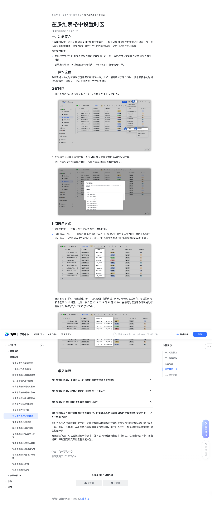

# 在多维表格中设置时区

> 来源：[飞书帮助中心](https://www.feishu.cn/hc/zh-CN/articles/101885955096)  
> 分类：多维表格 / 快速入门 / 基础设置  
> 抓取时间：2026-09-22T00:57:08.381Z

## 界面截图

### 文档内配图

1. 配图：https://p1-hera.feishucdn.com/tos-cn-i-jbbdkfciu3/f8e14d0ff4fc4049a0ee4c4453ec4d2e~tplv-jbbdkfciu3-image:0:0.image
2. 配图：https://p1-hera.feishucdn.com/tos-cn-i-jbbdkfciu3/32096f6957b6407d807c291597c04655~tplv-jbbdkfciu3-image:0:0.image
3. 配图：https://p1-hera.feishucdn.com/tos-cn-i-jbbdkfciu3/d841d271ef6f409aba1317cce68f5bab~tplv-jbbdkfciu3-image:0:0.image
4. 配图：https://p1-hera.feishucdn.com/tos-cn-i-jbbdkfciu3/1810a681bb104f0e911fb4243ab212f5~tplv-jbbdkfciu3-image:0:0.image

## 功能定位

本页对应飞书帮助中心「多维表格 / 快速入门 / 基础设置」下的「在多维表格中设置时区」。以下需求描述依据官方说明文档提炼，用于指导 DuoWei 对标实现。

## 功能目标

一、功能简介

## 文档结构（官方章节）

- 一、功能简介​
- 二、操作流程​
- 设置时区 ​
- 时间展示方式 ​
- 三、常见问题​

## 详细功能说明

一、功能简介

跨国项目管理：时间节点是项目管理中重要的一环，统一展示项目关键时间可以保障项目有序推进。

跨境电商管理：可以显示统一的采购、下单等时间，便于管理订单。

二、操作流程

多维表格文件的时区默认与创建者所在时区一致，比如：创建者位于东八区时，多维表格中的时间也为按照东八区显示。 你可以通过以下方式设置时区。

设置时区

打开多维表格，点击表格右上方的 ... 图标 > 更多 > 文档时区。

在弹窗中选择要设置的时区，点击 确定 即可更新文档内涉及的所有时区。

注：设置完成后如需修改时区，按照设置流程重新选择时区即可。

时间展示方式

仅展示年、月、日： 如果原时间段仅涉及年月日，修改时区后所有人看到的日期将不区分时区，比如：东八区 2022年12月31日，在任何时区查看多维表格时都将显示为2022/12/31 。

展示日期和时间，精确到时、分： 如果原时间段精确到了时分，修改时区后所有人看到的时间都将显示 GMT 时区，比如：东八区 2022 年 12 月 31 日 15:30，在任何时区查看多维表格时都将显示为 2022/12/31 15:30 (GMT+8) 。

三、常见问题

帮助中心新手入门使用飞书更多资源智能助手登录快速入门基础介绍快速上手多维表格多维表格全新功能说明区分电子表格与多维表格多维表格常见上限多维表格付费权益说明使用多维表格智能问答多维表格字段变更约束说明关于多维表格中按钮类型的说明基础设置使用多维表格查询页面导出或导入多维表格查看多维表格的历史记录在文档中插入多维表格在多维表格中新建文档页在多维表格中新建文件夹使用多维表格分组和筛选在多维表格中使用排序设置多维表格行高在多维表格中设置时区使用多维表格快捷键添加多维表格到导航栏在多维表格中批量导入数据使用多维表格智能工具栏使用多维表格的填色功能在多维表格中使用字段编组使用多维表格沙箱使用多维表格空间多维表格 AI搭建多维表格智能体为多维表格智能体配置触发器使用多维表格智能体在字段捷径中使用多维表格智能体在工作流中使用多维表格智能体节点在多维表格应用中关联和使用智能体在多维表格仪表盘中使用智能体组件使用多维表格 AI 侧边栏使用 AI 搭建多维表格业务系统使用 AI 搭建多维表格数据表使用 AI 配置多维表格高级权限使用多维表格 AI 问数与分析使用 AI 生成多维表格自定义页面多维表格 AI 功能的额度说明字段基础介绍使用多维表格字段使用多维表格公式字段捷径使用多维表格 AI 字段捷径使用多维表格 DeepSeek R1 AI 字段捷径常规字段使用多维表格群组字段设置单选、多选字段选项间的联动关系使用多维表格的单选和多选字段使用多维表格文本字段使用多维表格人员字段从人员字段和创建人字段获取更多信息使用多维表格日期字段使用多维表格数字字段使用多维表格复选框字段使用多维表格超链接字段使用多维表格附件字段用查找引用字段查找或引用数据业务字段使用多维表格流程字段使用多维表格按钮字段使用多维表格自动编号字段使用多维表格电话号码字段使用多维表格 Email 字段使用多维表格地理位置字段使用多维表格条码字段使用多维表格进度字段使用多维表格货币字段使用多维表格评分字段使用多维表格签字字段高级字段使用多维表格高级字段使用多维表格单向关联字段使用多维表格双向关联字段在记录详情页中查看和管理关联数据视图使用多维表格视图多维表格的数据表和视图独立分享视图关于多维表格保护视图的说明使用多维表格的日历视图使用多维表格的甘特视图使用多维表格的表单视图设置多维表格表单预填默认值在飞书文档中使用表单使用表单视图的“明细表”题型记录与行数关注多维表格单条记录分享多维表格单条记录智能总结多维表格单条记录新增多维表格记录多维表格支持 100 万行归档表多维表格行数扩容自定义记录详情页公式与函数基础介绍多维表格公式字段概述多维表格公式函数大全通过公式字段引用数据统计函数与 CurrentValue多维表格公式计算优化指南使用公式获取关联、地理位置等字段属性多维表格函数常见问题多维表格公式计算超限错误参考使用函数使用多维表格 ARRAYJOIN 函数使用多维表格 CONTAIN 函数使用多维表格 COUNTIF 函数使用多维表格 DATEDIF 函数使用多维表格 FILTER 函数使用多维表格 FIND 函数使用多维表格 IF 和 IFS 函数使用多维表格 ISBLANK 和 IFBLANK 函数使用多维表格 ISERROR 与 IFERROR 函数使用多维表格 LIST 函数使用多维表格 NETWORKDAYS 函数使用多维表格 SUMIF 函数使用多维表格 TEXT 函数使用多维表格 UNIQUE 函数使用多维表格 MAP 函数使用多维表格 LET 函数函数实践多维表格实践：对填写的信息进行校验多维表格实践：计算销售业绩的排名多维表格实践：对每月销量进行累加多维表格实践：判断多个字段是否同时满足条件多维表格实践：计算两个日期相差的时分秒多维表格实践：计算环比增长率多维表格实践：快速标记最新信息多维表格实践：对符合条件的数值求和多维表格实践：拼接字段或文本多维表格实践：在公式字段中进行换行多维表格实践：对日期的年月日进行加减计算多维表格实践：获取数据表中每一行的 ID多维表格实践：项目进度条提示多维表格实践：计算每个任务的净工作周期自动化使用多维表格自动化流程自动化消息支持发送多行记录自动化 webhook 参数的详细说明在工作流和自动化中发送邮件工作流和自动化邮件正文中支持的 Markdown 语法在工作流和自动化中使用 AI 生成文本在多维表格自动化流程操作中引用内容多维表格自动化发送 HTTP 请求功能介绍多维表格自动化流程转交说明HTTP 请求场景实践：发送群组消息用自动化流程创建飞书日程、任务和群组自动化流程创建任务场景实践：项目管理自动化流程创建日程场景实践：值班系统自动化流程创建群组场景实践：工单拉群系统自动化流程发送群消息场景实践：发送销售战报工作流多维表格工作流介绍使用多维表格工作流智能搭建多维表格工作流工作流和自动化流程名词解释与常见报错工作流和自动化触发条件与执行操作一览区分多维表格工作流和多维表格自动化多维表格工作流和自动化流程常见问题设置接收飞书消息为工作流和自动化触发条件设置点击按钮为工作流和自动化触发条件设置接收到 webhook 时为工作流和自动化触发条件在工作流和自动化中查找记录在工作流和自动化中发送消息多维表格实践：在工作流和自动化中发送消息工作流和自动化中不同消息内容版本的说明在工作流和自动化中使用公式在工作流和自动化中使用 Outlook使用工作流的条件判断功能使用工作流的循环功能工作流循环功能场景实践多维表格实践：工作流和自动化支持配置关联字段使用工作流的多分支节点在工作流和自动化中使用 AI 分析节点使用工作流的 AI 分类节点使用工作流的 AI Agent 节点使用工作流的节点捷径自动发送多维表格应用的页面截图仪表盘2025 仪表盘升级新功能介绍使用多维表格仪表盘智能搭建多维表格仪表盘 分享仪表盘使用仪表盘的组合图在仪表盘中筛选数据使用自动化流程发送仪表盘使用仪表盘的漏斗图使用仪表盘的词云图表使用仪表盘的文本组件使用仪表盘的按钮组件使用多维表格仪表盘插件使用智能图表分析和仪表盘总结多维表格仪表盘常见问题多维表格仪表盘场景实践使用仪表盘的视图组件设置仪表盘主题和背景使用仪表盘的指标卡组件使用仪表盘的排行榜组件使用仪表盘的面积图使用仪表盘的雷达图使用仪表盘的 NPS 图使用仪表盘的倒计时组件使用仪表盘的进度图组件使用仪表盘的透视表组件仪表盘组件添加多个数据源表使用仪表盘的组合布局组件设置仪表盘数据跟随访问者权限统计切换仪表盘图表组件的行列绘制方式使用切片器组件筛选仪表盘数据使用仪表盘的图表联动功能使用 TopN 筛选仪表盘图表中的数据将仪表盘图表插入飞书文档使用仪表盘的 AI 组件高级权限使用多维表格高级权限多维表格高级权限角色介绍高级权限的行列权限说明预览高级权限结果高级权限设置对表单填写的影响多维表格高级权限常见问题使用多维表格旧版高级权限旧版高级权限的默认角色多维表格实践：实现成员间数据隔离使用高级权限进行精细化权限管理应用模式多维表格应用模式介绍使用多维表格应用模式使用应用模式的列表组件使用应用模式的图片组件使用应用模式的标签页组件设置应用模式组件尺寸：填充容器与适应内容管理多维表格应用权限同步、插件与应用使用多维表格连接器使用多维表格插件跨多维表格同步数据将多维表格发布为共享数据源同步表格数据到多维表格同步审批数据到多维表格同步任务清单到多维表格使用多维表格网页预览插件多维表格实践：如何自动排版打印多维表格？使用业务小程序使用智能文档处理应用多维表格 API 功能常见问题功能实践场景实践多维表格实践：查找重复内容多维表格实践：使用多维表格进行财务管理用多维表格搭建轻量级工单系统多维表格实战模板：项目管理系统 多维表格实战模板：分表信息汇总至总表 多维表格实战模板：物品申领 多维表格：快速搭建门店巡检上报系统多维表格：使用多维表格查找引用字段客户案例中海集团：搭建大宗材料信息共享平台八九游：用仪表盘做运营数据简报百安居：用仪表盘制作销售战报企业案例｜革新企业精细化巡店管理系统企业案例｜让物流销售管理持续提质增效企业案例｜零门槛搭建远程项目管理平台多维表格快速入门基础设置在多维表格中设置时区在多维表格中设置时区本文阅读时长：3 分钟一、功能简介在跨国协作中，时区问题常常是阻碍协同的难题之一。你可以使用多维表格中的时区设置，统一整张表格的显示时间，避免因为时间差异产生的问题和误解，让跨时区协作更加顺畅。 常见使用场景： 跨国项目管理：时间节点是项目管理中重要的一环，统一展示项目关键时间可以保障项目有序推进。 跨境电商管理：可以显示统一的采购、下单等时间，便于管理订单。 二、操作流程多维表格文件的时区默认与创建者所在时区一致，比如：创建者位于东八区时，多维表格中的时间也为按照东八区显示。 你可以通过以下方式设置时区。设置时区 打开多维表格，点击表格右上方的 ... 图标 > 更多 > 文档时区。250px|700px|reset在弹窗中选择要设置的时区，点击 确定 即可更新文档内涉及的所有时区。 注：设置完成后如需修改时区，按照设置流程重新选择时区即可。 250px|700px|reset时间展示方式 在多维表格中，一共有 2 种主要方式展示日期和时间。仅展示年、月、日： 如果原时间段仅涉及年月日，修改时区后所有人看到的日期将不区分时区，比如：东八区 2022年12月31日，在任何时区查看多维表格时都将显示为2022/12/31 。 250px|700px|reset展示日期和时间，精确到时、分： 如果原时间段精确到了时分，修改时区后所有人看到的时间都将显示 GMT 时区，比如：东八区 2022 年 12 月 31 日 15:30，在任何时区查看多维表格时都将显示为 2022/12/31 15:30 (GMT+8) 。 250px|700px|reset三、常见问题问：修改时区后，多维表格内的已有时间是否也会自动更新？答：是的，多维表格内所有涉及时间的地方都将自动更新为同一个时区。问：修改时区后，所有人看到的时间都是一样的吗？答：是的。问：修改时区会影响到多维表格的哪些功能？功能影响范围自动化定时触发、触发条件或执行操作包含带有日期时间的记录时仪表盘图表中以日期时间为展示维度时公式时间日期参与计算时分组、筛选、排序、查找以时间日期为分组、筛选、排序、查找的维度时自动计算计算最早、最晚时间或时间范围时字段类型日期、创建时间、最后更新时间字段；公式字段和查找引用字段中涉及日期时间时复制粘贴粘贴外部日期到多维表格时，如果多维表格的日期字段展示了时区信息，则外部日期将自动展示当前多维表格的时区 如：2022/12/31 15:30 → 2022/12/31 15:30 (GMT+8)创建副本时区与源文档保持一致问：如何解决在跨时区使用的多维表格中，时间计算和格式转换函数的计算预览与实际结果不一致的问题？答：当多维表格被跨时区使用时，时间计算和转换函数的计算结果预览和实际计算结果可能出现不一致。例如，在使用 TEXT 函数将日期值转换为星期时，由于时区差异，预览结果和实际结果可能会相差一天。如遇到该问题，可以尝试新建一个副本，并将副本的时区调整至本地时区。在新建的副本中，日期相关计算的预览和实际结果将恢复一致。作者：飞书帮助中心最后更新于2025/07/09本文是否对你有帮助提交成功，感谢你的反馈！未能解决你的问题？请联系在线客服本篇目录一、功能简介二、操作流程设置时区 时间展示方式 三、常见问题1快速入门基础介绍快速上手多维表格多维表格全新功能说明区分电子表格与多维表格多维表格常见上限多维表格付费权益说明使用多维表格智能问答多维表格字段变更约束说明关于多维表格中按钮类型的说明基础设置使用多维表格查询页面导出或导入多维表格查看多维表格的历史记录在文档中插入多维表格在多维表格中新建文档页在多维表格中新建文件夹使用多维表格分组和筛选在多维表格中使用排序设置多维表格行高在多维表格中设置时区使用多维表格快捷键添加多维表格到导航栏在多维表格中批量导入数据使用多维表格智能工具栏使用多维表格的填色功能在多维表格中使用字段编组使用多维表格沙箱使用多维表格空间多维表格 AI搭建多维表格智能体为多维表格智能体配置触发器使用多维表格智能体在字段捷径中使用多维表格智能体在工作流中使用多维表格智能体节点在多维表格应用中关联和使用智能体在多维表格仪表盘中使用智能体组件使用多维表格 AI 侧边栏使用 AI 搭建多维表格业务系统使用 AI 搭建多维表格数据表使用 AI 配置多维表格高级权限使用多维表格 AI 问数与分析使用 AI 生成多维表格自定义页面多维表格 AI 功能的额度说明字段基础介绍使用多维表格字段使用多维表格公式字段捷径使用多维表格 AI 字段捷径使用多维表格 DeepSeek R1 AI 字段捷径常规字段使用多维表格群组字段设置单选、多选字段选项间的联动关系使用多维表格的单选和多选字段使用多维表格文本字段使用多维表格人员字段从人员字段和创建人字段获取更多信息使用多维表格日期字段使用多维表格数字字段使用多维表格复选框字段使用多维表格超链接字段使用多维表格附件字段用查找引用字段查找或引用数据业务字段使用多维表格流程字段使用多维表格按钮字段使用多维表格自动编号字段使用多维表格电话号码字段使用多维表格 Email 字段使用多维表格地理位置字段使用多维表格条码字段使用多维表格进度字段使用多维表格货币字段使用多维表格评分字段使用多维表格签字字段高级字段使用多维表格高级字段使用多维表格单向关联字段使用多维表格双向关联字段在记录详情页中查看和管理关联数据视图使用多维表格视图多维表格的数据表和视图独立分享视图关于多维表格保护视图的说明使用多维表格的日历视图使用多维表格的甘特视图使用多维表格的表单视图设置多维表格表单预填默认值在飞书文档中使用表单使用表单视图的“明细表”题型记录与行数关注多维表格单条记录分享多维表格单条记录智能总结多维表格单条记录新增多维表格记录多维表格支持 100 万行归档表多维表格行数扩容自定义记录详情页公式与函数基础介绍多维表格公式字段概述多维表格公式函数大全通过公式字段引用数据统计函数与 CurrentValue多维表格公式计算优化指南使用公式获取关联、地理位置等字段属性多维表格函数常见问题多维表格公式计算超限错误参考使用函数使用多维表格 ARRAYJOIN 函数使用多维表格 CONTAIN 函数使用多维表格 COUNTIF 函数使用多维表格 DATEDIF 函数使用多维表格 FILTER 函数使用多维表格 FIND 函数使用多维表格 IF 和 IFS 函数使用多维表格 ISBLANK 和 IFBLANK 函数使用多维表格 ISERROR 与 IFERROR 函数使用多维表格 LIST 函数使用多维表格 NETWORKDAYS 函数使用多维表格 SUMIF 函数使用多维表格 TEXT 函数使用多维表格 UNIQUE 函数使用多维表格 MAP 函数使用多维表格 LET 函数函数实践多维表格实践：对填写的信息进行校验多维表格实践：计算销售业绩的排名多维表格实践：对每月销量进行累加多维表格实践：判断多个字段是否同时满足条件多维表格实践：计算两个日期相差的时分秒多维表格实践：计算环比增长率多维表格实践：快速标记最新信息多维表格实践：对符合条件的数值求和多维表格实践：拼接字段或文本多维表格实践：在公式字段中进行换行多维表格实践：对日期的年月日进行加减计算多维表格实践：获取数据表中每一行的 ID多维表格实践：项目进度条提示多维表格实践：计算每个任务的净工作周期自动化使用多维表格自动化流程自动化消息支持发送多行记录自动化 webhook 参数的详细说明在工作流和自动化中发送邮件工作流和自动化邮件正文中支持的 Markdown 语法在工作流和自动化中使用 AI 生成文本在多维表格自动化流程操作中引用内容多维表格自动化发送 HTTP 请求功能介绍多维表格自动化流程转交说明HTTP 请求场景实践：发送群组消息用自动化流程创建飞书日程、任务和群组自动化流程创建任务场景实践：项目管理自动化流程创建日程场景实践：值班系统自动化流程创建群组场景实践：工单拉群系统自动化流程发送群消息场景实践：发送销售战报工作流多维表格工作流介绍使用多维表格工作流智能搭建多维表格工作流工作流和自动化流程名词解释与常见报错工作流和自动化触发条件与执行操作一览区分多维表格工作流和多维表格自动化多维表格工作流和自动化流程常见问题设置接收飞书消息为工作流和自动化触发条件设置点击按钮为工作流和自动化触发条件设置接收到 webhook 时为工作流和自动化触发条件在工作流和自动化中查找记录在工作流和自动化中发送消息多维表格实践：在工作流和自动化中发送消息工作流和自动化中不同消息内容版本的说明在工作流和自动化中使用公式在工作流和自动化中使用 Outlook使用工作流的条件判断功能使用工作流的循环功能工作流循环功能场景实践多维表格实践：工作流和自动化支持配置关联字段使用工作流的多分支节点在工作流和自动化中使用 AI 分析节点使用工作流的 AI 分类节点使用工作流的 AI Agent 节点使用工作流的节点捷径自动发送多维表格应用的页面截图仪表盘2025 仪表盘升级新功能介绍使用多维表格仪表盘智能搭建多维表格仪表盘 分享仪表盘使用仪表盘的组合图在仪表盘中筛选数据使用自动化流程发送仪表盘使用仪表盘的漏斗图使用仪表盘的词云图表使用仪表盘的文本组件使用仪表盘的按钮组件使用多维表格仪表盘插件使用智能图表分析和仪表盘总结多维表格仪表盘常见问题多维表格仪表盘场景实践使用仪表盘的视图组件设置仪表盘主题和背景使用仪表盘的指标卡组件使用仪表盘的排行榜组件使用仪表盘的面积图使用仪表盘的雷达图使用仪表盘的 NPS 图使用仪表盘的倒计时组件使用仪表盘的进度图组件使用仪表盘的透视表组件仪表盘组件添加多个数据源表使用仪表盘的组合布局组件设置仪表盘数据跟随访问者权限统计切换仪表盘图表组件的行列绘制方式使用切片器组件筛选仪表盘数据使用仪表盘的图表联动功能使用 TopN 筛选仪表盘图表中的数据将仪表盘图表插入飞书文档使用仪表盘的 AI 组件高级权限使用多维表格高级权限多维表格高级权限角色介绍高级权限的行列权限说明预览高级权限结果高级权限设置对表单填写的影响多维表格高级权限常见问题使用多维表格旧版高级权限旧版高级权限的默认角色多维表格实践：实现成员间数据隔离使用高级权限进行精细化权限管理应用模式多维表格应用模式介绍使用多维表格应用模式使用应用模式的列表组件使用应用模式的图片组件使用应用模式的标签页组件设置应用模式组件尺寸：填充容器与适应内容管理多维表格应用权限同步、插件与应用使用多维表格连接器使用多维表格插件跨多维表格同步数据将多维表格发布为共享数据源同步表格数据到多维表格同步审批数据到多维表格同步任务清单到多维表格使用多维表格网页预览插件多维表格实践：如何自动排版打印多维表格？使用业务小程序使用智能文档处理应用多维表格 API 功能常见问题功能实践场景实践多维表格实践：查找重复内容多维表格实践：使用多维表格进行财务管理用多维表格搭建轻量级工单系统多维表格实战模板：项目管理系统 多维表格实战模板：分表信息汇总至总表 多维表格实战模板：物品申领 多维表格：快速搭建门店巡检上报系统多维表格：使用多维表格查找引用字段客户案例中海集团：搭建大宗材料信息共享平台八九游：用仪表盘做运营数据简报百安居：用仪表盘制作销售战报企业案例｜革新企业精细化巡店管理系统企业案例｜让物流销售管理持续提质增效企业案例｜零门槛搭建远程项目管理平台简体中文EnglishCopyright © 2024 北京飞书科技有限公司京ICP备16045432号-4 京公网安备 11010802029085号增值电信业务经营许可证：京B2-20190249

## 实现要点（对标 DuoWei）

1. **入口与信息架构**：在产品中明确该能力所属模块（快速入门 / 基础设置），并保证用户可从对应导航触达。
2. **核心交互**：按上文「详细功能说明」还原主要操作路径；截图中出现的按钮、字段、面板命名尽量与飞书语义一致或可映射。
3. **数据与权限**：若文档涉及可见范围、可编辑范围、分享或高级权限，实现时需落到角色/成员模型，并保证 API/MCP 与 UI 权限一致。
4. **边界与上限**：若文档提到数量上限、格式限制、导入导出约束，需在实现与错误提示中体现。
5. **验收**：以本页截图场景为用例，完成「能打开 / 能配置 / 能保存 / 能被 Agent 读写（如适用）」四项检查。

## 原始摘录摘要

> 一、功能简介 跨国项目管理：时间节点是项目管理中重要的一环，统一展示项目关键时间可以保障项目有序推进。 跨境电商管理：可以显示统一的采购、下单等时间，便于管理订单。 二、操作流程 多维表格文件的时区默认与创建者所在时区一致，比如：创建者位于东八区时，多维表格中的时间也为按照东八区显示。 你可以通过以下方式设置时区。 设置时区 打开多维表格，点击表格右上方的 ... 图标 > 更多 > 文档时区。 在弹窗中选择要设置的时区，点击 确定 即可更新文档内涉及的所有时区。 注：设置完成后如需修改时区，按照设置流程重新选择时区即可。 时间展示方式 仅展示年、月、日： 如果原时间段仅涉及年月日，修改时区后所有人看到的日期将不区分时区，比如：东八区 2022年12月31日，在任何时区查看多维表格时都将显示为2022/12/31 。 展示日期和时间，精确到时、分： 如果原时间段精确到了时分，修改时区后所有人看到的时间都将显示 GMT 时区，比如：东八区 2022 年 12 月 31 日 15:30，在任何时区查看多维表格时都将显示为 2022/12/31 15:30 (GMT+8) 。 三、常见问题 帮助中心新手入门使用飞书更多资源智能助手登录快速入门基础介绍快速上手多维表格多维表格全新功能说明区分电子表格与多维表格多维表格常见上限多维表格付费权益说明使用多维表格智能问答多维表格字段变更约束说明关于多维表格中按钮类型的说明基础设置使用多维表格查询页面导出或导入多维表格查看多维表格的历史记录在文档中插入多维表格在多维表格中新建文档页在多维表格中新建文件夹使用多维表格分组和筛选在多维表格中使用排序设置多维表格行高在多维表格中设置时区使用多维表格快捷键添加多维表格到导航栏在多维表格中批量导入数据使用多维表格智能工具栏使用多维表格的填色功能在多维表格中使用字段编组使用多维表格沙箱使用多维表格空间多…

## 元数据

- article_id: `7137968601109364737`
- category_id: `7225072576895254530`
- path: `/hc/zh-CN/articles/101885955096`
- extracted_text_length: 345633
