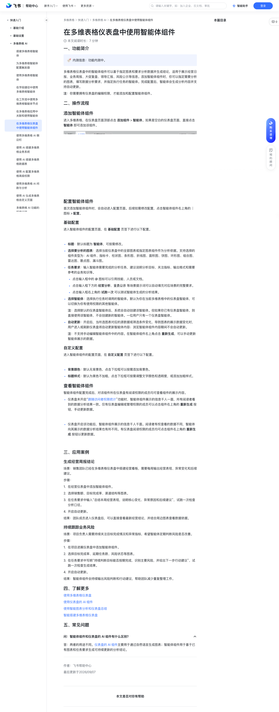

# 在多维表格仪表盘中使用智能体组件

> 来源：[飞书帮助中心](https://www.feishu.cn/hc/zh-CN/articles/015291827989)  
> 分类：多维表格 / 快速入门 / 多维表格 AI  
> 抓取时间：2026-09-22T01:16:01.631Z

## 界面截图

### 文档内配图

1. 配图：https://p1-hera.feishucdn.com/tos-cn-i-jbbdkfciu3/4f332b1f75744861b43cb6a9fa60173a~tplv-jbbdkfciu3-image:0:0.image
2. 配图：https://p1-hera.feishucdn.com/tos-cn-i-jbbdkfciu3/8c62e7342a1f47e4b7ed6340f0b48713~tplv-jbbdkfciu3-image:0:0.image
3. 配图：https://p1-hera.feishucdn.com/tos-cn-i-jbbdkfciu3/499d8e7ca6d648a09e1de8fc8db49589~tplv-jbbdkfciu3-image:0:0.image
4. 配图：https://p1-hera.feishucdn.com/tos-cn-i-jbbdkfciu3/d2dd7bd281e14215a9206e0704e40ee2~tplv-jbbdkfciu3-image:0:0.image
5. image.png：https://p1-hera.feishucdn.com/tos-cn-i-jbbdkfciu3/24b9312568f14b86871072bba5229d6e.png~tplv-jbbdkfciu3-png:0:0.png

## 功能定位

本页对应飞书帮助中心「多维表格 / 快速入门 / 多维表格 AI」下的「在多维表格仪表盘中使用智能体组件」。以下需求描述依据官方说明文档提炼，用于指导 DuoWei 对标实现。

## 功能目标

一、功能简介

## 文档结构（官方章节）

- 一、功能简介​
- 二、操作流程​
- 添加智能体组件​
- 配置智能体组件​
- 基础配置​
- 自定义配置​
- 查看智能体组件​
- 三、应用案例​
- 生成经营周报结论​
- 持续跟踪业务风险​
- 四、了解更多​
- 五、常见问题​

## 详细功能说明

一、功能简介

二、操作流程

添加智能体组件

配置智能体组件

基础配置

标题：默认标题为 智能体，可按需修改。

选择要分析的图表：选择当前仪表盘中的全部图表或指定图表组件作为分析依据。支持选择的组件类型为：AI 组件、指标卡、柱状图、条形图、折线图、面积图、饼图、环形图、组合图、雷达图、散点图、漏斗图。

任务要求：输入智能体需要完成的分析任务，建议说明分析目标、关注指标、输出格式和需要参考的业务知识等。

点击输入框中的 @ 图标可以引用技能、人员或文档。

点击输入框下方的 经营分析、全员公示 等场景提示词可以自动填充对应场景的完整要求。

点击输入框右上角的 试跑一次 可以测试智能体生成的分析结果。

选择智能体：选择执行任务时调用的智能体。默认为你在当前多维表格中的仪表盘智能体，可以切换为你有使用权限的其他智能体。

注：选择默认的仪表盘智能体后，系统会自动创建该智能体。但如果你已有仪表盘智能体，则直接使用该智能体，不会创建新的智能体。一位用户只有一个仪表盘智能体。

自动更新：开启后，当所选图表对应的源数据或筛选条件变化，导致图表的展示数据变化时，用户进入或刷新仪表盘将自动更新智能体内容；浏览智能体组件内容期间不会自动更新。

注：不支持手动编辑智能体组件中的内容。在智能体组件右上角点击 重新生成，可以手动更新智能体展示的数据。

自定义配置

背景颜色：默认无背景色，点击下拉框可以按需添加背景色。

标题样式：默认为黑色不加粗，点击下拉框可按需调整文字颜色和透明度，或添加加粗样式。

查看智能体组件

仪表盘未开启“跟随访问者权限统计”功能时，智能体组件展示的信息千人一面，所有阅读者看到的数据分析结果一致。仅有仪表盘编辑或管理权限的成员可以点击组件右上角的 重新生成 按钮，手动更新数据。

仪表盘开启该功能后，智能体组件展示的信息千人千面。阅读者有权查看的数据不同，智能体向其展示的数据分析结果也有所不同。有仪表盘阅读权限的成员均可点击组件右上角的 重新生成 按钮以更新数据。

三、应用案例

生成经营周报结论

在经营仪表盘中添加智能体组件。

选择销售额、目标完成率、渠道结构等图表。

在任务要求中输入“总结本周经营表现，说明核心变化、异常原因和后续建议”，试跑一次检查分析口径。

开启自动更新。

持续跟踪业务风险

在项目进展仪表盘中添加智能体组件。

选择目标完成率、延期任务数、风险状态等图表。

在任务要求中写明“持续判断目标能否按期完成，识别主要风险，并给出下一步行动建议”，试跑一次检查生成结果。

四、了解更多

五、常见问题

问：智能体组件和仪表盘的 AI 组件有什么区别？

答：两者的用途不同。仪表盘的 AI 组件主要用于通过自然语言生成图表；智能体组件用于基于已有图表和任务要求生成可持续更新的分析结论。

## 实现要点（对标 DuoWei）

1. **入口与信息架构**：在产品中明确该能力所属模块（快速入门 / 多维表格 AI），并保证用户可从对应导航触达。
2. **核心交互**：按上文「详细功能说明」还原主要操作路径；截图中出现的按钮、字段、面板命名尽量与飞书语义一致或可映射。
3. **数据与权限**：若文档涉及可见范围、可编辑范围、分享或高级权限，实现时需落到角色/成员模型，并保证 API/MCP 与 UI 权限一致。
4. **边界与上限**：若文档提到数量上限、格式限制、导入导出约束，需在实现与错误提示中体现。
5. **验收**：以本页截图场景为用例，完成「能打开 / 能配置 / 能保存 / 能被 Agent 读写（如适用）」四项检查。

## 原始摘录摘要

> 一、功能简介 二、操作流程 添加智能体组件 配置智能体组件 基础配置 标题：默认标题为 智能体，可按需修改。 选择要分析的图表：选择当前仪表盘中的全部图表或指定图表组件作为分析依据。支持选择的组件类型为：AI 组件、指标卡、柱状图、条形图、折线图、面积图、饼图、环形图、组合图、雷达图、散点图、漏斗图。 任务要求：输入智能体需要完成的分析任务，建议说明分析目标、关注指标、输出格式和需要参考的业务知识等。 点击输入框中的 @ 图标可以引用技能、人员或文档。 点击输入框下方的 经营分析、全员公示 等场景提示词可以自动填充对应场景的完整要求。 点击输入框右上角的 试跑一次 可以测试智能体生成的分析结果。 选择智能体：选择执行任务时调用的智能体。默认为你在当前多维表格中的仪表盘智能体，可以切换为你有使用权限的其他智能体。 注：选择默认的仪表盘智能体后，系统会自动创建该智能体。但如果你已有仪表盘智能体，则直接使用该智能体，不会创建新的智能体。一位用户只有一个仪表盘智能体。 自动更新：开启后，当所选图表对应的源数据或筛选条件变化，导致图表的展示数据变化时，用户进入或刷新仪表盘将自动更新智能体内容；浏览智能体组件内容期间不会自动更新。 注：不支持手动编辑智能体组件中的内容。在智能体组件右上角点击 重新生成，可以手动更新智能体展示的数据。 自定义配置 背景颜色：默认无背景色，点击下拉框可以按需添加背景色。 标题样式：默认为黑色不加粗，点击下拉框可按需调整文字颜色和透明度，或添加加粗样式。 查看智能体组件 仪表盘未开启“跟随访问者权限统计”功能时，智能体组件展示的信息千人一面，所有阅读者看到的数据分析结果一致。仅有仪表盘编辑或管理权限的成员可以点击组件右上角的 重新生成 按钮，手动更新数据。 仪表盘开启该功能后，智能体组件展示的信息千人千面。阅读者有权查看的数据不同，智能体向其展示的数据分析结…

## 元数据

- article_id: `7675656330481109995`
- category_id: `7630766419524717789`
- path: `/hc/zh-CN/articles/015291827989`
- extracted_text_length: 1160
