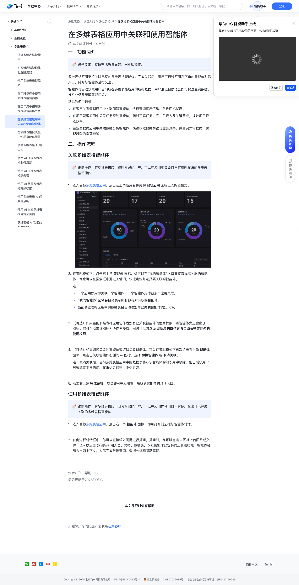

# 在多维表格应用中关联和使用智能体

> 来源：[飞书帮助中心](https://www.feishu.cn/hc/zh-CN/articles/257698775694)  
> 分类：多维表格 / 快速入门 / 多维表格 AI  
> 抓取时间：2026-09-22T01:16:02.422Z

## 界面截图

### 文档内配图

1. 配图：https://p1-hera.feishucdn.com/tos-cn-i-jbbdkfciu3/1000dd140dd84737a22e8bc6fdcd8885~tplv-jbbdkfciu3-image:0:0.image
2. 配图：https://p1-hera.feishucdn.com/tos-cn-i-jbbdkfciu3/9649f0f83d0a4bfda3f50ddef3fcde69~tplv-jbbdkfciu3-image:0:0.image
3. 配图：https://p1-hera.feishucdn.com/tos-cn-i-jbbdkfciu3/a856d592b1e24327ab0125aa0835f797~tplv-jbbdkfciu3-image:0:0.image
4. 配图：https://p1-hera.feishucdn.com/tos-cn-i-jbbdkfciu3/65e3aca98a404e7aa8cb106ddb68538d~tplv-jbbdkfciu3-image:0:0.image
5. 配图：https://p1-hera.feishucdn.com/tos-cn-i-jbbdkfciu3/ca0452dd7d0547c0b8b6a902b355db28~tplv-jbbdkfciu3-image:0:0.image
6. image.png：https://p1-hera.feishucdn.com/tos-cn-i-jbbdkfciu3/5af2fa8076e84482b7bc5fa82f985583~tplv-jbbdkfciu3-image:0:0.image

## 功能定位

本页对应飞书帮助中心「多维表格 / 快速入门 / 多维表格 AI」下的「在多维表格应用中关联和使用智能体」。以下需求描述依据官方说明文档提炼，用于指导 DuoWei 对标实现。

## 功能目标

一、功能简介

## 文档结构（官方章节）

- 一、功能简介​
- 二、操作流程​
- 关联多维表格智能体​
- 使用多维表格智能体​

## 详细功能说明

一、功能简介

在客户关系管理应用中关联问答智能体，快速查询客户信息、跟进商机状态。

在项目管理应用中关联任务规划智能体，随时了解任务进度、负责人及关键节点，提升项目跟进效率。

在业务数据应用中关联数据分析智能体，快速获取数据解读与业务洞察，并查询异常数据，实现风险的提前预警。

二、操作流程

关联多维表格智能体

进入目标多维表格应用，点击左上角应用名称旁的 编辑应用 图标进入编辑模式。

在编辑模式下，点击右上角 智能体 图标，你可以在“我的智能体”区域直接选择需关联的智能体；你也可以在搜索框中通过关键词，快速定位并选择要关联的智能体。

一个应用仅支持关联一个智能体，一个智能体支持被多个应用关联。

“我的智能体”区域会自动展示所有你有所有权的智能体。

当前多维表格应用中的数据表会自动添加为已关联智能体的知识库。

（可选）如果当前多维表格应用协作者没有已关联智能体的使用权限，该智能体旁边会出现 ! 图标。你可以点击该图标为协作者授权，同时可以勾选 后续新增的协作者将自动获得智能体的使用权限。

（可选）如需切换关联的智能体或取消关联智能体，可以在编辑模式下再次点击右上角 智能体 图标，点击已关联智能体右侧的 ··· 图标，选择 切换智能体 或 取消关联。

注：取消关联后，当前多维表格应用中的数据表将从该智能体的知识库中移除，但已授权用户对智能体本身的使用权限仍会保留，不受影响。

点击右上角 完成编辑，成员即可在应用右下角找到智能体的对话入口。

使用多维表格智能体

进入目标多维表格应用，点击右下角 智能体 图标，即可打开侧边栏与智能体对话。

在侧边栏对话框中，你可以直接输入问题进行提问。提问时，你可以点击 + 图标上传图片或文件；也可以点击 @ 图标引用人员、文档、数据表，以及智能体已安装的工具和技能。智能体会结合当前上下文，为你完成数据查询、数据分析和问题解答。

## 实现要点（对标 DuoWei）

1. **入口与信息架构**：在产品中明确该能力所属模块（快速入门 / 多维表格 AI），并保证用户可从对应导航触达。
2. **核心交互**：按上文「详细功能说明」还原主要操作路径；截图中出现的按钮、字段、面板命名尽量与飞书语义一致或可映射。
3. **数据与权限**：若文档涉及可见范围、可编辑范围、分享或高级权限，实现时需落到角色/成员模型，并保证 API/MCP 与 UI 权限一致。
4. **边界与上限**：若文档提到数量上限、格式限制、导入导出约束，需在实现与错误提示中体现。
5. **验收**：以本页截图场景为用例，完成「能打开 / 能配置 / 能保存 / 能被 Agent 读写（如适用）」四项检查。

## 原始摘录摘要

> 一、功能简介 在客户关系管理应用中关联问答智能体，快速查询客户信息、跟进商机状态。 在项目管理应用中关联任务规划智能体，随时了解任务进度、负责人及关键节点，提升项目跟进效率。 在业务数据应用中关联数据分析智能体，快速获取数据解读与业务洞察，并查询异常数据，实现风险的提前预警。 二、操作流程 关联多维表格智能体 进入目标多维表格应用，点击左上角应用名称旁的 编辑应用 图标进入编辑模式。 在编辑模式下，点击右上角 智能体 图标，你可以在“我的智能体”区域直接选择需关联的智能体；你也可以在搜索框中通过关键词，快速定位并选择要关联的智能体。 一个应用仅支持关联一个智能体，一个智能体支持被多个应用关联。 “我的智能体”区域会自动展示所有你有所有权的智能体。 当前多维表格应用中的数据表会自动添加为已关联智能体的知识库。 （可选）如果当前多维表格应用协作者没有已关联智能体的使用权限，该智能体旁边会出现 ! 图标。你可以点击该图标为协作者授权，同时可以勾选 后续新增的协作者将自动获得智能体的使用权限。 （可选）如需切换关联的智能体或取消关联智能体，可以在编辑模式下再次点击右上角 智能体 图标，点击已关联智能体右侧的 ··· 图标，选择 切换智能体 或 取消关联。 注：取消关联后，当前多维表格应用中的数据表将从该智能体的知识库中移除，但已授权用户对智能体本身的使用权限仍会保留，不受影响。 点击右上角 完成编辑，成员即可在应用右下角找到智能体的对话入口。 使用多维表格智能体 进入目标多维表格应用，点击右下角 智能体 图标，即可打开侧边栏与智能体对话。 在侧边栏对话框中，你可以直接输入问题进行提问。提问时，你可以点击 + 图标上传图片或文件；也可以点击 @ 图标引用人员、文档、数据表，以及智能体已安装的工具和技能。智能体会结合当前上下文，为你完成数据查询、数据分析和问题解答。

## 元数据

- article_id: `7677478119858539819`
- category_id: `7630766419524717789`
- path: `/hc/zh-CN/articles/257698775694`
- extracted_text_length: 790
