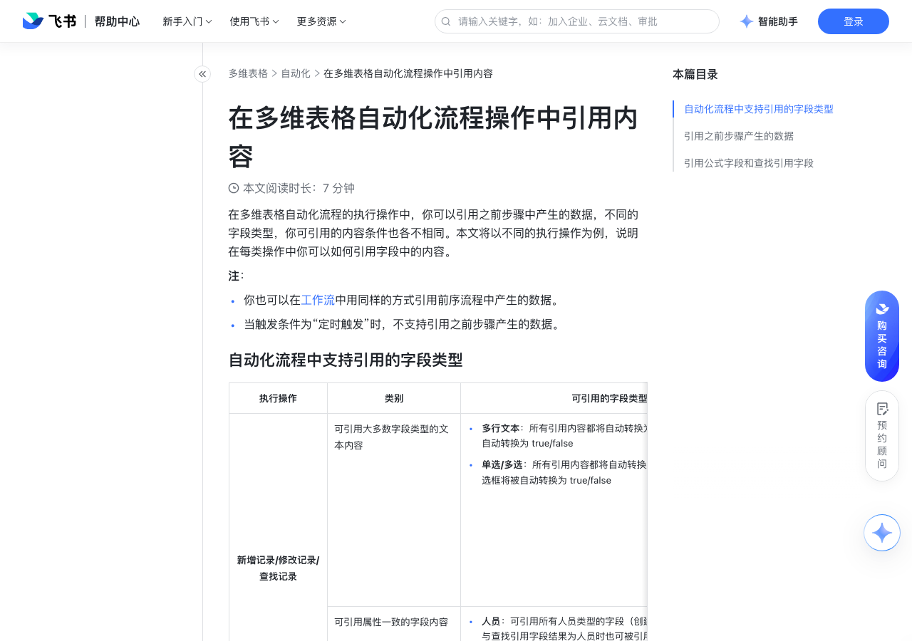

# 在多维表格自动化流程操作中引用内容

> 来源：[飞书帮助中心](https://www.feishu.cn/hc/zh-CN/articles/658874173365)  
> 分类：多维表格 / 自动化  
> 抓取时间：2026-09-22T01:24:01.518Z

## 界面截图

### 文档内配图

1. 配图：https://p1-hera.feishucdn.com/tos-cn-i-jbbdkfciu3/2cf9a4cc26994069bfa04a1714818654~tplv-jbbdkfciu3-image:0:0.image
2. 配图：https://p1-hera.feishucdn.com/tos-cn-i-jbbdkfciu3/c81c0f268e9148c5b158de5064b02fd7~tplv-jbbdkfciu3-image:0:0.image
3. 配图：https://p1-hera.feishucdn.com/tos-cn-i-jbbdkfciu3/a66cc56d5a75446291b9fa59d770b282~tplv-jbbdkfciu3-image:0:0.image
4. 配图：https://p1-hera.feishucdn.com/tos-cn-i-jbbdkfciu3/1dc53453cd01475cb70c0402dcbd7cff~tplv-jbbdkfciu3-image:0:0.image

## 功能定位

本页对应飞书帮助中心「多维表格 / 自动化」下的「在多维表格自动化流程操作中引用内容」。以下需求描述依据官方说明文档提炼，用于指导 DuoWei 对标实现。

## 功能目标

你也可以在工作流中用同样的方式引用前序流程中产生的数据。

## 文档结构（官方章节）

- 自动化流程中支持引用的字段类型​
- 引用之前步骤产生的数据​
- 引用公式字段和查找引用字段​

## 详细功能说明

你也可以在工作流中用同样的方式引用前序流程中产生的数据。

当触发条件为“定时触发”时，不支持引用之前步骤产生的数据。

自动化流程中支持引用的字段类型

执行操作

可引用的字段类型

新增记录/修改记录/查找记录

可引用大多数字段类型的文本内容

多行文本：所有引用内容都将自动转换为文本类型，复选框将被自动转换为 true/false单选/多选：所有引用内容都将自动转换为单选与多选的选项，复选框将被自动转换为 true/false

多行文本：所有引用内容都将自动转换为文本类型，复选框将被自动转换为 true/false

单选/多选：所有引用内容都将自动转换为单选与多选的选项，复选框将被自动转换为 true/false

暂不支持引用自动编号、附件、电话号码字段引用单向/双向关联字段时，结果将为当前记录索引列的内容引用复选框时，结果将被自动转换为 true/false引用超链接时，结果将自动转换为超链接的文本引用公式和查找引用字段时，需先添加 查找记录 的操作（详细操作请见下文）

暂不支持引用自动编号、附件、电话号码字段

引用单向/双向关联字段时，结果将为当前记录索引列的内容

引用复选框时，结果将被自动转换为 true/false

引用超链接时，结果将自动转换为超链接的文本

引用公式和查找引用字段时，需先添加 查找记录 的操作（详细操作请见下文）

可引用属性一致的字段内容

人员：可引用所有人员类型的字段（创建人、修改人等），公式与查找引用字段结果为人员时也可被引用日期：可引用所有日期类型的字段（创建时间、修改时间等），公式与查找引用字段结果为日期时也可被引用数字：可引用数字类型字段，公式与查找引用字段结果为数字、货币等时也可被引用复选框：可原样引用复选框字段内容，公式与查找引用字段结果为 true/false 时也可被引用超链接：可原样引用超链接字段，公式与查找引用字段结果为超链接时也可被引用

人员：可引用所有人员类型的字段（创建人、修改人等），公式与查找引用字段结果为人员时也可被引用

日期：可引用所有日期类型的字段（创建时间、修改时间等），公式与查找引用字段结果为日期时也可被引用

数字：可引用数字类型字段，公式与查找引用字段结果为数字、货币等时也可被引用

复选框：可原样引用复选框字段内容，公式与查找引用字段结果为 true/false 时也可被引用

超链接：可原样引用超链接字段，公式与查找引用字段结果为超链接时也可被引用

暂不支持引用的字段类型

公式、查找引用、单向关联、双向关联、创建人、修改人、创建时间、最后更新时间、自动编号、电话号码字段暂不支持引用字段内容

填写内容

发送飞书消息

可引用所有人员字段：人员、创建人、修改人，公式与查找引用字段结果为人员时公式与查找引用字段结果为人员时也可被引用

消息标题

可引用附件字段以外的所有字段类型

引用单向/双向关联字段时，结果将为当前记录索引列的内容引用复选框时，结果将被自动转换为 true/false引用超链接时，结果将自动转换为超链接的文本

消息内容

可引用除附件字段外所有类型的字段，以及图片类型的附件字段不支持引用非图片类附件字段

可引用除附件字段外所有类型的字段，以及图片类型的附件字段

不支持引用非图片类附件字段

引用单向/双向关联字段时，结果将为当前记录索引列的内容引用复选框时，结果将被自动转换为 true/false

按钮名称

不支持引用，仅可手动输入

按钮链接

可引用超链接字段，或当公式与查找引用字段结果为超链接时也可被引用

发送 HTTP 请求

请求 URL

引用之前步骤产生的数据

选择数据表：希望在哪一个数据表中新增一条记录，如库存管理

设置记录内容：希望在新增的记录中自动生成哪些内容

点击设置字段值，选择希望自动填写的字段，如货品数量

点击输入框右侧的 +，选择第 1 步修改的记录，点击继续

找到希望引用的字段，如采购数量，点击选择即可

引用公式字段和查找引用字段

选择执行操作为 查找记录，选择记录为 第 1 步新增的记录

在设置查找内容处，选择公式字段货品总价

添加执行操作 新增记录

在设置字段值处，选择需要自动填写的字段 总价

点击输入框右侧的 +，选择 第 2 步查找的记录，选择公式字段货品总价

执行操作 | 类别 | 可引用的字段类型 | 备注

新增记录/修改记录/查找记录 | 可引用大多数字段类型的文本内容 | 多行文本：所有引用内容都将自动转换为文本类型，复选框将被自动转换为 true/false单选/多选：所有引用内容都将自动转换为单选与多选的选项，复选框将被自动转换为 true/false | 暂不支持引用自动编号、附件、电话号码字段引用单向/双向关联字段时，结果将为当前记录索引列的内容引用复选框时，结果将被自动转换为 true/false引用超链接时，结果将自动转换为超链接的文本引用公式和查找引用字段时，需先添加 查找记录 的操作（详细操作请见下文）

| 可引用属性一致的字段内容 | 人员：可引用所有人员类型的字段（创建人、修改人等），公式与查找引用字段结果为人员时也可被引用日期：可引用所有日期类型的字段（创建时间、修改时间等），公式与查找引用字段结果为日期时也可被引用数字：可引用数字类型字段，公式与查找引用字段结果为数字、货币等时也可被引用复选框：可原样引用复选框字段内容，公式与查找引用字段结果为 true/false 时也可被引用超链接：可原样引用超链接字段，公式与查找引用字段结果为超链接时也可被引用 | /

| 暂不支持引用的字段类型 | 公式、查找引用、单向关联、双向关联、创建人、修改人、创建时间、最后更新时间、自动编号、电话号码字段暂不支持引用字段内容 | /

执行操作 | 填写内容 | 可引用的字段类型 | 备注

发送飞书消息 | 接收人 | 可引用所有人员字段：人员、创建人、修改人，公式与查找引用字段结果为人员时公式与查找引用字段结果为人员时也可被引用 | /

| 消息标题 | 可引用附件字段以外的所有字段类型 | 引用单向/双向关联字段时，结果将为当前记录索引列的内容引用复选框时，结果将被自动转换为 true/false引用超链接时，结果将自动转换为超链接的文本

| 消息内容 | 可引用除附件字段外所有类型的字段，以及图片类型的附件字段不支持引用非图片类附件字段 | 引用单向/双向关联字段时，结果将为当前记录索引列的内容引用复选框时，结果将被自动转换为 true/false

| 按钮名称 | 不支持引用，仅可手动输入 | /

| 按钮链接 | 可引用超链接字段，或当公式与查找引用字段结果为超链接时也可被引用 | /

发送 HTTP 请求 | 请求 URL | 可引用附件字段以外的所有字段类型 | /

| 入参 | 可引用附件字段以外的所有字段类型 | 引用单向/双向关联字段时，结果将为当前记录索引列的内容引用复选框时，结果将被自动转换为 true/false引用超链接时，结果将自动转换为超链接的文本

| 出参 | 可引用附件字段以外的所有字段类型 |

## 实现要点（对标 DuoWei）

1. **入口与信息架构**：在产品中明确该能力所属模块（自动化），并保证用户可从对应导航触达。
2. **核心交互**：按上文「详细功能说明」还原主要操作路径；截图中出现的按钮、字段、面板命名尽量与飞书语义一致或可映射。
3. **数据与权限**：若文档涉及可见范围、可编辑范围、分享或高级权限，实现时需落到角色/成员模型，并保证 API/MCP 与 UI 权限一致。
4. **边界与上限**：若文档提到数量上限、格式限制、导入导出约束，需在实现与错误提示中体现。
5. **验收**：以本页截图场景为用例，完成「能打开 / 能配置 / 能保存 / 能被 Agent 读写（如适用）」四项检查。

## 原始摘录摘要

> 你也可以在工作流中用同样的方式引用前序流程中产生的数据。 当触发条件为“定时触发”时，不支持引用之前步骤产生的数据。 自动化流程中支持引用的字段类型 执行操作 可引用的字段类型 新增记录/修改记录/查找记录 可引用大多数字段类型的文本内容 多行文本：所有引用内容都将自动转换为文本类型，复选框将被自动转换为 true/false单选/多选：所有引用内容都将自动转换为单选与多选的选项，复选框将被自动转换为 true/false 多行文本：所有引用内容都将自动转换为文本类型，复选框将被自动转换为 true/false 单选/多选：所有引用内容都将自动转换为单选与多选的选项，复选框将被自动转换为 true/false 暂不支持引用自动编号、附件、电话号码字段引用单向/双向关联字段时，结果将为当前记录索引列的内容引用复选框时，结果将被自动转换为 true/false引用超链接时，结果将自动转换为超链接的文本引用公式和查找引用字段时，需先添加 查找记录 的操作（详细操作请见下文） 暂不支持引用自动编号、附件、电话号码字段 引用单向/双向关联字段时，结果将为当前记录索引列的内容 引用复选框时，结果将被自动转换为 true/false 引用超链接时，结果将自动转换为超链接的文本 引用公式和查找引用字段时，需先添加 查找记录 的操作（详细操作请见下文） 可引用属性一致的字段内容 人员：可引用所有人员类型的字段（创建人、修改人等），公式与查找引用字段结果为人员时也可被引用日期：可引用所有日期类型的字段（创建时间、修改时间等），公式与查找引用字段结果为日期时也可被引用数字：可引用数字类型字段，公式与查找引用字段结果为数字、货币等时也可被引用复选框：可原样引用复选框字段内容，公式与查找引用字段结果为 true/false 时也可被引用超链接：可原样引用超链接字段，公式与查找引用字段结果为超链接时也…

## 元数据

- article_id: `7130830893362593820`
- category_id: `7165751270974767105`
- path: `/hc/zh-CN/articles/658874173365`
- extracted_text_length: 2924
