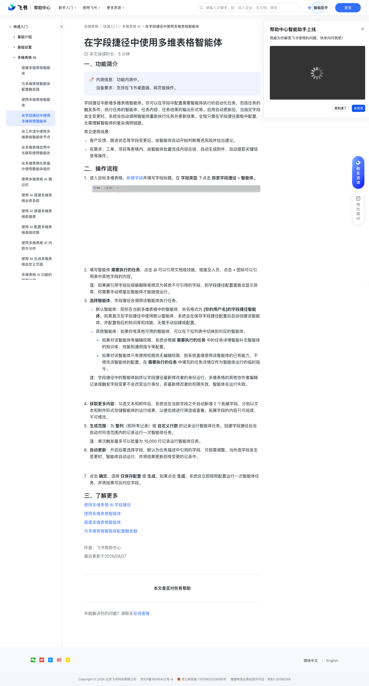

# 在字段捷径中使用多维表格智能体

> 来源：[飞书帮助中心](https://www.feishu.cn/hc/zh-CN/articles/182197102682)  
> 分类：多维表格 / 快速入门 / 多维表格 AI  
> 抓取时间：2026-09-22T01:16:02.017Z

## 界面截图

### 文档内配图

1. 配图：https://p1-hera.feishucdn.com/tos-cn-i-jbbdkfciu3/d476d434f5d6419a8d84cf41c0455354~tplv-jbbdkfciu3-image:0:0.image
2. 配图：https://p1-hera.feishucdn.com/tos-cn-i-jbbdkfciu3/b6bd824255f649f4a9fe13052a2951f8~tplv-jbbdkfciu3-image:0:0.image
3. 配图：https://p1-hera.feishucdn.com/tos-cn-i-jbbdkfciu3/7f95959263ab4c1a8bd5ce00177ffd7b~tplv-jbbdkfciu3-image:0:0.image

## 功能定位

本页对应飞书帮助中心「多维表格 / 快速入门 / 多维表格 AI」下的「在字段捷径中使用多维表格智能体」。以下需求描述依据官方说明文档提炼，用于指导 DuoWei 对标实现。

## 功能目标

一、功能简介

## 文档结构（官方章节）

- 一、功能简介​
- 二、操作流程​
- 三、了解更多​

## 详细功能说明

一、功能简介

客户反馈、跟进状态等字段变更后，由智能体自动开始判断推进风险并给出建议。

在需求、工单、项目等表格内，由智能体批量完成内容总结、自动生成附件、自动提取关键信息等操作。

二、操作流程

进入目标多维表格，新建字段并填写字段标题，在 字段类型 下点击 探索字段捷径 > 智能体。

填写智能体 需要执行的任务，点击 @ 可以引用文档或技能，或提及人员，点击 + 图标可以引用表中其他字段的内容。

注：如果被引用字段后续被删除或修改为其他不可引用的字段，则字段捷径配置面板会显示异常，你需要手动修复后智能体才能继续运行。

选择智能体，字段捷径会调用该智能体执行任务。

默认智能体：即你在当前多维表格中的智能体，命名格式为 [你的用户名]的字段捷径智能体。如果首次在字段捷径中使用默认智能体，系统会在保存字段捷径配置后自动创建该智能体，并配置相应的知识库和技能，无需手动创建或配置。

其他智能体：如果你有其他可用的智能体，可以在下拉列表中切换到对应的智能体。

如果对该智能体有编辑权限，系统会根据 需要执行的任务 中的任务详情智能补充智能体的知识库、技能和通用指令等配置。

如果对该智能体只有使用权限而无编辑权限，则系统直接使用该智能体的已有能力，不修改该智能体的配置。在 需要执行的任务 中填写的任务详情仅作为智能体运行的临时指令。

注：字段捷径中的智能体始终以字段捷径最新修改者的身份运行，多维表格的其他协作者编辑记录或触发字段变更不会改变运行身份。若最新修改者的权限失效，智能体会运行失败。

获取更多内容：勾选文本和附件后，系统会在当前字段之外自动新增 2 个拓展字段，分别以文本和附件形式存储智能体的运行结果，以便后续进行筛选或查看。拓展字段的内容只可阅读，不可修改。

生成范围：为 整列（即所有记录）或 自定义行数 的记录运行智能体任务。创建字段捷径后会自动对所选范围内的记录运行一次智能体任务。

注：单次触发最多可以批量为 10,000 行记录运行智能体任务。

自动更新：开启后需选择字段，默认为任务描述中引用的字段，可按需调整。当所选字段发生变更时，智能体自动运行，并将结果更新到有变更的记录中。

点击 确定，选择 仅保存配置 或 生成。如果点击 生成，系统会立即按照配置运行一次智能体任务，并将结果写回对应字段。

三、了解更多

## 实现要点（对标 DuoWei）

1. **入口与信息架构**：在产品中明确该能力所属模块（快速入门 / 多维表格 AI），并保证用户可从对应导航触达。
2. **核心交互**：按上文「详细功能说明」还原主要操作路径；截图中出现的按钮、字段、面板命名尽量与飞书语义一致或可映射。
3. **数据与权限**：若文档涉及可见范围、可编辑范围、分享或高级权限，实现时需落到角色/成员模型，并保证 API/MCP 与 UI 权限一致。
4. **边界与上限**：若文档提到数量上限、格式限制、导入导出约束，需在实现与错误提示中体现。
5. **验收**：以本页截图场景为用例，完成「能打开 / 能配置 / 能保存 / 能被 Agent 读写（如适用）」四项检查。

## 原始摘录摘要

> 一、功能简介 客户反馈、跟进状态等字段变更后，由智能体自动开始判断推进风险并给出建议。 在需求、工单、项目等表格内，由智能体批量完成内容总结、自动生成附件、自动提取关键信息等操作。 二、操作流程 进入目标多维表格，新建字段并填写字段标题，在 字段类型 下点击 探索字段捷径 > 智能体。 填写智能体 需要执行的任务，点击 @ 可以引用文档或技能，或提及人员，点击 + 图标可以引用表中其他字段的内容。 注：如果被引用字段后续被删除或修改为其他不可引用的字段，则字段捷径配置面板会显示异常，你需要手动修复后智能体才能继续运行。 选择智能体，字段捷径会调用该智能体执行任务。 默认智能体：即你在当前多维表格中的智能体，命名格式为 [你的用户名]的字段捷径智能体。如果首次在字段捷径中使用默认智能体，系统会在保存字段捷径配置后自动创建该智能体，并配置相应的知识库和技能，无需手动创建或配置。 其他智能体：如果你有其他可用的智能体，可以在下拉列表中切换到对应的智能体。 如果对该智能体有编辑权限，系统会根据 需要执行的任务 中的任务详情智能补充智能体的知识库、技能和通用指令等配置。 如果对该智能体只有使用权限而无编辑权限，则系统直接使用该智能体的已有能力，不修改该智能体的配置。在 需要执行的任务 中填写的任务详情仅作为智能体运行的临时指令。 注：字段捷径中的智能体始终以字段捷径最新修改者的身份运行，多维表格的其他协作者编辑记录或触发字段变更不会改变运行身份。若最新修改者的权限失效，智能体会运行失败。 获取更多内容：勾选文本和附件后，系统会在当前字段之外自动新增 2 个拓展字段，分别以文本和附件形式存储智能体的运行结果，以便后续进行筛选或查看。拓展字段的内容只可阅读，不可修改。 生成范围：为 整列（即所有记录）或 自定义行数 的记录运行智能体任务。创建字段捷径后会自动对所选范围内的记录运行一次智能…

## 元数据

- article_id: `7665640570775505908`
- category_id: `7630766419524717789`
- path: `/hc/zh-CN/articles/182197102682`
- extracted_text_length: 972
